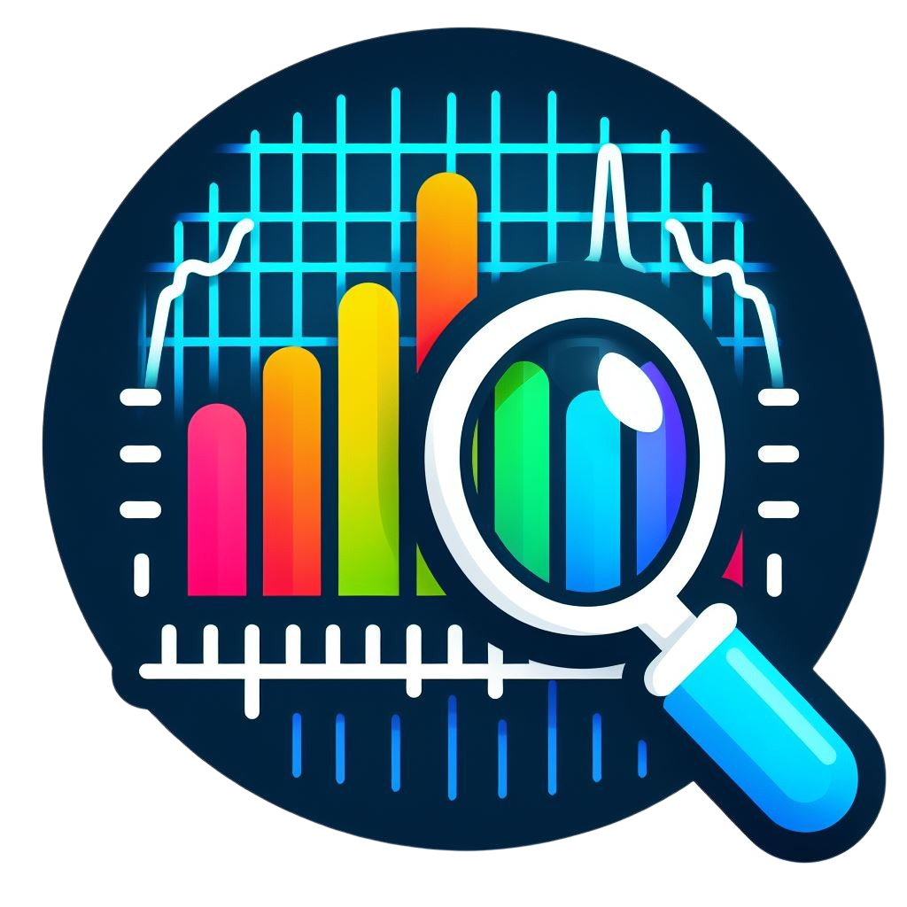
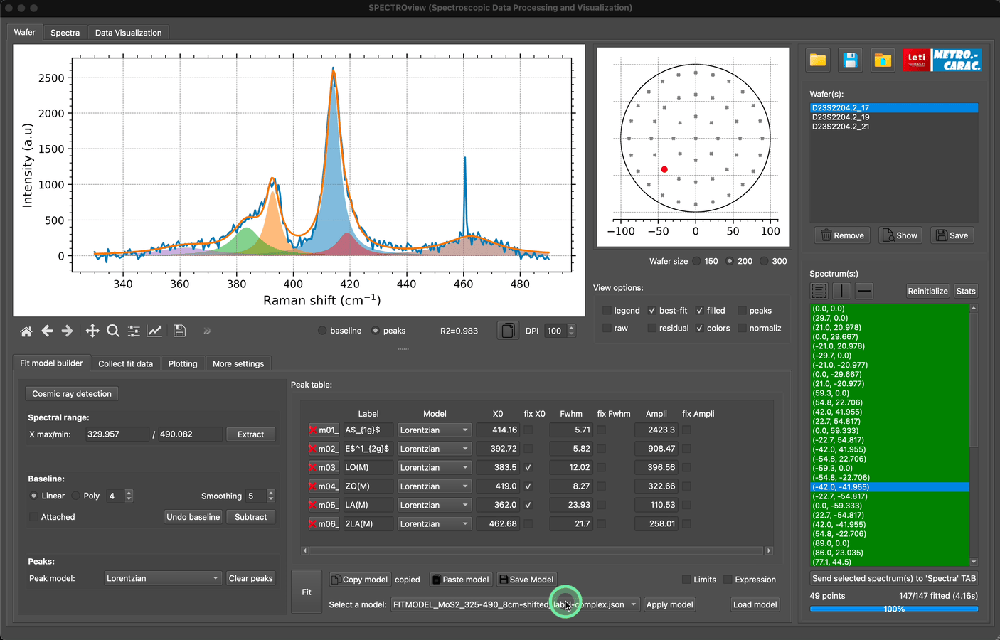

    

### SPECTROview : A tool for Spectroscopic Data Processing and Visualization.

*Version 2024.8c (build 09-08-2024)*

Fitting features are powered
by the [FITSPY](https://github.com/CEA-MetroCarac/fitspy)
and [LMFIT](https://lmfit.github.io/lmfit-py/) open-source packages.
___

## Main features:

- **Optimal GUI for easy and rapid inspection and comparison of spectra.**

    

- **Fit Multiple Spectra or Wafer Spectroscopic Data...**

-- with pre-defined model:

    

-- or by building a new fit model:

    

- **Collect All Best Fit Results at a Glance**.

    

- **Effortless, Easy, and Rapid Visualization of Spectroscopic Data**.

    

- **Dedicated Module for Data Visualization**

    

---

For any feedback, contact: [van-hoan.le@cea.fr](mailto:van-hoan.le@cea.fr)
