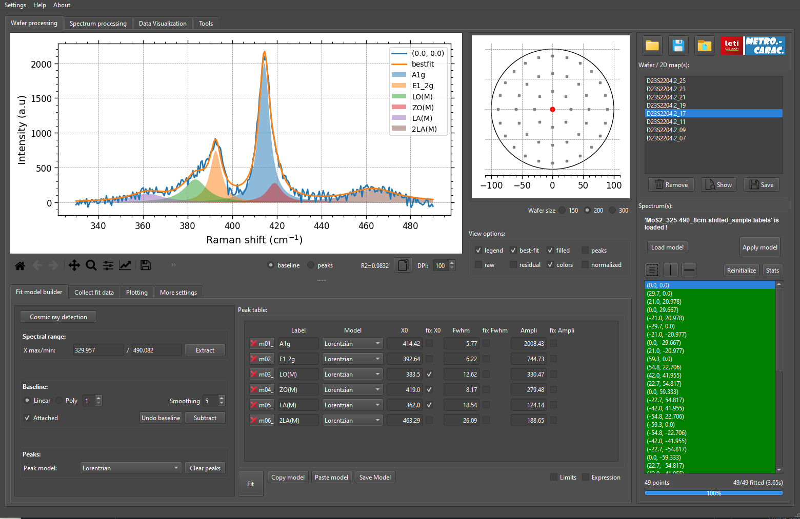
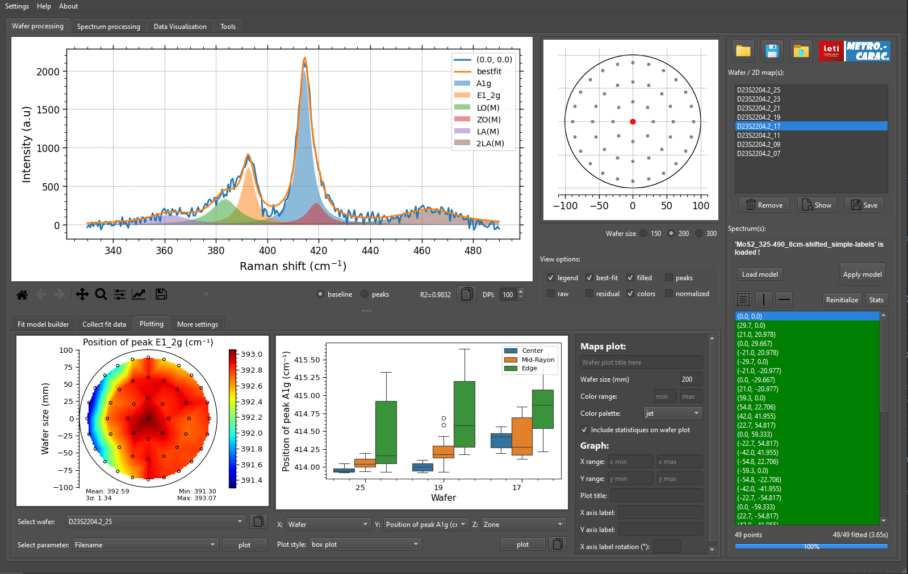
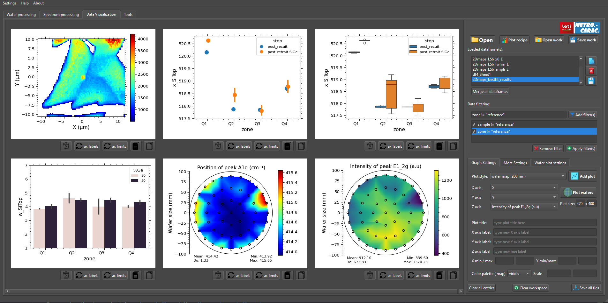

    

### SPECTROview : All-in-one Application for Spectroscopic Data Processing and Visualization.

*Version 2024.5*

Fitting features are powered
by the [FITSPY](https://github.com/CEA-MetroCarac/fitspy)
 and [LMFIT](https://lmfit.github.io/lmfit-py/) open-source packages.
___

## Main features:

- **Fit Multiple Spectra or Wafer Spectroscopic Data**.
- **Optimal GUI for easy and rapid inspection and comparison of spectra.**

    

- **Collect All Best Fit Results at a Glance**.

    

- **Effortless, Easy, and Rapid Visualization of Spectroscopic Data**.

    

- **Dedicated Module for Data Visualization**

    

---

For any feedback, contact: [van-hoan.le@cea.fr](mailto:van-hoan.le@cea.fr)
