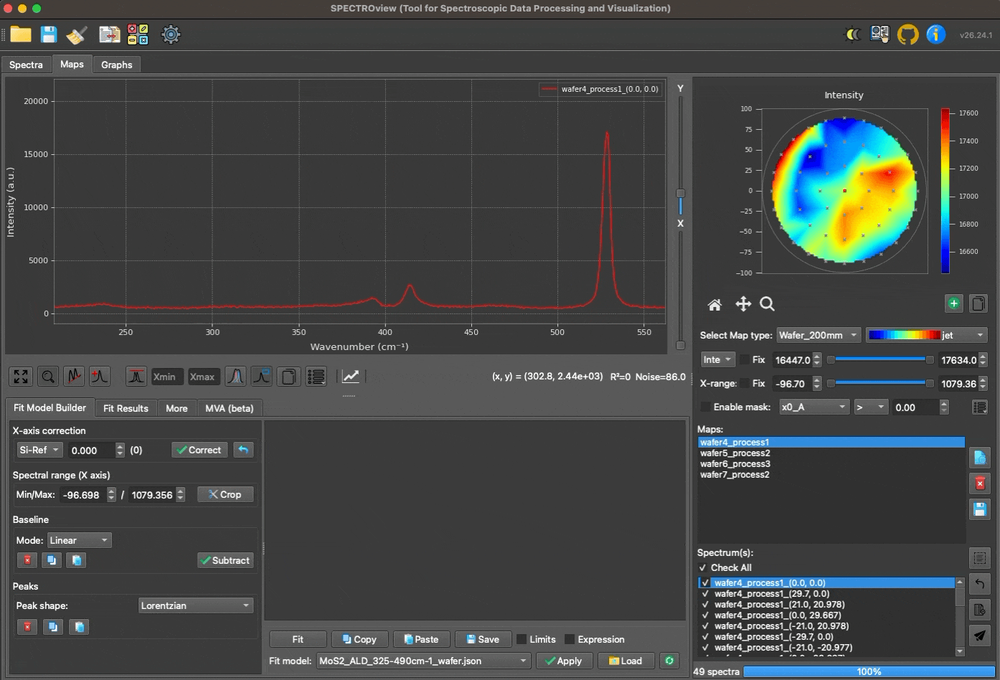
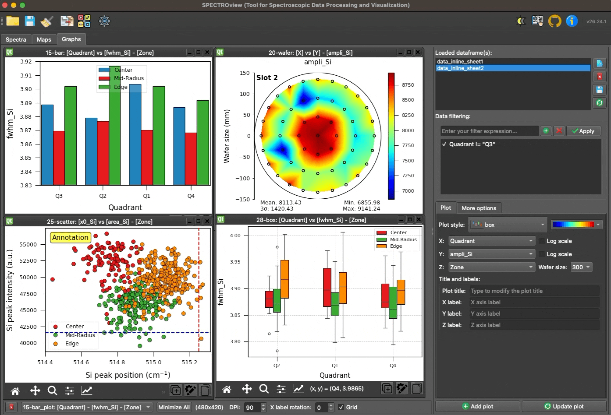

[](https://badge.fury.io/py/spectroview)
[](https://CEA-MetroCarac.github.io/SPECTROview/)
[](https://github.com/CEA-MetroCarac/spectroview)
[](https://pypi.org/project/spectroview/)

<p align="center">
    
</p>
    
## **SPECTROview: A Tool for Spectroscopic Data Processing and Visualization**

`SPECTROview` is a free, open-source software application designed for advanced spectroscopic data analysis. It supports a diverse array of data types, including discrete spectra and hyperspectral datasets such as 2D maps and wafer maps.

With its integrated visualization tools, `SPECTROview` streamlines your analytical workflow by consolidating data processing and visualization into a single, cohesive application.

- Full **documentation** is available at [**CEA-MetroCarac.github.io/SPECTROview**](https://CEA-MetroCarac.github.io/SPECTROview/). A comprehensive user manual is also available [online](https://cea-metrocarac.github.io/SPECTROview/user_manual/) or directly within the application.
- **Installation**: Instructions can be found at the bottom of this page.
- Check out the [**Releases**](https://github.com/CEA-MetroCarac/SPECTROview/releases) page for the latest updates and new features.
- **Getting Started**: Explore the [`/examples`](https://github.com/CEA-MetroCarac/SPECTROview/tree/main/examples) folder to familiarize yourself with supported data formats and find example datasets for practice.

---

### **Key Features**

- **Cross-Platform Compatibility:** Fully supported on Windows, macOS, and Linux.
- **Versatile Data Processing:** Seamlessly process both 1D spectral data and 2D hyperspectral data.
- **High-Performance Vectorized Batch Fit Engine (`VBF Engine`):** Achieves very fast fitting speeds through batched matrix operations, capable of simultaneously fitting multiple spectra or large 2D maps.
- **Custom Fit Models:** Construct customized fit models for specific spectroscopic profiles and reuse them to rapidly analyze new datasets.
- **Unified Results:** Collect and compile all best-fit results with a single click.
- **Optimized User Interface:** Designed for quick inspection, filtering, and comparison of large spectral datasets.
- **Advanced Visualization:** Dedicated workspace for generating fast, publication-ready data visualizations.

---

### **Three distinct workspaces for processing discrete spectra, hyperspectral data, and data visualization:**
<p align="center">
    
</p>

### **Build custom fit models, replicate them across datasets, fit multiple spectra simultaneously, and aggregate all best-fit results with a single click:**

<p align="center">
    
</p>

### **Rapidly and easily plot your data to generate professional visualizations:**

<p align="center">
    
</p>

---

## **Installation from PyPI**

`SPECTROview` requires Python (versions 3.8 through 3.12).

```bash
pip install spectroview
```

## **Installation from GitHub**

To install the latest development version directly from the source repository:

```bash
pip install git+https://github.com/CEA-MetroCarac/SPECTROview.git
```


## **Launch SPECTROview**
Open your terminal or command prompt and execute:
```bash
spectroview
```

## **Acknowledgements**

This work was carried out at the CEA — Platform for Nanocharacterisation (PFNC) and supported by the "Recherche Technologique de Base" program of the French National Research Agency (ANR).

---

## **Citation**

If you use `SPECTROview` for data processing or visualization in your research, please cite the following publication:

- Le, V.-H., & Quéméré, P. (2025). SPECTROview: A Tool for Spectroscopic Data Processing and Visualization. Zenodo. https://doi.org/10.5281/zenodo.14147172

Additionally, if you use the Multivariate Analysis (MVA) features to generate results for a publication, we kindly ask that you cite the following papers describing the core algorithms:

- **PCA algorithm**: Wold, S., Esbensen, K., and Geladi, P., "Principal component analysis." *Chemometrics and intelligent laboratory systems* 2.1-3 (1987): 37-52.
- **NMF algorithm**: Lee, Daniel D., and H. Sebastian Seung, "Learning the parts of objects by non-negative matrix factorization." *Nature* 401.6755 (1999): 788-791.