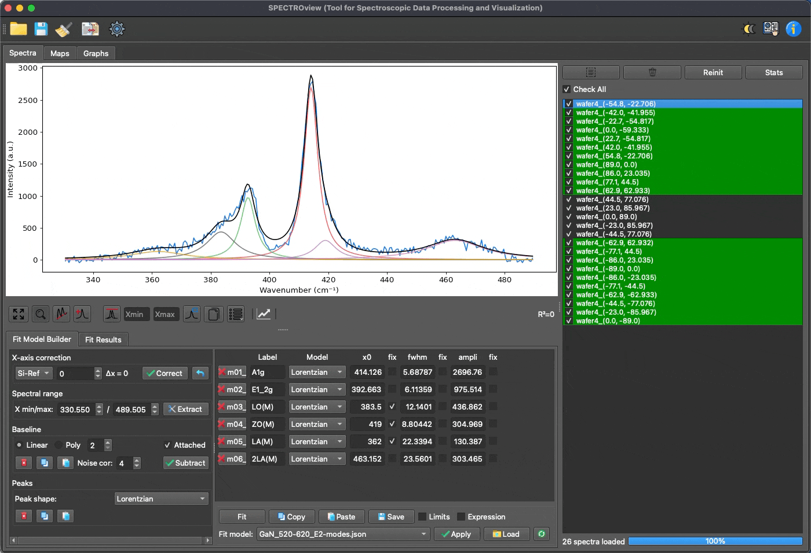
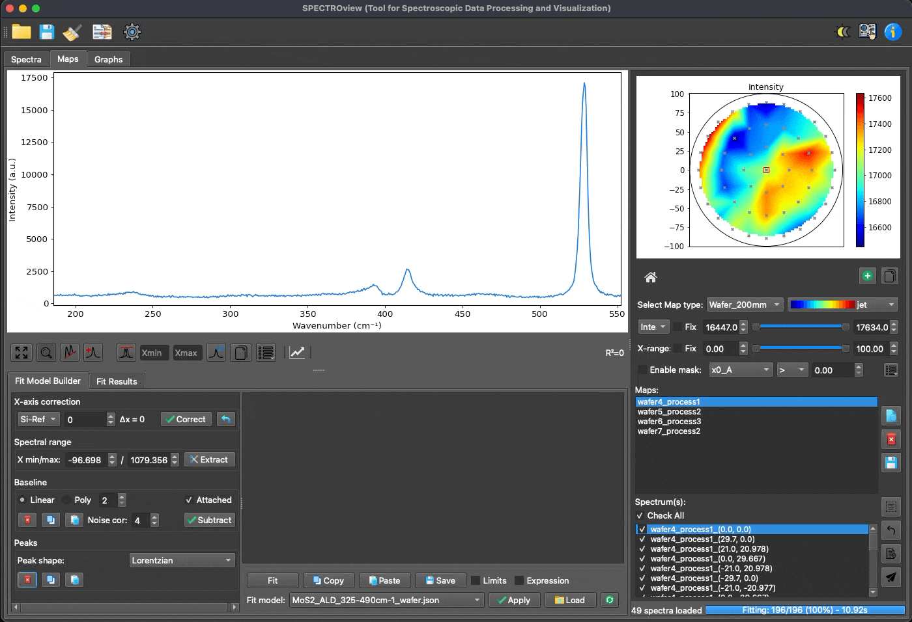
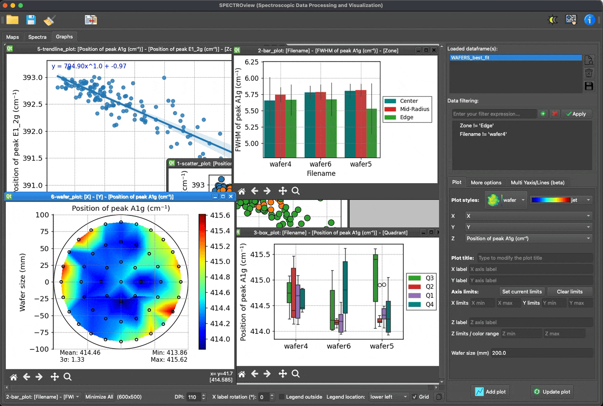

[](https://badge.fury.io/py/spectroview)
[](https://CEA-MetroCarac.github.io/SPECTROview/)
[](https://github.com/CEA-MetroCarac/spectroview)
[](https://pypi.org/project/spectroview/)
[](https://doi.org/10.5281/zenodo.14147172) 

<p align="center">
    
</p>

## SPECTROview : A Tool for Spectroscopic Data Processing and Visualization.

SPECTROview is free, open-source software designed for spectroscopic data analysis. It supports a wide range of data types, including discrete spectra and hyperspectral data (such as 2D maps and wafer maps).

With its built-in visualization tools, SPECTROview streamlines your workflow by combining data processing and visualization into a single, efficient application. 

- Full **documentation** is available at [**CEA-MetroCarac.github.io/SPECTROview**](https://CEA-MetroCarac.github.io/SPECTROview/). A PDF manual is also available [here](https://github.com/CEA-MetroCarac/SPECTROview/blob/main/spectroview/resources/SPECTROview_UserManual.pdf) or from within the application.
- **Installation**: Instructions can be found at the bottom of this page.
- Check out [**Releases**](https://github.com/CEA-MetroCarac/SPECTROview/releases) page for the latest updates and new features.
- **Getting Started**: Check out [this folder](https://github.com/CEA-MetroCarac/SPECTROview/tree/main/examples) to see the supported data formats and find example datasets for practice.


___
## Features: 

- Cross-platform compatibility (Windows, macOS, Linux).
- Supports processing of spectral data (1D) and hyperspectral data (2D maps or wafer maps)*. 
- **Tensor Fit Engine**: 10–15× faster fitting using batched matrix operations
- Ability to fit multiple spectra or 2Dmaps using predefined models or by creating custom fit models*.

- Collect all best-fit results with one click.
- Optimized user inferface for easy and quick inspection and comparison of spectra.
- Dedicated module for effortless, fast, and easy data visualization. 

**Fitting features are powered by the *fitspy* and *lmfit* open-source packages.*

______
### Three separate tabs for processing discrete spectra, hyperspectral data, and data visualization:
<p align="center">
    
</p>

### Build a fit model for later use, copy/paste to others, fit multiple spectra or maps, collect all best-fit results with one click:

<p align="center">
    
</p>

### Plot and visualize data radpily and easily:

<p align="center">
    
</p>

____

## Installation from PyPI:

Make sure that Python (version between 3.8 and 3.12) is already installed.

```bash
pip install spectroview
```

## Installation from Github:

```bash
pip install git+https://github.com/CEA-MetroCarac/SPECTROview.git
```


## To launch SPECTROview:
```bash
spectroview
```

## Acknowledgements

This work, carried out on the CEA - Platform for Nanocharacterisation (PFNC), was supported by the “Recherche Technologique de Base” program of the French National Research Agency (ANR).

---
## Citation

Le, V.-H., & Quéméré, P. (2025). SPECTROview : A Tool for Spectroscopic Data Processing and Visualization. Zenodo. https://doi.org/10.5281/zenodo.14147172
