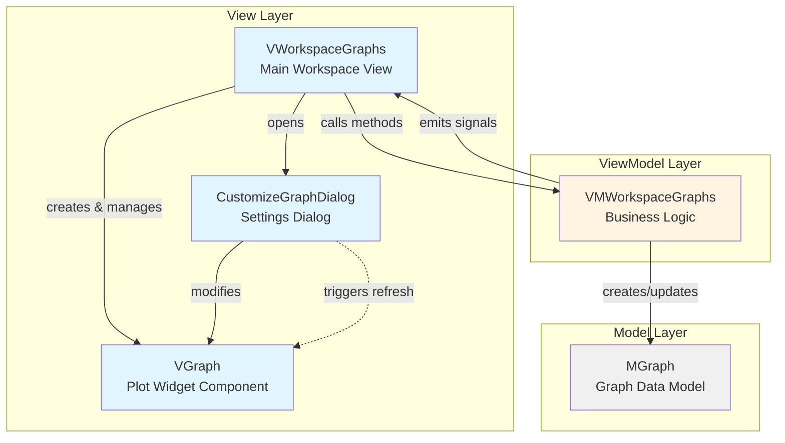
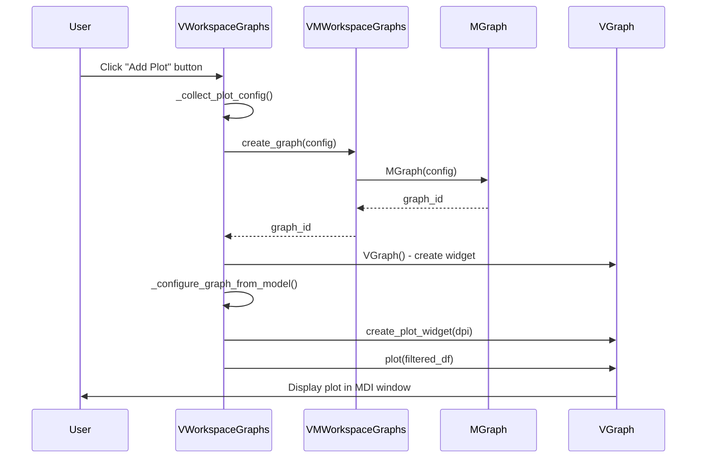
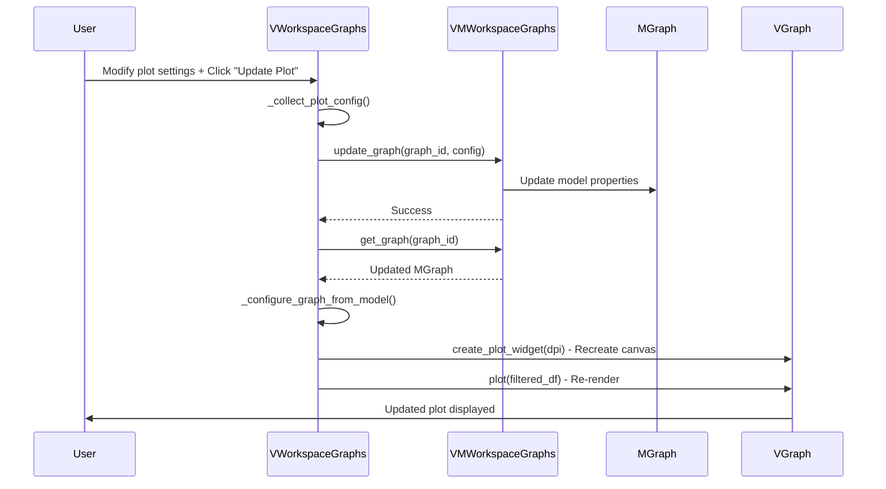
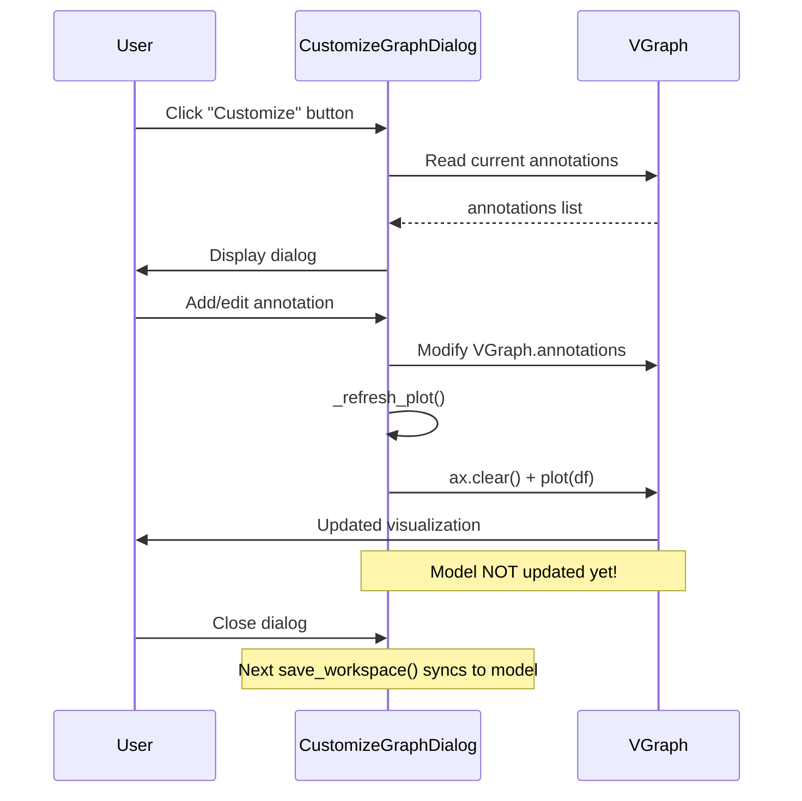
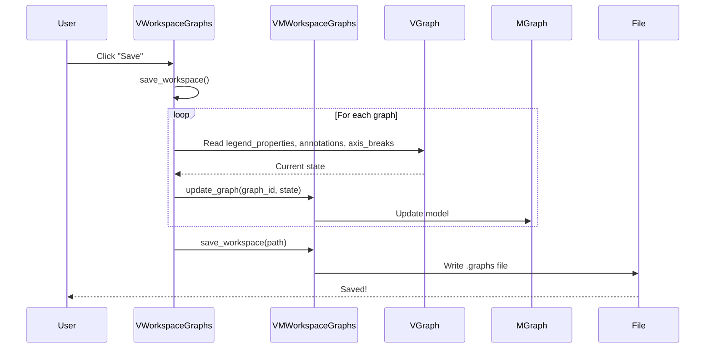
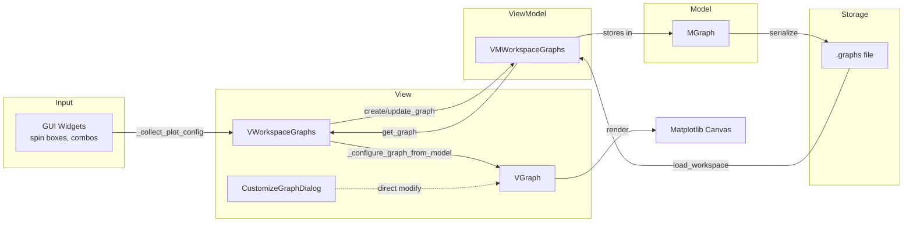

# Graphs Workspace Architecture Map

This document explains the signal flow and connections between modules in the **Graphs Workspace** using the MVVM (Model-View-ViewModel) pattern.

## Architecture Overview



## Module Responsibilities

### 📊 **MGraph** (Model)
**File:** [`m_graph.py`](file:///c:/Users/VL251876/Documents/Python/SPECTROview-1/spectroview/model/m_graph.py)

**Purpose:** Pure data container for graph properties

**Key Properties:**
- `graph_id`, `df_name` - Graph identification
- `x`, `y`, `y2`, `y3`, `z` - Axis mappings
- `plot_style` - Plot type (scatter, line, box, etc.)
- `dpi`, `xmin`, `xmax`, `ymin`, `ymax` - Display settings
- `annotations` - List of annotation objects
- `axis_breaks` - Axis break configurations
- `legend_properties` - Custom legend settings

**No Logic:** Just stores data, no business logic

---

### 🎨 **VGraph** (View Component)
**File:** [`v_graph.py`](file:///c:/Users/VL251876/Documents/Python/SPECTROview-1/spectroview/view/components/v_graph.py)

**Purpose:** Matplotlib-based plotting widget

**Key Responsibilities:**
- Renders plots using matplotlib
- Manages figure, axes, and canvas
- Handles mouse events (dragging annotations)
- Applies visual styling (colors, markers, labels)

**Key Methods:**
- `plot(df)` - Main rendering method
- `create_plot_widget(dpi)` - Creates matplotlib canvas
- `_plot_primary_axis()` - Plots on main Y-axis
- `_apply_axis_breaks()` - Renders axis breaks
- `_render_annotations()` - Draws annotations

**Data Flow:** Receives DataFrame → Renders plot → Emits no signals (pure visualization)

---

### ⚙️ **CustomizeGraphDialog** (View Component)
**File:** [`customize_graph_dialog.py`](file:///c:/Users/VL251876/Documents/Python/SPECTROview-1/spectroview/view/components/customize_graph_dialog.py)

**Purpose:** Non-modal dialog for customizing graph appearance

**Key Features:**
- **Annotations Tab:** Add/edit/delete text and line annotations
- **Legend Tab:** Customize legend colors, markers, labels
- **Axis Tab:** Configure axis breaks (X and Y)

**Key Methods:**
- `_refresh_plot()` - Lightweight visual refresh (doesn't update model)
- `_apply_axis_breaks()` - Applies axis break settings
- `_on_annotation_added()` - Adds new annotation to graph

**Important:** Directly modifies `VGraph` widget properties, does NOT update the ViewModel/Model

---

### 🏢 **VWorkspaceGraphs** (View)
**File:** [`v_workspace_graphs.py`](file:///c:/Users/VL251876/Documents/Python/SPECTROview-1/spectroview/view/v_workspace_graphs.py)

**Purpose:** Main workspace UI orchestrator

**Key Responsibilities:**
- Manages MDI subwindows (multiple graphs)
- Handles toolbar interactions
- Syncs GUI ↔ ViewModel
- Manages graph lifecycle (create/update/delete)

**Key Methods:**
- `_on_add_plot()` - Creates new graph
- `_on_update_plot()` - Updates existing graph (full rebuild)
- `_collect_plot_config()` - Gathers GUI inputs
- `_configure_graph_from_model()` - Applies model properties to VGraph
- `save_workspace()` - Syncs VGraph state back to model

**Data Structure:**
```python
self.graph_widgets = {
    graph_id: (VGraph, data, QMdiSubWindow)
}
```

---

### 🧠 **VMWorkspaceGraphs** (ViewModel)
**File:** [`vm_workspace_graphs.py`](file:///c:/Users/VL251876/Documents/Python/SPECTROview-1/spectroview/viewmodel/vm_workspace_graphs.py)

**Purpose:** Business logic and state management

**Key Responsibilities:**
- Manages graph models (`MGraph` instances)
- Applies data filters
- Handles workspace save/load
- Emits signals to notify View of changes

**Key Methods:**
- `create_graph(config)` - Creates `MGraph`, returns `graph_id`
- `update_graph(graph_id, config)` - Updates existing `MGraph`
- `get_graph(graph_id)` - Retrieves `MGraph`
- `apply_filters(df_name, filters)` - Filters DataFrame
- `save_workspace(path)` - Saves all graphs to `.graphs` file
- `load_workspace(path)` - Loads graphs from file

**Signals:**
- `graph_created` - Emitted when new graph is created
- `graph_updated` - Emitted when graph is modified
- `workspace_loaded` - Emitted when workspace file is loaded

---

## Signal Flow Examples

### 🔄 Creating a New Plot



### 🔄 Updating an Existing Plot



### 🔄 Customizing Annotations (Dialog)



### 🔄 Save/Load Workspace



## Data Flow Architecture



## Key Design Patterns

### ✅ MVVM Pattern Compliance

| Layer | Responsibilities | Dependencies |
|-------|-----------------|--------------|
| **Model** (`MGraph`) | Pure data storage | None |
| **ViewModel** (`VMWorkspaceGraphs`) | Business logic, state management | Model only |
| **View** (`VWorkspaceGraphs`, `VGraph`) | UI presentation | ViewModel + Model (read-only) |

### ⚠️ Architecture Note: CustomizeGraphDialog

`CustomizeGraphDialog` is a **special case** that breaks strict MVVM:
- **Why:** Performance - avoids full plot rebuild for visual tweaks
- **How:** Directly modifies `VGraph.annotations` and `VGraph.axis_breaks`
- **Sync:** Changes are synced back to model during `save_workspace()`

**Trade-off:** Better UX (instant visual feedback) vs. architectural purity

---

## Common Operations Summary

| Operation | Entry Point | Model Updated? | Canvas Recreated? |
|-----------|-------------|----------------|-------------------|
| Add Plot | `_on_add_plot()` | ✅ Yes | ✅ Yes |
| Update Plot | `_on_update_plot()` | ✅ Yes | ✅ Yes |
| Add Annotation | `CustomizeGraphDialog` | ❌ No (deferred) | ❌ No |
| Modify Axis Break | `CustomizeGraphDialog` | ❌ No (deferred) | ❌ No |
| Save Workspace | `save_workspace()` | ✅ Yes (sync back) | ❌ No |

---

## File Overview

| File | LOC | Role | Key Dependencies |
|------|-----|------|------------------|
| [`m_graph.py`](file:///c:/Users/VL251876/Documents/Python/SPECTROview-1/spectroview/model/m_graph.py) | ~100 | Data model | None |
| [`vm_workspace_graphs.py`](file:///c:/Users/VL251876/Documents/Python/SPECTROview-1/spectroview/viewmodel/vm_workspace_graphs.py) | ~600 | Business logic | `m_graph`, PySide6 Signals |
| [`v_workspace_graphs.py`](file:///c:/Users/VL251876/Documents/Python/SPECTROview-1/spectroview/view/v_workspace_graphs.py) | ~1500 | Main view orchestrator | `vm_workspace_graphs`, `v_graph` |
| [`v_graph.py`](file:///c:/Users/VL251876/Documents/Python/SPECTROview-1/spectroview/view/components/v_graph.py) | ~1300 | Plot rendering | matplotlib, seaborn, numpy |
| [`customize_graph_dialog.py`](file:///c:/Users/VL251876/Documents/Python/SPECTROview-1/spectroview/view/components/customize_graph_dialog.py) | ~800 | Settings UI | `v_graph` |
