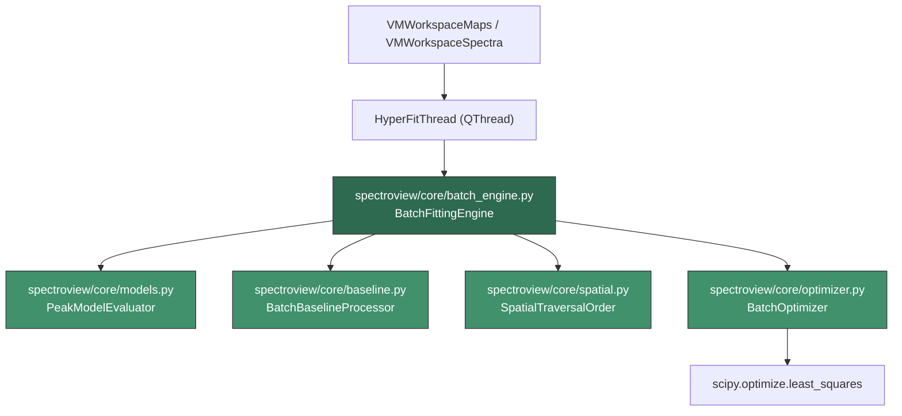

# High-Performance Fitting Engine for Hyperspectral Data

## Problem Statement

The current SPECTROview fitting pipeline is built on top of **fitspy** (`fitspy.Spectrum.preprocess()` + `fitspy.Spectrum.fit()`), which uses **lmfit** underneath. Each pixel spectrum is fitted independently via a `for` loop (single-core) or via `ProcessPoolExecutor` (multi-core with dill serialization). For 2D hyperspectral maps with thousands of pixels, this approach is too slow because:

1. **Per-spectrum overhead**: Each call to `lmfit.Model.fit()` creates parameter objects, builds the composite model, and runs Levenberg-Marquardt from scratch.
2. **Serialization cost**: Multi-process mode uses `dill.dumps/loads` per spectrum — expensive for thousands of spectra.
3. **No spatial awareness**: Adjacent pixels (with nearly identical spectra) get independent initial guesses, causing many unnecessary optimizer iterations.
4. **Baseline re-evaluation**: `preprocess()` re-evaluates baseline for every spectrum even when all spectra share the same baseline settings.

## Design Strategy

The new engine will bypass the fitspy per-spectrum fitting loop entirely and implement a **batch-vectorized fitting pipeline** that operates on the full `(N_spectra × N_wavelengths)` data matrix at once, using SciPy's `least_squares` directly (same underlying algorithm as lmfit's `leastsq`).

### Key architectural decisions:

| Decision | Rationale |
|----------|-----------|
| **Use `scipy.optimize.least_squares` directly** | Eliminates lmfit overhead (parameter creation, model composition) per-spectrum — we batch-build everything once |
| **Vectorized residual computation** | Model evaluation uses NumPy broadcast over the full data matrix rather than Python loops |
| **Spatial neighbor propagation** | Uses raster-scan order with BFS/spiral traversal from map center; propagate fitted params as initial guess to neighbors |
| **Multi-threaded via `concurrent.futures.ThreadPoolExecutor`** | SciPy releases the GIL during C-level optimization; threads avoid dill serialization overhead entirely |
| **Two-stage fitting (coarse → refined)** | Stage 1: fast fit with relaxed tolerances for all pixels; Stage 2: refine only poorly-fit pixels |
| **Preserve compatibility** | Results are written back to the existing `MSpectrum` objects (same `result_fit`, `peak_models`, `baseline` attributes) so all existing Views/ViewModels work unchanged |

## Architecture Diagram



## Proposed Changes

### New Module: `spectroview/core/` (Fitting Engine)

---

#### [NEW] [\_\_init\_\_.py](file:///c:/Users/VL251876/Documents/Python/SPECTROview-2/spectroview/core/__init__.py)

Package init. Exports the public API: `BatchFittingEngine`, `HyperFitThread`.

---

#### [NEW] [models.py](file:///c:/Users/VL251876/Documents/Python/SPECTROview-2/spectroview/core/models.py)

**Vectorized peak model evaluation.**

Provides pure-NumPy implementations of all supported peak shapes (Gaussian, Lorentzian, PseudoVoigt, GaussianAsym, LorentzianAsym, Fano, DecaySingleExp, DecayBiExp) that operate on 1D x-arrays but can be called in tight loops with minimal overhead.

Key class: `PeakModelEvaluator`
- `build_param_vector(peak_models, bkg_model)` → flat `p0` array + bounds + mask of fixed params
- `evaluate(x, params)` → sum of all peak contributions for a single spectrum  
- `evaluate_jacobian(x, params)` → analytic Jacobian (optional, for speed)
- Maps between the flat parameter vector and the structured lmfit-style `param_hints`

---

#### [NEW] [baseline.py](file:///c:/Users/VL251876/Documents/Python/SPECTROview-2/spectroview/core/baseline.py)

**Batch baseline processing.**

- `batch_preprocess(spectra, baseline_settings)` → processes all spectra baselines in one pass
- For `Linear`/`Polynomial` modes: vectorized interpolation across all spectra simultaneously
- For `arpls` mode: the penalty matrix is shared (same spectral length), only the weight iteration differs per-spectrum
- Returns `(y_subtracted_matrix, baseline_matrix)` as 2D arrays

---

#### [NEW] [spatial.py](file:///c:/Users/VL251876/Documents/Python/SPECTROview-2/spectroview/core/spatial.py)

**Spatial traversal and neighbor propagation.**

- `build_traversal_order(coords, strategy='spiral')` → ordered list of indices starting from map center
- `get_neighbor_params(index, fitted_params_cache, coords, k=4)` → returns best initial guess from already-fitted k-nearest neighbors
- Uses KDTree for fast neighbor lookup
- Fallback to global initial guess when no neighbors are fitted yet

---

#### [NEW] [optimizer.py](file:///c:/Users/VL251876/Documents/Python/SPECTROview-2/spectroview/core/optimizer.py)

**Core fitting optimizer.**

- `fit_single_spectrum(x, y, evaluator, p0, bounds, method, xtol, max_nfev)` → wraps `scipy.optimize.least_squares`
- `fit_batch_threaded(x, Y_matrix, evaluator, p0_matrix, bounds, ncpus, progress_callback)` → distributes spectra across threads
- Two-stage logic:
  - Stage 1: `xtol=1e-2`, `max_nfev=50*nparams` → fast coarse fit
  - Stage 2: for spectra with `cost > threshold`, re-fit with `xtol=1e-4`, `max_nfev=200*nparams`
- Thread-safe progress reporting via callback

---

#### [NEW] [batch_engine.py](file:///c:/Users/VL251876/Documents/Python/SPECTROview-2/spectroview/core/batch_engine.py)

**Main orchestrator — the public API of the engine.**

Class: `BatchFittingEngine`

```python
class BatchFittingEngine:
    def fit_spectra(
        self,
        spectra: list[MSpectrum],
        fit_model: dict,        # from spectrum.save() or loaded JSON
        coords: np.ndarray | None,  # (N,2) spatial coords (None for non-map)
        fit_params: dict,       # method, xtol, max_ite, etc.
        ncpus: int = 1,
        progress_callback=None, # callable(current, total)
        cancel_check=None,      # callable() -> bool
    ) -> list[dict]:
        """
        Fit all spectra using the batch engine.
        
        Returns list of result dicts that can be applied back to MSpectrum objects.
        """
```

Pipeline:
1. Extract `(x, Y_matrix)` from spectra — all spectra assumed to share the same x-axis (true for maps)
2. Build `PeakModelEvaluator` from `fit_model`
3. Batch baseline preprocessing
4. Build traversal order (spatial if coords provided, sequential otherwise)
5. Iterate in traversal order: for each spectrum, get initial guess (neighbor or global), call optimizer
6. Write results back to `MSpectrum` objects (set `result_fit`, call `reassign_params()`)

---

#### [NEW] [hyper_fit_thread.py](file:///c:/Users/VL251876/Documents/Python/SPECTROview-2/spectroview/core/hyper_fit_thread.py)

**QThread wrapper for the batch engine** — drop-in replacement for `ApplyFitModelThread`.

```python
class HyperFitThread(QThread):
    progress_changed = Signal(int, int, int, float)
    
    def __init__(self, spectra, fit_model, fnames, ncpus=1, coords=None):
        ...
    
    def stop(self):
        self._is_cancelled = True
    
    def run(self):
        engine = BatchFittingEngine()
        engine.fit_spectra(
            spectra=...,
            fit_model=...,
            coords=self.coords,
            ncpus=self.ncpus,
            progress_callback=self._emit_progress,
            cancel_check=lambda: self._is_cancelled,
        )
```

---

### Integration Changes (Existing Files)

---

#### [MODIFY] [vm_workspace_maps.py](file:///c:/Users/VL251876/Documents/Python/SPECTROview-2/spectroview/viewmodel/vm_workspace_maps.py)

- Override `_run_fit_thread()` to use `HyperFitThread` instead of `ApplyFitModelThread` when fitting map spectra
- Extract spatial `(X, Y)` coordinates from `current_map_df` and pass to thread
- Fallback to existing `ApplyFitModelThread` for non-map spectra or if batch engine fails

---

#### [MODIFY] [vm_workspace_spectra.py](file:///c:/Users/VL251876/Documents/Python/SPECTROview-2/spectroview/viewmodel/vm_workspace_spectra.py)

- Add optional `use_batch_engine` parameter to `_run_fit_thread()` for the Spectra workspace
- When batch engine is available and number of spectra > threshold (e.g., 50), automatically use batch engine
- Keep existing `ApplyFitModelThread` as fallback

---

## User Review Required

> [!IMPORTANT]
> **Scope of changes**: The new engine lives entirely in `spectroview/core/` and integrates via only 2 modified files in `viewmodel/`. All existing UI components, Views, and signal/slot patterns remain untouched. The existing `ApplyFitModelThread` and `FitThread` are preserved as fallbacks.

> [!IMPORTANT]
> **No new dependencies required**: The engine uses only `scipy.optimize.least_squares`, `numpy`, and `concurrent.futures.ThreadPoolExecutor` — all already available in the project.

> [!WARNING]  
> **Assumption: shared x-axis for maps**: The batch engine assumes all spectra in a map share the same x-axis (wavelength grid). This is true for all supported map formats (WDF, SPC, CSV/TXT maps). For discrete spectra with different x-axes, the engine falls back to per-spectrum fitting.

## Open Questions

> [!IMPORTANT]
> **Threshold for batch engine activation**: Should the batch engine be used for ALL fitting operations (including single-spectrum), or only when `N > threshold` (e.g., 50 spectra)? My recommendation is to use it for all map fitting and for discrete spectra batches > 50, with the existing engine as fallback for < 50 spectra.

> [!IMPORTANT]
> **Analytic Jacobian**: Implementing analytic Jacobians for Gaussian, Lorentzian, and PseudoVoigt would give ~2-3x additional speedup. Should I implement these for the initial version, or defer to a follow-up? My recommendation is to implement them for the 3 most common models (Gaussian, Lorentzian, PseudoVoigt) in the initial version.

> [!IMPORTANT]
> **Two-stage fitting**: The plan includes a coarse-then-refined strategy. The coarse stage uses `xtol=1e-2` and limited iterations, then only poorly-fit spectra are refined. Should I implement this from the start, or begin with single-stage fitting and add the two-stage logic later?

## Verification Plan

### Automated Tests

1. **Unit tests** for each module:
   - `test_models.py`: Verify vectorized models match lmfit model output (< 1e-10 relative error)
   - `test_optimizer.py`: Fit synthetic spectra (known peak parameters) and verify recovery
   - `test_spatial.py`: Verify traversal order and neighbor lookup
   - `test_batch_engine.py`: End-to-end test with synthetic map data

2. **Integration test**:
   - Load a real `.wdf` map file
   - Fit with existing `ApplyFitModelThread` → record results + timing
   - Fit with `HyperFitThread` → record results + timing
   - Compare: results should match within tolerance; timing should show significant improvement

3. **Run**: `pytest tests/` to verify no regressions

### Manual Verification

- Load a real 2D hyperspectral map in SPECTROview
- Apply a fit model with 2-3 Lorentzian peaks
- Compare fitting time and results between existing and new engine
- Verify that map heatmap visualization, fit results collection, and all downstream features work correctly
