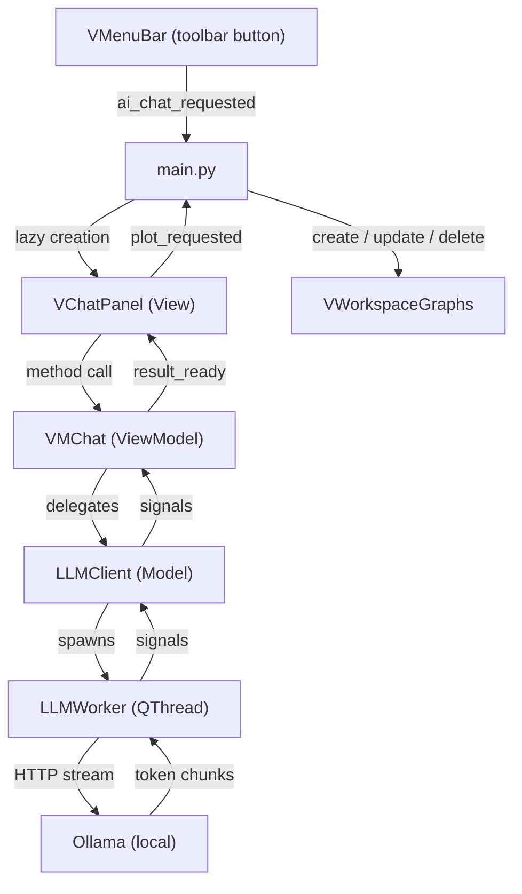
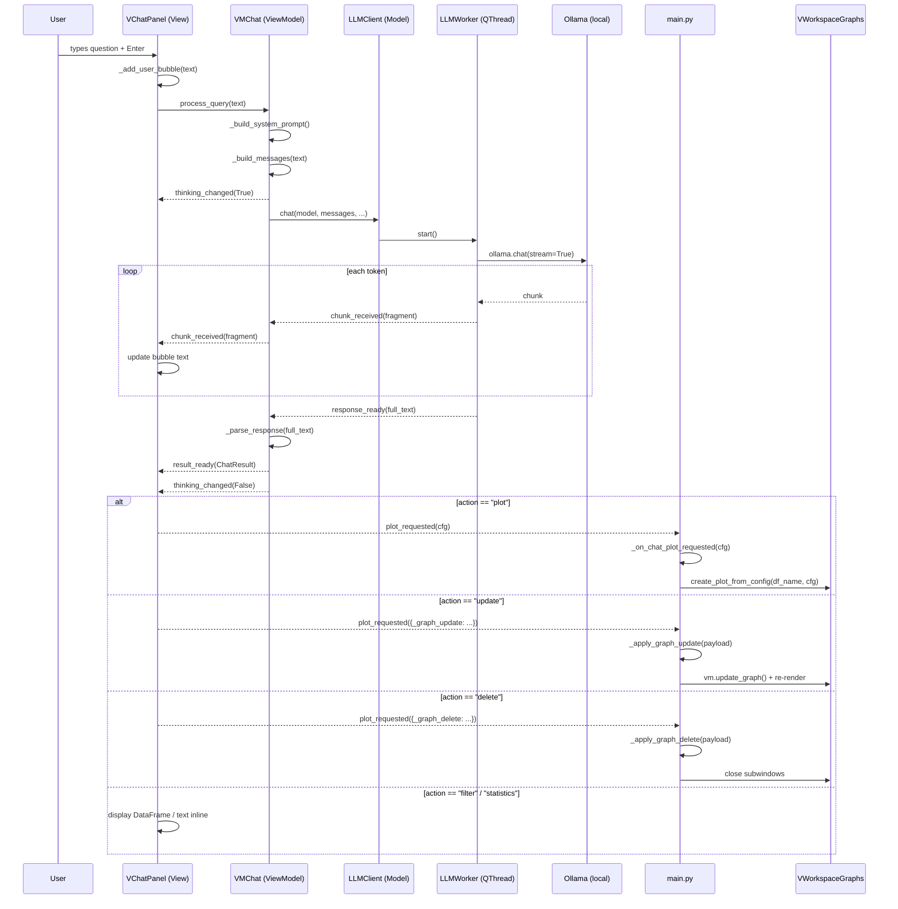

# **AI Data Chat**

The `AI Data Chat` is an optional, locally-hosted LLM chatbot that lets users query, filter, plot, and modify their data using natural language. It runs entirely on the user's machine via **Ollama** and communicates with the `Graphs` workspace to create, update, and delete plots.

> The AI module is **fully optional**. If the `ollama` Python package is not installed or the Ollama daemon is not running, the rest of SPECTROview is completely unaffected.

---

## **Prerequisites for Users**

### **Option 1: macOS**

1. **Install Ollama**
   Using Homebrew (recommended):
   ```bash
   brew install ollama
   ```
   *(Alternatively, download the macOS application directly from [Ollama's official website](https://ollama.com/download/mac).)*

2. **Start the Ollama Service**
   If you used Homebrew, start Ollama as a background service:
   ```bash
   brew services start ollama
   ```
   *(If you installed the Mac app, simply open the Ollama application from your Applications folder. You should see its icon in your menu bar.)*

### **Option 2: Windows**

1. **Install Ollama**
   Download the Windows installer from [Ollama's official website](https://ollama.com/download/windows) and run it.

2. **Start the Ollama Service**
   Ollama usually starts automatically after installation. If it doesn't, search for "Ollama" in the Start menu and open it. You should see the Ollama icon in your system tray (bottom right corner).

---

### **Common Steps (Both platforms)**

3. **Download the AI Model**
   SPECTROview uses `qwen2.5-coder:7b` by default. Open your terminal (or Command Prompt / PowerShell on Windows) and pull it:
   ```bash
   ollama pull qwen2.5-coder:7b
   ```

4. **Install the Python Dependency**
   The AI features require the `ollama` Python package to communicate with the local service. From your SPECTROview project directory, run:
   ```bash
   pip install ollama
   # or install using the optional dependencies:
   pip install -e ".[ai]"
   ```

5. **Run SPECTROview**
   Start the application:
   ```bash
   python -m spectroview.main
   ```
   Click on the **AI Data Chat** button in the top toolbar. The chat panel will open, and the status bar should say **🟢 Ollama connected**.

---

## **Architecture Overview**

The AI feature follows the same strict **MVVM** pattern as the rest of the application. All AI-related code lives in the `spectroview/llm/` package, isolated from the core workspaces.



---

## **Module Structure**

```
spectroview/llm/
├── __init__.py          # Docstring only — keeps the module optional
├── m_llm_client.py      # Model layer: Ollama connection + QThread worker
├── vm_chat.py           # ViewModel: system prompt, history, response parsing
└── v_chat_panel.py      # View: floating chat dialog (QDialog)
```

### **File Roles**

| File | Layer | Responsibility |
|------|-------|---------------|
| `m_llm_client.py` | **Model** | Wraps the `ollama` Python package. Checks availability, lists downloaded models, spawns a `QThread` worker to stream chat responses. |
| `vm_chat.py` | **ViewModel** | Builds the system prompt from DataFrame schemas. Manages conversation history. Parses the LLM's structured JSON response into a `ChatResult` object. Executes safe pandas operations (`df.query()`, `df.describe()`). |
| `v_chat_panel.py` | **View** | Floating `QDialog` with a chat bubble UI, model selector, status bar, and input field. Emits `plot_requested(dict)` when the AI suggests a plot or graph modification. |

---

## **Key Classes**

### **`LLMWorker` — Background Thread**

**File**: `spectroview/llm/m_llm_client.py`

A `QThread` subclass that executes a single streaming chat request against the local Ollama API. Emitting token-by-token so the UI can display a live typing effect.

| Signal | Payload | Purpose |
|--------|---------|---------|
| `chunk_received` | `str` | Each streamed token fragment |
| `response_ready` | `str` | Full assembled response text |
| `error_occurred` | `str` | Error message if Ollama is unreachable |

### **`LLMClient` — Connection Facade**

**File**: `spectroview/llm/m_llm_client.py`

A lightweight, non-Qt class that manages Ollama connectivity and worker lifecycle.

| Method | Purpose |
|--------|---------|
| `is_available()` | Returns `True` if both the `ollama` package and the local daemon are reachable (HTTP call to `/api/tags`) |
| `get_models()` | Returns sorted list of locally downloaded model names |
| `chat(model, messages, on_chunk, on_done, on_error)` | Spawns a background `LLMWorker`; cancels any previous in-flight request |
| `cancel()` | Terminates the current worker thread |
| `is_busy()` | Returns `True` while a worker is running |

**Default model**: `qwen2.5-coder:7b` (configurable via the UI combobox)

### **`VMChat` — ViewModel**

**File**: `spectroview/llm/vm_chat.py`

Manages one chat session linked to the loaded DataFrames. Follows the MVVM contract: the View calls public methods; the ViewModel responds exclusively through signals.

| Signal | Payload | Purpose |
|--------|---------|---------|
| `thinking_changed` | `bool` | `True` while the LLM is processing |
| `chunk_received` | `str` | Streaming token fragments for typing animation |
| `result_ready` | `ChatResult` | Parsed and validated action result |
| `error_occurred` | `str` | Human-readable error message |

#### **Public API**

| Method | Purpose |
|--------|---------|
| `set_dataframes(dfs, active_name)` | Update available DataFrames; clears history only when the set of DataFrame keys changes |
| `update_active_df_name(name)` | Switch active DataFrame without clearing history |
| `set_graphs(graphs)` | Update known open graphs (included in system prompt for context) |
| `set_model(model)` | Switch the Ollama model |
| `process_query(user_text)` | Send a user question to the LLM |
| `cancel()` | Abort in-progress request |
| `clear_history()` | Reset conversation history |

#### **Conversation History**

The ViewModel maintains a rolling history of the last **6 pairs** (12 messages: 6 user + 6 assistant) to prevent context overflow while enabling multi-turn follow-up questions. History is only cleared when the set of loaded DataFrames changes, not when the active selection switches.

### **`ChatResult` — Parsed Response**

**File**: `spectroview/llm/vm_chat.py`

A plain data object carrying the parsed LLM response back to the View:

| Field | Type | Purpose |
|-------|------|---------|
| `action` | `str` | `"filter"` \| `"statistics"` \| `"plot"` \| `"update"` \| `"delete"` \| `"answer"` |
| `explanation` | `str` | Human-readable description shown in the chat bubble |
| `dataframe` | `pd.DataFrame` \| `None` | Filtered DataFrame result |
| `text_summary` | `str` | Statistics text or plain-text answer |
| `plot_config` | `list[dict]` \| `None` | Plot configuration(s) for the Graphs workspace |
| `raw_response` | `str` | Full LLM text for debugging |

### **`VChatPanel` — View Dialog**

**File**: `spectroview/llm/v_chat_panel.py`

A floating `QDialog` with the following layout:

```
┌─────────────────────────────────────────────────┐
│  🤖  AI Data Chat              [model combo] [⟳]│
│─────────────────────────────────────────────────│
│  🟢 Ollama connected    📊 2 DataFrame(s) loaded│
│─────────────────────────────────────────────────│
│                                                 │
│   ┌─[You]──────────────────────────────────┐    │
│   │ Show rows where fwhm_Si > 5            │    │
│   └────────────────────────────────────────┘    │
│                                                 │
│   ┌─[🤖 AI]───────────────────────────────┐    │
│   │ Found 42 rows matching `fwhm_Si > 5`  │    │
│   │ ┌────────┬──────┬──────┐              │    │
│   │ │ name   │ fwhm │ ...  │              │    │
│   │ └────────┴──────┴──────┘              │    │
│   └────────────────────────────────────────┘    │
│                                                 │
│─────────────────────────────────────────────────│
│  [Clear]  [Ask a question about your data…] [▶] │
└─────────────────────────────────────────────────┘
```

Helper widgets:
- **`_MessageBubble`**: Styled `QFrame` for user / assistant / error messages with role-dependent colors
- **`_ThinkingDots`**: Animated "Thinking..." label with cycling dots
- **`_DataFramePreview`**: Inline `QTableWidget` for displaying filtered DataFrames (capped at 50 rows, 15 columns) with a "Copy table" button
- **`_ChatLineEdit`**: `QLineEdit` subclass that emits `send_requested` on Enter key

---

## **System Prompt & LLM Contract**

The ViewModel constructs a rich system prompt that injects:

1. **All loaded DataFrame schemas** — column names, dtypes, sample values, and a 3-row preview
2. **Currently active DataFrame** name
3. **Open graphs summary** — graph IDs with their style, x/y/z columns, and source DataFrame

The LLM is instructed to respond with **only a valid JSON object** (no markdown fences, no explanatory text) conforming to this schema:

```json
{
  "action": "filter | statistics | plot | update | delete | answer",
  "explanation": "short human-readable description",
  "target_dataframe": "name or null",
  "query": "pandas .query() expression or null",
  "stat_columns": ["col1", "col2"],
  "graph_update": {
    "graph_id": 1,
    "properties": { "ymin": 3.6, "plot_title": "New title", ... }
  },
  "graph_delete": {
    "delete_all": false,
    "graph_ids": [1, 2, 3]
  },
  "plot_config": [
    {
      "x": "column", "y": "column", "z": "column or null",
      "filters": ["pandas query string"],
      "plot_style": "point | scatter | box | bar | line | trendline | histogram | wafer | 2Dmap",
      "plot_title": "...", "xlabel": "...", "ylabel": "...",
      "xmin": null, "xmax": null, "ymin": null, "ymax": null,
      "color_palette": "jet | viridis | plasma | ...",
      "scatter_size": 70, "hist_bins": 20, "hist_kde": false,
      "plot_width": 480, "plot_height": 420, "dpi": 100
    }
  ],
  "answer_text": "plain text answer or null"
}
```

### **Safety Rules**

- Only `pd.DataFrame.query()` and `pd.DataFrame.describe()` are executed — **never** `eval()` or `exec()`.
- The LLM's `query` field is passed directly to `df.query()`, so only pandas expression syntax is allowed.
- If the JSON cannot be parsed, the raw text is displayed as an "answer" fallback.

---

## **Supported Actions**

### **1. Filter** (`action: "filter"`)

Applies a `pandas.query()` expression to the target DataFrame and shows the matching rows.

```
User: "Show rows where fwhm_Si > 5 and R² > 0.95"
→ action: "filter", query: "fwhm_Si > 5 and `R²` > 0.95"
→ Result: filtered DataFrame displayed inline as a table
```

### **2. Statistics** (`action: "statistics"`)

Runs `df[columns].describe()` on the specified columns. Falls back to all numeric columns if none are provided.

```
User: "Give me statistics for peak center and FWHM"
→ action: "statistics", stat_columns: ["center_Si", "fwhm_Si"]
→ Result: describe() output displayed as text
```

### **3. Plot** (`action: "plot"`)

Generates one or more plot configurations that are automatically applied to the Graphs workspace.

```
User: "Create a scatter plot of Slot vs center_Si colored by Zone"
→ action: "plot", plot_config: [{ x: "Slot", y: "center_Si", z: "Zone", plot_style: "scatter" }]
→ Result: plot created in the Graphs MDI area
```

**Comma-separated styles**: The LLM can return `"plot_style": "box, bar, point"` in a single entry. `VMChat._execute_plot()` expands this into 3 separate plot configs sharing the same axis/column settings.

### **4. Update** (`action: "update"`)

Modifies an existing graph by ID. The AI knows which graphs are open via the system prompt.

```
User: "Set the Y-axis range of graph 3 to [3.5, 4.2]"
→ action: "update", graph_update: { graph_id: 3, properties: { ymin: 3.5, ymax: 4.2 } }
→ Result: graph 3 is re-rendered with the new limits
```

### **5. Delete** (`action: "delete"`)

Closes one or more graphs. Supports `delete_all` or specific `graph_ids`.

```
User: "Delete all graphs except graph 5"
→ action: "delete", graph_delete: { delete_all: false, graph_ids: [1, 2, 3, 4, 6] }
→ Result: listed subwindows are closed
```

### **6. Answer** (`action: "answer"`)

Plain-text response for questions that don't map to data operations.

```
User: "What columns are available?"
→ action: "answer", answer_text: "The following columns are available: ..."
```

---

## **Data Flow: End-to-End**



---

## **Integration with Graphs Workspace**

### **Lazy Initialization**

The chat panel is created on first use in `Main.open_ai_chat()`. This avoids importing the `ollama` package or building the UI at startup.

```python
# main.py
if self._chat_panel is None:
    self._chat_panel = VChatPanel(self)
    self._chat_panel.plot_requested.connect(self._on_chat_plot_requested)
```

### **DataFrame Synchronization**

The chat panel stays in sync with the Graphs workspace through three signal connections set up in `main.py`:

| Signal | Handler | Trigger |
|--------|---------|---------|
| `vm.dataframes_changed` | `sync_chat_dfs_full` | DataFrames added/removed — refreshes all DFs and graph info |
| `vm.dataframe_columns_changed` | `sync_chat_active` | Active DataFrame selection changed — preserves chat history |
| `vm.graphs_changed` | `sync_chat_graphs` | Graphs created/updated/deleted — refreshes graph IDs in system prompt |

Each time the panel is shown, a forced sync is performed to ensure current data is available.

### **Plot Config Normalization**

When the AI emits a `plot_config`, `main.py` normalizes the raw JSON before passing it to the Graphs workspace:

| Field | Normalization |
|-------|--------------|
| `y` | `str` → `[str]`, `None` → `[]` |
| Limit fields (`xmin`, `ymin`, ...) | `str`/`int`/`"null"` → `float` or `None` |
| Integer fields (`x_rot`, `scatter_size`, ...) | Cast to `int`, remove on failure |
| `filters` | `["expr1", "expr2"]` → `[{"expression": "expr1", "state": True}, ...]` |

### **Graph Update Flow**

For `action: "update"`, `main.py._apply_graph_update()`:

1. Retrieves the existing `MGraph` model by ID.
2. Normalizes the property types (same rules as above).
3. Calls `vm.update_graph(graph_id, props)` to update the model.
4. Re-renders the corresponding `VGraph` widget in the MDI area.

### **Graph Delete Flow**

For `action: "delete"`, `main.py._apply_graph_delete()`:

1. Reads `delete_all` and `graph_ids` from the payload.
2. Determines the set of graph IDs to close.
3. Closes the corresponding `QMdiSubWindow` instances (triggers cleanup via the `closed` signal).

---

## **Toolbar Entry Point**

The AI Chat button is added to the main toolbar in `VMenuBar`:

```python
# v_menubar.py
self.actionAIChat = self.addAction(
    QIcon(os.path.join(ICON_DIR, "llm_ai.png")),
    "AI Data Chat"
)
self.actionAIChat.triggered.connect(self.ai_chat_requested.emit)
```

The `ai_chat_requested` signal is connected to `Main.open_ai_chat()` in `setup_connections()`.

---

## **Optional Dependency Management**

The AI feature is gated behind an optional dependency:

```toml
# pyproject.toml
[project.optional-dependencies]
ai = ["ollama>=0.4"]
```

Install with:
```bash
pip install -e ".[ai]"
```

### **Import Guard Pattern**

```python
# m_llm_client.py
try:
    import ollama as _ollama
    OLLAMA_AVAILABLE = True
except ImportError:
    _ollama = None
    OLLAMA_AVAILABLE = False
```

```python
# main.py
try:
    from spectroview.llm.v_chat_panel import VChatPanel, LLMClient
    LLM_AVAILABLE = True
except ImportError:
    LLM_AVAILABLE = False
```

If `ollama` is not installed:
- `LLMClient.is_available()` returns `False`
- The toolbar button shows an informational dialog instead of opening the panel
- No error is raised at startup

---

## **Response Parsing & Error Handling**

`VMChat._parse_response()` handles several edge cases in the LLM output:

1. **Markdown fences**: Strips `` ```json `` / `` ``` `` that the model sometimes adds.
2. **JSON extraction**: If the top-level text isn't valid JSON, a regex searches for the first `{...}` block.
3. **Fallback**: If no valid JSON can be found, the raw text is returned as an `action: "answer"` so the user always sees something useful.
4. **Invalid DataFrame target**: Falls back to the active DataFrame, then to the first loaded DataFrame.

---

## **Current Features (Graph Workspace)**

| Feature | Description |
|---------|-------------|
| **Natural language plot creation** | Ask for any of the 9 supported plot styles (point, scatter, box, bar, line, trendline, histogram, wafer, 2Dmap) with column, filter, and style options |
| **Multi-plot generation** | A single query can create multiple plots simultaneously (e.g., "create a box and scatter plot of X vs Y") |
| **Data filtering** | Filter DataFrames using natural language (translated to `pandas.query()` expressions) |
| **Descriptive statistics** | Request `describe()` statistics on specific columns |
| **Graph modification** | Update existing graph properties (axis limits, title, style, filters) by graph ID |
| **Graph deletion** | Delete specific graphs or all graphs by natural language instruction |
| **Multi-DataFrame support** | Switch between multiple loaded DataFrames; the AI knows which is active |
| **Conversation memory** | Multi-turn conversations with rolling 6-pair history; follow-up queries reuse context |
| **Streaming responses** | Token-by-token display with live typing animation |
| **Model selection** | Switch between locally downloaded Ollama models via the header combobox |
| **Inline data preview** | Filtered DataFrames displayed as interactive tables with copy-to-clipboard |
| **Context-aware prompts** | System prompt includes DataFrame schemas, sample values, and open graph configurations |


