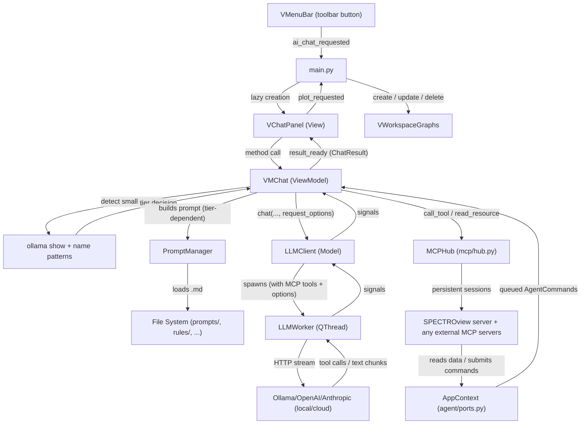
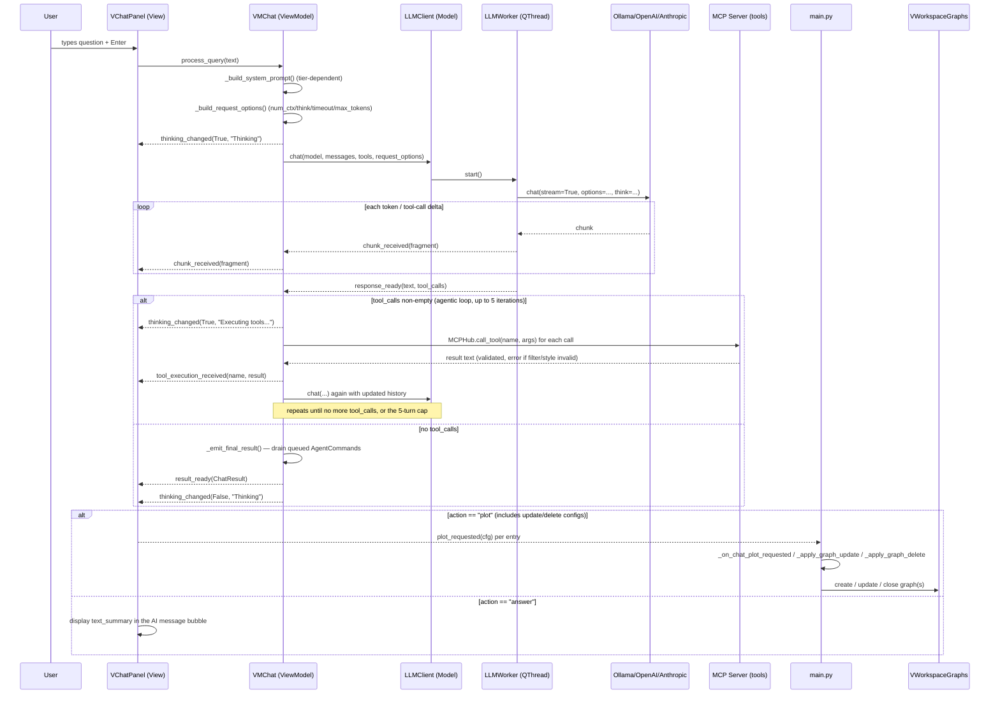

# **AI Data Chat**

The `AI Data Chat` is an optional, multi-provider AI chatbot that lets users query, filter, plot, and modify their data using natural language. It supports local inference via **Ollama**, cloud providers via the **OpenAI** SDK (OpenAI, DeepSeek, Gemini, and any OpenAI-compatible endpoint), and **Anthropic** Claude models. The agent communicates with the `Graphs` workspace to create, update, and delete plots in real time.

> The AI module is **optional to use** — if Ollama isn't running and no cloud API key is configured, the chat panel shows a red "not connected" status and the rest of SPECTROview is completely unaffected. The Python packages it depends on (`ollama`, `openai`, `anthropic`, `mcp`) are, however, unconditional install-time dependencies of the project (see [Optional Dependency Management](#optional-dependency-management)).

A second, distinct axis of "optional" matters here too: **small local models get a different, simplified prompt and request configuration than large/cloud models** — this is the biggest architectural addition since the MCP migration and is covered in its own section below ([Small-Model Support](#small-model-support)).

---

## **Prerequisites for Users**

### **Option 1: macOS**

1. **Install Ollama**
   Using Homebrew (recommended):
   ```bash
   brew install ollama
   ```
   *(Alternatively, download the macOS application directly from [Ollama's official website](https://ollama.com/download/mac).)*

2. **Start the Ollama Service**
   If you used Homebrew, start Ollama as a background service:
   ```bash
   brew services start ollama
   ```
   *(If you installed the Mac app, simply open the Ollama application from your Applications folder. You should see its icon in your menu bar.)*

### **Option 2: Windows**

1. **Install Ollama**
   Download the Windows installer from [Ollama's official website](https://ollama.com/download/windows) and run it.

2. **Start the Ollama Service**
   Ollama usually starts automatically after installation. If it doesn't, search for "Ollama" in the Start menu and open it. You should see the Ollama icon in your system tray (bottom right corner).

---

### **Common Steps (Both platforms)**

3. **Download an AI Model**
   SPECTROview uses `qwen2.5-coder:7b` by default. Open your terminal (or Command Prompt / PowerShell on Windows) and pull it:
   ```bash
   ollama pull qwen2.5-coder:7b
   ```
   Any Ollama model that supports tool/function calling will work — see [Small-Model Support](#small-model-support) for how SPECTROview adapts its behavior to the model you pick.

4. **Install SPECTROview**
   `ollama`, `openai`, `anthropic`, and `mcp` are core dependencies of the package (not a separate extras group), so a normal install already includes everything the AI feature needs:
   ```bash
   pip install -e .
   ```

5. **Run SPECTROview**
   Start the application:
   ```bash
   python -m spectroview.main
   ```
   Click on the **AI Data Chat** button in the top toolbar. The chat panel will open, and the status bar should say **🟢 Ollama connected**.

---

## **Architecture Overview**

The AI feature follows the same strict **MVVM** pattern as the rest of the application. All AI-related code lives in the `spectroview/ai_agent/` package, isolated from the core workspaces.


### **The AppContext boundary**

The MCP server does **not** import `VMChat`. It is handed an `AppContext`
(`agent/ports.py`) — a five-method protocol: list DataFrames, get one, get the
active name, list graphs, submit a command. `VMChat` supplies a `VMChatContext`
adapter; tests supply `RecordingContext`.

This is what makes the tool layer independently testable (no Qt, no LLM, no
application) and what would let the same server run out-of-process. Tools never
mutate the ViewModel; they submit typed commands (`agent/commands.py`:
`CreatePlot`, `UpdatePlot`, `DeletePlots`), which `VMChat` drains and normalises
once when the turn ends.

### **MCPHub — one loop, many servers**

`MCPHub` (`mcp/hub.py`) owns a single asyncio event loop on a background thread
and keeps an initialised session open for every server listed in
`config/servers.yaml` (`in-process`, `stdio`, or `http`). Qt-thread callers use
plain synchronous methods; the hub marshals each call onto its loop.

Previously the ViewModel called `asyncio.run()` directly on the GUI thread and
rebuilt the server session for every tool batch — which blocked the UI and only
worked because the single server was in-process.

Tool names stay unqualified while unique across servers (so `plot_graph` keeps
working everywhere it is documented); a name offered by two servers becomes
`<server_id>__<tool>` for both. A per-server `tools:` allowlist keeps the
offered set small — tool schemas are prompt tokens on every turn, and small
local models degrade quickly past roughly a dozen tools.

### **Pushed vs pulled context**

The system prompt always carries DataFrame names, shapes, and every column name
with its dtype — a model that has never seen a column name will invent one, so
this half is non-negotiable. Sample values, row previews, and full graph configs
are bulky and rarely decisive, so they live behind MCP **resources**
(`spectroview://dataframes/detail`, `spectroview://graphs/detail`).

No LLM API has a native notion of a resource, so the hub exposes reading one as
a synthetic `get_context(uri)` tool whose `uri` enum lists exactly the resources
currently available — which also constrains grammar-guided local models to a
real URI. Resources added by any server appear there with no client change.

---

## **Module Structure**

```
spectroview/ai_agent/
├── __init__.py              # Docstring only — keeps the module optional
├── config/                  # YAML configuration (model.yaml, settings.yaml, servers.yaml)
├── examples/                # Few-shot conversation examples (Markdown)
│   ├── plotting_examples.md #   Full-tier: 13 examples, tool-call style
│   └── examples_small.md    #   Simplified-tier: ~8 tight examples covering all 5 tools
├── knowledge/                # Static domain facts (Markdown; full tier only)
├── prompts/                  # Core identity + per-topic instructions (Markdown)
│   ├── system.md, chat.md, plotting.md   # Full tier (default; also used by cloud providers)
│   └── system_small.md      #   Simplified tier — single consolidated file for detected small models
├── rules/                   # Behavioural constraints (Markdown)
├── agent/                   # Qt-free core
│   ├── commands.py          #   CreatePlot / UpdatePlot / DeletePlots dataclasses
│   └── ports.py             #   AppContext protocol + RecordingContext (the test fake)
├── utils/
│   ├── plot_utils.py        # normalize_plot_config / expand_comma_styles — type coercion for plot configs
│   ├── safe_eval.py         # evaluate_pandas_expression() — df.query() first, sandboxed eval() fallback
│   └── df_summary.py        # compact_dataframe_schema() for the prompt; summarize_dataframe_columns() for the resource
├── m_llm_client.py          # Model layer: LLM connections + QThread workers
│                            #   - LLMWorker (Ollama)
│                            #   - APIWorker (OpenAI-compatible)
│                            #   - AnthropicWorker (Anthropic SDK)
│                            #   - anthropic_tools()/anthropic_messages() — protocol translation
│                            #   - LLMClient (unified facade)
│                            #   - get_ollama_model_info() — `ollama show` wrapper for size detection
├── m_conversation.py        # Data model: single conversation (messages, save/load JSON)
├── m_conversation_store.py  # Conversation store: scan/list/load saved conversations
├── mcp/
│   ├── server.py            # SPECTROview's FastMCP server: 5 tools + 2 resources
│   ├── hub.py               # MCP client: one loop thread, one session per server
│   └── config.py            # servers.yaml -> validated ServerSpec list
├── m_prompt_manager.py      # Prompt caching and assembly: loads and merges the Markdown fragments
├── vm_chat.py               # ViewModel: prompt-tier selection, small-model detection, request tuning, agentic loop
├── v_chat_panel.py          # View: floating chat dialog (QDialog), incl. the Auto/Full/Simplified selector
└── v_history_dialog.py      # View: history browser dialog (QDialog)
```

### **File Roles**

| File | Layer | Responsibility |
|------|-------|---------------|
| `m_prompt_manager.py` | **Model** | Loads, caches, and assembles Markdown files into a system prompt for a given set of `prompts=`/`rules=`/`knowledge=`/`examples=` lists. Also parses `config/model.yaml`/`config/settings.yaml` (`.model_config`). |
| `m_llm_client.py` | **Model** | Wraps Ollama, OpenAI SDK, and Anthropic SDK. Checks availability, lists models, looks up a model's parameter count (`get_ollama_model_info`), translates the OpenAI tool dialect to Anthropic's, and spawns one of three background `QThread` workers depending on the selected provider. |
| `m_conversation.py` | **Model** | Represents a single conversation: add messages (including `tool_calls`/`tool_call_id`), auto-title, save/load as JSON, cap to the last N messages **without splitting a tool call from its result**. Skips saving empty conversations. |
| `m_conversation_store.py` | **Model** | Scans the history folder, lists saved conversations as lightweight summaries, loads conversations by ID. |
| `agent/ports.py` | **Model** | `AppContext` — the only thing the MCP tools know about the application. `RecordingContext` is the in-memory implementation used by every tool test. |
| `agent/commands.py` | **Model** | `CreatePlot`/`UpdatePlot`/`DeletePlots` — what a tool asks the application to do, instead of raw dicts keyed by `_graph_update`/`_graph_delete`. |
| `mcp/server.py` | **Model** | FastMCP server exposing SPECTROview's 5 tools and 2 resources, with request-time filter/plot-style validation. Depends only on `AppContext`. |
| `mcp/hub.py` | **Model** | MCP client: background event loop, one persistent session per configured server, tool-name qualification, allowlists, and the synthetic `get_context` resource tool. |
| `mcp/config.py` | **Model** | Parses and validates `config/servers.yaml`; skips (with a warning) any entry that is malformed, disabled, or a duplicate id. |
| `utils/safe_eval.py` | **Model** | Shared, sandboxed pandas-expression evaluator used by both `query_dataframe` and the filter-validation step in `plot_graph`/`update_graph`. |
| `utils/df_summary.py` | **Model** | `compact_dataframe_schema()` builds the always-pushed names+dtypes block; `summarize_dataframe_columns()` builds the detailed listing served by the `dataframes/detail` resource, compacting by prefix past `column_detail_threshold` columns without ever hiding a column name. |
| `utils/plot_utils.py` | **Model** | `normalize_plot_config()`/`expand_comma_styles()` — post-processes accumulated plot configs (type coercion, comma-separated multi-style expansion) before they reach the Graphs workspace. |
| `vm_chat.py` | **ViewModel** | Detects small-vs-full model tier, builds the tier-appropriate system prompt, assembles Ollama/timeout/max-token request options, manages conversation history, and runs the tool-calling agentic loop (up to 5 turns). |
| `v_chat_panel.py` | **View** | Floating `QDialog` with chat bubbles, provider/model selector, the prompt-tier selector, timestamp display, status bar, and input field. Emits `plot_requested(dict)` when the AI creates/updates/deletes a graph. The model selector is an **editable** `QComboBox` (a model name can be typed directly); for the **Custom** provider its list is seeded from the comma-separated `custom_models` setting (Settings ▸ AI) via `_custom_model_names()`, so endpoints without a model-listing API are still usable. |
| `v_history_dialog.py` | **View** | Browsable list of saved conversations sorted by most-recent-first. Supports open, rename, duplicate, and delete. |

---

## **Small-Model Support**

Small local models (roughly, anything under ~10B parameters) get a measurably different prompt, context budget, and request configuration than large/cloud models — not just a shorter version of the same thing. This exists because a large, information-dense prompt with an unset context window is enough on its own to make an otherwise-capable small model fail at tool calling (see the case study at the bottom of this section).

### Detection

`VMChat._auto_detect_small_model()` resolves in this order:

1. **Manual override** — `VMChat.set_small_model_mode(True | False | None)`. `None` (the default) means "keep auto-detecting." Exposed in the UI as the **Auto / Full / Small** combo box in `v_chat_panel.py`'s header, persisted via `MSettings`.

### **Persisted settings**

Everything the agent stores — provider, selected model per provider, prompt
tier, API keys, chat-history folder — lives under the `ai_chat/` prefix of the
single application store, reached through `MSettings.get_ai_value()` /
`set_ai_value()`. The AI module imports no `QSettings` of its own.

It used to keep a second `QSettings("SPECTROview", "AIChat")` pair. That made
the agent's configuration invisible to the rest of the app and, worse, slipped
past the `_isolate_qsettings` test fixture — so any test constructing a `VMChat`
read the developer's real settings and wrote chat history into their real
history folder. `MSettings._migrate_legacy_ai_settings()` copies the old values
across once (guarded by a marker key, never overwriting a newer value) and
leaves the legacy store in place so an older build still runs.

> **Secrets**: API keys are written to the per-user OS settings store (Windows
> registry / macOS defaults) — never to a file inside the project, so they
> cannot be committed. `config/servers.yaml` *is* committed: never put a token
> in it, use `${VAR}` (expanded by `mcp/config.py`) instead.
2. **Parameter-count check** (Ollama only) — `get_ollama_model_info(model)` calls `ollama show <model>`, parses `details.parameter_size` (e.g. `"8.2B"`) via `_parse_param_size_to_billions()`, and compares it against `config/model.yaml`'s `small_model_param_threshold_b` (default **10.0**). Cached per model name for the life of the `VMChat` instance.
3. **Name-pattern fallback** — if the parameter count can't be determined (cloud model, or `ollama show` fails), the model name is matched against `VMChat._SMALL_MODEL_PATTERNS`, a list of known small model tags (`qwen3:8b`, `gemma3:4b`, `phi3:mini`, `deepseek-r1:8b`, etc.).
4. **Default: full tier.** If nothing resolves, the model is treated as large. An unrecognized model getting the full prompt is the safer failure mode than an unrecognized *large* model being needlessly handicapped.

Detection is hard-gated to `provider == "Ollama"` for steps 2–3 — cloud providers always resolve to the full tier unless a manual override forces otherwise. Detection re-runs on `set_model()`/`set_provider()`, never during `__init__` (an `ollama show` network call shouldn't race object construction).

### What changes in Simplified mode

All four of the following are computed in `vm_chat.py` and read from `config/model.yaml`:

| Aspect | Full tier | Simplified tier | Config keys |
|---|---|---|---|
| System prompt | `system.md`+`chat.md`+`plotting.md` + `rules/general,plotting,spectroview` + `knowledge/features` + `examples/plotting_examples` (~27K chars) | `system_small.md` + `rules/general` + `examples/examples_small` (~9K chars) | n/a (hardcoded lists in `_build_system_prompt()`) |
| Conversation history | unlimited | last 6 messages | `max_context_messages` / `max_context_messages_small` |
| Ollama `num_ctx` | 16384 | 8192 | `ollama_num_ctx_full` / `ollama_num_ctx_small` |
| Max output tokens | 81920 | 4096 | `max_tokens` / `max_tokens_small` |
| Ollama `think` | unset (model/Ollama default) | `false` | `ollama_think` |

`rules/general.md` is shared by both tiers (it's small and universally correct); `rules/plotting.md`, `rules/spectroview.md`, and `knowledge/features.md` are full-tier only — their essential content (filter quoting, spatial-plot axis mapping) is folded directly into `system_small.md` instead.

`num_ctx` and `think` are Ollama-`options`-only: `LLMClient.chat()`'s `request_options` dict is translated per-provider, and these two keys are never forwarded to `APIWorker`/`AnthropicWorker` — structurally impossible to affect DeepSeek/OpenAI/Anthropic/Gemini regardless of which tier is active.

### Schema-level accommodations (help every model, not just small ones)

Two changes in `mcp/server.py` reduce ambiguity for *any* model, independent of prompt tier:

- `plot_style` is a `Literal[...]` (produces a real JSON-Schema `enum` of the 9 valid styles) instead of a bare `str`.
- The most common `other_properties` keys (`grid`, `plot_title`, `xlabel`, `ylabel`, `zlabel`, axis limits, `color_palette`, log-scale flags, etc.) are explicit, typed, named parameters on `plot_graph`/`update_graph`, in addition to the `other_properties` catch-all dict. A model that puts `grid=true` at the top level of the call (rather than correctly nested inside `other_properties`) no longer loses that value — both forms are merged into the final config, with the named parameter winning on conflict.

### Case study: qwen3:8b

Given an identical 3-plot request, a large cloud model (DeepSeek) succeeded in one turn; `qwen3:8b` failed two different ways on two attempts before this system existed:
- **Attempt A**: emitted zero tool calls — instead, 2,237 characters of prose describing a plan, in ```python fenced pseudo-code, that was never actually executed.
- **Attempt B**: emitted valid tool calls, but placed `grid: true` as a top-level argument (the only place its real signature recognized it was nested inside `other_properties`) — silently dropped by MCP/Pydantic, no error, no retry.

After the fixes above: **3/3 replay attempts succeeded**, each producing exactly 3 correctly-shaped `plot_graph` calls (with `grid` correctly preserved) and a closing summary, averaging ~19s total versus the original 42–100s *per single failed turn*.

---

## **Key Classes**

### **`LLMWorker` / `APIWorker` / `AnthropicWorker` — Background Threads**

**File**: `spectroview/ai_agent/m_llm_client.py`

Three `QThread` subclasses, one per backend. Each executes a single streaming (or, for Anthropic with tools, non-streaming) chat request.

| Class | Backend | Package required | Extra constructor params |
|-------|---------|------------------|---------------------------|
| `LLMWorker` | Ollama (local) | `ollama` | `options` (dict: `num_ctx`, `num_predict`), `think` (`bool`\|`"low"`\|`"medium"`\|`"high"`\|`None`), `timeout` |
| `APIWorker` | OpenAI, DeepSeek, Gemini, Custom | `openai` | `timeout`, `max_tokens` |
| `AnthropicWorker` | Anthropic Claude | `anthropic` | `timeout`, `max_tokens` |

`LLMWorker` only constructs an `ollama.Client(timeout=...)` when a timeout is actually set; otherwise it uses the module-level `ollama.chat()` convenience function directly. Tool calls returned by Ollama arrive as pydantic model objects (`ollama._types.Message.ToolCall`), not plain dicts — `LLMWorker.run()` normalizes each one via `.model_dump()` before emitting, so `MConversation.save()` (plain `json.dump`) doesn't choke on a non-serializable object.

| Signal | Payload | Purpose |
|--------|---------|---------|
| `chunk_received` | `str` | Each streamed token fragment |
| `response_ready` | `(str, list)` | Full assembled response text + accumulated tool calls |
| `error_occurred` | `str` | Error message if the backend is unreachable |

> **Error messages surface the root cause.** All three workers pass caught exceptions through `_format_exception()`, which walks the `__cause__`/`__context__` chain. The openai/anthropic SDKs collapse low-level TLS/socket failures into a terse `APIConnectionError("Connection error.")`; without the walk, a corporate-CA `CERTIFICATE_VERIFY_FAILED`, a DNS `getaddrinfo failed`, or a refused connection would all render identically and undiagnosably.

> **Corporate / internal-CA TLS.** `openai`/`anthropic` verify TLS via httpx against certifi's bundle, which omits private corporate CAs — an on-prem endpoint then fails with the opaque "Connection error." above. `m_llm_client` handles this at import time: if `SSL_CERT_FILE`/`REQUESTS_CA_BUNDLE` names a PEM file it is passed as httpx's `verify` (`_make_http_client()`, threaded into every SDK client as `http_client=`); otherwise `truststore.inject_into_ssl()` routes verification through the OS trust store (e.g. the Windows certificate store), where such CAs usually already live. `truststore` is a core dependency (declared with a `python_version >= '3.10'` marker in `pyproject.toml`, since it targets Python 3.10+); the import is still guarded, so on an older interpreter — or any environment where it's missing — its absence just leaves certifi as the default.

> Ollama's `message["thinking"]` field (hybrid-reasoning models' hidden scratchpad, when `think` is enabled) is intentionally **never** appended to `chunk_received`/the response text — merging a hidden-reasoning channel into the visible answer is exactly how the qwen3 "Attempt A" failure above happens. A "Show model reasoning" UI toggle (an opt-in `think=True` override plus a collapsible reasoning section under each message bubble) existed for a time and has since been **removed entirely** — the app never explicitly requests `think=True` anymore, so `think` simply stays at each tier's default (unset for full tier, `false` for small tier; see the [Small-Model Support](#small-model-support) table). The channel separation itself is kept regardless of that removal: even if a model spontaneously emits `thinking` content unrequested, `LLMWorker`'s `thinking_chunk_received` signal (and `VMChat._on_thinking_chunk`, which now just discards the fragment instead of surfacing it) keeps it off the answer channel.

### **`LLMClient` — Connection Facade**

**File**: `spectroview/ai_agent/m_llm_client.py`

A lightweight, non-Qt facade that manages provider selection, API key storage, and worker lifecycle.

**Known providers** (defined in `API_PROVIDERS` dict):
- `Ollama` → `LLMWorker`
- `OpenAI`, `DeepSeek`, `Gemini`, `Custom` → `APIWorker`
- `Anthropic` → `AnthropicWorker`

| Method | Purpose |
|--------|---------|
| `is_available()` | `True` if the active provider's package is installed and (Ollama) the daemon responds, or (cloud) an API key is set |
| `get_models()` | Sorted list of available model names for the active provider |
| `chat(model, messages, on_chunk, on_done, on_error, tools=None, parent=None, request_options=None)` | Spawns the right background worker for the active provider; cancels any in-flight request first. `request_options` (`num_ctx`/`think`/`timeout`/`max_tokens`) is translated per-provider — see [Small-Model Support](#small-model-support) for the cross-provider isolation guarantee. |
| `cancel()` | Terminates the current worker thread |
| `is_busy()` | `True` while a worker is running |

**Module-level helper**: `get_ollama_model_info(model) -> Optional[ollama.ShowResponse]` — best-effort `ollama.show()`, returns `None` on any failure; never raises. Used by `VMChat`'s small-model detection.

**Default model**: `qwen2.5-coder:7b` (configurable via the UI combobox; `LLMClient.DEFAULT_MODEL`).

### **`PromptManager` — Prompt Assembly**

**File**: `spectroview/ai_agent/m_prompt_manager.py`

A caching manager that reads Markdown sections from disk and concatenates them into a system prompt for whatever `prompts=`/`rules=`/`knowledge=`/`examples=` lists it's given.

| Method | Purpose |
|--------|---------|
| `load_prompt(name)` / `load_rule(name)` / `load_knowledge(name)` / `load_example(name)` | Load one Markdown file by stem, cached in memory (auto-invalidated on mtime change if `auto_reload: true`) |
| `build_prompt(prompts, rules, knowledge, examples)` | Assembles a complete system prompt from the named fragments. Missing files are skipped with a warning rather than raising. |
| `.model_config` | Parsed `config/model.yaml` as a dict |

> **Which fragments load is decided in code**, by `VMChat._build_system_prompt()` — one list for the full tier, one for the simplified tier (see [Small-Model Support](#small-model-support)). There is no intent router. An earlier keyword-based one (`_detect_intent()`, `_INTENT_DEFAULTS`, `enable_intent_detection`) was inert — the explicit lists always short-circuited it — and has been removed along with the five prompt fragments only it could have loaded (`prompts/fitting.md`, `prompts/coding.md`, `rules/fitting.md`, `rules/python.md`, `examples/filtering_examples.md`). Recover them from git history if intent routing is ever built for real.

### **`VMChat` — ViewModel**

**File**: `spectroview/ai_agent/vm_chat.py`

Manages one chat session linked to the loaded DataFrames. Follows the MVVM contract: the View calls public methods; the ViewModel responds exclusively through signals.

| Signal | Payload | Purpose |
|--------|---------|---------|
| `thinking_changed` | `(bool, str)` | `True` while the LLM/tool loop is processing, with a status label (`"Thinking"` / `"Executing tools..."`) |
| `chunk_received` | `str` | Streaming token fragments for typing animation |
| `result_ready` | `ChatResult` | Final result once the agentic loop stops issuing tool calls |
| `error_occurred` | `str` | Human-readable error message |
| `tool_execution_received` | `(str, str)` | Tool name + its result text, emitted for every tool call in the loop (including intermediate ones). The View uses it only to update the transient "thinking" status — intermediate tool steps are no longer rendered as chips in the conversation |
| `conversation_changed` | `str` | New/loaded conversation's title |

#### **Public API**

| Method | Purpose |
|--------|---------|
| `set_dataframes(dfs, active_name)` | Update available DataFrames |
| `update_active_df_name(name)` | Switch active DataFrame without clearing history |
| `set_graphs(graphs)` | Update known open graphs (included in system prompt for context) |
| `set_model(model)` | Switch model; re-runs small-model auto-detection |
| `set_provider(provider, api_key, base_url, model)` | Switch backend; re-runs auto-detection; starts a new conversation |
| `set_small_model_mode(enabled)` | `True`/`False` force a tier, `None` resume auto-detection |
| `is_small_model_mode()` | `True` if the simplified tier is currently active |
| `process_query(user_text)` | Send a user question to the LLM |
| `cancel()` | Abort in-progress request |
| `clear_history()` | Reset conversation history (same as **+ New Chat**) |

#### **The Agentic Tool-Calling Loop**

`process_query()` → `LLMClient.chat()` → `_on_done(full_text, tool_calls)`:

- If `tool_calls` is non-empty: each call's `arguments` (parsed if it arrived as a JSON string; a parse failure produces an actionable "please retry with valid JSON" tool-result message instead of silently substituting `{}`) is dispatched through `MCPHub.call_tool(name, args)`, which routes it to whichever server owns that tool. Every tool result — success, a validation error, or an unknown-tool message — is appended to conversation history as a `role="tool"` message, and `_on_done` calls `LLMClient.chat()` again with the updated history. Capped at `VMChat.MAX_AGENT_TURNS` (**5**).
- If `tool_calls` is empty: the turn ends via `_emit_final_result()`.

`_emit_final_result()` drains the commands queued on the context during the turn, renders them to configs (normalising once, in `_commands_to_configs`), and emits `ChatResult(action="plot", plot_config=[...])` — or `ChatResult(action="answer", text_summary=...)` when nothing was queued.

It runs on **every** terminating path, including the turn cap and a tool-execution exception. Previously those two paths returned early, so a model that queued three plots and then kept calling tools until the cap left the user with an error and no graphs, after being told the graphs were created.

**`ChatResult.action` is only ever `"plot"` or `"answer"`.** The pre-MCP JSON-protocol values (`"filter"`/`"statistics"`/`"update"`/`"delete"`/`"query"`) have no code path; `query_dataframe`/`get_statistics` results reach the user as the model's final prose answer, not as a separate structured result. The vestigial `dataframe`/`raw_response`/`query`/`target_dataframe` fields and the `_DataFramePreview` widget that only rendered for them have been removed.

#### **Request Options**

`_build_request_options()` reads `config/model.yaml` and returns the `num_ctx`/`think`/`timeout`/`max_tokens` dict passed as `request_options=` to every `LLMClient.chat()` call — see [Small-Model Support](#small-model-support) for the full table of full-vs-simplified values.

#### **Conversation History & Persistence**

Conversations are saved automatically as JSON files in the user-configured history folder (**Settings → AI tab**). `MConversation`:

- Accumulates messages (including `tool_calls`/`tool_call_id` for tool-calling turns) with ISO timestamps.
- Auto-titles itself from the first user message (up to 60 chars).
- Persists to disk after each assistant turn and after each batch of tool results.
- Is **not cleared** when the user loads a new workspace file or switches DataFrames — only **+ New Chat** resets it.

The context actually sent to the LLM is capped via `max_context_messages` — unlimited for the full tier, the last 6 messages for the simplified tier (see [Small-Model Support](#small-model-support); this replaces a `MAX_HISTORY_PAIRS = 6` class constant that used to exist but was never actually wired to anything).

`to_llm_messages()` **widens** that window rather than cutting blindly: a `role="tool"` message is only valid immediately after the assistant message carrying its `tool_calls`, so if the cap would land between them the window is extended backwards until the pair is intact. Slicing between them made providers reject the request — and because the cap is only active in simplified mode, it hit exactly the small local models least able to recover from an API error.

### **`ChatResult` — Parsed Response**

**File**: `spectroview/ai_agent/vm_chat.py`

```python
class ChatResult:
    __slots__ = ("action", "explanation", "text_summary", "plot_config")
```

| Field | Type | Purpose |
|-------|------|---------|
| `action` | `str` | `"plot"` or `"answer"` — the only two values (see above) |
| `explanation` | `str` | Text shown on the message card when graph commands ran |
| `text_summary` | `str` | The LLM's final natural-language text |
| `plot_config` | `list[dict]` \| `None` | Accumulated plot/update/delete configs for the Graphs workspace |

### **`VChatPanel` — View Dialog**

**File**: `spectroview/ai_agent/v_chat_panel.py`

A floating `QDialog`. Header row 1: provider selector, model selector, **prompt-tier selector** (`cbb_prompt_tier`: Auto / Full prompt / Simplified prompt — see [Small-Model Support](#small-model-support)), refresh button. Header row 2 (left to right): connection status label `lbl_status` (appends `· Simplified prompts` when active), `lbl_no_data` (a "no DataFrame selected/available" notice, blank once DataFrames are loaded), a stretch, then the Conversation History / New Chat buttons (36×36 icon buttons). There is no longer a separate status-bar strip below the header — both status labels live in the header itself now.

Two things previously on this panel have since moved or been removed:
- The **"Show model reasoning" toggle** is gone entirely (see the note under `LLMWorker`/`APIWorker`/`AnthropicWorker` above) — reasoning is never surfaced in the chat UI now.
- **General plot-template management** (browse/apply/rename/duplicate/delete, save-all-open-graphs) now lives entirely in the Graphs workspace (`VWorkspaceGraphs`, next to Add/Update plot), not here. `VChatPanel.prompt_and_save_template()` survives only as the inline "Save N plot(s) as Template" shortcut offered after the AI creates plots (see `_on_result_ready`).
- **Intermediate tool-step chips** (`🔧 query_dataframe`, `🔧 plot_graph`, …) are no longer shown in the conversation. `_on_tool_execution` now only updates the transient "thinking" status so the finished chat stays clean.

Helper widgets:
- **`_MessageCard`**: styled message bubble; `_add_card(text, role, timestamp)` indents it on the side matching the speaker
- **`_ChatLineEdit`** / input area: emits `send_requested` on Enter key

---

## **System Prompt & LLM Contract**

The system prompt is modular and managed by `PromptManager`, assembled from two tiers of granular Markdown files depending on the active model (see [Small-Model Support](#small-model-support)):

**Full tier** (default; also used for all cloud providers):
1. **Core prompt** (`prompts/system.md`, `chat.md`, `plotting.md`): identity, tool-usage contract, plotting instructions.
2. **Dynamic context** (injected by `VMChat`): DataFrame schemas/sample values (compacted above `column_detail_threshold` columns via `utils/df_summary.py`), active DataFrame name, open-graph summary.
3. **Rules** (`rules/general.md`, `plotting.md`, `spectroview.md`): behavioral constraints.
4. **Knowledge** (`knowledge/features.md`): static facts about the software.
5. **Examples** (`examples/plotting_examples.md`): 13 few-shot tool-call examples.

**Simplified tier**: `prompts/system_small.md` (self-contained: identity, critical rules, dynamic context placeholders, tool list, common `plot_graph` options, spatial-plot mapping, multi-turn guidance — all in one file) + `rules/general.md` + `examples/examples_small.md` (~8 examples covering all 5 tools).

The agent uses **native Tool/Function Calling** via the **Model Context Protocol (MCP)** — no JSON-text parsing. The LLM is given a strict, typed schema for each tool (`mcp/server.py`, built with `FastMCP`):

```python
query_dataframe(query: str, df_name: str = "") -> str
get_statistics(columns: list[str], df_name: str = "") -> str
plot_graph(x: str, y: str | list[str], plot_style: Literal[9 styles], z=None,
           filters: list[str] | None = None, df_name: str = "",
           grid=None, plot_title=None, xlabel=None, ylabel=None, zlabel=None,
           xmin=None, xmax=None, ymin=None, ymax=None, zmin=None, zmax=None,
           color_palette=None, xlogscale=None, ylogscale=None,
           scatter_size=None, hist_bins=None, trendline_order=None,
           other_properties: dict | None = None) -> str
update_graph(graph_id: str, ...)   # same optional fields as plot_graph, all Optional
delete_graph(delete_all: bool = False, graph_ids: list[int] | None = None) -> str
```

`plot_graph`/`update_graph`'s named optional parameters (`grid`, `plot_title`, axis limits, etc.) are additive to `other_properties` — either form works, and a value passed via the named parameter wins if the same key is also present in `other_properties`. This is the direct fix for the qwen3 case study above: a model no longer has to correctly infer an undocumented nesting rule to get common properties like `grid` applied.

`LLMClient` intercepts tool calls and dispatches them to an in-process MCP client session; results (including validation errors) feed back into conversation history for the model to act on.

### **Safety & Validation**

- **Filter/query expressions** are evaluated by `utils/safe_eval.py::evaluate_pandas_expression()`: tries `DataFrame.query()` first (pandas' own restricted grammar, safely handles the bare-column syntax every prompt teaches — e.g. `"FWHM_Si > 5"`), and falls back to a namespace-restricted `eval()` (`{"__builtins__": {}}`, bound only to `df`/`pd`/`np`/individual columns) for expressions `.query()` can't express, such as `"df.groupby('Slot')['x'].mean().idxmax()"`. This is a strict superset of the pre-existing `eval()`-only behavior — nothing that worked before stops working, and no new execution surface is introduced.
- **`plot_graph`/`update_graph` dry-run every filter** against the real target DataFrame *before* accepting the plot. An invalid filter (most commonly: an unquoted string value) returns an actionable error — the plot is **not** created — instead of the tool always reporting generic success regardless of correctness.
- **`plot_style` is schema-validated** (enum) and additionally checked in Python as defense-in-depth for providers that don't grammar-constrain tool arguments.
- **Malformed JSON tool-call arguments** (rare; mainly a concern for OpenAI-compatible providers, where `arguments` streams as a string to be parsed) produce a retry-inducing error message instead of being silently replaced with `{}`.

---

## **Data Flow: End-to-End**



---

## **Integration with Graphs Workspace**

### **Lazy Initialization**

Both the **import** and the **widget** are deferred to `Main.open_ai_chat()`. The provider SDKs cost ~4.5 s to import, which is why `main.py` only probes for the module at startup (`importlib.util.find_spec`, no execution) and does the real import when the user first opens the panel.

```python
# main.py — module level: probe only, nothing is executed
LLM_AVAILABLE = importlib.util.find_spec("spectroview.ai_agent.v_chat_panel") is not None

# main.py — inside open_ai_chat()
from spectroview.ai_agent.v_chat_panel import VChatPanel
if self._chat_panel is None:
    self._chat_panel = VChatPanel(self)
    self._chat_panel.plot_requested.connect(self._on_chat_plot_requested)
```

The same principle applies one level down: `mcp` is imported inside `MCPHub._open_session()` rather than at `hub.py` module level.

### **DataFrame Synchronization**

The chat panel stays in sync with the Graphs workspace through three signal connections set up in `main.py`:

| Signal | Handler | Trigger |
|--------|---------|---------|
| `vm.dataframes_changed` | `sync_chat_dfs_full` | DataFrames added/removed — refreshes all DFs and graph info |
| `vm.dataframe_columns_changed` | `sync_chat_active` | Active DataFrame selection changed — preserves chat history |
| `vm.graphs_changed` | `sync_chat_graphs` | Graphs created/updated/deleted — refreshes graph IDs in system prompt |

Each time the panel is shown, a forced sync is performed to ensure current data is available.

### **Plot Config Normalization**

Queued commands are normalized **once**, in `VMChat._commands_to_configs()`, before being emitted to `main.py`. (Both `VMChat` and `main.py` used to normalize the same dict; the `main.py` pass has been removed.)

| Field | Normalization |
|-------|--------------|
| `y` | `str` → `[str]`, `None` → `[]` |
| Limit fields (`xmin`, `ymin`, ...) | `str`/`int`/`"null"` → `float` or `None` |
| Integer fields (`x_rot`, `scatter_size`, ...) | Cast to `int`, remove on failure |
| `filters` | `["expr1", "expr2"]` → `[{"expression": "expr1", "state": True}, ...]` |
| `plot_style` | Comma-separated (`"box, scatter"`) → one config per style |

`utils/plot_utils.py` derives its valid plot styles and palettes from `spectroview.PLOT_STYLES`/`PALETTE`, as does `mcp/server.py`'s validator. The tool schema's `Literal` must stay statically analysable, so it is spelled out — `test_ai_agent_schema.py::TestPlotStyleSingleSourceOfTruth` fails if the lists ever drift.

### **Graph Update / Delete Flow**

`UpdatePlot`/`DeletePlots` commands are rendered to `{"_graph_update": {...}}` / `{"_graph_delete": {...}}` entries for the existing `plot_requested` signal, and `main.py`:

1. Retrieves the existing `MGraph` model(s) by ID (or resolves `"all"`).
2. Calls `vm.update_graph(...)` or closes the corresponding `QMdiSubWindow`(s).

---

## **Toolbar Entry Point**

The AI Chat button is added to the main toolbar in `VMenuBar`:

```python
# v_menubar.py
self.actionAIChat = self.addAction(
    QIcon(os.path.join(ICON_DIR, "llm_ai.png")),
    "AI Data Chat"
)
self.actionAIChat.triggered.connect(self.ai_chat_requested.emit)
```

The `ai_chat_requested` signal is connected to `Main.open_ai_chat()` in `setup_connections()`.

---

## **Optional Dependency Management**

`ollama`, `openai`, `anthropic`, and `mcp` are **unconditional core dependencies** in `pyproject.toml` — there is no separate `[ai]` extras group; a normal `pip install -e .` already includes everything the AI feature needs. What's actually optional is *using* the feature at runtime:

### **Import Guard Pattern**

Availability is probed **without importing** — `find_spec` only locates the package, it never executes it — and the real import happens on first use, cached in the module global:

```python
# m_llm_client.py — each SDK is probed and loaded independently
OLLAMA_AVAILABLE = importlib.util.find_spec("ollama") is not None
_ollama = None

def _load_ollama():
    """Return the `ollama` module (imported on first use), or None."""
    global _ollama
    if _ollama is None and OLLAMA_AVAILABLE:
        import ollama as _mod
        _ollama = _mod
    return _ollama
# ... same pattern for openai (_load_openai), anthropic (_load_anthropic)
```

Because the loader returns the module global when it is already set, tests can still swap in a fake with `patch.object(m_llm_client, "_ollama", fake)`.

If a package is genuinely missing (e.g. a stripped-down environment) or Ollama isn't running / no API key is set:
- The relevant provider reports unavailable via `LLMClient.is_available()`, surfaced as a red status message with actionable install instructions.
- No error is raised at startup; the rest of the application is unaffected.

---

## **Response Parsing & Error Handling**

With **MCP Tool Calling**, response parsing has no free-text JSON to parse at all:

1. **Tool execution**: the LLM emits structured tool calls via the provider's native function-calling protocol.
2. **Validation at the tool boundary**: `mcp/server.py` validates `plot_style` (schema enum) and dry-runs every filter (`utils/safe_eval.py`) before accepting a plot/update — invalid input gets an actionable error fed back to the model instead of silently succeeding or being dropped.
3. **Malformed arguments**: a JSON-string `arguments` payload that fails to parse (or parses to something other than an object) produces a retry-inducing tool-result message rather than being silently replaced with `{}`.
4. **Text-only fallback**: if the LLM replies with plain text and no tool call, that text becomes `ChatResult(action="answer", text_summary=...)` — always something useful for the user to see, even if no data operation happened.
5. **Missing DataFrame target**: MCP tools resolve an empty `df_name` to the currently active DataFrame.
6. **Non-serializable tool-call objects**: Ollama returns `tool_calls` as pydantic model objects; `LLMWorker.run()` normalizes each to a plain dict (`.model_dump()`) before it's added to conversation history, so `MConversation.save()`'s plain `json.dump()` doesn't fail.

---

## **Current Features (Graph Workspace)**

| Feature | Description |
|---------|-------------|
| **Natural language plot creation** | Ask for any of the 9 supported plot styles (point, scatter, box, bar, line, trendline, histogram, wafer, 2Dmap) with column, filter, and style options |
| **Multi-plot generation** | A single query can create multiple plots simultaneously (parallel tool calls, or several turns of the agentic loop) |
| **Data filtering** | Filter DataFrames using natural language (translated to a validated pandas expression, see [Safety & Validation](#safety-validation)) |
| **Descriptive statistics** | Request `describe()` statistics on specific columns |
| **Graph modification** | Update existing graph properties (axis limits, title, style, filters, palette) by graph ID |
| **Graph deletion** | Delete specific graphs or all graphs by natural language instruction |
| **Multi-DataFrame support** | Switch between multiple loaded DataFrames; the AI knows which is active |
| **Small-model adaptation** | Auto-detects small local models (by parameter count or name) and switches to a shorter prompt, capped history, and tuned Ollama request options — manually overridable via the Auto/Full/Simplified selector. See [Small-Model Support](#small-model-support). |
| **Self-correcting tool calls** | Invalid filters or plot styles are rejected with an actionable error *before* being applied, giving the model a chance to retry within the same turn/loop |
| **Conversation memory** | Multi-turn conversations; full history for large/cloud models, last 6 messages for detected small models |
| **Conversation persistence** | Conversations survive file loads and tab switches. Only **+ New Chat** resets the history |
| **Conversation history browser** | Browse, search, open, rename, duplicate, and delete past conversations via the History dialog |
| **Streaming responses** | Token-by-token display with live typing animation, on every provider including Anthropic with tools |
| **Model & prompt-tier selection** | Switch between locally downloaded Ollama models or cloud providers; independently force the prompt tier |
| **Context-aware prompts** | System prompt carries DataFrame names, shapes, and every column with its dtype; sample values, row previews, and full graph configs are fetched on demand via `get_context` |
| **External MCP servers** | Any `stdio` or `http` MCP server listed in `config/servers.yaml` is connected at startup and its tools offered to the model, with an optional per-server allowlist |

---

## **Connecting Another MCP Server**

Add a block to `spectroview/ai_agent/config/servers.yaml` and restart:

```yaml
servers:
  - id: spectroview          # SPECTROview's own tools — keep this one
    transport: in-process
    factory: spectroview.ai_agent.mcp.server:create_mcp_server
    enabled: true

  - id: filesystem
    transport: stdio
    command: [npx, -y, "@modelcontextprotocol/server-filesystem", "~/data"]
    enabled: true
    tools: [read_file, list_directory]     # optional allowlist
```

`${VARS}` and `~` are expanded in `command`, `env`, and `url`. A server that
fails to start is logged and skipped — the chat keeps working with whatever
connected.

Two things to keep in mind:

- **Tool count is a cost.** Every tool's schema is in the prompt on every turn,
  and small local models lose accuracy quickly past roughly a dozen tools. Use
  `tools:` to expose only what you need.
- **An external server's tool descriptions are untrusted text** written by
  someone else and passed to the model verbatim. Only enable servers you trust,
  and prefer an allowlist for anything that can write.
