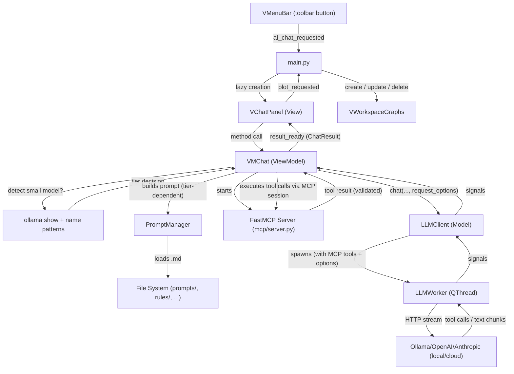

# **AI Data Chat**

The `AI Data Chat` is an optional, multi-provider AI chatbot that lets users query, filter, plot, and modify their data using natural language. It supports local inference via **Ollama**, cloud providers via the **OpenAI** SDK (OpenAI, DeepSeek, Gemini, and any OpenAI-compatible endpoint), and **Anthropic** Claude models. The agent communicates with the `Graphs` workspace to create, update, and delete plots in real time.

> The AI module is **optional to use** — if Ollama isn't running and no cloud API key is configured, the chat panel shows a red "not connected" status and the rest of SPECTROview is completely unaffected. The Python packages it depends on (`ollama`, `openai`, `anthropic`, `mcp`) are, however, unconditional install-time dependencies of the project (see [Optional Dependency Management](#optional-dependency-management)).

A second, distinct axis of "optional" matters here too: **small local models get a different, simplified prompt and request configuration than large/cloud models** — this is the biggest architectural addition since the MCP migration and is covered in its own section below ([Small-Model Support](#small-model-support)).

---

## **Prerequisites for Users**

### **Option 1: macOS**

1. **Install Ollama**
   Using Homebrew (recommended):
   ```bash
   brew install ollama
   ```
   *(Alternatively, download the macOS application directly from [Ollama's official website](https://ollama.com/download/mac).)*

2. **Start the Ollama Service**
   If you used Homebrew, start Ollama as a background service:
   ```bash
   brew services start ollama
   ```
   *(If you installed the Mac app, simply open the Ollama application from your Applications folder. You should see its icon in your menu bar.)*

### **Option 2: Windows**

1. **Install Ollama**
   Download the Windows installer from [Ollama's official website](https://ollama.com/download/windows) and run it.

2. **Start the Ollama Service**
   Ollama usually starts automatically after installation. If it doesn't, search for "Ollama" in the Start menu and open it. You should see the Ollama icon in your system tray (bottom right corner).

---

### **Common Steps (Both platforms)**

3. **Download an AI Model**
   SPECTROview uses `qwen2.5-coder:7b` by default. Open your terminal (or Command Prompt / PowerShell on Windows) and pull it:
   ```bash
   ollama pull qwen2.5-coder:7b
   ```
   Any Ollama model that supports tool/function calling will work — see [Small-Model Support](#small-model-support) for how SPECTROview adapts its behavior to the model you pick.

4. **Install SPECTROview**
   `ollama`, `openai`, `anthropic`, and `mcp` are core dependencies of the package (not a separate extras group), so a normal install already includes everything the AI feature needs:
   ```bash
   pip install -e .
   ```

5. **Run SPECTROview**
   Start the application:
   ```bash
   python -m spectroview.main
   ```
   Click on the **AI Data Chat** button in the top toolbar. The chat panel will open, and the status bar should say **🟢 Ollama connected**.

---

## **Architecture Overview**

The AI feature follows the same strict **MVVM** pattern as the rest of the application. All AI-related code lives in the `spectroview/ai_agent/` package, isolated from the core workspaces.



---

## **Module Structure**

```
spectroview/ai_agent/
├── __init__.py              # Docstring only — keeps the module optional
├── config/                  # YAML configuration files (model.yaml, settings.yaml)
├── examples/                # Few-shot conversation examples (Markdown)
│   ├── plotting_examples.md #   Full-tier: 13 examples, tool-call style
│   ├── filtering_examples.md#   query_dataframe/get_statistics examples
│   └── examples_small.md    #   Simplified-tier: ~8 tight examples covering all 5 tools
├── knowledge/                # Static domain facts (Markdown; full tier only)
├── prompts/                  # Core identity + per-intent instructions (Markdown)
│   ├── system.md, chat.md, plotting.md   # Full tier (default; also used by cloud providers)
│   └── system_small.md      #   Simplified tier — single consolidated file for detected small models
├── rules/                   # Behavioural constraints (Markdown)
├── templates/                # Reusable Markdown output formats
├── utils/
│   ├── plot_utils.py        # normalize_plot_config / expand_comma_styles — type coercion for plot configs
│   ├── safe_eval.py         # evaluate_pandas_expression() — df.query() first, sandboxed eval() fallback
│   └── df_summary.py        # summarize_dataframe_columns() — compacts wide DataFrames in the prompt
├── m_llm_client.py          # Model layer: LLM connections + QThread workers
│                            #   - LLMWorker (Ollama)
│                            #   - APIWorker (OpenAI-compatible)
│                            #   - AnthropicWorker (Anthropic SDK)
│                            #   - LLMClient (unified facade)
│                            #   - get_ollama_model_info() — `ollama show` wrapper for size detection
├── m_conversation.py        # Data model: single conversation (messages, save/load JSON)
├── m_conversation_store.py  # Conversation store: scan/list/load saved conversations
├── mcp/
│   └── server.py            # FastMCP server defining the 5 AI tools (plot_graph, query_dataframe, etc.)
├── m_prompt_manager.py      # Prompt caching and assembly: loads and merges Markdown files based on intent/tier
├── vm_chat.py               # ViewModel: prompt-tier selection, small-model detection, request tuning, agentic loop
├── v_chat_panel.py          # View: floating chat dialog (QDialog), incl. the Auto/Full/Simplified selector
└── v_history_dialog.py      # View: history browser dialog (QDialog)
```

### **File Roles**

| File | Layer | Responsibility |
|------|-------|---------------|
| `m_prompt_manager.py` | **Model** | Loads, caches, and assembles Markdown files into a system prompt for a given set of `prompts=`/`rules=`/`knowledge=`/`examples=` lists. Also parses `config/model.yaml`/`config/settings.yaml` (`.model_config`/`.settings` properties). |
| `m_llm_client.py` | **Model** | Wraps Ollama, OpenAI SDK, and Anthropic SDK. Checks availability, lists models, looks up a model's parameter count (`get_ollama_model_info`), and spawns one of three background `QThread` workers depending on the selected provider. |
| `m_conversation.py` | **Model** | Represents a single conversation: add messages (including `tool_calls`/`tool_call_id`), auto-title, save/load as JSON, slice to the last N messages. Skips saving empty conversations. |
| `m_conversation_store.py` | **Model** | Scans the history folder, lists saved conversations as lightweight summaries, loads conversations by ID. |
| `mcp/server.py` | **Model** | FastMCP server exposing SPECTROview's 5 AI tools to the LLM, with request-time filter/plot-style validation. |
| `utils/safe_eval.py` | **Model** | Shared, sandboxed pandas-expression evaluator used by both `query_dataframe` and the filter-validation step in `plot_graph`/`update_graph`. |
| `utils/df_summary.py` | **Model** | Compacts a DataFrame's column listing in the system prompt once it exceeds `column_detail_threshold` columns, without ever hiding a column name. |
| `utils/plot_utils.py` | **Model** | `normalize_plot_config()`/`expand_comma_styles()` — post-processes accumulated plot configs (type coercion, comma-separated multi-style expansion) before they reach the Graphs workspace. |
| `vm_chat.py` | **ViewModel** | Detects small-vs-full model tier, builds the tier-appropriate system prompt, assembles Ollama/timeout/max-token request options, manages conversation history, and runs the tool-calling agentic loop (up to 5 turns). |
| `v_chat_panel.py` | **View** | Floating `QDialog` with chat bubbles, provider/model selector, the prompt-tier selector, timestamp display, status bar, and input field. Emits `plot_requested(dict)` when the AI creates/updates/deletes a graph. |
| `v_history_dialog.py` | **View** | Browsable list of saved conversations sorted by most-recent-first. Supports open, rename, duplicate, and delete. |

---

## **Small-Model Support**

Small local models (roughly, anything under ~10B parameters) get a measurably different prompt, context budget, and request configuration than large/cloud models — not just a shorter version of the same thing. This exists because a large, information-dense prompt with an unset context window is enough on its own to make an otherwise-capable small model fail at tool calling (see the case study at the bottom of this section).

### Detection

`VMChat._auto_detect_small_model()` resolves in this order:

1. **Manual override** — `VMChat.set_small_model_mode(True | False | None)`. `None` (the default) means "keep auto-detecting." Exposed in the UI as the **Auto / Full prompt / Simplified prompt** combo box in `v_chat_panel.py`'s header, persisted via `QSettings`.
2. **Parameter-count check** (Ollama only) — `get_ollama_model_info(model)` calls `ollama show <model>`, parses `details.parameter_size` (e.g. `"8.2B"`) via `_parse_param_size_to_billions()`, and compares it against `config/model.yaml`'s `small_model_param_threshold_b` (default **10.0**). Cached per model name for the life of the `VMChat` instance.
3. **Name-pattern fallback** — if the parameter count can't be determined (cloud model, or `ollama show` fails), the model name is matched against `VMChat._SMALL_MODEL_PATTERNS`, a list of known small model tags (`qwen3:8b`, `gemma3:4b`, `phi3:mini`, `deepseek-r1:8b`, etc.).
4. **Default: full tier.** If nothing resolves, the model is treated as large. An unrecognized model getting the full prompt is the safer failure mode than an unrecognized *large* model being needlessly handicapped.

Detection is hard-gated to `provider == "Ollama"` for steps 2–3 — cloud providers always resolve to the full tier unless a manual override forces otherwise. Detection re-runs on `set_model()`/`set_provider()`, never during `__init__` (an `ollama show` network call shouldn't race object construction).

### What changes in Simplified mode

All four of the following are computed in `vm_chat.py` and read from `config/model.yaml`:

| Aspect | Full tier | Simplified tier | Config keys |
|---|---|---|---|
| System prompt | `system.md`+`chat.md`+`plotting.md` + `rules/general,plotting,spectroview` + `knowledge/features` + `examples/plotting_examples` (~27K chars) | `system_small.md` + `rules/general` + `examples/examples_small` (~9K chars) | n/a (hardcoded lists in `_build_system_prompt()`) |
| Conversation history | unlimited | last 6 messages | `max_context_messages` / `max_context_messages_small` |
| Ollama `num_ctx` | 16384 | 8192 | `ollama_num_ctx_full` / `ollama_num_ctx_small` |
| Max output tokens | 81920 | 4096 | `max_tokens` / `max_tokens_small` |
| Ollama `think` | unset (model/Ollama default) | `false` | `ollama_think` |

`rules/general.md` is shared by both tiers (it's small and universally correct); `rules/plotting.md`, `rules/spectroview.md`, and `knowledge/features.md` are full-tier only — their essential content (filter quoting, spatial-plot axis mapping) is folded directly into `system_small.md` instead.

`num_ctx` and `think` are Ollama-`options`-only: `LLMClient.chat()`'s `request_options` dict is translated per-provider, and these two keys are never forwarded to `APIWorker`/`AnthropicWorker` — structurally impossible to affect DeepSeek/OpenAI/Anthropic/Gemini regardless of which tier is active.

### Schema-level accommodations (help every model, not just small ones)

Two changes in `mcp/server.py` reduce ambiguity for *any* model, independent of prompt tier:

- `plot_style` is a `Literal[...]` (produces a real JSON-Schema `enum` of the 9 valid styles) instead of a bare `str`.
- The most common `other_properties` keys (`grid`, `plot_title`, `xlabel`, `ylabel`, `zlabel`, axis limits, `color_palette`, log-scale flags, etc.) are explicit, typed, named parameters on `plot_graph`/`update_graph`, in addition to the `other_properties` catch-all dict. A model that puts `grid=true` at the top level of the call (rather than correctly nested inside `other_properties`) no longer loses that value — both forms are merged into the final config, with the named parameter winning on conflict.

### Case study: qwen3:8b

Given an identical 3-plot request, a large cloud model (DeepSeek) succeeded in one turn; `qwen3:8b` failed two different ways on two attempts before this system existed:
- **Attempt A**: emitted zero tool calls — instead, 2,237 characters of prose describing a plan, in ```python fenced pseudo-code, that was never actually executed.
- **Attempt B**: emitted valid tool calls, but placed `grid: true` as a top-level argument (the only place its real signature recognized it was nested inside `other_properties`) — silently dropped by MCP/Pydantic, no error, no retry.

After the fixes above: **3/3 replay attempts succeeded**, each producing exactly 3 correctly-shaped `plot_graph` calls (with `grid` correctly preserved) and a closing summary, averaging ~19s total versus the original 42–100s *per single failed turn*.

---

## **Key Classes**

### **`LLMWorker` / `APIWorker` / `AnthropicWorker` — Background Threads**

**File**: `spectroview/ai_agent/m_llm_client.py`

Three `QThread` subclasses, one per backend. Each executes a single streaming (or, for Anthropic with tools, non-streaming) chat request.

| Class | Backend | Package required | Extra constructor params |
|-------|---------|------------------|---------------------------|
| `LLMWorker` | Ollama (local) | `ollama` | `options` (dict: `num_ctx`, `num_predict`), `think` (`bool`\|`"low"`\|`"medium"`\|`"high"`\|`None`), `timeout` |
| `APIWorker` | OpenAI, DeepSeek, Gemini, Custom | `openai` | `timeout`, `max_tokens` |
| `AnthropicWorker` | Anthropic Claude | `anthropic` | `timeout`, `max_tokens` |

`LLMWorker` only constructs an `ollama.Client(timeout=...)` when a timeout is actually set; otherwise it uses the module-level `ollama.chat()` convenience function directly. Tool calls returned by Ollama arrive as pydantic model objects (`ollama._types.Message.ToolCall`), not plain dicts — `LLMWorker.run()` normalizes each one via `.model_dump()` before emitting, so `MConversation.save()` (plain `json.dump`) doesn't choke on a non-serializable object.

| Signal | Payload | Purpose |
|--------|---------|---------|
| `chunk_received` | `str` | Each streamed token fragment |
| `response_ready` | `(str, list)` | Full assembled response text + accumulated tool calls |
| `error_occurred` | `str` | Error message if the backend is unreachable |

> Ollama's `message["thinking"]` field (hybrid-reasoning models' hidden scratchpad, when `think` is enabled) is intentionally **never** appended to `chunk_received`/the response text. Merging a hidden-reasoning channel into the visible answer is exactly how the qwen3 "Attempt A" failure above happens — if a future UI wants to surface reasoning, it needs its own separate signal, never merged into the answer channel.

### **`LLMClient` — Connection Facade**

**File**: `spectroview/ai_agent/m_llm_client.py`

A lightweight, non-Qt facade that manages provider selection, API key storage, and worker lifecycle.

**Known providers** (defined in `API_PROVIDERS` dict):
- `Ollama` → `LLMWorker`
- `OpenAI`, `DeepSeek`, `Gemini`, `Custom` → `APIWorker`
- `Anthropic` → `AnthropicWorker`

| Method | Purpose |
|--------|---------|
| `is_available()` | `True` if the active provider's package is installed and (Ollama) the daemon responds, or (cloud) an API key is set |
| `get_models()` | Sorted list of available model names for the active provider |
| `chat(model, messages, on_chunk, on_done, on_error, tools=None, parent=None, request_options=None)` | Spawns the right background worker for the active provider; cancels any in-flight request first. `request_options` (`num_ctx`/`think`/`timeout`/`max_tokens`) is translated per-provider — see [Small-Model Support](#small-model-support) for the cross-provider isolation guarantee. |
| `cancel()` | Terminates the current worker thread |
| `is_busy()` | `True` while a worker is running |

**Module-level helper**: `get_ollama_model_info(model) -> Optional[ollama.ShowResponse]` — best-effort `ollama.show()`, returns `None` on any failure; never raises. Used by `VMChat`'s small-model detection.

**Default model**: `qwen2.5-coder:7b` (configurable via the UI combobox; `LLMClient.DEFAULT_MODEL`).

### **`PromptManager` — Prompt Assembly**

**File**: `spectroview/ai_agent/m_prompt_manager.py`

A caching manager that reads Markdown sections from disk and concatenates them into a system prompt for whatever `prompts=`/`rules=`/`knowledge=`/`examples=` lists it's given.

| Method | Purpose |
|--------|---------|
| `load_prompt(name)` / `load_rule(name)` / `load_knowledge(name)` / `load_example(name)` | Load one Markdown file by stem, cached in memory (auto-invalidated on mtime change if `auto_reload: true`) |
| `build_prompt(intent, user_message, prompts, rules, knowledge, examples)` | Assembles a complete system prompt. When explicit lists are passed (which `vm_chat.py` always does), they override the per-`intent` defaults entirely. |
| `.model_config` | Parsed `config/model.yaml` as a dict |
| `.settings` | Parsed `config/settings.yaml` as a dict |
| `clear_cache()` | Clears the file-content cache |

> **Gotcha for future changes**: `_INTENT_DEFAULTS` (per-intent default file lists for `"plotting"`/`"fitting"`/`"coding"`) and `_detect_intent()` (keyword-based intent sniffing) exist but are **currently inert** — `vm_chat.py` always calls `build_prompt()` with explicit `prompts=`/`rules=`/`knowledge=`/`examples=` lists (one set for the full tier, one for the simplified tier — see [Small-Model Support](#small-model-support)), which unconditionally short-circuits the intent-based defaults regardless of `config/settings.yaml`'s `enable_intent_detection` flag. `prompts/fitting.md`, `prompts/coding.md`, `rules/fitting.md`, `rules/python.md`, and `examples/filtering_examples.md` are fully written but never loaded under the current call pattern.

### **`VMChat` — ViewModel**

**File**: `spectroview/ai_agent/vm_chat.py`

Manages one chat session linked to the loaded DataFrames. Follows the MVVM contract: the View calls public methods; the ViewModel responds exclusively through signals.

| Signal | Payload | Purpose |
|--------|---------|---------|
| `thinking_changed` | `(bool, str)` | `True` while the LLM/tool loop is processing, with a status label (`"Thinking"` / `"Executing tools..."`) |
| `chunk_received` | `str` | Streaming token fragments for typing animation |
| `result_ready` | `ChatResult` | Final result once the agentic loop stops issuing tool calls |
| `error_occurred` | `str` | Human-readable error message |
| `tool_execution_received` | `(str, str)` | Tool name + its result text, emitted for every tool call in the loop (including intermediate ones) |
| `conversation_changed` | `str` | New/loaded conversation's title |

#### **Public API**

| Method | Purpose |
|--------|---------|
| `set_dataframes(dfs, active_name)` | Update available DataFrames |
| `update_active_df_name(name)` | Switch active DataFrame without clearing history |
| `set_graphs(graphs)` | Update known open graphs (included in system prompt for context) |
| `set_model(model)` | Switch model; re-runs small-model auto-detection |
| `set_provider(provider, api_key, base_url, model)` | Switch backend; re-runs auto-detection; starts a new conversation |
| `set_small_model_mode(enabled)` | `True`/`False` force a tier, `None` resume auto-detection |
| `is_small_model_mode()` | `True` if the simplified tier is currently active |
| `process_query(user_text)` | Send a user question to the LLM |
| `cancel()` | Abort in-progress request |
| `clear_history()` | Reset conversation history (same as **+ New Chat**) |

#### **The Agentic Tool-Calling Loop**

`process_query()` → `LLMClient.chat()` → `_on_done(full_text, tool_calls)`:

- If `tool_calls` is non-empty: each call's `arguments` (parsed if it arrived as a JSON string; a parse failure produces an actionable "please retry with valid JSON" tool-result message instead of silently substituting `{}`) is dispatched via an in-process MCP client session (`session.call_tool(name, args)`). Every tool result — success or a validation error — is appended to conversation history as a `role="tool"` message, and `_on_done` recursively calls `LLMClient.chat()` again with the updated history. Capped at **5 iterations** (`error_occurred` fires past that).
- If `tool_calls` is empty: any `plot_graph`/`update_graph`/`delete_graph` calls made during the loop have accumulated into `self._pending_plots`. If non-empty, they're normalized/expanded (`utils/plot_utils.py`) into a `ChatResult(action="plot", plot_config=[...])`. Otherwise, `ChatResult(action="answer", text_summary=full_text)`.

**In the current tool-calling architecture, `ChatResult.action` is only ever `"plot"` or `"answer"`** — there is no code path that constructs it with `"filter"`/`"statistics"`/`"update"`/`"delete"`/`"query"` (those were meaningful values under the pre-MCP JSON-protocol architecture; `query_dataframe`/`get_statistics` results now surface only as tool-result text feeding into the LLM's final natural-language answer, not as a separate structured result). `ChatResult.dataframe` is consequently never populated either — `v_chat_panel.py`'s `_DataFramePreview` inline-table widget, which only renders when `result.dataframe is not None`, is effectively dead code today. This isn't something introduced by the small-model work; it's been true since the MCP migration and just hadn't been documented.

#### **Request Options**

`_build_request_options()` reads `config/model.yaml` and returns the `num_ctx`/`think`/`timeout`/`max_tokens` dict passed as `request_options=` to every `LLMClient.chat()` call — see [Small-Model Support](#small-model-support) for the full table of full-vs-simplified values.

#### **Conversation History & Persistence**

Conversations are saved automatically as JSON files in the user-configured history folder (**Settings → AI tab**). `MConversation`:

- Accumulates messages (including `tool_calls`/`tool_call_id` for tool-calling turns) with ISO timestamps.
- Auto-titles itself from the first user message (up to 60 chars).
- Persists to disk after each assistant turn and after each batch of tool results.
- Is **not cleared** when the user loads a new workspace file or switches DataFrames — only **+ New Chat** resets it.

The context actually sent to the LLM is capped via `max_context_messages` — unlimited for the full tier, the last 6 messages for the simplified tier (see [Small-Model Support](#small-model-support); this replaces a `MAX_HISTORY_PAIRS = 6` class constant that used to exist but was never actually wired to anything).

### **`ChatResult` — Parsed Response**

**File**: `spectroview/ai_agent/vm_chat.py`

```python
class ChatResult:
    __slots__ = ("action", "explanation", "dataframe", "text_summary",
                 "plot_config", "raw_response", "query", "target_dataframe")
```

| Field | Type | Purpose |
|-------|------|---------|
| `action` | `str` | `"plot"` or `"answer"` in current usage (see above) |
| `explanation` | `str` | Rarely populated in current usage |
| `dataframe` | `pd.DataFrame` \| `None` | **Always `None`** in current usage — vestigial, see above |
| `text_summary` | `str` | The LLM's final natural-language text |
| `plot_config` | `list[dict]` \| `None` | Accumulated plot/update/delete configs for the Graphs workspace |
| `raw_response` | `str` | Full LLM text for debugging |
| `query` / `target_dataframe` | `str` | **Always `""`** in current usage — vestigial fields from the pre-MCP JSON-action protocol |

### **`VChatPanel` — View Dialog**

**File**: `spectroview/ai_agent/v_chat_panel.py`

A floating `QDialog`. Header row: provider selector, model selector, **prompt-tier selector** (`cbb_prompt_tier`: Auto / Full prompt / Simplified prompt — see [Small-Model Support](#small-model-support)), refresh button, history/new-chat buttons. Status bar shows connection state and, when active, `· Simplified prompts`.

Helper widgets:
- **`_MessageCard`** / AI/user card variants: styled message bubbles with role-dependent colors
- **`_DataFramePreview`**: inline `QTableWidget` for filtered DataFrames — see the `ChatResult.dataframe` note above regarding current reachability
- **`_ChatLineEdit`** / input area: emits `send_requested` on Enter key

---

## **System Prompt & LLM Contract**

The system prompt is modular and managed by `PromptManager`, assembled from two tiers of granular Markdown files depending on the active model (see [Small-Model Support](#small-model-support)):

**Full tier** (default; also used for all cloud providers):
1. **Core prompt** (`prompts/system.md`, `chat.md`, `plotting.md`): identity, tool-usage contract, plotting instructions.
2. **Dynamic context** (injected by `VMChat`): DataFrame schemas/sample values (compacted above `column_detail_threshold` columns via `utils/df_summary.py`), active DataFrame name, open-graph summary.
3. **Rules** (`rules/general.md`, `plotting.md`, `spectroview.md`): behavioral constraints.
4. **Knowledge** (`knowledge/features.md`): static facts about the software.
5. **Examples** (`examples/plotting_examples.md`): 13 few-shot tool-call examples.

**Simplified tier**: `prompts/system_small.md` (self-contained: identity, critical rules, dynamic context placeholders, tool list, common `plot_graph` options, spatial-plot mapping, multi-turn guidance — all in one file) + `rules/general.md` + `examples/examples_small.md` (~8 examples covering all 5 tools).

The agent uses **native Tool/Function Calling** via the **Model Context Protocol (MCP)** — no JSON-text parsing. The LLM is given a strict, typed schema for each tool (`mcp/server.py`, built with `FastMCP`):

```python
query_dataframe(query: str, df_name: str = "") -> str
get_statistics(columns: list[str], df_name: str = "") -> str
plot_graph(x: str, y: str | list[str], plot_style: Literal[9 styles], z=None,
           filters: list[str] | None = None, df_name: str = "",
           grid=None, plot_title=None, xlabel=None, ylabel=None, zlabel=None,
           xmin=None, xmax=None, ymin=None, ymax=None, zmin=None, zmax=None,
           color_palette=None, xlogscale=None, ylogscale=None,
           scatter_size=None, hist_bins=None, trendline_order=None,
           other_properties: dict | None = None) -> str
update_graph(graph_id: str, ...)   # same optional fields as plot_graph, all Optional
delete_graph(delete_all: bool = False, graph_ids: list[int] | None = None) -> str
```

`plot_graph`/`update_graph`'s named optional parameters (`grid`, `plot_title`, axis limits, etc.) are additive to `other_properties` — either form works, and a value passed via the named parameter wins if the same key is also present in `other_properties`. This is the direct fix for the qwen3 case study above: a model no longer has to correctly infer an undocumented nesting rule to get common properties like `grid` applied.

`LLMClient` intercepts tool calls and dispatches them to an in-process MCP client session; results (including validation errors) feed back into conversation history for the model to act on.

### **Safety & Validation**

- **Filter/query expressions** are evaluated by `utils/safe_eval.py::evaluate_pandas_expression()`: tries `DataFrame.query()` first (pandas' own restricted grammar, safely handles the bare-column syntax every prompt teaches — e.g. `"FWHM_Si > 5"`), and falls back to a namespace-restricted `eval()` (`{"__builtins__": {}}`, bound only to `df`/`pd`/`np`/individual columns) for expressions `.query()` can't express, such as `"df.groupby('Slot')['x'].mean().idxmax()"`. This is a strict superset of the pre-existing `eval()`-only behavior — nothing that worked before stops working, and no new execution surface is introduced.
- **`plot_graph`/`update_graph` dry-run every filter** against the real target DataFrame *before* accepting the plot. An invalid filter (most commonly: an unquoted string value) returns an actionable error — the plot is **not** created — instead of the tool always reporting generic success regardless of correctness.
- **`plot_style` is schema-validated** (enum) and additionally checked in Python as defense-in-depth for providers that don't grammar-constrain tool arguments.
- **Malformed JSON tool-call arguments** (rare; mainly a concern for OpenAI-compatible providers, where `arguments` streams as a string to be parsed) produce a retry-inducing error message instead of being silently replaced with `{}`.

---

## **Data Flow: End-to-End**

```mermaid
sequenceDiagram
    participant User
    participant VCP as VChatPanel (View)
    participant VMC as VMChat (ViewModel)
    participant LLC as LLMClient (Model)
    participant Worker as LLMWorker (QThread)
    participant Backend as Ollama/OpenAI/Anthropic
    participant MCPS as MCP Server (tools)
    participant Main as main.py
    participant VWG as VWorkspaceGraphs

    User->>VCP: types question + Enter
    VCP->>VMC: process_query(text)
    VMC->>VMC: _build_system_prompt() (tier-dependent)
    VMC->>VMC: _build_request_options() (num_ctx/think/timeout/max_tokens)
    VMC-->>VCP: thinking_changed(True, "Thinking")
    VMC->>LLC: chat(model, messages, tools, request_options)
    LLC->>Worker: start()
    Worker->>Backend: chat(stream=True, options=..., think=...)

    loop each token / tool-call delta
        Backend-->>Worker: chunk
        Worker-->>VMC: chunk_received(fragment)
        VMC-->>VCP: chunk_received(fragment)
    end

    Worker-->>VMC: response_ready(text, tool_calls)

    alt tool_calls non-empty (agentic loop, up to 5 iterations)
        VMC-->>VCP: thinking_changed(True, "Executing tools...")
        VMC->>MCPS: call_tool(name, args) for each call
        MCPS-->>VMC: result text (validated; error if filter/style invalid)
        VMC-->>VCP: tool_execution_received(name, result)
        VMC->>LLC: chat(...) again with updated history
        Note over VMC,LLC: repeats until no more tool_calls, or 5-turn cap
    else no tool_calls
        VMC->>VMC: build ChatResult (action="plot" if _pending_plots, else "answer")
        VMC-->>VCP: result_ready(ChatResult)
        VMC-->>VCP: thinking_changed(False, "Thinking")
    end

    alt action == "plot" (includes update/delete configs)
        VCP-->>Main: plot_requested(cfg) per entry
        Main->>Main: _on_chat_plot_requested / _apply_graph_update / _apply_graph_delete
        Main->>VWG: create / update / close graph(s)
    else action == "answer"
        VCP->>VCP: display text_summary in the AI message bubble
    end
```

---

## **Integration with Graphs Workspace**

### **Lazy Initialization**

The chat panel is created on first use in `Main.open_ai_chat()`. This avoids importing the `ollama`/`openai`/`anthropic`/`mcp` packages or building the UI at startup.

```python
# main.py
if self._chat_panel is None:
    self._chat_panel = VChatPanel(self)
    self._chat_panel.plot_requested.connect(self._on_chat_plot_requested)
```

### **DataFrame Synchronization**

The chat panel stays in sync with the Graphs workspace through three signal connections set up in `main.py`:

| Signal | Handler | Trigger |
|--------|---------|---------|
| `vm.dataframes_changed` | `sync_chat_dfs_full` | DataFrames added/removed — refreshes all DFs and graph info |
| `vm.dataframe_columns_changed` | `sync_chat_active` | Active DataFrame selection changed — preserves chat history |
| `vm.graphs_changed` | `sync_chat_graphs` | Graphs created/updated/deleted — refreshes graph IDs in system prompt |

Each time the panel is shown, a forced sync is performed to ensure current data is available.

### **Plot Config Normalization**

Accumulated plot configs are normalized by `utils/plot_utils.py::expand_all_plot_configs()` before being emitted to `main.py`:

| Field | Normalization |
|-------|--------------|
| `y` | `str` → `[str]`, `None` → `[]` |
| Limit fields (`xmin`, `ymin`, ...) | `str`/`int`/`"null"` → `float` or `None` |
| Integer fields (`x_rot`, `scatter_size`, ...) | Cast to `int`, remove on failure |
| `filters` | `["expr1", "expr2"]` → `[{"expression": "expr1", "state": True}, ...]` |
| `plot_style` | Comma-separated (`"box, scatter"`) → one config per style |

### **Graph Update / Delete Flow**

For entries wrapped as `{"_graph_update": {...}}` / `{"_graph_delete": {...}}` (produced by the `update_graph`/`delete_graph` MCP tools), `main.py`:

1. Retrieves the existing `MGraph` model(s) by ID (or resolves `"all"`).
2. Normalizes property types (same rules as above).
3. Calls `vm.update_graph(...)` or closes the corresponding `QMdiSubWindow`(s).

---

## **Toolbar Entry Point**

The AI Chat button is added to the main toolbar in `VMenuBar`:

```python
# v_menubar.py
self.actionAIChat = self.addAction(
    QIcon(os.path.join(ICON_DIR, "llm_ai.png")),
    "AI Data Chat"
)
self.actionAIChat.triggered.connect(self.ai_chat_requested.emit)
```

The `ai_chat_requested` signal is connected to `Main.open_ai_chat()` in `setup_connections()`.

---

## **Optional Dependency Management**

`ollama`, `openai`, `anthropic`, and `mcp` are **unconditional core dependencies** in `pyproject.toml` — there is no separate `[ai]` extras group; a normal `pip install -e .` already includes everything the AI feature needs. What's actually optional is *using* the feature at runtime:

### **Import Guard Pattern**

```python
# m_llm_client.py — each SDK is guarded independently
try:
    import ollama as _ollama
    OLLAMA_AVAILABLE = True
except ImportError:
    OLLAMA_AVAILABLE = False
# ... same pattern for openai, anthropic
```

```python
# main.py
try:
    from spectroview.ai_agent.v_chat_panel import VChatPanel
    LLM_AVAILABLE = True
except ImportError:
    LLM_AVAILABLE = False
```

If a package is genuinely missing (e.g. a stripped-down environment) or Ollama isn't running / no API key is set:
- The relevant provider reports unavailable via `LLMClient.is_available()`, surfaced as a red status message with actionable install instructions.
- No error is raised at startup; the rest of the application is unaffected.

---

## **Response Parsing & Error Handling**

With **MCP Tool Calling**, response parsing has no free-text JSON to parse at all:

1. **Tool execution**: the LLM emits structured tool calls via the provider's native function-calling protocol.
2. **Validation at the tool boundary**: `mcp/server.py` validates `plot_style` (schema enum) and dry-runs every filter (`utils/safe_eval.py`) before accepting a plot/update — invalid input gets an actionable error fed back to the model instead of silently succeeding or being dropped.
3. **Malformed arguments**: a JSON-string `arguments` payload that fails to parse (or parses to something other than an object) produces a retry-inducing tool-result message rather than being silently replaced with `{}`.
4. **Text-only fallback**: if the LLM replies with plain text and no tool call, that text becomes `ChatResult(action="answer", text_summary=...)` — always something useful for the user to see, even if no data operation happened.
5. **Missing DataFrame target**: MCP tools resolve an empty `df_name` to the currently active DataFrame.
6. **Non-serializable tool-call objects**: Ollama returns `tool_calls` as pydantic model objects; `LLMWorker.run()` normalizes each to a plain dict (`.model_dump()`) before it's added to conversation history, so `MConversation.save()`'s plain `json.dump()` doesn't fail.

---

## **Current Features (Graph Workspace)**

| Feature | Description |
|---------|-------------|
| **Natural language plot creation** | Ask for any of the 9 supported plot styles (point, scatter, box, bar, line, trendline, histogram, wafer, 2Dmap) with column, filter, and style options |
| **Multi-plot generation** | A single query can create multiple plots simultaneously (parallel tool calls, or several turns of the agentic loop) |
| **Data filtering** | Filter DataFrames using natural language (translated to a validated pandas expression, see [Safety & Validation](#safety--validation)) |
| **Descriptive statistics** | Request `describe()` statistics on specific columns |
| **Graph modification** | Update existing graph properties (axis limits, title, style, filters, palette) by graph ID |
| **Graph deletion** | Delete specific graphs or all graphs by natural language instruction |
| **Multi-DataFrame support** | Switch between multiple loaded DataFrames; the AI knows which is active |
| **Small-model adaptation** | Auto-detects small local models (by parameter count or name) and switches to a shorter prompt, capped history, and tuned Ollama request options — manually overridable via the Auto/Full/Simplified selector. See [Small-Model Support](#small-model-support). |
| **Self-correcting tool calls** | Invalid filters or plot styles are rejected with an actionable error *before* being applied, giving the model a chance to retry within the same turn/loop |
| **Conversation memory** | Multi-turn conversations; full history for large/cloud models, last 6 messages for detected small models |
| **Conversation persistence** | Conversations survive file loads and tab switches. Only **+ New Chat** resets the history |
| **Conversation history browser** | Browse, search, open, rename, duplicate, and delete past conversations via the History dialog |
| **Streaming responses** | Token-by-token display with live typing animation (non-streaming for Anthropic when tools are involved) |
| **Model & prompt-tier selection** | Switch between locally downloaded Ollama models or cloud providers; independently force the prompt tier |
| **Context-aware prompts** | System prompt includes DataFrame schemas (compacted for wide tables), sample values, and open graph configurations |
