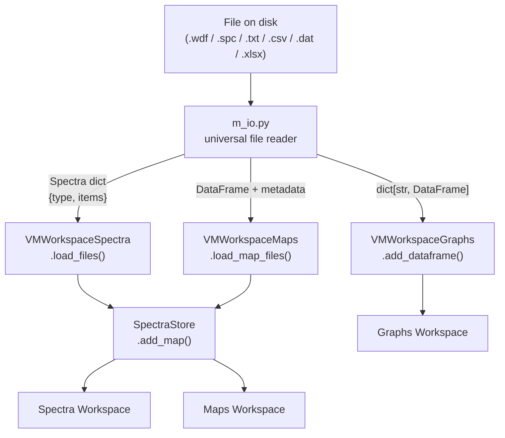

# **File Loading Pipeline (`m_io.py`)**

`m_io.py` is the **universal file reader** for SPECTROview. It sits at the entry point of every data ingestion operation — raw files on disk pass through it before any other part of the application ever touches the data.

**Source file**: [`m_io.py`](https://github.com/CEA-MetroCarac/SPECTROview/blob/main/spectroview/model/m_io.py)

---

## Overview

`m_io.py` handles **all supported file formats** for three distinct data categories:

| Category | Description | Destination |
|----------|-------------|-------------|
| **Discrete Spectra** | 1D or multi-spectrum files (single point acquisitions, temporal series) | → `SpectraStore` → Spectra workspace |
| **Hyperspectral Maps** | 2D spatial grids of spectra | → `SpectraStore` → Maps workspace |
| **Datasheets** | Generic tabular data (fit results, external datasets) | → directly to Graphs workspace |



---

## Supported Formats

| Format | Extension | Function | Returns |
|--------|-----------|----------|---------|
| Renishaw WiRE spectrum | `.wdf` | `load_wdf_spectrum()` | `spectra dict` |
| Renishaw WiRE map | `.wdf` | `load_wdf_map()` | `(DataFrame, metadata dict)` |
| Galactic SPC spectrum | `.spc` | `load_spc_spectrum()` | `spectra dict` |
| Galactic SPC map | `.spc` | `load_spc_map()` | `(DataFrame, metadata dict)` |
| Text / CSV spectrum | `.txt`, `.csv` | `load_spectrum_file()` | `spectra dict` |
| Text / CSV map | `.txt`, `.csv` | `load_map_file()` | `DataFrame` |
| TRPL time-resolved PL | `.dat` | `load_TRPL_data()` | `spectra dict` |
| Excel / CSV datasheet | `.xlsx`, `.xls`, `.csv` | `load_dataframe_file()` | `dict[str, DataFrame]` |

---

## Return Formats

### Spectra Dict — Discrete Spectra

All spectra loaders (`load_wdf_spectrum`, `load_spc_spectrum`, `load_spectrum_file`, `load_TRPL_data`) return a unified **spectra dict**:

```python
{
    "type": "spectra",
    "items": [
        {
            "name": "my_sample",       # str — unique identifier (file stem or stem + index)
            "x0":   np.ndarray,        # float64[M] — wavenumber axis
            "y0":   np.ndarray,        # float64[M] — raw intensity values
            "metadata": {              # dict — acquisition parameters
                "File Format": "Renishaw WDF",
                "Laser Wavelength (nm)": "532.00",
                "Exposure Time (s)": "1.0",
                # ...
            }
        },
        # Additional items for multi-spectrum files (e.g., temporal series from WDF)
        {
            "name": "my_sample_1",
            "x0":   np.ndarray,
            "y0":   np.ndarray,
            "metadata": {"Time (s)": 1.5, "...": "..."}
        },
    ]
}
```

> [!IMPORTANT]
> **Why a list?** A single `.wdf` file configured as a temporal series (e.g., 100 acquisitions over 10 minutes) contains N spectra, not 1. The `items` list handles single spectra (N=1) and multi-spectrum files uniformly without branching logic in the caller.

### Map DataFrame — Hyperspectral Maps

All map loaders (`load_wdf_map`, `load_spc_map`, `load_map_file`) return a **pandas DataFrame** (and optionally a metadata dict for binary formats):

```python
# Return type for WDF/SPC: tuple[pd.DataFrame, dict]
# Return type for TXT/CSV: pd.DataFrame

df, metadata = load_wdf_map(path)

#  df layout:
#   Columns:  ['X', 'Y', '100.5', '101.0', '101.5', ...]
#             |     |     |
#             |     |     +-- wavenumber values as strings (cm-1)
#             +-----+-------- spatial stage coordinates (µm)
#
#   Shape: (N_spectra, 2 + M_wavenumbers)
```

| Column type | Content | dtype |
|-------------|---------|-------|
| `X` | Stage X position (µm) | `float64` |
| `Y` | Stage Y position (µm) | `float64` |
| `'100.5'`, `'101.0'`, ... | Spectral intensities at that wavenumber | `float64` |

### Datasheet Dict — Tabular Data

`load_dataframe_file()` returns a dictionary mapping name keys to DataFrames. For single-sheet Excel files or CSVs, the key is the file stem:

```python
# Single-sheet Excel or CSV:
result = load_dataframe_file(path)
# -> {"my_results": pd.DataFrame}

# Multi-sheet Excel:
result = load_dataframe_file(path)
# -> {"my_results_Sheet1": pd.DataFrame, "my_results_Sheet2": pd.DataFrame}
```

---

## How the GUI Transforms I/O Output into SpectraStore

The raw `m_io` output is intentionally a simple Python structure (dict / DataFrame). The conversion into the tensor-centric `SpectraStore` is handled by the ViewModel layer.

### Spectra Workspace: `VMWorkspaceSpectra.load_files()`

```python
# In vm_workspace_spectra.py — simplified for clarity

data_dict = load_wdf_spectrum(path)   # -> {"type": "spectra", "items": [...]}

for item in data_dict["items"]:
    fname    = item["name"]           # unique map key
    x0       = item["x0"]            # float64[M]
    y0       = item["y0"]            # float64[M]
    metadata = item["metadata"]      # dict

    # Each spectrum becomes its own MapData in SpectraStore:
    # N=1 (single row), M = len(x0)
    self.store.add_map(
        name   = fname,
        x0     = x0.copy(),
        Y0     = np.asarray(y0, dtype=np.float32).reshape(1, -1),   # shape (1, M)
        coords = np.array([[0.0, 0.0]], dtype=np.float64),           # no spatial position
        fnames = [fname],
    )
    self.store.get_map_data(fname).map_metadata = metadata
```

> [!NOTE]
> **Each spectrum is its own `MapData` block** (N=1). This is the same structure used for map spectra (N=thousands). The unified model is what lets `VMWorkspaceMaps` extend `VMWorkspaceSpectra` without duplication.

### Maps Workspace: `VMWorkspaceMaps.load_map_files()`

```python
# In vm_workspace_maps.py — simplified for clarity

df, metadata = load_wdf_map(path)    # -> (DataFrame, dict)

# Separate coordinate columns from spectral data
wn_cols  = [c for c in df.columns if c not in ('X', 'Y')]
x0       = np.array([float(c) for c in wn_cols])        # float64[M]
Y0       = df[wn_cols].to_numpy(dtype=np.float32)        # float32[N, M]
coords   = df[['X', 'Y']].to_numpy(dtype=np.float64)    # float64[N, 2]

# Register as a single MapData block with N spectra
self.store.add_map(
    name   = path.stem,
    x0     = x0,
    Y0     = Y0,
    coords = coords,
    fnames = [f"{path.stem}_{i}" for i in range(len(coords))],
)
```

### Graphs Workspace: Direct DataFrame Ingestion

Datasheets bypass `SpectraStore` entirely — they go directly from `m_io` to the Graphs workspace ViewModel:

```python
# In vm_workspace_graphs.py

dataframes = load_dataframe_file(path)   # -> dict[str, DataFrame]

for name, df in dataframes.items():
    self.dataframes[name] = df           # stored in VM directly, no SpectraStore
```

---

## Design Notes

### Auto-Detection of Delimiters (TXT files)

`load_spectrum_file()` and `load_map_file()` automatically detect whether a `.txt` file uses `;`, `\t`, or space delimiters by inspecting the first two lines before reading the full file. This avoids requiring users to specify delimiters when loading exported text files from various instruments.

### Wavenumber Sort (WDF files)

Renishaw WiRE exports wavenumber axes in descending order (e.g., 3200 → 100 cm⁻¹). Both `load_wdf_spectrum()` and `load_wdf_map()` detect this and sort the axis to ascending order, reordering the intensity arrays correspondingly. This normalization ensures all downstream code (baseline, fitting, plotting) can assume ascending x-axes.

### `parse_wdf_metadata()` (WDF only)

WDF files encode rich acquisition metadata in binary blocks. `m_io.py` delegates the parsing of those blocks to `parse_wdf_metadata()` in `viewmodel/utils.py`, which extracts grating name, objective, exposure time, slit settings, timestamp, and more into a clean dict that becomes `MapData.map_metadata`.

---

## Related Pages

- **[Data Architecture: SpectraStore](spectra_store.md)** — how the loaded data is stored, indexed, and accessed.
- **[Spectra Workspace](spectra.md)** — `VMWorkspaceSpectra.load_files()` and the full spectrum lifecycle.
- **[Maps Workspace](maps.md)** — `VMWorkspaceMaps.load_map_files()` and the full map lifecycle.
