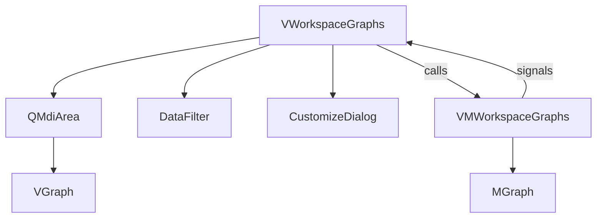
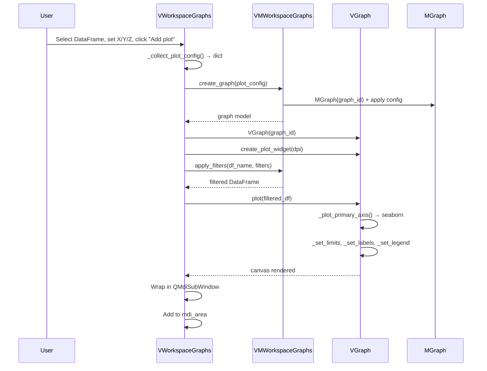
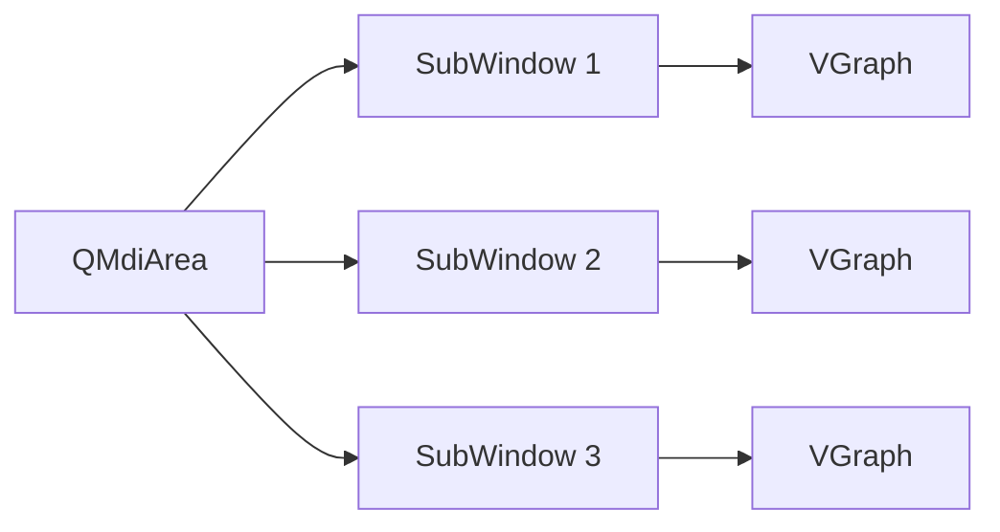

# **Graphs Workspace**

The `Graphs` workspace is a standalone statistical plotting environment. It manages DataFrames (from file or cross-workspace injection), applies dynamic filters, and creates publication-quality plots using `Seaborn` and `Matplotlib` inside an MDI (Multiple Document Interface) area.

---

## **Architecture Overview**



---

## **Key Classes**

### **`VMWorkspaceGraphs` — The ViewModel**

**File**: `spectroview/viewmodel/vm_workspace_graphs.py` (~438 lines)

Manages DataFrames and graph models. Unlike the `Spectra`/`Maps` ViewModels, this ViewModel is relatively lightweight — the heavy rendering logic lives in the `VGraph` widget.

| Responsibility | Methods |
|---------------|---------|
| **DataFrame loading** | `load_dataframes(paths)` — Supports `.xlsx`, `.xls`, `.csv` |
| **DataFrame management** | `add_dataframe()`, `remove_dataframe()`, `select_dataframe()`, `refresh_dataframe()` |
| **Graph CRUD** | `create_graph()`, `get_graph()`, `update_graph()`, `delete_graph()` |
| **Filtering** | `apply_filters(df_name, filters)` — `pd.DataFrame.query()` based |
| **Multi-wafer** | `create_multi_wafer_graphs()` — Batch-creates one wafer plot per slot |
| **Persistence** | `save_workspace()`, `load_workspace()`, `clear_workspace()` |

#### **Signals**

```python
dataframes_changed = Signal(list)           # List of DataFrame names updated
dataframe_columns_changed = Signal(list)    # Column names of selected DataFrame
graphs_changed = Signal(list)               # List of graph IDs updated
notify = Signal(str)                        # Toast notification
```

### **`MGraph` — The Plot Configuration Model**

**File**: `spectroview/model/m_graph.py` (~157 lines)

A pure data class that stores everything needed to recreate a plot:

| Property | Type | Purpose |
|----------|------|---------|
| `graph_id` | `int` | Unique identifier |
| `df_name` | `str` | Source DataFrame name |
| `plot_style` | `str` | One of `PLOT_STYLES` (`point`, `scatter`, `box`, `bar`, `line`, `wafer`, `2Dmap`, `trendline`) |
| `x`, `y`, `z` | `str` / `list[str]` / `str` | Column mappings for axes |
| `filters` | `list[dict]` | Saved filter state |
| `plot_title`, `xlabel`, `ylabel`, `zlabel` | `str` | Label overrides |
| `xmin`/`xmax`, `ymin`/`ymax`, `zmin`/`zmax` | `float` | Axis limits |
| `xlogscale`, `ylogscale` | `bool` | Log scale toggles |
| `y2`, `y3` | `str` | Secondary/tertiary Y-axis columns |
| `color_palette` | `str` | Matplotlib colormap name |
| `wafer_size` | `int` | Wafer diameter (300, 200, 150, 100) |
| `legend_properties` | `list[dict]` | Per-series label, color, marker overrides |
| `annotations` | `list[dict]` | Vertical lines, horizontal lines, text annotations |
| `dpi` | `int` | Figure DPI |
| `plot_width`/`height` | `int` | Window dimensions |

`MGraph` provides `save()` and `load(data)` methods for complete serialization.

### **`VGraph` — The Rendering Widget**

**File**: `spectroview/view/components/v_graph.py` (~1275 lines)

Each plot in the MDI area is a `VGraph` instance. It holds a Matplotlib `Figure` + `FigureCanvas` and renders using Seaborn plotting functions.

---

## **Data Flow: Creating a Plot**



---

## **Plot Styles**

Each plot style maps to a specific Seaborn or custom rendering function:

| Style | Seaborn Function | Hue Support | Notes |
|-------|-----------------|-------------|-------|
| `point` | `sns.pointplot()` | ✓ Z column | Supports "join" toggle for connecting points |
| `scatter` | `sns.scatterplot()` | ✓ Z column | Edgecolor black, 70pt markers |
| `box` | `sns.boxplot()` | ✓ Z column | Width 0.4, palette support |
| `bar` | `sns.barplot()` | ✓ Z column | Optional error bars (sd) |
| `line` | `sns.lineplot()` | ✓ Z column | Standard line plot |
| `trendline` | `sns.regplot()` | — | Polynomial regression with equation annotation |
| `wafer` | Custom `WaferPlot` | — | Circular wafer visualization with die sites |
| `2Dmap` | `ax.imshow()` | — | Rectangular heatmap via `pivot()` |

### **Multi-Axis Support**

`VGraph` supports up to **3 Y-axes**:

- **Primary Y** (`self.ax`): Standard left axis
- **Secondary Y** (`self.ax2`): Right axis, red color, created via `ax.twinx()`
- **Tertiary Y** (`self.ax3`): Far-right axis, green color, offset by 100 points

Each axis can use a different column and plot style.

---

## **DataFrame Management**

### **Loading**

`VMWorkspaceGraphs.load_dataframes()` uses `m_io.load_dataframe_file()`:

- **Excel** (`.xlsx`/`.xls`): Single sheet → `{filename: df}`. Multiple sheets → `{filename_sheetname: df}` per sheet.
- **CSV**: Auto-detects semicolon vs. comma delimiter.

### **Source Tracking and Refresh**

Every loaded DataFrame's source file path is stored in `self.dataframe_sources`. The "Refresh" button re-reads the file from disk, enabling iterative workflows where external tools modify the data.

### **Programmatic Injection**

Other workspaces can inject DataFrames directly:

```python
# From Maps workspace:
self.graphs_workspace.vm.add_dataframe(profile_name, profile_df)

# From Spectra/Maps fit results:
self.graphs_workspace.vm.add_dataframe("fit_results", df_fit_results)
```

---

## **Filter System**

The `VDataFilter` widget provides a dynamic query builder:

```python
# Each filter is a dict:
{
    "expression": "Slot == 5",    # Pandas query expression
    "state": True                  # Active/inactive toggle
}
```

Filters are applied via `pd.DataFrame.query()`:

```python
def apply_filters(self, df_name, filters):
    df = self.dataframes[df_name].copy()
    for filter_data in filters:
        if filter_data.get("state", False):
            df = df.query(filter_data["expression"])
    return df
```

Filters are **saved per-graph** in `MGraph.filters`, so each plot can have different active filters.

### **Multi-Wafer Workflow**

When a DataFrame contains a `Slot` column (common in semiconductor datasets):

1. The View shows slot checkboxes and the "Add Multi-Wafer" button.
2. The user selects slots (e.g., 1, 3, 5, 7).
3. `create_multi_wafer_graphs()` creates one wafer plot per slot, each with a `Slot == N` filter merged into the base filters.
4. All wafer plots appear simultaneously in the MDI area.

---

## **Graph Customization**

### **`CustomizeGraphDialog` (Singleton)**

**File**: `spectroview/view/components/customize_graph_dialog.py` (~1000+ lines)

A workspace-level singleton dialog that auto-switches context when the user activates a different MDI subwindow. Features:

| Feature | Description |
|---------|-------------|
| **Legend editor** | Rename labels, change colors and markers per series |
| **Axis limits** | Set exact min/max for all axes |
| **Annotations** | Add vertical/horizontal lines and text labels |
| **Axis breaks** | Insert break markers at specified positions |
| **Export** | Copy to clipboard, save as image |

### **Legend Customization**

Legend properties are stored in `VGraph.legend_properties`:

```python
[
    {"label": "Group A", "marker": "o", "color": "#1f77b4", "rgba": (0.12, 0.47, 0.71, 1.0)},
    {"label": "Group B", "marker": "s", "color": "#ff7f0e", "rgba": (1.0, 0.50, 0.06, 1.0)},
]
```

These are synchronized to `MGraph.legend_properties` via the `properties_changed` signal, ensuring they persist across save/load cycles.

### **Annotation System**

Annotations are stored as dicts in `MGraph.annotations`:

```python
# Vertical line
{"type": "vline", "id": "vl_1", "x": 520.7, "color": "red", "linestyle": "--", "linewidth": 1.5}

# Horizontal line
{"type": "hline", "id": "hl_1", "y": 100.0, "color": "blue", "linestyle": "-", "linewidth": 1.0}

# Text
{"type": "text", "id": "txt_1", "x": 300, "y": 500, "text": "Peak A", "fontsize": 12, "color": "black"}
```

Annotations support **drag interaction** — clicking and dragging a vertical/horizontal line updates its position in real time and emits `annotation_position_changed`.

---

## **MDI Area Management**

The `Graphs` workspace uses a `QMdiArea` to display multiple plots simultaneously:



- Each plot is wrapped in a `QMdiSubWindow` for independent sizing, minimizing, and arranging.
- The bottom toolbar provides global controls: graph selector combobox, DPI, X-label rotation, grid toggle.
- "Minimize All" collapses all windows for a clean workspace.
- Graph selection in the combobox activates the corresponding subwindow and syncs the right panel controls.

### **Graph Storage**

```python
# VWorkspaceGraphs maintains a lookup:
self.graph_widgets = {
    graph_id: (VGraph, QDialog, QMdiSubWindow)
}
```

When a graph is selected via the combobox or by clicking its subwindow:
1. `_on_subwindow_activated()` identifies the `graph_id`.
2. The ViewModel's `MGraph` is loaded.
3. The right panel controls (X/Y/Z comboboxes, labels, style) are synced to match.

---

## **Persistence**

### **Save Format (`.graphs`)**

```json
{
    "plots": {
        "1": {
            "graph_id": 1,
            "df_name": "fit_results",
            "plot_style": "point",
            "x": "Slot",
            "y": ["Si_center"],
            "z": "Zone",
            "filters": [{"expression": "R² > 0.95", "state": true}],
            "legend_properties": [...],
            "annotations": [...],
            "plot_width": 480,
            "plot_height": 400,
            "dpi": 100
        }
    },
    "original_dfs": {
        "fit_results": "1f8b0800..."
    },
    "dataframe_sources": {
        "fit_results": "/path/to/original.xlsx"
    }
}
```

DataFrames are stored as gzip-compressed CSV encoded as hex strings. On load, they are decompressed and reconstructed:

```python
csv_data = gzip.decompress(bytes.fromhex(hex_string)).decode('utf-8')
df = pd.read_csv(StringIO(csv_data))
```

---

## **Plot Replication**

The "Replicate" button on each graph toolbar creates a deep copy of the plot:

1. Serializes the current `MGraph` via `save()`.
2. Removes `graph_id` (the ViewModel assigns a new one).
3. Captures the current subwindow size for the replica.
4. Calls `_create_and_display_plot()` with the cloned config.

This enables rapid A/B comparison of the same data with different visual settings.
