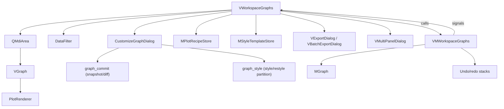
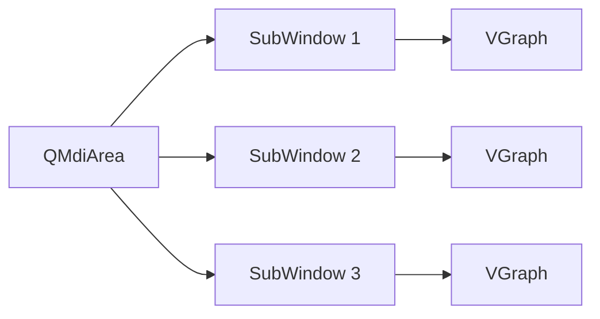

# **Workspace: Graphs**

The `Graphs` workspace is a standalone statistical plotting environment. It manages DataFrames (from file or cross-workspace injection), applies dynamic filters, and creates publication-quality plots using pure `Matplotlib` (plus `scipy` for statistics) inside an MDI (Multiple Document Interface) area. It no longer depends on Seaborn — every plot style is drawn directly with Matplotlib primitives in `PlotRenderer`.

---

## **Architecture Overview**



---

## **Key Classes**

### **`VMWorkspaceGraphs` — The ViewModel**

**File**: `spectroview/viewmodel/vm_workspace_graphs.py`

Manages DataFrames, graph models, and the workspace's undo/redo history. Unlike the `Spectra`/`Maps` ViewModels, this ViewModel is relatively lightweight — the heavy rendering logic lives in the `VGraph` widget.

| Responsibility | Methods |
|---------------|---------|
| **DataFrame loading** | `load_dataframes(paths)` — Supports `.xlsx`, `.xls`, `.csv` |
| **DataFrame management** | `add_dataframe()`, `remove_dataframe()`, `select_dataframe()`, `refresh_dataframe()` |
| **Graph CRUD** | `create_graph()`, `get_graph()`, `update_graph()`, `delete_graph()` |
| **Filtering** | `apply_filters(df_name, filters)` — `pd.DataFrame.query()` based |
| **Multi-wafer** | `create_multi_wafer_graphs()` — Batch-creates one wafer plot per slot |
| **Undo/redo** | `undo()`, `redo()`, `begin_undo_batch()`/`end_undo_batch()`, `can_undo`/`can_redo` |
| **Persistence** | `save_workspace()`, `load_workspace()`, `clear_workspace()` |

#### **Signals**

```python
dataframes_changed = Signal(list)           # List of DataFrame names updated
dataframe_columns_changed = Signal(list)    # Column names of selected DataFrame
graphs_changed = Signal(list)               # List of graph IDs updated
undo_state_changed = Signal()               # can_undo/can_redo changed -- sync toolbar buttons
notify = Signal(str)                        # Toast notification
```

### **`MGraph` — The Plot Configuration Model**

**File**: `spectroview/model/m_graph.py`

A pure dataclass (113 fields) that stores everything needed to recreate a plot. `save()`/`load(data)` provide complete serialization; `get_display_name()` builds the MDI subwindow title. Rather than enumerate every field here (see `m_graph.py` for the exhaustive, authoritative list), fields group into:

| Category | Examples |
|---|---|
| Identity / data source | `graph_id`, `df_name`, `plot_style`, `x`/`y`/`z`, `filters` |
| Primary axis limits | `xmin`/`xmax`, `ymin`/`ymax`, `zmin`/`zmax` |
| Axis scale/orientation | `xlogscale`/`ylogscale`, `xscale_mode`/`yscale_mode`, `x_inverted`/`y_inverted` |
| Secondary axes (Y2/Y3/X2) | per-axis column, `color`, `marker`, `min`/`max`, `logscale`, `label` |
| Labels/titles | `plot_title`, `plot_subtitle`, `xlabel`/`ylabel`/`zlabel` |
| Style/appearance | `grid`, `tick_direction`, `tick_label_format`, font sizes, `figure_facecolor`, `figure_margins`, `spines_visible`, `figure_theme`, minor-tick toggles |
| Legend | `legend_visible`, `legend_outside`, `legend_properties`, `legend_bbox`, `legend_ncol`, `legend_frame`, `legend_title`, `legend_fontsize`, `legend_alpha`, `legend_loc` |
| Plot-style-specific | wafer/2Dmap colormap (`color_palette`, `colormap_norm`, `colormap_center`), trendline fit/anchor, error bars, point/scatter (`scatter_size`, `scatter_edgecolor`, `unify_marker_style`), histogram, sort order |
| Annotations | `annotations` (list of typed dicts, see [Annotations Tab](#annotations-tab)) |
| Broken axis | `axis_breaks` |
| Inset (zoom) axes | `inset_enabled`, `inset_bounds`, `inset_xmin`/`xmax`/`ymin`/`ymax`, `inset_show_zoom_indicator` |
| Export/window geometry | `plot_width`/`height`, `dpi`, `export_width_mm`/`height_mm` |

Note: style templates, plot recipes, and the working-folder setting are **not** `MGraph` fields — they're separate systems built around subsets of these fields (see [Style Templates & Plot Recipes](#style-templates-plot-recipes)).

### **`VGraph` — The Rendering Widget**

**File**: `spectroview/view/components/v_graph.py`

Each plot in the MDI area is a `VGraph` instance. It holds a Matplotlib `Figure` + `FigureCanvas` and acts as the UI wrapper. It manages interactions, context menus, and toolbar actions (Style menu, Export, Replicate), but delegates the actual drawing algorithms to `PlotRenderer`. `create_plot_widget()` still builds each `VGraph`'s own matplotlib nav toolbar + action-button row (`self.toolbar_container`), but never adds it to the graph's own layout — see [the bottom toolbar](#mdi-area-management) for where it's actually shown.

Two rendering paths:
- **`plot(df)`** — full replot: clears and rebuilds the Axes from scratch. Required whenever artists themselves change (series data, colors/markers per point, colormap, secondary/twin axes, annotations, insets) or a broken axis is active/toggled.
- **`restyle()`** — fast path that repaints an already-rendered Axes in place (titles/labels/fontsizes, grid, tick direction/format, primary axis limits, log/symlog scale, figure facecolor/spines/margins, legend box styling) without touching plotted data. Returns `False` (forcing a full replot instead) whenever a broken axis is active. See [Live Preview & Restyle Fast Path](#live-preview-restyle-fast-path) for how the Customize dialog decides which path to use.

`_set_figure_style()` re-applies `axes.facecolor`/`figure.facecolor`/`axes.labelcolor`/`text.color`/`xtick.color`/`ytick.color`/`axes.edgecolor` from `plt.rcParams` on every render — necessary because `ax.clear()` does not retroactively repaint an Axes built under a different Matplotlib style/theme context, which previously left tick/label/spine colors stuck black after switching to a dark theme.

### **`PlotRenderer` — The Plotting Engine**

**File**: `spectroview/view/components/v_plot_renderer.py`

Separated from `VGraph` for maintainability, this class encapsulates the pure Matplotlib rendering logic for all plot styles (e.g., `_plot_scatter`, `_plot_histogram`, and the `WaferPlot` class). It receives a reference to the `VGraph` instance (`self.vg`) to access configuration state (`self.vg.x`, `self.vg.plot_style`, etc.) and draws directly onto the Matplotlib `Axes`.

#### Colormap Normalization

`_build_color_norm(vmin, vmax, norm_kind, center)` builds the color-scale mapping for wafer/2Dmap heatmaps from `MGraph.colormap_norm` (`"linear"`/`"log"`/`"centered"`) and `MGraph.colormap_center`, editable from the More Options tab's "Colormap scale" group (only shown for `wafer`/`2Dmap`). `"log"` uses `LogNorm`, `"centered"` uses `CenteredNorm` (useful for diverging data like stress/strain centered at 0), and both degrade gracefully back to plain linear `vmin`/`vmax` if the requested norm is invalid for the actual data range (e.g. log norm on non-positive data).

Both `_plot_wafer`/`_plot_2dmap` resolve `vmin`/`vmax` through `_clear_degenerate_zlim(zmin, zmax)` first, which treats an explicit `zmin == zmax` (both set, equal) the same as unset, falling back to the data-derived range. A handful of pre-existing saved `.graphs` files carry an explicit `zmin == zmax == 0.0` (from an old, since-fixed default) — honoring that literally collapses `matplotlib.colors.Normalize(vmin=0, vmax=0)` to mapping every value to the same color, which is what actually broke color mapping when reopening those files, not the colormap-normalization feature itself.

`_resolve_marker_size(style, fallback)` / `_resolve_edge_color(style, fallback)` centralize the "Unify Marker size / Edge color" behavior (see [Legend / Color Tab](#legend-color-tab)): when `VGraph.unify_marker_style` is `True`, every series uses the graph-wide `scatter_size`/`scatter_edgecolor`; when `False`, each series' `legend_properties[i]` override (if any) wins.

---

## **Data Flow: Creating a Plot**

1. **User Action**: The user selects a DataFrame, configures the X/Y/Z axes, and clicks "Add plot" in the `VWorkspaceGraphs` UI.
2. **Configuration Capture**: The View calls `_collect_plot_config()` to gather all UI settings into a configuration dictionary, then merges in `MSettings.get_default_graph_style()` (the user's "Set as Default Style" baseline, if any — see [Style Templates & Plot Recipes](#style-templates-plot-recipes)) via `_apply_default_style_to_config()`. The collected config's data-identity fields (`x`/`y`/`z`/`df_name`/`plot_style`) always win over the default style, since the default only ever contains appearance fields.
3. **Model Creation**: The View calls `vm.create_graph(plot_config)`. The ViewModel instantiates an `MGraph(graph_id)`, applies the configuration, records an undo point, and returns the graph model.
4. **Widget Initialization**: The View instantiates a `VGraph(graph_id)` widget and calls `create_plot_widget(dpi)` to set up the Matplotlib canvas.
5. **Data Filtering**: The View requests the `filtered_df` from the ViewModel by calling `vm.apply_filters(df_name, filters)`.
6. **Rendering**: The View calls `VGraph.plot(filtered_df)`.
7. **Plot Execution**: `VGraph` calls `_plot_primary_axis()`, which instantiates a `PlotRenderer(self)` and delegates the drawing logic (e.g., `self.renderer._plot_scatter()`), then applies limits, labels, and legends before returning the rendered canvas.
8. **UI Integration**: The View wraps the new `VGraph` widget in a `QMdiSubWindow` and adds it to the MDI area.

This same default-style merge applies to `_on_plot_multi_wafer()`; it deliberately does **not** apply when applying a Plot Recipe or replicating an existing graph, since those already carry a fully-specified, intentional style.

---

## **Plot Styles**

Each plot style maps to a `PlotRenderer._plot_*` method that draws directly with Matplotlib primitives (no Seaborn):

| Style | Matplotlib primitive | Hue Support | Notes |
|-------|---------------------|-------------|-------|
| `point` | `ax.errorbar()` | ✓ Z column | Plots per-category means with error bars; "Join" toggle connects them with a line; only style with a per-series Marker column |
| `scatter` | `ax.scatter()` | ✓ Z column | Marker size/edge color unified across series by default (see Unify checkbox) |
| `box` | `ax.boxplot()` | ✓ Z column | Palette support; box width derived from category spacing |
| `bar` | `ax.bar()` | ✓ Z column | Optional error bars (sd/95% CI) |
| `line` | `ax.plot()` | ✓ Z column | Standard line plot |
| `trendline` | `np.poly1d` fit + `ax.scatter()` / `ax.plot()` / `ax.fill_between()` | ✓ Z column | Polynomial regression with custom zero-intercept anchoring, an analytical 95% CI band, and equation table export |
| `histogram` | `ax.hist()` (+ `scipy.stats.gaussian_kde`) | ✓ Z column | Bins customization, optional KDE overlay, step outline vs. filled bars |
| `wafer` | Custom `WaferPlot` (`ax.scatter()`) | — | Circular wafer visualization with die sites; colormap normalization (linear/log/centered) |
| `2Dmap` | `ax.imshow()` | — | Rectangular heatmap via `pivot()`; same colormap normalization options as wafer |

### **Multi-Axis Support**

`VGraph` supports up to **3 Y-axes**, plus a secondary X-axis:

- **Primary Y** (`self.ax`): Standard left axis
- **Secondary Y** (`self.ax2`): Right axis, created via `ax.twinx()`
- **Tertiary Y** (`self.ax3`): Far-right axis, offset outward
- **Secondary X** (`x2`): created via `ax.twiny()`

Each secondary axis can use a different column and has its own label, min/max limits, log-scale toggle, color, and marker — all editable from the **Secondary axes** section at the bottom of the Customize dialog's Axis tab (previously only settable via script or hardcoded). A row is enabled only once that axis has a column assigned.

---

## **DataFrame Management**

### **Loading**

`VMWorkspaceGraphs.load_dataframes()` uses `m_io.load_dataframe_file()`:

- **Excel** (`.xlsx`/`.xls`): Single sheet → `{filename: df}`. Multiple sheets → `{filename_sheetname: df}` per sheet.
- **CSV**: Auto-detects semicolon vs. comma delimiter.

### **Source Tracking and Refresh**

Every loaded DataFrame's source file path is stored in `self.dataframe_sources`. The "Refresh" button re-reads the file from disk, enabling iterative workflows where external tools modify the data.

### **Programmatic Injection**

Other workspaces can inject DataFrames directly:

```python
# From Maps workspace:
self.graphs_workspace.vm.add_dataframe(profile_name, profile_df)

# From Spectra/Maps fit results:
self.graphs_workspace.vm.add_dataframe("fit_results", df_fit_results)
```

---

## **Filter System**

The `VDataFilter` widget provides a dynamic query builder:

```python
# Each filter is a dict:
{
    "expression": "Slot == 5",    # Pandas query expression
    "state": True                  # Active/inactive toggle
}
```

Filters are applied via `pd.DataFrame.query()`:

```python
def apply_filters(self, df_name, filters):
    df = self.dataframes[df_name].copy()
    for filter_data in filters:
        if filter_data.get("state", False):
            df = df.query(filter_data["expression"])
    return df
```

Filters are **saved per-graph** in `MGraph.filters`, so each plot can have different active filters.

### **Multi-Wafer Workflow**

When a DataFrame contains a `Slot` column (common in semiconductor datasets):

1. The View shows slot checkboxes and the "Add Multi-Wafer" button.
2. The user selects slots (e.g., 1, 3, 5, 7).
3. `create_multi_wafer_graphs()` creates one wafer plot per slot, each with a `Slot == N` filter merged into the base filters.
4. All wafer plots appear simultaneously in the MDI area.

---

## **Graph Customization**

### **`CustomizeGraphDialog` (Singleton)**

**Package**: `spectroview/view/components/customize_graph/` — `CustomizeGraphDialog` (in `customize_graph_dialog.py`) hosts four tab widgets, each in its own module, plus the small shared `customize_annotation_dialogs.py` (per-annotation-type edit dialogs, color delegate):

| Tab | Class | Module |
|---|---|---|
| Axis | `CustomizeAxis` | `customize_axis.py` |
| Legend / Color | `CustomizeLegend` | `customize_legend.py` |
| Annotations | `CustomizeAnnotations` | `customize_annotations.py` |
| More options | `CustomizeMoreOptions` | `customize_more_options.py` |

`CustomizeAxis` also owns the Inset (zoom) axes and Secondary axes (Y2/Y3/X2) sections — these used to be their own tabs, but were folded back into the Axis tab since axis-shaped controls belong together and a 7-tab dialog wasn't actually easier to navigate. Given how much that adds, the tab wraps its content in a `QScrollArea` (matching `CustomizeMoreOptions`'s own pattern) so the dialog's minimum height stays reasonable on smaller screens. `CustomizeMoreOptions` similarly owns Font sizes (Title/Subtitle/Axis label/Tick label, one row) and the figure Theme selector (folded into "Plot options:"), consolidated from a former standalone Text Size tab and a since-removed "Figure style" groupbox.

A workspace-level singleton dialog that auto-switches context when the user activates a different MDI subwindow. Its initial size (560×760) is a starting point only — Qt's layout system clamps both dimensions upward as needed for whichever tab's content is largest (e.g. the Legend tab's per-series columns when Unify is unchecked), so the literal numbers don't need to be exact.

### **Live Preview & Restyle Fast Path**

Every control in every tab restarts a single debounced 400ms `QTimer` on change. On timeout, each tab's apply method runs with `replot=False` against the live widget, and `graph_commit.snapshot()`/`diff()` (see below) determine exactly which fields changed. If the changed fields are a subset of `graph_style.RESTYLE_SAFE_FIELDS`, the dialog calls `VGraph.restyle()` (fast in-place repaint); otherwise it does a full `VGraph.plot(df)`. This preview never touches the undo stack or `vm.update_graph()` — it's purely visual until the user clicks **Apply**, which wraps every tab's changes in one `vm.begin_undo_batch()`/`end_undo_batch()` pair (one undo step per Apply, regardless of how many tabs were edited). **Cancel** reverts the widget from a snapshot taken when the dialog opened, without ever having touched the ViewModel.

### **`graph_style.py` — the style/data field partition**

**File**: `spectroview/model/graph_style.py`

- **`STYLE_FIELD_NAMES`** — every `MGraph` field *except* identity/data columns, data-coordinate limits, annotations, and window/output geometry (computed by excluding `_NON_STYLE_FIELDS`). This is "how a graph looks," portable from one graph to another regardless of its data.
- **`RESTYLE_SAFE_FIELDS`** — a narrower subset of `STYLE_FIELD_NAMES`: fields safe for `VGraph.restyle()`'s fast repaint path (titles/labels/fontsizes, grid, tick direction/format, primary axis limits, log/symlog scale, figure facecolor/spines/margins, legend box styling). Excludes anything that requires artists to be recreated (per-series color/marker/size, colormap, secondary axes, annotations, insets).
- **`extract_style(source_dict)`** / **`apply_style_dict(graph_widget, style_dict)`** / **`default_style()`** — pull the style subset out of a graph, write a style dict onto a widget (resetting `legend_properties` so per-series colors re-derive), and produce the hardcoded factory-default style respectively.
- **`can_restyle_without_replot(changed_fields)`** — `True` iff every changed field is in `RESTYLE_SAFE_FIELDS`.

### **`graph_commit.py` — change tracking**

**File**: `spectroview/view/components/graph_commit.py`

`snapshot(gw)` deep-copies every `MGraph` field (except `graph_id`) off a live `VGraph` widget; `diff(gw, before)` returns a patch dict of only the fields that differ from a prior snapshot. Used both by the Customize dialog's live-preview tick (deciding restyle vs. replot) and by toolbar-level edits (e.g. syncing a dragged legend position / resized subwindow into the model before `save_workspace()`) — in both cases the resulting patch flows through `properties_changed.emit()` → `vm.update_graph()`, which is what actually records the undo step.

### **Undo/Redo**

The undo/redo stack lives in `VMWorkspaceGraphs`, not the View: `_undo_stack`/`_redo_stack` hold whole-workspace snapshots (`{graph_id: MGraph.save()-dict}`), capped at 50 entries. Every `create_graph()`/`update_graph()`/`delete_graph()` call records one undo point unless it's inside a `begin_undo_batch()`/`end_undo_batch()` pair, in which case the whole batch collapses into a single step — used by the Customize dialog's Apply button (one step for all four tabs) and by Plot Recipe application (one step for the whole recipe, not one per plot). `undo_state_changed` keeps the toolbar's Undo/Redo buttons in sync via `can_undo`/`can_redo`.

### **Keyboard Shortcuts**

Registered on `self.mdi_area` (not the whole workspace widget, so they don't shadow a side-panel `QLineEdit`'s native shortcuts while typing) and act on the active MDI subwindow's graph. This `WidgetWithChildrenShortcut` context also means they're implicitly scoped to the Graphs tab itself: `self.mdi_area` (and everything in it) isn't part of the focus chain while a different tab is active, so the shortcuts simply don't fire.

| Shortcut | Action |
|---|---|
| `Ctrl+Z` | Undo |
| `Ctrl+Shift+Z` | Redo |
| `Ctrl+C` | Copy the active graph's *figure* to the clipboard (`VGraph.copy_to_clipboard()`, matching the toolbar's Copy button) |
| `Ctrl+V` | Paste the copied *style* onto the active graph |
| `Ctrl+E` | Open the Customize Graph Dialog for the active graph (matching the toolbar's Customize button) |

Style copy/paste no longer has its own Ctrl+C shortcut (`_on_copy_style_shortcut()` was removed) — Ctrl+C copies the figure instead, since that's the far more common action. Style copy is still one click away via the Style menu's "Copy Style" action; Ctrl+V still pastes whatever style was last copied that way.

### **Axis Tab**

The tab wraps its content in a `QScrollArea` (like More Options) since it now covers every axis-shaped concern in one place — content is tall enough on smaller screens to need scrolling.

- **Axis properties**: per-axis (X/Y) scale (Linear/Logarithmic/Symlog), data type (Auto/Category/Numerical), and Inverted toggle.
- **Axis Appearance**: minor ticks (independently for X-Bottom/X-Top/Y-Left/Y-Right), **Show spines** (Top/Right/Bottom/Left), tick direction (Default/In/Out/In & Out), and tick label format (Auto/Integer/1-decimal/2-decimal/Scientific).
- **Set Axis Limits**: one spinbox-slider row per X/Y/Z axis (X/Y hidden for `wafer`/`2Dmap`, where Z is the color-scale control instead). Each min/max spinbox is paired with a double-range slider whose drag bounds derive from the actual data range (padded 10%). When a limit is unset, the spinbox shows the plot's real current rendered value grayed out — not a generic "default" placeholder — so the displayed number is always meaningful; this same real-value-placeholder pattern applies to every optional spinbox in this dialog (inset limits, per-series legend overrides).
- **Broken axis**: X-axis break and Y-axis break are mutually exclusive (enabling one disables the other, since the renderer only supports one break axis at a time). Rendering splits the Axes into two panels via `gridspec` — side-by-side sharing the Y axis for an X-break, stacked sharing the X axis for a Y-break — each panel clipped to its half of the range with the facing spines hidden and standard diagonal "//" break marks drawn on the real spine boundaries. A broken axis always forces a full replot (`VGraph.restyle()` returns `False` while one is active) and is mutually exclusive with inset axes.
- **Inset (zoom) axes**: a checkable group with Position (x0, y0) and Size (w, h) in axes-fraction coordinates, independent X/Y limits, and a "Show zoom indicator" toggle that draws the connector lines from the inset box back to the region it zooms into on the main plot (`ax.indicate_inset_zoom()`). The inset Axes itself is never persisted — it's rebuilt on every render from `MGraph.inset_bounds`. Mutually exclusive with a broken axis.
- **Secondary axes** (bottom of the tab): one row per Y2/Y3/X2 axis (each disabled until that axis has a column assigned), exposing Label, Min/Max, Log toggle, Color, and Marker — see [Multi-Axis Support](#multi-axis-support).

Font sizes (Title/Axis label/Tick label) live in the **More Options** tab, not here.

### **Legend / Color Tab**

- **Legends box**: an optional **"Unify marker size / edge color"** checkbox (checked by default). While checked, a single Marker size / Edge color row at the top of the box applies to every series, and the per-series Marker size/Edge color table columns are hidden. Unchecking it reveals those per-series columns (for `point`/`scatter`-family styles only) so each series can override marker size and edge color independently — `PlotRenderer._resolve_marker_size()`/`_resolve_edge_color()` implement the fallback. Per-series Label, Color, and Alpha are always editable individually; Marker is point-style-only, and Line width only shows for styles that actually draw a line (`line`/`trendline`, or `point` with "Join" enabled) — a bare scatter/box/bar has nothing for a line width to describe. Unset per-series linewidth/alpha spinboxes show the real value that will actually be used (e.g. "1.50"), grayed out, rather than a generic placeholder.
- **Legend style**: columns, frame, title, font size, alpha, position.
- **Error bars**: type (95% CI / SD / None, style-dependent options) and cap size.

### **Annotations Tab**

Eight annotation types, each an "Add" button plus a dedicated edit dialog in `customize_annotation_dialogs.py`:

| Type | Purpose | Edit dialog |
|---|---|---|
| `vline` / `hline` | Vertical/horizontal reference line | `EditLineDialog` |
| `text` | Free text label with optional background box | `EditTextDialog` |
| `arrow` | Point-to-point arrow | `EditArrowDialog` |
| `vspan` / `hspan` | Shaded vertical/horizontal band | `EditSpanDialog` |
| `box` | Filled/outlined rectangle | `EditBoxDialog` |
| `callout` | Text label with a pointer arrow to a data point | `EditCalloutDialog` |

All stored as typed dicts in `MGraph.annotations`. Every type supports **drag interaction** — clicking and dragging updates position in real time and emits `annotation_position_changed` — implemented by `VGraph._on_annotation_click()`/`_on_annotation_drag()`/`_on_annotation_release()` in `v_graph.py`. Hit-testing is done manually (`self.ax.findobj()` + `artist.contains(event)`) rather than via matplotlib's `pick_event`: `Figure.pick()` only delivers a pick event to an artist when `event.inaxes` equals that artist's own Axes, which silently never happens for an annotation on the primary Axes whenever a secondary Y-axis is also present (it fully overlaps the primary Axes and has higher z-order, so `event.inaxes` resolves to it instead) — this used to make every annotation on a graph with `y2`/`y3` configured completely undraggable. `VGraph._ax_data_coords(event)` resolves the drag position from the event's own pixel coordinates through `self.ax.transData` directly, sidestepping the same `event.inaxes` ambiguity for the position itself.

### **More Options Tab**

**Plot options**: style-dependent checkboxes (join/dodge points, error bars, wafer stats), plus one row shared by three global controls: a **Theme** selector (Light/Dark/Soft Dark — re-applies `axes.facecolor`/label/tick/spine colors from `plt.rcParams` on every render so switching themes doesn't leave stale black text/spines), an **X label rotation** spinbox (`MGraph.x_rot`), and a **Grid** checkbox (`MGraph.grid`) — the latter two migrated here from the workspace's bottom toolbar.

**Font sizes (pt)**: Title, Subtitle, Axis label, and Tick label spinboxes in a single row (defaults 12/10/12/9, matching the active Matplotlib style). The Subtitle *text* itself (what it says, not its size) lives in the workspace side panel (`VWorkspaceGraphs`), not in this dialog — the old "Figure style" groupbox's redundant Subtitle text field was removed for that reason. Background color, Show-spines, and Margins controls that used to live in "Figure style" are still respected if set programmatically via `MGraph.figure_facecolor`/`figure_margins`, just without a dedicated picker (Show-spines moved to the Axis tab).

**Colormap scale** (wafer/2Dmap only): Normalization (Linear/Log/Centered) and, for Centered, a Center value — see [Colormap Normalization](#colormap-normalization) below.

---

## **Style Templates & Plot Recipes**

Two conceptually distinct, previously-conflated features:

- **Plot Recipe** (`MPlotRecipeStore` / `VPlotRecipeDialog`, folder: `<working folder>/plot_recipe/`) — a saved **set of full plot configurations** (data bindings *and* style: `df_name`, `x`/`y`/`z`, `filters`, plus every style field), one JSON file per recipe. Applying a recipe **creates new plots**: `_on_recipe_applied()` re-targets each saved config's `df_name` at the *currently selected* DataFrame (not each plot's originally-saved one) and skips + reports any plot whose required columns are missing, rather than aborting the whole batch. The whole recipe applies as one undo step. The dialog supports browse/search/apply/rename/**duplicate**/delete.
- **Style Template** (`MStyleTemplateStore` / `VStyleTemplateDialog`, folder: `<working folder>/plot_style/`) — a saved **appearance-only** style dict (`graph_style.extract_style()`), one JSON file per template. Applying one (`_apply_style_to_graph()`) writes onto an **existing** graph via `graph_style.apply_style_dict()` — data bindings are never touched. A leaner sibling of `VPlotRecipeDialog`: no graph-count or Duplicate, since a style template is always exactly one style dict.

Both stores are deliberately **rebuilt from the current Working Folder setting at the point of use** (`VWorkspaceGraphs._refresh_recipe_and_style_stores()`, called at the top of every apply/save handler, including the AI Chat panel's own recipe-save flow via `VMChat.refresh_recipe_store()`) rather than built once at startup — fixing a bug where a Working Folder configured after the workspace tab already existed silently never took effect until an app restart.

Each `VGraph`'s toolbar **Style menu** ties these together: **Save Style…** / **Apply Style…** (open the respective dialog), **Copy Style** / **Paste Style** (in-memory, `Ctrl+C`/`Ctrl+V`), **Reset to Default** (always the hardcoded factory `graph_style.default_style()`), and **Set as Default Style** (saves the current graph's style, via `MSettings.set_default_graph_style()`, as the baseline new graphs start from — see [Data Flow: Creating a Plot](#data-flow-creating-a-plot)). These are two independent, non-overlapping concepts: **Reset to Default** always restores the factory style regardless of what's been set as default; **Set as Default Style** only changes what *newly created* plots start with, is persisted across restarts, and never affects existing graphs or Reset-to-Default's behavior.

---

## **Export & Multi-Panel Composer**

**File**: `spectroview/view/components/v_export_dialog.py`

- **`VExportDialog(graph_widget, parent=None)`** — exports a single graph to PNG/TIFF/SVG/PDF/EPS with format/DPI/transparency/export-time-theme-override controls, plus a physical-size section (journal presets, mm/inch toggle, blank = current on-screen size) that persists back onto the graph's `export_width_mm`/`export_height_mm` fields.
- **`VBatchExportDialog(graph_widgets: dict, parent=None)`** — exports every currently-open graph to a chosen folder in one pass, each at its own already-persisted physical size, reporting per-graph failures in a summary dialog.

**File**: `spectroview/view/components/v_multipanel_dialog.py`

- **`VMultiPanelDialog(graph_widgets: dict, parent=None)`** — composes several checked/reordered open graphs into one throwaway `matplotlib.figure.Figure` grid (auto-suggested rows/cols, constrained layout, shared-axis-label collapsing on interior panels, lettered/numbered panel labels). Each panel is rendered by temporarily repointing the source `VGraph`'s `.ax`/`.figure` onto the composed figure's subplot and calling its normal render path, then restoring the source widget so the live workspace is never mutated. Graphs with an active broken axis render via a simplified single-panel path in the composed figure (a documented scope limit).

---

## **MDI Area Management**

The `Graphs` workspace uses a `QMdiArea` to display multiple plots simultaneously:



- Each plot is wrapped in a `QMdiSubWindow` for independent sizing, minimizing, and arranging. Fusion's native subwindow frame is fairly thick and heavily beveled; `self.mdi_area.setStyleSheet(...)` adds a `QMdiSubWindow { border: 1px solid ... }` rule to flatten it to a thin 1px line (setting any border property via QSS switches a widget from native to CSS-based border rendering).
- The bottom toolbar provides global controls: minimize/delete-all, Undo/Redo, Compose Figure (icon-only buttons, moved here from the side panel since they're workspace-global and used more often than the recipe buttons that stayed there), and one shared **graph toolbar slot** (`self.graph_toolbar_slot` / `self._graph_toolbar_slot_layout`, given stretch factor 1 so it fills the remaining width). Every `VGraph` builds its own matplotlib nav toolbar (Home/Pan/Zoom/Subplots) + a `QFrame.VLine` separator + action-button row (Replicate/Customize/Copy/Export/Style menu, pushed flush against the right edge via a `QHBoxLayout.addStretch()` between the separator and the buttons) in `create_plot_widget()`, but keeps it parentless and hidden (`self.toolbar_container`) instead of showing it inside its own MDI window — each MDI window shows only its plot canvas. The Export button does double duty (`VGraph._on_export_clicked()`, mirroring `VSpectraViewer`'s Copy button): a plain click emits `export_requested(graph_id)` (single-graph export dialog); Ctrl+Click (checked via `QApplication.keyboardModifiers() & Qt.ControlModifier` inside the click handler) emits `export_all_requested` instead, wired to the same `VWorkspaceGraphs._on_export_all_clicked()` the old side-panel "Export All" button used to call — that button was removed outright once this made it redundant. Every action-button icon is a fixed colorful icon set once at creation; `VGraph.update_icon_colors()` and `VWorkspaceGraphs`'s per-theme retinting of it were removed since nothing on a graph needs to track the app theme anymore. `VWorkspaceGraphs._sync_active_graph_toolbar()` reparents whichever graph's `toolbar_container` belongs to the currently active MDI subwindow into the shared slot (detaching the previous one first), so every graph visually shares one toolbar instead of each carrying an identical copy. It's called from every place the active graph can change or a graph's toolbar gets rebuilt: `_on_subwindow_activated` (covers subwindow clicks, the graph-list combobox, and the "no subwindows left" `None` case), `_build_graph_widget` (new graph), `_on_update_plot`/the AI-agent's graph-update path in `main.py` (`create_plot_widget()` rebuilds `toolbar_container` from scratch, so the slot must re-sync to the new instance), and `_on_graph_closed`/`_on_delete_all`/`clear_workspace`/`_rebuild_all_graph_widgets` (teardown/rebuild paths, so the slot never dangles a reference to a deleted widget). X-label rotation and the grid toggle used to live in this toolbar too — moved into the Customize dialog's More Options tab (same row as Theme) since they're per-graph style, not workspace-global, and the toolbar versions only ever applied as one-off new-plot defaults with no live-preview. (A DPI spinbox used to live here too — removed: it only ever set the *default* DPI for the next newly-created plot, silently doing nothing when changed with an existing graph selected despite visually syncing to show that graph's DPI, which read as a live edit control but wasn't one. `MGraph.dpi` still defaults to 100 and can be set via script/AI-agent; on-screen rendering resolution isn't something users need to hand-tune day to day, and export resolution has its own explicit control in `VExportDialog`.)
- The graph selector combobox ("Active plot:") and the live plot-size label both moved out of the bottom toolbar: the selector now lives in the side panel, right above Add/Update Plot (`VWorkspaceGraphs._setup_action_buttons()`), and the plot-size label was removed entirely (along with `MdiSubWindow`'s `figsize_label` param and its now-pointless `resizeEvent` override).
- "Minimize All" collapses all windows for a clean workspace.
- Graph selection in the combobox activates the corresponding subwindow and syncs the right panel controls.

### **Graph Storage**

```python
# VWorkspaceGraphs maintains a lookup:
self.graph_widgets = {
    graph_id: (VGraph, QDialog, QMdiSubWindow)
}
```

When a graph is selected via the combobox or by clicking its subwindow:
1. `_on_subwindow_activated()` identifies the `graph_id`.
2. The ViewModel's `MGraph` is loaded.
3. The right panel controls (X/Y/Z comboboxes, labels, style) are synced to match.

---

## **Persistence**

### **SPECTROview Working Folder**

A single user-configured root folder (Settings panel) with three subfolders auto-created under it (`os.makedirs(..., exist_ok=True)`) on first configuration:

| Subfolder | Purpose | `MSettings` getter |
|---|---|---|
| `fit_model/` | Fit-model JSON templates (Spectra/Maps workspaces) | `get_fit_model_folder()` |
| `plot_recipe/` | Plot Recipes | `get_plot_recipe_folder()` |
| `plot_style/` | Style Templates | `get_plot_style_folder()` |

`get_working_folder()` one-time-migrates from the older, separate "Fit model folder"/"Plot template folder" settings if either was previously configured, so existing setups aren't orphaned. A separate setting, `get_default_graph_style()`/`set_default_graph_style()`, stores the "Set as Default Style" baseline (see [Style Templates & Plot Recipes](#style-templates-plot-recipes)) — unrelated to the working folder, but persisted the same way (`QSettings`, disk-backed, survives restarts).

### **Save Format (`.graphs`)**

Current format (`format_version: 3`) is a **ZIP archive**, written by `WorkspaceIO.save_workspace()`:

```
metadata.json                          # {"format_version": 3, "plots": {...}, "dataframe_sources": {...}}
dataframes/<name>.parquet              # one Parquet file per DataFrame, streamed directly into the zip
```

Each entry in `metadata["plots"]` is a full `MGraph.save()` dict keyed by `graph_id`:

```json
{
    "plots": {
        "1": {
            "graph_id": 1,
            "df_name": "fit_results",
            "plot_style": "point",
            "x": "Slot",
            "y": ["Si_center"],
            "z": "Zone",
            "filters": [{"expression": "R² > 0.95", "state": true}],
            "legend_properties": [...],
            "annotations": [...],
            "plot_width": 480,
            "plot_height": 400,
            "dpi": 100
        }
    },
    "dataframe_sources": {
        "fit_results": "/path/to/original.xlsx"
    }
}
```

`WorkspaceIO.load_workspace()` sniffs the ZIP magic number; files that predate this format (raw JSON, DataFrames embedded as gzip-compressed CSV hex strings under an `original_dfs` key) are detected as legacy and loaded via a dedicated fallback path — kept only for opening old files, never used for saving.

---

## **Plot Replication**

The "Replicate" button (in the shared graph toolbar, acting on whichever graph is active) creates a deep copy of the plot:

1. Serializes the current `MGraph` via `save()`.
2. Removes `graph_id` (the ViewModel assigns a new one).
3. Captures the current subwindow size for the replica.
4. Calls `_create_and_display_plot()` with the cloned config.

This enables rapid A/B comparison of the same data with different visual settings. Unlike newly-created plots (Add Plot / Add Multi-Wafer), a replicated graph's style is **not** overridden by the "Set as Default Style" baseline, since it already carries a fully-specified, intentional style.
