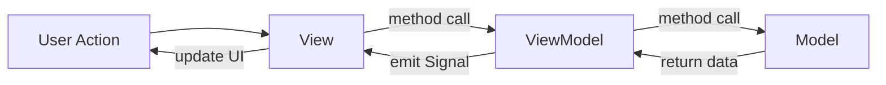

# Developer Guide

This guide covers the technical architecture, code organization, and development patterns of SPECTROview.

## Architecture: MVVM Pattern

SPECTROview uses a strict **Model-View-ViewModel** architecture:



### File Naming Convention

| Layer | Prefix | Example |
|-------|--------|---------|
| View | `v_` | `v_workspace_spectra.py` |
| ViewModel | `vm_` | `vm_workspace_spectra.py` |
| Model | `m_` | `m_spectrum.py` |

### Layer Rules

| Layer | Can Import | Cannot Import |
|-------|-----------|--------------|
| **View** | ViewModel, Components | — |
| **ViewModel** | Model, fit_engine | View |
| **Model** | Standard libs only | View, ViewModel |

### Communication

Views and ViewModels communicate **only via signals/slots**. Never call View methods from ViewModel.

```python
# ViewModel defines signals
class VMWorkspaceSpectra(QObject):
    spectra_list_changed = Signal(list)
    fit_progress_updated = Signal(int, int, int, float)

# View connects
class VWorkspaceSpectra(QWidget):
    def __init__(self):
        self.vm.spectra_list_changed.connect(self._update_list)
```

## Project Structure

```
spectroview/
├── __init__.py          # Constants, peak models, resource paths
├── main.py              # Entry point, Main window, cross-workspace wiring
├── model/               # Data models (no Qt deps)
│   ├── m_spectrum.py    # Single spectrum (extends fitspy.Spectrum)
│   ├── m_spectra.py     # Spectrum collection
│   ├── m_graph.py       # Plot configuration
│   ├── m_settings.py    # App settings
│   ├── m_io.py          # File loading (TXT, CSV, WDF, SPC, TRPL)
│   ├── m_mva.py         # PCA + NMF engine
│   ├── m_fit_models.py  # Custom peak shapes (Fano, Decay)
│   ├── m_quick_calc.py  # Calculators (Spot Size, Depth, Units)
│   └── ...
├── viewmodel/           # Business logic
│   ├── vm_workspace_spectra.py
│   ├── vm_workspace_maps.py   # Extends Spectra VM
│   ├── vm_workspace_graphs.py
│   ├── vm_mva.py
│   ├── vm_settings.py
│   └── utils.py         # FitThread, helpers
├── view/                # Qt widgets
│   ├── v_workspace_spectra.py
│   ├── v_workspace_maps.py
│   ├── v_workspace_graphs.py
│   └── components/      # Shared widgets
│       ├── v_spectra_viewer.py
│       ├── v_fit_model_builder.py
│       ├── v_peak_table.py
│       ├── v_map_viewer.py
│       ├── v_graph.py
│       ├── v_mva.py
│       ├── customize_graph_dialog.py
│       └── ...
├── fit_engine/          # Tensor Fit Engine
│   ├── tensor_engine.py
│   ├── evaluator.py
│   ├── optimizer.py
│   ├── models.py
│   ├── scalar_models.py
│   └── tensor_fit_thread.py
└── resources/           # Icons, styles, manual
```

## Deep-Dive Documentation

- **[Tensor Fit Engine](tensor-engine.md)** — Batched LM optimizer, analytical Jacobians, adding models
- **[MVA](mva.md)** — PCA/NMF implementation details

## Key Patterns

### Threading

Long operations run on QThread to prevent UI freezing:

| Thread | File | Purpose |
|--------|------|---------|
| `TensorFitThread` | `fit_engine/tensor_fit_thread.py` | Batched fitting |
| `FitThread` | `viewmodel/utils.py` | Legacy per-spectrum fitting |
| `ApplyFitModelThread` | `viewmodel/utils.py` | Apply model in background |

### Cross-Workspace Communication

Uses dependency injection in `main.py`:

```python
def setup_connections(self):
    self.v_maps.vm.set_graphs_workspace(self.v_graphs)
    self.v_maps.vm.switch_to_graphs_tab.connect(
        lambda: self.tabWidget.setCurrentWidget(self.v_graphs)
    )
```

### Singleton Dialog

The `CustomizeGraphDialog` follows a workspace-level singleton pattern that auto-switches to the active MDI subwindow.

## Running & Testing

```bash
# Run
python -m spectroview.main

# Test
pytest

# Build
pip install -e .
```

## Dependencies

| Package | Constraint | Purpose |
|---------|-----------|---------|
| `fitspy` | `< 2026.4` | Core spectrum classes |
| `PySide6` | — | Qt bindings (**not** PyQt) |
| `matplotlib` | `< 3.10.9` | Plotting |
| `numpy` | `< 2.0.0` | Numerical ops |
| `lmfit` | — | Legacy fitting |
| `scipy` | — | Scientific computing |
| `pandas` | — | DataFrames |
