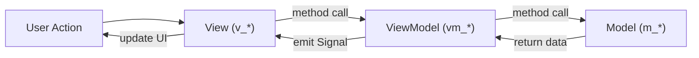
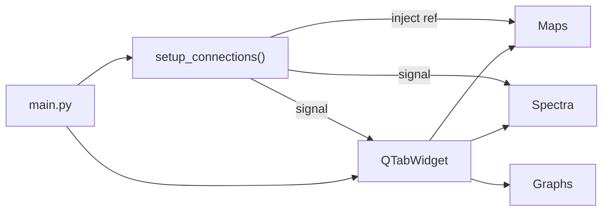
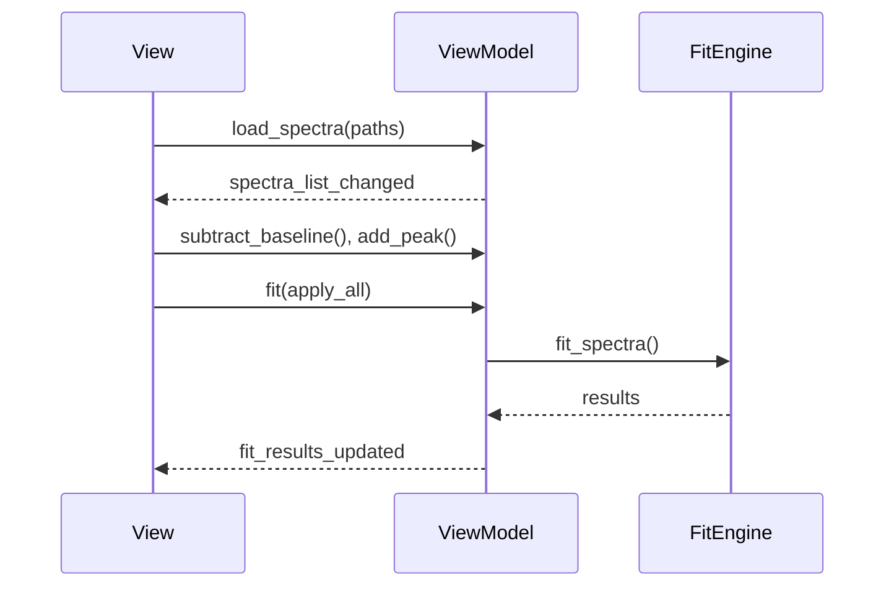
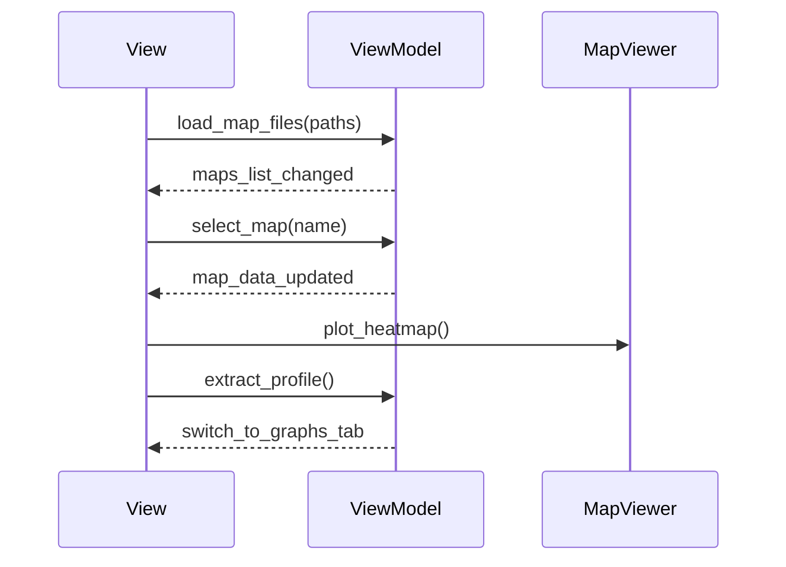
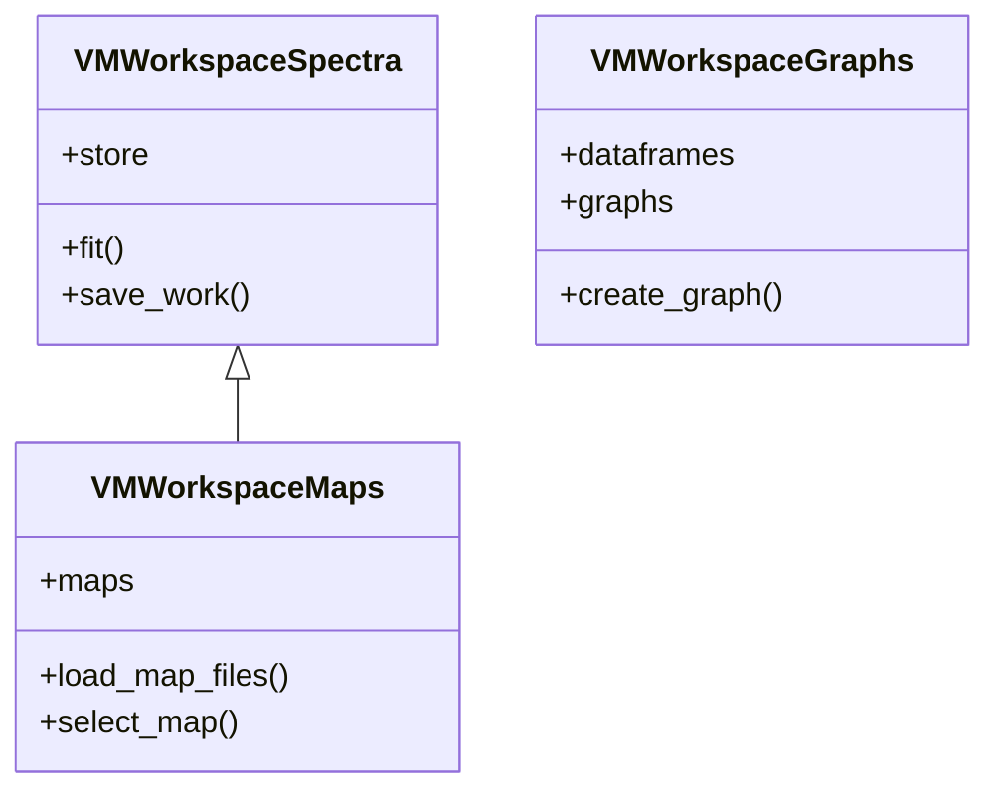

# **Application Architecture**

This guide covers the technical architecture, code organization, and development patterns of `SPECTROview`. It is intended for developers who want to understand, maintain, or extend the application.

---

## **MVVM Pattern**

`SPECTROview` enforces a strict **Model-View-ViewModel** architecture.
Every workspace follows the same three-layer separation of concerns:

- **Model** — Pure data containers and domain logic. Models hold no references to Qt widgets and can be tested independently.
- **ViewModel** — Business-logic orchestrator. The ViewModel reads and mutates Models, then notifies the View through Qt signals. It **never** imports or references View classes.
- **View** — Qt widget layer. Views connect to ViewModel signals and call ViewModel methods in response to user actions.



### **File Naming Convention**

| Layer | Prefix | Example |
|-------|--------|---------|
| View | `v_` | `v_workspace_spectra.py` |
| ViewModel | `vm_` | `vm_workspace_spectra.py` |
| Model | `m_` | `spectra_store.py` |

### **Import Rules**

| Layer | Can Import | Cannot Import |
|-------|-----------|--------------| 
| **View** | ViewModel, Components | — |
| **ViewModel** | Model, `fit_engine` | View |
| **Model** | Standard libs only | View, ViewModel |

### **Signal/Slot Communication**

Views and ViewModels communicate **exclusively via Qt signals and slots**. A ViewModel must never call View methods directly, and a View must never modify Model state without going through its ViewModel.

```python
# ── ViewModel defines signals ──
class VMWorkspaceSpectra(QObject):
    spectra_list_changed = Signal(list)       # ViewModel → View
    fit_progress_updated = Signal(int, int, int, float)

# ── View connects in __init__ ──
class VWorkspaceSpectra(QWidget):
    def __init__(self):
        self.vm.spectra_list_changed.connect(self._update_list)
```

---

## **Project Structure**

```
spectroview/
├── __init__.py             # Constants, peak models, resource paths
├── main.py                 # Entry point, QMainWindow, cross-workspace wiring
│
├── model/                  # Data models (no Qt deps)
│   ├── spectra_store.py    # Tensor-centric SpectraStore & MapData structures
│   ├── workspace_io.py     # Unified serialization for Workspaces
│   ├── peak_model.py       # Helper functions for peak parameters
│   ├── m_graph.py          # Plot configuration model
│   ├── m_settings.py       # Persistent app settings (QSettings wrapper)
│   ├── m_io.py             # File loaders (TXT, CSV, WDF, SPC, TRPL, DAT)
│   ├── m_mva.py            # PCA + NMF engine
│   ├── m_fit_model_manager.py # Saved fit model file management
│   ├── m_file_converter.py # Batch file format converter
│   ├── m_quick_calc.py     # Scientific calculators (Spot Size, Depth, Unit conversion)
│   └── m_spc.py            # Galactic SPC binary reader
│
├── viewmodel/              # Business logic and data orchestration
│   ├── vm_workspace_spectra.py   # Spectra workspace logic (base class)
│   ├── vm_workspace_maps.py      # Maps workspace (extends Spectra VM)
│   ├── vm_workspace_graphs.py    # Graphs workspace logic
│   ├── vm_fit_model_builder.py   # Fit model file management orchestration
│   ├── vm_mva.py                 # MVA orchestration
│   ├── vm_settings.py            # Settings persistence
│   └── utils.py                  # Helpers, toast notifications
│
├── view/                   # Qt widgets and UI layout
│   ├── v_workspace_spectra.py    # Spectra workspace View
│   ├── v_workspace_maps.py       # Maps workspace View (extends Spectra)
│   ├── v_workspace_graphs.py     # Graphs workspace View
│   └── components/               # Shared / reusable widgets
│       ├── v_spectra_viewer.py        # Matplotlib spectra canvas
│       ├── v_fit_model_builder.py     # Baseline + Peak + Fit controls
│       ├── v_peak_table.py            # Interactive peak parameter table
│       ├── v_map_viewer.py            # Heatmap / wafer canvas
│       ├── v_map_viewer_dialog.py     # Detachable map viewer window
│       ├── v_map_list.py              # Loaded maps list panel
│       ├── v_graph.py                 # Single graph widget (seaborn/mpl)
│       ├── v_mva.py                   # PCA/NMF controls and plots
│       ├── v_fit_results.py           # Fit results DataFrame table
│       ├── v_data_filter.py           # Dynamic query filter panel
│       ├── v_dataframe_table.py       # Generic DataFrame viewer
│       ├── v_spectra_list.py          # Spectrum list with checkboxes
│       ├── v_moretab.py               # Metadata / tab panel
│       ├── v_settings.py              # Fit/view settings dialog
│       ├── v_menubar.py               # Main menu bar
│       ├── v_about.py                 # About dialog
│       ├── v_user_manual.py           # Built-in user manual viewer
│       ├── customize_graph_dialog.py  # Graph customization dialog
│       └── customized_widgets.py      # Palette combobox, custom toolbar
│
├── fit_engine/             # High-performance batch fitting
│   ├── vbf_engine.py            # Orchestrator (VBFengine)
│   ├── evaluator.py             # Parameter mapping (VBFevaluator)
│   ├── optimizer.py             # Batched Levenberg-Marquardt
│   ├── models.py                # Batched peak functions + Jacobians
│   ├── scalar_models.py         # Fallback scalar functions + FitResult
│   ├── vbf_thread.py            # QThread wrapper
│   ├── baseline.py              # Baseline algorithms (arPLS, airPLS, etc)
│   └── noise.py                 # Noise estimation functions
│
└── resources/              # Icons, stylesheets, user manual assets
    ├── icons/
    ├── styles/
    └── user_manual/
```

---

## **Application Entry Point**

`spectroview/main.py` creates the `QMainWindow` and instantiates all workspaces as tabs in a `QTabWidget`:



The `setup_connections()` method in `main.py` wires cross-workspace dependencies:

- **Maps → Graphs**: `VMWorkspaceMaps.set_graphs_workspace(v_graphs)` injects a reference so `Maps` can send profiles and DataFrames directly to the `Graphs` workspace.
- **Maps → Spectra**: The `send_spectra_to_workspace` signal passes deep copies of selected map spectra to the `Spectra` tab.
- **Fit Results → Graphs**: Both `Spectra` and `Maps` emit `fit_results_updated` with a `pd.DataFrame` that can be forwarded to the `Graphs` workspace for statistical plotting.

---

## **Data Lifecycle**

### **Spectra: Loading → Processing → Fitting → Results**



### **Maps: Loading → Extraction → Heatmap → Profile**



---

## **Workspace Inheritance**

`VMWorkspaceMaps` **extends** `VMWorkspaceSpectra`. This means every fitting, baseline, peak, and serialization feature available in the `Spectra` workspace is automatically available in the `Maps` workspace, with additional map-specific overrides:



---

## **Reusable Component System**

Workspaces are composed from **shared components** that follow the same signal-based pattern:

| Component | File | Purpose |
|-----------|------|---------|
| `VSpectraViewer` | `v_spectra_viewer.py` | Matplotlib canvas for spectrum display, zoom/pan, peak/baseline interaction |
| `VFitModelBuilder` | `v_fit_model_builder.py` | X-correction, spectral range, baseline, peaks, fit controls |
| `VPeakTable` | `v_peak_table.py` | Editable table of peak parameters (center, FWHM, amplitude, bounds) |
| `VMapViewer` | `v_map_viewer.py` | Heatmap/wafer canvas with Z/X range sliders, mask, profile extraction |
| `VMapViewerDialog` | `v_map_viewer_dialog.py` | Detachable always-on-top window wrapping `VMapViewer` |
| `VGraph` | `v_graph.py` | Seaborn/Matplotlib graph widget supporting 10+ plot styles |
| `VDataFilter` | `v_data_filter.py` | Dynamic `pandas` `.query()` filter builder |
| `VFitResults` | `v_fit_results.py` | Color-coded fit results table |
| `VMVA` | `v_mva.py` | PCA/NMF controls and embedded plotting |
| `CustomizeGraphDialog` | `customize_graph_dialog.py` | Singleton dialog for graph annotation, legends, and axis customization |

---

## **Persistence & Serialization**

`SPECTROview` delegates all loading and saving operations to the unified `WorkspaceIO` class (`workspace_io.py`), which isolates IO logic from the ViewModels. Each workspace uses its own save/load format via `WorkspaceIO`:

| Workspace | File Extension | Key Strategy |
|-----------|---------------|-------------|
| `Spectra` | `.spectra` | ZIP archive with metadata JSON, NPZ arrays per spectrum (v5+). Handled by `WorkspaceIO.save_spectra_workspace()`. |
| `Maps` | `.maps` | ZIP archive with metadata JSON, NPZ arrays, and pickled DataFrames (v5+). Handled by `WorkspaceIO.save_maps_workspace()`. |
| `Graphs` | `.graphs` | JSON with `gzip+hex` compressed DataFrames and `MGraph.save()` serialized plots. |

### **Spectrum Serialization Flow**

```python
# Save (v4+): SpectraStore → ZIP archive (metadata.json + arrays.npz)
metadata = {
    "format_version": 5,
    "spectrums_meta": {
        "0": {
            "fname": "sample_001",
            "is_active": [True],
            "baseline_config": {...},
            "peak_params": [...],
            ...
        }
    }
}
arrays = {
    "x0_0": x0_array, # float64 axis
    "y0_0": y0_array  # float32 raw intensities
}
```

---

## **Threading Model**

Long-running operations run on `QThread` subclasses to prevent UI freezing.
All threads emit progress signals that the ViewModel relays to the View's progress bar:

| Thread Class | Location | Purpose |
|-------------|----------|---------|
| `VBFthread` | `fit_engine/vbf_thread.py` | Batched fitting (primary engine) |

**Thread lifecycle**:

1. ViewModel instantiates the thread and connects `finished` / `progress` signals.
2. Thread `.start()` — runs `run()` on a separate OS thread.
3. On completion, the `finished` signal triggers `_on_fit_finished()` in the ViewModel.
4. ViewModel emits result signals → View updates UI.

---

## **Cross-Workspace Communication**

`SPECTROview` avoids a global event bus. Instead, `main.py` uses **dependency injection** and **direct signal connections**:

```python
# main.py → setup_connections()
# 1. Inject reference: Maps VM can call Graphs workspace methods
self.v_maps_workspace.vm.set_graphs_workspace(self.v_graphs_workspace)

# 2. Signal: Maps requests tab switch after sending profile
self.v_maps_workspace.vm.switch_to_graphs_tab.connect(
    lambda: self.tabWidget.setCurrentWidget(self.v_graphs_workspace)
)

# VWorkspaceMaps.__init__ connects the spectra transfer internally:
# self.vm.send_spectra_to_workspace.connect(self._receive_spectra_from_maps)
```

---

## **Global Constants (`__init__.py`)**

`spectroview/__init__.py` defines application-wide constants:

| Constant | Purpose |
|----------|---------|
| `PEAK_MODELS` | Registered peak shapes (`Gaussian`, `Lorentzian`, `PseudoVoigt`, `Fano`, ...) |
| `FIT_PARAMS` | Default fitting parameters (`max_ite`, `xtol`, `ftol`, bounds) |
| `PLOT_STYLES` | Available graph types (`point`, `scatter`, `box`, `bar`, `line`, `wafer`, ...) |
| `X_AXIS_UNIT`, `Y_AXIS_UNIT` | Axis label registries |
| `AXIS_LABELS` | Autocomplete suggestions for graph labels |
| `ICON_DIR` | Resolved path to `resources/icons/` |
| `PLOT_POLICY_LIGHT`, `PLOT_POLICY_DARK` | Matplotlib stylesheet paths |

---

## **Deep-Dive Documentation**

| Topic | Page | Summary |
|-------|------|---------|
| **Data Architecture: SpectraStore** | [spectra_store.md](spectra_store.md) | `MapData`, `MapInfo`, `SpectrumProxy`, data hierarchy, preprocessing pipeline, persistence |
| **Spectra Workspace** | [spectra.md](spectra.md) | `VMWorkspaceSpectra`, spectrum lifecycle, baseline/peak pipeline, fit model management |
| **Maps Workspace** | [maps.md](maps.md) | `VMWorkspaceMaps`, hyperspectral data loading, heatmap rendering, coordinate handling |
| **Graphs Workspace** | [graphs.md](graphs.md) | `VMWorkspaceGraphs`, DataFrame management, plot creation, `VGraph` rendering |
| **Vectorized Batch Fit Engine (`VBF Engine`)** | [vbf_engine.md](vbf_engine.md) | Batched LM optimizer, analytical Jacobians, adding new peak models |
| **Multivariate Analysis** | [mva.md](mva.md) | PCA/NMF implementation, data pipeline, export to `Graphs` |

---

## **Running & Testing**

```bash
# Run from source
python -m spectroview.main

# Install in editable mode
pip install -e .

# Run tests
pytest

# Build documentation
mkdocs serve
```

---

## **Dependencies**

| Package | Constraint | Purpose |
|---------|-----------|---------| 
| `PySide6` | — | Qt 6 bindings (**not** PyQt) |
| `matplotlib` | `< 3.10.9` | Plotting backend for spectra and maps |
| `numpy` | `< 2.0.0` | Numerical array operations |
| `scipy` | — | Interpolation, KDTree, SVD |
| `pandas` | — | DataFrame management |
| `seaborn` | — | Statistical plotting in `Graphs` workspace |
| `renishawWiRE` | — | Renishaw `.wdf` file reader |
| `superqt` | — | Enhanced Qt widgets (range sliders) |
