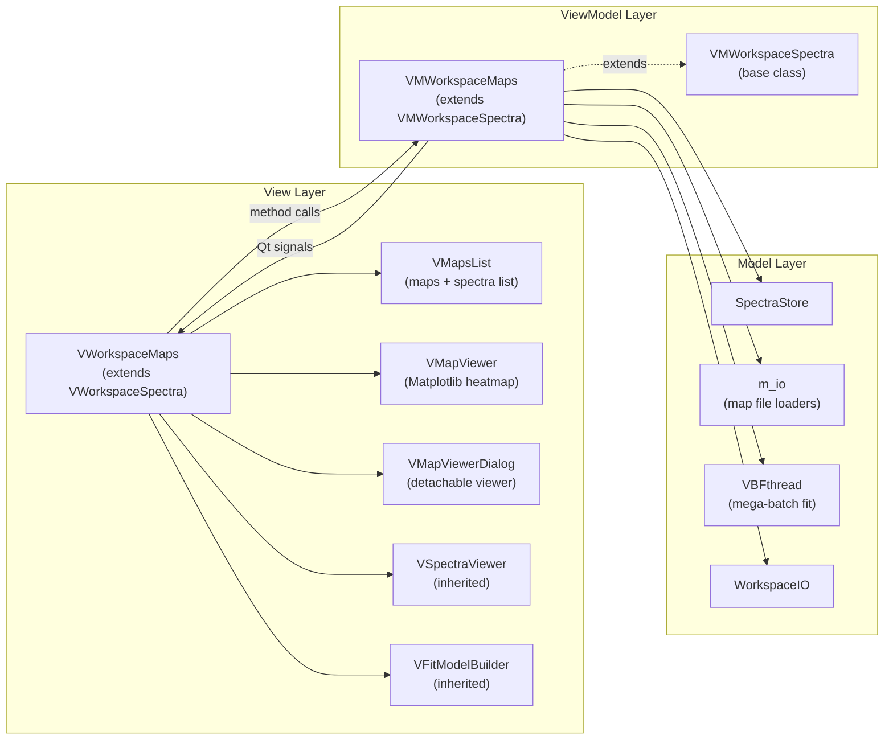

# **Workspace: Maps**

The `Maps` workspace handles **hyperspectral map data** — spatially resolved spectral datasets where each pixel corresponds to a full spectrum. It extends the [Spectra workspace](spectra.md) via inheritance, gaining all fitting, baseline, peak-editing, and persistence capabilities for free, and adds spatial awareness, heatmap visualization, and coordinate-based operations on top.

> [!NOTE]
> **Prerequisites** — Before reading this guide, ensure you are familiar with:
>
> - [Data Architecture: SpectraStore](spectra_store.md) — the shared `MapData` / `SpectraStore` data model.
> - [Workspace: Spectra](spectra.md) — the base ViewModel, View components, and data flow patterns.
>
> This page covers **only the Maps-specific extensions**. Inherited behavior is not repeated here.

---

## How Maps Differs from Spectra

The fundamental difference is the cardinality of `MapData.N`:

| Workspace | `MapData.N` | Meaning |
|-----------|------------|---------|
| **Spectra** | 1 | One spectrum per MapData block |
| **Maps** | 2 – 100 000 | N spectra sharing a single wavenumber axis |

Because the underlying [tensor model](spectra_store.md#mapdata-the-tensor-block) is identical, a single vectorized fit that works for 1 spectrum also works for 100 000, with no code change in the engine.

### MapData in Maps Context

```
MapData ("wafer_300mm") — 50×50 wafer (2500 spectra, 1000 wavenumbers)
├── x0:          float64[1000]          1 shared wavenumber axis
├── Y0:          float32[2500, 1000]    raw intensities — 10 MB
├── x:           float64[800]           after spectral crop
├── Y:           float32[2500, 800]     after crop + baseline sub — 8 MB
├── coords:      float64[2500, 2]       (X, Y) stage positions in µm
├── fnames:      list[str] × 2500       "wafer_300mm_(x_pos, y_pos)"
├── is_active:   bool[2500]             checkbox state
├── peak_params: float64[2500, K]       after VBF fit — all 2500 at once
├── fit_success: bool[2500]
├── fit_r2:      float64[2500]
├── Y_bestfit:   float32[2500, 800]     8 MB
└── Y_peaks:     [float32[2500, 800], ...]   8 MB per peak
```

---

## Architecture Overview



### Why Inheritance Instead of Composition?

`VMWorkspaceMaps` **extends** `VMWorkspaceSpectra` rather than wrapping it:

- Every fitting algorithm (baseline, peaks, VBF engine) works identically on both single spectra (N=1) and maps (N>1).
- Duplicating or delegating the fitting code would introduce maintenance fragility.
- Overriding via the **Template Method pattern** (three hook methods) is sufficient to customize bulk-operation targeting without forking any algorithm logic.

The same pattern applies at the View level: `VWorkspaceMaps` extends `VWorkspaceSpectra`, overrides `setup_connections()` to prevent double-wiring during `__init__`, then replaces the right sidebar widget with the map-specific `VMapsList + VMapViewer` panel.

---

## Maps-Specific Components

### `VMWorkspaceMaps` — The ViewModel

**File**: [`vm_workspace_maps.py`](file:///Users/HoanLe/Documents/SPECTROview/spectroview/viewmodel/vm_workspace_maps.py)

Additional state beyond the inherited [VMWorkspaceSpectra](spectra.md#vmworkspacespectra-the-viewmodel):

| Attribute | Type | Purpose |
|-----------|------|---------|
| `maps` | `dict[str, pd.DataFrame]` | Raw map DataFrames indexed by name (legacy cache) |
| `current_map_name` | `str \| None` | Active map selection |
| `maps_metadata` | `dict[str, dict]` | Acquisition metadata per map (WDF, SPC) |
| `map_type` | `str` | `'2Dmap'` or `'Wafer_300mm'` / `'Wafer_200mm'` / `'Wafer_100mm'` |
| `graphs_workspace` | ref | Injected reference for profile extraction |

#### Additional Signals

```python
maps_list_changed       = Signal(list)    # map name list updated → VMapsList
map_data_updated        = Signal(object)  # current map DF changed → trigger heatmap redraw
send_spectra_to_workspace = Signal(list)  # deep copies → Spectra workspace
clear_map_cache_requested = Signal(str)   # map name → VMapViewer cache invalidation
switch_to_graphs_tab    = Signal()        # request tab switch after profile extraction
```

#### Additional Method Reference

| Category | Methods |
|----------|---------|
| **Map loading** | `load_map_files(paths)` |
| **Map selection** | `select_map(name)`, `_show_map_spectra(name)` |
| **Map deletion** | `delete_current_map()`, `remove_map(name)` |
| **Map data** | `get_current_map_dataframe()`, `get_fit_results_dataframe()` |
| **Export** | `save_current_map_to_csv(file_path)` |
| **Fit** | `fit()`, `_run_fit_thread()`, `collect_fit_results()` — all override parent |
| **Cross-workspace** | `send_selected_spectra_to_spectra_workspace()`, `extract_and_send_profile_to_graphs()` |
| **Persistence** | `save_work()`, `load_work()`, `_load_legacy_maps()` |

### `VWorkspaceMaps` — The View

**File**: [`v_workspace_maps.py`](file:///Users/HoanLe/Documents/SPECTROview/spectroview/view/v_workspace_maps.py)

Overrides `_add_maps_panel()` to replace the inherited spectra sidebar with:

- `VMapViewer` — the heatmap canvas with Z-parameter and X-range sliders.
- `VMapsList` — dual-panel list (maps on top, spectra in map below) with action buttons.

The left side (SpectraViewer + FitModelBuilder tabs) is inherited unchanged.

**Centralized map type management:** The `selected_map_type` attribute is the single source of truth for all viewers (main + dialogs). When the user changes the combobox in any viewer, `_on_map_type_changed()` updates all viewers synchronously, preventing drift.

### `VMapViewer` — The Heatmap Canvas

**File**: [`v_map_viewer.py`](file:///Users/HoanLe/Documents/SPECTROview/spectroview/view/components/v_map_viewer.py)

The most complex View component (~1 300 lines). It renders both 2D rectangular maps and circular wafer maps. Features:

- Z-parameter combobox (Intensity / Area / any fit result column)
- X-range double slider (filters which wavenumbers contribute to Z)
- Outlier removal toggle
- Interactive selection (click, rectangle drag, profile line)
- Multi-viewer dialog spawning

### `VMapsList` — The Dual-Panel List

**File**: [`v_map_list.py`](file:///Users/HoanLe/Documents/SPECTROview/spectroview/view/components/v_map_list.py)

Contains two `QListWidget`s and action buttons. The top list shows loaded map names; the bottom list shows spectra within the selected map, with checkboxes controlling `md.is_active`. Also provides a "Check All" checkbox that updates `is_active` for all N spectra in a single bulk operation.

### `VMapViewerDialog` — Detachable Window

**File**: [`v_map_viewer_dialog.py`](file:///Users/HoanLe/Documents/SPECTROview/spectroview/view/components/v_map_viewer_dialog.py)

A `QDialog` wrapper around a second `VMapViewer` instance. Uses `Qt.WindowStaysOnTopHint` so the user can select pixels in the floating window while the main window shows the spectrum. Multiple dialogs can be open simultaneously, each showing a different Z-parameter on the same spatial data. Data is shared by reference — no duplication.

---

## The Dual-Storage Pattern

The Maps workspace maintains **two stores** for the same data:

1. **`self.maps[map_name]`** — a `pd.DataFrame` with columns `X, Y, w1, w2, ...` (one row per spectrum). This is the legacy store populated at load time from the file parser.
2. **`self.store.get_map_data(map_name)`** — the `MapData` tensor block with all processing state.

The DataFrame is used for **heatmap input** (pivot table → imshow) and **CSV export**. The tensor block is used for **all analysis operations** (baseline, fitting, results collection). When saving processed data to CSV, `save_current_map_to_csv()` reads from `md.x` / `md.Y` (processed) rather than the raw DataFrame.

> [!IMPORTANT]
> When a new developer is confused about "where is the data?", the answer is: **both places, for different purposes**. The DataFrame is the entry point from the file loader and the input to the heatmap pipeline. The tensor block is the source of truth for all analysis. Modifications (baseline, crop) only affect the tensor block — they do not update the DataFrame.

### Filename Convention

Each spectrum row in a `MapData` block gets a unique `fname` constructed from its coordinates:

```python
fname = f"{map_name}_({float(x_pos)}, {float(y_pos)})"
# Example: "wafer_300mm_(12.5, -7.0)"
```

This convention is used throughout the codebase to:

- Filter spectra belonging to a specific map: `fname.startswith(f"{map_name}_(")`
- Extract coordinates from fnames: parse between `(` and `)`.
- Match `SpectraStore` entries back to `DataFrame` rows for heatmap rendering.

Coordinate parsing is centralized in `parse_coords_from_fname()` (`viewmodel/utils.py`); `VWorkspaceMaps._extract_coords_from_fname()` and `VMWorkspaceMaps._extract_coords_for_spectra()` both delegate to it. If you change the fname convention, update that single helper (and keep the `float()` formatting identical on the write side in `_extract_spectra_from_map()`).

---

## Data Flow

### Loading a Hyperspectral Map

1. **User Action**: The user initiates a load map action in `VWorkspaceMaps`.
2. **View → ViewModel**: The View calls `vm.load_map_files(paths)`.
3. **File Parsing**: For each file, the ViewModel delegates to the `m_io` module (`load_wdf_map`, `load_spc_map`, etc.). The IO module returns a DataFrame containing `X`, `Y`, and all wavenumber columns, plus metadata.
4. **Data Storage (Legacy)**: The ViewModel caches the returned DataFrame in `self.maps[name]`.
5. **Data Extraction**: The ViewModel calls `_extract_spectra_from_map(name, map_df)` to extract the `x0`, `Y0`, and spatial `coords` arrays from the DataFrame. It also builds the `fnames` list here.
6. **Data Storage (Tensor)**: The ViewModel registers the data in the `SpectraStore` via `add_map(name, x0, Y0, coords, fnames, is_active)`.
7. **UI Update**: Once all files are processed, the ViewModel emits the `maps_list_changed` signal with the list of loaded map names.

`_extract_spectra_from_map()` performs one critical operation: it drops the **last wavenumber column** before building `x0`. This follows a legacy convention from early SPC/WDF parsers that include an artifact value at the upper bound.

### Map Selection

When the user clicks a map name in `VMapsList`:

1. **User Action**: The user clicks a map name in the `VMapsList` UI widget.
2. **View → ViewModel**: The View captures this and calls `vm.select_map(map_name)`.
3. **State Update**: The ViewModel sets `current_map_name = map_name`.
4. **Spectra List Refresh**: The ViewModel reads the `fnames`, `is_active` flags, and fit status from the MapData, then emits `spectra_list_changed(spectra_info)` to update the bottom list pane.
5. **Map Viewer Refresh**: The ViewModel emits `map_data_updated(current_map_df)`.
6. **Canvas Redraw**: `VWorkspaceMaps` forwards the updated data to the `VMapViewer`, which calls `plot_heatmap()` to render the spatial data.

### Fitting Workflow (Maps Override)

The Maps workspace overrides [`fit()`](spectra.md#fitting-workflow) to construct **multi-task batches** that can span the entire map:

1. **User Action**: The user clicks "Fit" (or Ctrl+Fit to apply to all maps).
2. **Task Construction**: 
    - If `apply_all = True`: The ViewModel groups maps by x-axis length and stacks them into mega-batch `Y` matrices.
    - If `apply_all = False`: The ViewModel builds a task for just the current map and selected indices.
3. **Thread Launch**: The ViewModel starts a `VBFthread` with the task list.
4. **Engine Execution (Background)**: For each task, the thread calls `VBFengine.fit_spectra()`. Stacked multi-map tasks are fit as a single vectorized operation.
5. **Result Storage (Background)**: The thread scatters results back to their respective maps via `SpectraStore.set_fit_results()`.
6. **Completion**: The thread emits `finished()`, and the ViewModel calls `_on_fit_finished()`.
7. **Result Collection**: `collect_fit_results()` aggregates the results into a single DataFrame.
8. **UI Refresh**: Signals are emitted to redraw both the heatmap (`map_data_updated`) and the results table (`fit_results_updated`).

**Mega-batch grouping** is the key performance optimization. When `apply_all=True`, maps with the same x-axis length are stacked into a single `Y` matrix and fit in one vectorized call. A 10-map wafer measurement that individually takes 30 s each can complete in ~35 s total when batched.

### After Fitting: Propagating Results

After `_on_fit_finished()`:

1. `collect_fit_results()` is called → builds `self.df_fit_results` (DataFrame with `X, Y` columns + all fit columns).
2. `fit_results_updated` emitted → `VFitResults` table updates.
3. `map_data_updated` emitted → `VMapViewer` re-reads `df_fit_results` and adds fit columns to its Z-parameter combobox.
4. `clear_map_cache_requested` emitted → `VMapViewer` invalidates its `griddata` cache for the affected map name.

---

## Map Visualization Pipeline

1. **Data Source**: Depending on preprocessing state, the source is either the processed intensities (`md.Y`) or raw intensities (`md.Y0`).
2. **DataFrame Filtering**: `get_current_map_dataframe()` filters out inactive spectra.
3. **Viewer Binding**: The DataFrame is passed to `VMapViewer.set_map_data()`.
4. **Z-Value Computation**: `_compute_z_values()` calculates the target metric based on the combobox selection:
    - *Intensity*: sums over the selected X-range slider.
    - *Area*: calculates a trapezoidal integral.
    - *Fit parameter*: retrieves values directly from `df_fit_results`.
5. **Outlier Removal**: Z-values are clipped using percentiles if the user toggles the feature.
6. **Rendering Logic**: Depending on `map_type`:
    - *2D map*: Fast path. A pivot table maps `(X, Y)` to `Z` on an exact grid, rendered via Matplotlib `imshow()`.
    - *Wafer map*: Slow path. `scipy.griddata` interpolates irregular circular sites onto an 80×80 grid before rendering via `imshow()`.

**Why two rendering paths?**

A 2D rectangular map has data on a regular grid — a pivot table suffices and renders in milliseconds. A wafer measurement has sites distributed across a circular region (not a grid), so `scipy.griddata` must interpolate onto a regular grid before `imshow` can render it. This is the expensive step.

### Heatmap Caching Strategy

`scipy.griddata` can take 100–500 ms for large maps. The viewer uses a **multi-key cache** to avoid recomputation:

```python
cache_key = (
    map_name,        # which map
    parameter,       # which Z parameter
    (xmin, xmax),    # X-range filter
    map_type,        # 2Dmap vs Wafer variant
    mask_config,     # mask settings or None
    remove_outliers  # outlier removal flag
)
```

The cache is:
- **Preserved across map switches** — switching back to a previously viewed map is instant.
- **Invalidated by name** after fitting completes, via the `clear_map_cache_requested` signal.
- **Not persisted** across application sessions — it lives only in `VMapViewer._griddata_cache`.

### Interactive Selection

The `VMapViewer` supports three selection modes:

| Mode | Trigger | Behavior |
|------|---------|----------|
| **Single click** | Left-click on map | Selects nearest site, highlights with red rectangle |
| **Rectangle drag** | Click-and-drag | Selects all sites within dragged rectangle |
| **Profile** | Exactly 2 selected sites, 2D mode | Enables "Extract profile" button |

Selection in `VMapViewer` emits `spectra_selected(list[tuple])`. `VWorkspaceMaps._on_map_viewer_selection()` maps the `(x, y)` coordinates back to `fnames` and calls `vm.set_selected_fnames()`, which triggers `_emit_selected_spectra()` → `VSpectraViewer` redraws the selected spectrum.

Selected points are rendered as `PatchCollection` (one draw call for all rectangles) rather than individual `add_patch()` calls, giving O(1) rendering time regardless of selection size.

---

## Template Method Overrides

The Maps workspace customizes the inherited bulk-operation pipeline via three [hook methods](spectra.md#template-method-hooks). Understanding these is essential when debugging or extending bulk operations.

### `_get_target_mds(apply_all)`

Determines **which `MapData` objects** a bulk operation targets.

| `apply_all` | Spectra workspace | Maps workspace |
|-------------|-------------------|----------------|
| `False` | `MapData` blocks of selected spectra | Current map's `MapData` block only |
| `True` | All `MapData` blocks in store | All maps' `MapData` blocks |

This is why Ctrl+Subtract-Baseline in the Maps workspace subtracts from **all spectra in the current map** (not just selected ones) — the Maps override returns the entire map's `MapData`.

### `_on_map_data_changed(md, action)`

Called **after each individual `MapData` is modified** within a bulk loop.

```python
# Maps workspace override:
def _on_map_data_changed(self, md, action: str):
    if action == "reinit_spectra":
        self.store.clear_preprocess(md.name)
    elif action in ("delete_baseline", "subtract_baseline", "apply_spectral_range"):
        self.store.batch_preprocess(md.name, md.baseline_config, md.range_min, md.range_max)
    elif action == "paste_peaks":
        self._reconstruct_y_peaks(md)
    # Always invalidate heatmap cache
    self.clear_map_cache_requested.emit(md.name)
```

### `_post_bulk_action(apply_all, action)`

Called **once after all `MapData` objects have been processed**. The Maps override refreshes fit results and re-emits the map view.

### `_emit_selected_spectra()` Override

The Maps override builds a `"type": "tensor"` payload (shared x-axis batch) instead of the Spectra workspace's `"type": "tensor_list"` (independent arrays per spectrum):

```python
# Maps workspace:
batch_data = {
    'type': 'tensor',
    'x': x,             # shared float64[M_proc]
    'y': Y,             # float32[n_selected, M_proc]
    'indices': indices, # which rows within the map
    ...
}
```

This lets `VSpectraViewer` render multiple map spectra using matrix operations rather than a Python loop.

---

## Cross-Workspace Communication

### Maps → Spectra Workspace

```python
# User selects spectra in Maps workspace and clicks "Send to Spectra"
vm.send_selected_spectra_to_spectra_workspace()
```

For each selected spectrum:
1. Builds a **deep-copied** payload dict (raw `x0`, `Y0`, `baseline_config`, `fit_model`, `range_min/max`, `is_subtracted`).
2. Emits `send_spectra_to_workspace(payloads)`.
3. `main.py` connects that signal to the Spectra ViewModel's `receive_spectra()`, which registers each payload as a new N=1 `MapData` block in the **Spectra** workspace's `SpectraStore`.

Deep copying prevents cross-workspace state pollution — editing the spectrum in the Spectra tab does not affect the original map.

### Maps → Graphs Workspace (Profile Extraction)

When the user selects exactly 2 points in 2D map mode and clicks "Extract profile":

1. **User Action**: The user selects exactly 2 points on a 2D map and clicks "Extract profile".
2. **View → ViewModel**: `VMapViewer` signals `extract_profile_requested(profile_name)`.
3. **Extraction Logic**: `VWorkspaceMaps` delegates to `_extract_profile()`, which constructs a `profile_df` dataframe by interpolating points along the line segment.
4. **Forwarding Payload**: The View passes the payload to `VMWorkspaceMaps.extract_and_send_profile_to_graphs()`.
5. **Workspace Transfer**: The ViewModel directly invokes `VMWorkspaceGraphs.add_dataframe()`.
6. **UI Update**: A signal instructs the main window to switch focus to the Graphs tab.

The profile DataFrame has columns `distance` (µm) and `values` (Z intensity). The Graphs workspace auto-creates a line plot from it.

---

## Fit Results with Spatial Columns

`collect_fit_results()` overrides the parent to add spatial and zone columns:

```python
# After super().collect_fit_results():
# base DataFrame has: Filename, x0_Peak1, fwhm_Peak1, ...

# Maps workspace adds: X, Y (from fname parsing)
# For wafer maps, also: Zone, Quadrant

# Final columns:
# Filename | X | Y | x0_Peak1 | fwhm_Peak1 | area_Peak1 | ... | Zone | Quadrant
```

`Zone` classifies by radial distance:

| Zone | Distance |
|------|----------|
| Center | ≤ 35 % of radius |
| Mid-Radius | 35 – 80 % |
| Edge | ≥ 80 % |

`Quadrant` classifies by sign of (X, Y): Q1 (−,−), Q2 (−,+), Q3 (+,+), Q4 (+,−).

---

## Persistence

### Modern Format (v2+, ZIP-backed)

Maps workspace files (`.maps`) use the same ZIP structure described in [SpectraStore: Persistence](spectra_store.md#persistence), with heavier content due to larger tensors.

Map DataFrames are serialized with a custom binary format for speed:

```python
# Fast serialization (vs to_csv which is 20-70× slower)
arr = map_df.to_numpy()
buf = io.BytesIO(); np.save(buf, arr)
gzip.compress(buf.getvalue(), compresslevel=1)  # level=1: 70× faster, ~5% larger
```

### Legacy Loader

`_load_legacy_maps()` handles old `.maps` JSON files where each map was stored as a gzip+hex CSV string:

1. Parses the top-level `"maps"` dict (map_name → hex_string).
2. Decompresses and reads each CSV into a DataFrame.
3. Builds a coordinate lookup dict from the `"spectrums_data"` entries (keyed by `(map_name, x, y)`).
4. Registers each map into `SpectraStore` via `add_map()`.
5. Vectorized-restores baselines, peak curves, and fit results.

---

## Extension Guide

### Adding a New Map File Format

1. Create a loader function in `spectroview/model/m_io.py` (e.g., `load_xyz_map(path) → pd.DataFrame`).
2. In `VMWorkspaceMaps.load_map_files()`, add an `elif path.suffix.lower() == '.xyz':` branch.
3. The returned DataFrame must have `X` and `Y` columns followed by numeric wavenumber columns.
4. If the format provides metadata, return a `(DataFrame, dict)` tuple and store the dict in `self.maps_metadata[map_name]`.

### Adding a New Z-Parameter Type

New Z-parameter types are computed in `VMapViewer._compute_z_values()`. To add, e.g., a peak ratio:

1. Add the parameter name to the `VMapViewer` combobox population logic.
2. In `_compute_z_values()`, add an `elif parameter == "My Ratio":` branch that reads from `df_fit_results`.
3. The cache key already includes `parameter`, so caching works automatically.

### Adding a New Map Type (beyond Wafer)

New spatial layouts require:

1. Add the type string to the `cbb_map_type` combobox.
2. In `VMapViewer.plot_heatmap()`, add a rendering branch (likely `scipy.griddata` with a custom mask).
3. In `VMWorkspaceMaps.collect_fit_results()`, add a zone/quadrant classification branch for the new type.

---

## Troubleshooting

**Heatmap does not update after fitting**
- `collect_fit_results()` must be called after `_on_fit_finished()`. Check that `clear_map_cache_requested` is emitted for the map name, and that the cache key's `parameter` matches what is currently selected in the combobox.

**Selected pixel does not highlight the correct spectrum**
- The mapping from `(x, y)` coordinates to fnames relies on the format `{map_name}_(x, y)` matching `md.fnames`. Check that `float(x_pos)` renders the same string in `_extract_spectra_from_map()` and in `_on_map_viewer_selection()`.

**Fitting a large map freezes the UI briefly at start**
- Task construction (`_run_fit_thread()`) happens on the main thread before `VBFthread.start()`. For very large maps, the `np.arange(md.n_spectra)` index build is fast, but the `vstack` of Y matrices can be slow. Profile the `_run_fit_thread()` call with `cProfile` if this becomes a bottleneck.

**Send to Spectra creates duplicate spectra**
- The Spectra ViewModel's `receive_spectra()` checks `name in self.store.map_names` before adding. If duplicates appear, check that the fname format is consistent (watch for floating-point rounding in `(x_pos, y_pos)` string representations).

**Wafer griddata is slow on every redraw**
- Ensure `clear_map_cache_requested` is only emitted when necessary (after fitting, not on every selection change). Check that the `cache_key` tuple is hashable and stable — if any element changes inadvertently between renders, the cache will never hit.

**Memory spike when loading many large maps**
- Each `MapData.Y0` for a 50×50 map at 1000 wavenumbers is ~100 MB. After fitting, `Y_bestfit` and `Y_peaks` add another ~100 MB each. Plan for ~300–400 MB per map if fits are stored. Use `remove_map()` for maps no longer needed, or reduce `float64 → float32` in `x0` if precision allows.

For data-model troubleshooting (preprocessing not applied, memory management), see [SpectraStore: Troubleshooting](spectra_store.md#troubleshooting).
