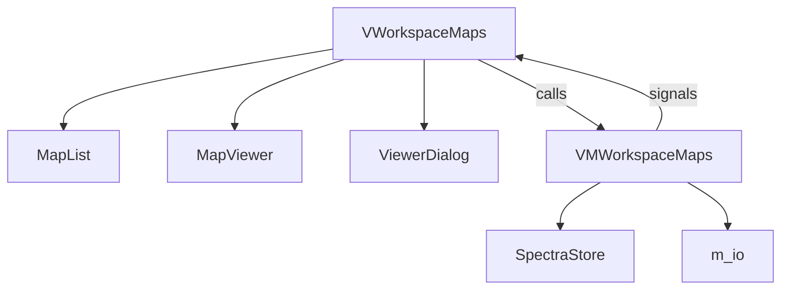
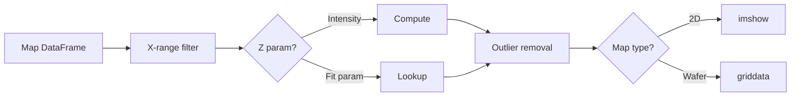

# Maps Workspace

The Maps Workspace handles **hyperspectral map data** — spatially resolved spectral datasets where each pixel contains a full spectrum. It extends the Spectra Workspace, inheriting all fitting and preprocessing capabilities while adding spatial awareness, heatmap visualization, and coordinate-based operations.

---
## Architecture Overview



---

## Key Design Decision: Inheritance

`VMWorkspaceMaps` extends `VMWorkspaceSpectra` rather than composing a separate spectra handler. This means:

- All spectral operations (baseline, peaks, fitting, model management, persistence helpers) are **inherited directly**.
- Maps-specific behavior is added through **method overrides** (e.g., `collect_fit_results()` adds X/Y coordinate columns, `_on_fit_finished()` also refreshes the heatmap).
- The View (`VWorkspaceMaps`) similarly extends `VWorkspaceSpectra`, adding the map list panel and map viewer but reusing the spectra list, spectra viewer, and fit model builder.

---

## Key Classes

### `VMWorkspaceMaps` — The ViewModel

**File**: `spectroview/viewmodel/vm_workspace_maps.py`

| Responsibility | Methods |
|---------------|---------|
| **Map loading** | `load_map_files(paths)` |
| **Map selection** | `select_map(name)`, `_show_map_spectra(name)` |
| **Map deletion** | `delete_current_map()`, `remove_map(name)` |
| **Fit results** | `collect_fit_results()` — overrides parent to add X, Y, Zone, Quadrant columns |
| **Heatmap data** | `get_fit_results_dataframe()`, `get_current_map_dataframe()` |
| **Cross-workspace** | `send_selected_spectra_to_spectra_workspace()`, `extract_and_send_profile_to_graphs()` |
| **Persistence** | `save_work()`, `load_work()` — ZIP archive with numpy+gzip arrays and dataframes |

#### Signals

```python
maps_list_changed = Signal(list)         # Map names list updated
map_data_updated = Signal(object)        # Current map DataFrame changed
send_spectra_to_workspace = Signal(list) # Send copies to Spectra tab
clear_map_cache_requested = Signal(str)  # Invalidate VMapViewer cache
switch_to_graphs_tab = Signal()          # Request tab switch to Graphs
```

---

## Data Flow: Loading a Map

### Supported Formats

| Format | Loader | Data Structure |
|--------|--------|---------------|
| `.csv` (new) | `load_map_file()` | Header row + data rows with X, Y, wavenumber columns |
| `.csv` (legacy) | `load_map_file()` | Alternating rows format (auto-detected) |
| `.txt` | `load_map_file()` | Space/tab/semicolon delimited with Y, X, wavenumber columns |
| `.wdf` | `load_wdf_map()` | Renishaw WiRE binary → DataFrame |
| `.spc` | `load_spc_map()` | Galactic SPC binary → DataFrame + metadata dict |

### The Map DataFrame

Every map is stored as a `pd.DataFrame` with this structure:

| X | Y | 100.5 | 101.0 | 101.5 | ... | 3200.0 |
|---|---|-------|-------|-------|-----|--------|
| 0.0 | 0.0 | 42.3 | 43.1 | 44.0 | ... | 12.5 |
| 1.0 | 0.0 | 38.7 | 39.2 | 40.1 | ... | 11.8 |

- Columns `X` and `Y` contain spatial coordinates (µm).
- All remaining columns are wavenumber values (as strings), each containing intensity data.
- Each row represents one spatial point (one spectrum).

### Tensor Registration Pipeline

When maps are loaded, raw coordinates, wavenumber grids, and spectral matrices are registered directly into `SpectraStore` in a single batched operation:
1. `self.store.add_map(name, x0, Y0, coords, fnames, is_active)` allocates contiguous NumPy arrays.
2. Individual spectrum filenames are auto-generated following the coordinate pattern: `{map_name}_(x_pos, y_pos)`.
3. Working copies and results are computed vectorially, avoiding any legacy row-by-row instance overhead.

!!! important "Filename Convention"
    Map spectra use the format `{map_name}_(x_pos, y_pos)` as their `fname`. This naming convention is used to:
    
    - Filter spectra belonging to a specific map (`fname.startswith(prefix)`)
    - Extract (X, Y) coordinates from the filename for fit results
    - Match spectra back to DataFrame rows during heatmap rendering and coordinate querieseatmap rendering

---

## Heatmap Visualization

### VMapViewer

**File**: `spectroview/view/components/v_map_viewer.py` (~1273 lines)

The `VMapViewer` is the most complex View component. It renders both **2D maps** (rectangular grids) and **wafer maps** (circular die-site layouts).

#### Z-Parameter Selection

The Z-axis (color dimension) of the heatmap can display:

| Parameter | Source | When Available |
|-----------|--------|---------------|
| `Intensity` | Raw map DataFrame (sum of intensities in X-range) | Always |
| `Area` | Integrated area under spectrum in X-range | Always |
| Fit parameters | `df_fit_results` columns (e.g., `Si_center`, `D_fwhm`) | After fitting |

#### Data Pipeline for Heatmap



#### Caching Strategy

Computing `scipy.griddata` for wafer maps is expensive (~100ms+ per call). The `VMapViewer` uses a **multi-key cache**:

```python
cache_key = (
    map_name,          # Which map
    parameter,         # Which Z parameter
    (xmin, xmax),      # X-range filter
    map_type,          # 2Dmap vs Wafer_300mm
    mask_config,       # Mask settings tuple or None
    remove_outliers    # Outlier removal flag
)
```

The cache is:
- **Preserved** across map switches (for fast switching between maps).
- **Invalidated** after fitting completes via `clear_map_cache_requested` signal.

#### Interactive Selection

The map viewer supports three selection modes:

| Mode | Trigger | Behavior |
|------|---------|----------|
| **Single click** | Left-click on heatmap | Selects the nearest spectrum point, highlights with red rectangle |
| **Rectangle drag** | Click-and-drag | Selects all points within the rectangle |
| **Profile** | Select exactly 2 points in 2D mode | Draws a line between points; enables "Extract profile" |

Selected points are overlaid using `PatchCollection` for O(1) rendering performance (compared to individual `add_patch()` calls).

---

## Coordinate Handling

### Extracting Coordinates from Filenames

Since map spectra encode their position in `fname`, coordinate extraction is done via string parsing:

```python
def _extract_coords_for_spectra(self, spectra):
    coords = []
    for spectrum in spectra:
        fname = spectrum.fname
        coord_str = fname[fname.rfind('(') + 1:fname.rfind(')')]
        x_str, y_str = coord_str.split(',')
        coords.append([float(x_str.strip()), float(y_str.strip())])
    return np.array(coords, dtype=np.float64)
```

### Fit Results with Spatial Columns

`collect_fit_results()` overrides the parent to:

1. Call `super().collect_fit_results()` to build the base DataFrame
2. Parse `(x, y)` from each `Filename` entry
3. Insert `X` and `Y` columns at positions 1 and 2
4. For wafer maps (`map_type != '2Dmap'`), add `Zone` and `Quadrant` columns using spatial utility functions

```python
# After override, the DataFrame looks like:
# | Filename | X   | Y   | Si_center | Si_fwhm | ... | Zone   | Quadrant |
# |----------|-----|-----|-----------|---------|-----|--------|----------|
# | map1     | 0.0 | 0.0 | 520.7     | 3.2     | ... | Center | NE       |
```

---

## Map Types and Wafer Rendering

| Map Type | Radius | Rendering |
|----------|--------|-----------|
| `2Dmap` | N/A | Rectangular `pivot_table` → `imshow()` |
| `Wafer_300mm` | 150 mm | Circular mask, `griddata` interpolation to 80×80 grid |
| `Wafer_200mm` | 100 mm | Same as above with smaller radius |
| `Wafer_100mm` | 50 mm | Same as above |

For wafer maps, the viewer:

1. Draws a wafer circle outline
2. Shows all measurement sites as gray `×` markers
3. Interpolates Z-values onto a regular grid using `scipy.griddata`
4. Renders with `imshow()` using bilinear interpolation for smoothness

---

## Cross-Workspace Features

### Send Spectra to Spectra Workspace

```python
def send_selected_spectra_to_spectra_workspace(self):
    spectra_copies = [deepcopy(spectrum) for spectrum in selected_spectra]
    self.send_spectra_to_workspace.emit(spectra_copies)
```

Deep copies ensure that modifications in the Spectra tab don't affect the Maps workspace.

### Extract Profile to Graphs

When a user selects exactly 2 points on a 2D map and clicks "Extract profile":

1. The `VMapViewer` computes a height profile (Z values along the line between the two points)
2. The profile is packaged as a `pd.DataFrame` with columns `distance` and `values`
3. `VMWorkspaceMaps.extract_and_send_profile_to_graphs()` injects the DataFrame into `VMWorkspaceGraphs`
4. A line plot is auto-created in the Graphs workspace
5. The `switch_to_graphs_tab` signal triggers a tab switch

---

## Persistence: Workspace Save/Load

Maps workspace uses the shared ZIP-backed serialization strategy for saving/loading work, which splits metadata and arrays to achieve maximum performance.

### Save (v4+)
- Lightweight per-map metadata (such as `baseline_config`, `fit_model`, and `range_min`) is serialized to JSON inside `metadata.json`.
- Heavy multi-spectrum coordinate matrices and raw intensities are serialized directly into `arrays.npz` as binary NumPy matrices under `store_{map_name}_coords`, `store_{map_name}_x0`, and `store_{map_name}_y0`.
- Best-fit curves and statistics DataFrames are serialized to `dataframes.pkl` using highly optimized Python pickles.

### Backward-Compatible Loading
To support legacy workspaces saved with older versions of SPECTROview (which are raw JSON `.map`/`.maps` files containing alternating hex/gzip strings), a custom parser parses and upgrades them:
1. **Gzip CSV Decompression**: Decodes hex strings and decompresses the gzip streams to load map DataFrames directly into memory.
2. **Fast Coordinate Mapping**: Builds an O(N) lookup dictionary of individual row properties indexed by `(map_name, round(X, 3), round(Y, 3))` to link coordinates back to active flags, baseline anchor points, and peak definitions.
3. **Contiguous Allocation**: Packs the data into `SpectraStore` in batch layouts.
4. **Vectorized Curve Restoration**: Batch evaluates legacy baselines and peak functions to immediately render the fits in the viewer without needing to refit the raw data.

---

## Method Overrides

The Maps ViewModel overrides several parent methods to maintain map-specific state:

| Method | Override Purpose |
|--------|-----------------|
| `_get_selected_spectra()` | Filters by `is_active` (checkbox state) in addition to selection |
| `reinit_spectra()` | Calls parent, then refreshes `_show_map_spectra()` for current map |
| `delete_baseline()` | Calls parent, then refreshes map spectra list |
| `delete_peaks()` | Calls parent, then refreshes map spectra list |
| `_on_fit_finished()` | Calls parent, then re-emits `map_data_updated` and clears cache |
| `collect_fit_results()` | Calls parent, then adds X, Y, Zone, Quadrant columns |
| `clear_workspace()` | Calls parent, then clears `maps` dict and emits empty signals |

---

## VMapViewerDialog

**File**: `spectroview/view/components/v_map_viewer_dialog.py`

A thin `QDialog` wrapper around `VMapViewer` that:

- Uses `Qt.WindowStaysOnTopHint` to remain visible while interacting with the main window
- Synchronizes data from the primary map viewer
- Allows multiple simultaneous views of the same map with different Z-parameters
- Enables side-by-side comparison of different fit parameters on the same spatial data
