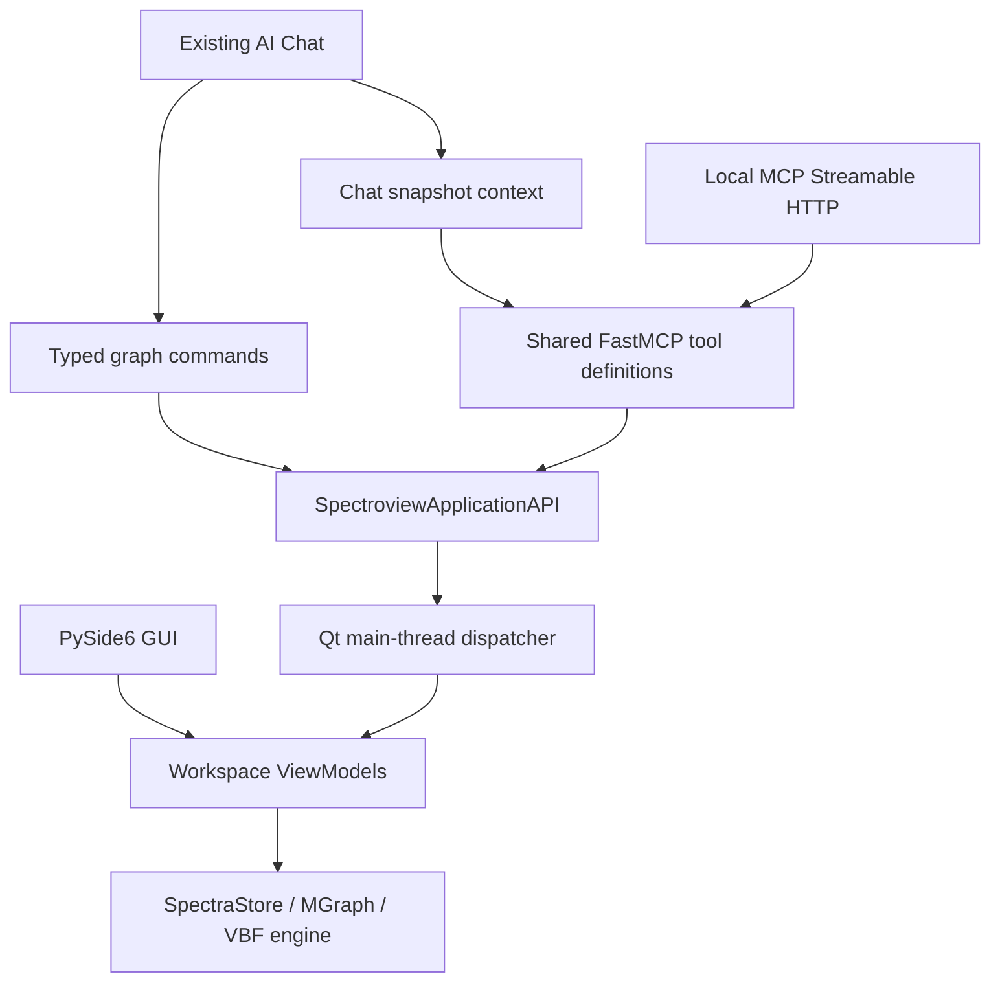

# Local MCP Server

SPECTROview can expose the state of the currently running desktop application
to trusted MCP clients on the same computer. The server is **disabled by
default**, binds only to `127.0.0.1`, and uses MCP Streamable HTTP at
`http://127.0.0.1:8765/mcp` unless another port is selected.

## Architecture



There are two related APIs:

- `spectroview.api` creates independent headless workspaces for Python scripts.
- `spectroview.application.SpectroviewApplicationAPI` controls the currently
  running desktop session. It is the live application boundary used by MCP.

The MCP layer contains no fitting, preprocessing, or rendering algorithm. It
uses the existing ViewModel orchestration, `SpectraStore`, `graph_control`, and
Vectorized Batch Fit engine. Graph rendering remains a View responsibility.

### Why embedded Streamable HTTP

Three runtime designs were considered:

| Design | Result |
|---|---|
| Embedded server in the desktop process | Selected. It has direct access to the current state and needs only one Qt dispatch boundary. |
| Separate localhost service with custom IPC | Rejected for the first iteration. It adds another protocol, state synchronization, and lifecycle failure mode. |
| Separate stdio MCP process plus IPC bridge | Rejected for live desktop state. Stdio is useful when the client owns the server process, but the SPECTROview GUI is already the state owner. |

Streamable HTTP is used instead of the superseded SSE transport. Uvicorn runs
on a daemon thread; `LocalMCPRuntime.stop()` provides deterministic shutdown.
The FastMCP ASGI application retains the SDK's localhost Host/Origin checks.

## Enable and connect

1. Open **Settings → AI → Local MCP Server**.
2. Check **Enable local MCP endpoint**.
3. Keep the default port or choose an unused port from 1024 to 65535.
4. Select **OK**. The endpoint starts immediately; no application restart is
   required.
5. Configure an MCP client with the displayed Streamable HTTP URL, normally:

   ```text
   http://127.0.0.1:8765/mcp
   ```

The SPECTROview desktop application must be running. Disabling the setting or
closing SPECTROview stops the endpoint.

## Security and permissions

- The bind address is hard-coded to IPv4 loopback and is not editable in the
  UI. SPECTROview does not listen on a LAN/public interface.
- There is no authentication in this loopback-only first iteration. Do not
  proxy or port-forward the endpoint.
- Read and write tools are distinct and their descriptions identify mutations.
- MCP `read_only_hint`, `destructive_hint`, `idempotent_hint`, and `open_world_hint`
  annotations classify tools for clients that implement approval policies.
- `export_results` requires a caller-supplied path, never creates a parent
  directory, and refuses to replace an existing file unless the call includes
  `overwrite=true`.
- Dataset or graph deletion is never inferred from a read request. `delete_graph`
  is an explicit state-changing tool.

This separation gives a future Work Harness enough information to apply an
approval policy to graph changes, processing, fitting, deletion, and exports.

## Tools

| Tool | Purpose | Access |
|---|---|---|
| `get_application_state` | Active workspace, selection, object counts, fit activity | Read |
| `get_active_workspace` | Visible workspace | Read |
| `get_current_selection` | Workspace-specific selection | Read |
| `list_datasets` | Spectra, maps, and DataFrame catalog with stable IDs | Read |
| `get_dataset_info` | Dataset shape, range, processing and fit metadata | Read |
| `get_spectrum` | Bounded/downsampled raw or processed X/Y values | Read |
| `get_current_spectrum` | Selected Spectra/Maps X/Y values | Read |
| `query_dataframe` | Validated DataFrame query/expression | Read |
| `get_statistics` | Descriptive statistics for named columns | Read |
| `crop_spectrum` | Crop current/all applicable data using workspace logic | Write |
| `normalize_spectrum` | Apply an explicit intensity divisor | Write |
| `subtract_baseline` | Subtract an already-configured baseline | Write |
| `get_fit_configuration` | Current fit model and parameters | Read |
| `fit_spectrum` | Start the existing VBF fitting path | Write |
| `get_fit_results` | Collect/read bounded structured fit-result rows | Read/Write when `collect=true` |
| `list_graphs` | Complete typed `MGraph` configurations | Read |
| `get_active_graph` | Complete active graph configuration | Read |
| `plot_graph` | Validate and create a graph | Write |
| `plot_graphs` | Validate and create multiple graphs simultaneously (recipe / batch mode) | Write |
| `update_graph` | Typed partial update, including every mutable `MGraph` field | Write |
| `delete_graph` | Close specified/all graphs | Destructive write |
| `get_active_map` | Active map configuration and selection | Read |
| `export_results` | CSV/Excel fit-result export with overwrite guard | Filesystem write |

Every new desktop tool returns a JSON envelope:

```json
{"ok": true, "result": {}}
```

or a stable error code and message:

```json
{"ok": false, "error": {"code": "NO_ACTIVE_GRAPH", "message": "No graph is active."}}
```

The installed MCP SDK version represents this JSON as text content. Clients
should parse it as JSON rather than matching human-readable messages.

## Resources

| URI | Contents |
|---|---|
| `spectroview://application/state` | Application/workspace summary |
| `spectroview://workspace/current` | Current workspace and selection |
| `spectroview://datasets` | Compact loaded-dataset catalog |
| `spectroview://dataframes/detail` | DataFrame columns, samples, preview |
| `spectroview://graphs/detail` | All graph configurations |
| `spectroview://graphs/current` | Active graph configuration or typed error |
| `spectroview://fit/current` | Active fit configuration or typed error |

Resources are read-only context. Actions remain tools.

## Thread safety

The HTTP/ASGI thread never reads or mutates Qt-owned state directly.
`QtMainThreadDispatcher` emits a queued signal carrying a callable and waits on
the server thread for its result. The callable executes on the `QApplication`
thread. Calls already on that thread execute directly. Requests during
shutdown fail with `APPLICATION_NOT_READY`; stalled dispatches fail with
`MAIN_THREAD_TIMEOUT` rather than waiting forever.

Fitting itself remains asynchronous and continues to use SPECTROview's existing
`VBFthread`. `fit_spectrum` reports that the fit started; clients inspect
`get_application_state` before collecting results.

## Existing AI Chat compatibility

The internal chat is not converted into an HTTP client. Its existing MCP hub,
ReAct loop, provider adapters, conversation behavior, and typed graph-command
queue are unchanged. It intentionally keeps the original compact five-tool
profile (`query_dataframe`, `get_statistics`, `plot_graph`, `update_graph`,
`delete_graph`) because large schemas materially reduce small local model
reliability. The resulting graph commands are applied through
`SpectroviewApplicationAPI`, the same live application boundary used by the
external server.

The chat's DataFrame and graph reads remain turn snapshots. Routing a
synchronous in-process chat tool call back through a blocking Qt dispatcher
would deadlock the GUI thread; the external server does not have that
constraint.

## Adding a capability

1. Reuse or add a domain operation in a Model/ViewModel or the headless
   `spectroview.api`; do not implement scientific logic in the MCP handler.
2. Add a domain-shaped method to `SpectroviewApplicationAPI`. Keep widget
   lookup, combo boxes, dialogs, and signal wiring inside the adapter.
3. Register a typed tool in `create_mcp_server(...,
   include_application_tools=True)`. Use `Literal`/`Field` constraints and the
   `{ok,result|error}` response envelope.
4. Decide explicitly whether it is read-only, state-changing, destructive, or
   a filesystem write. Require an overwrite/delete flag where appropriate.
5. Add service tests, generated-schema tests, valid/invalid MCP calls, and a
   thread-boundary test if Qt state is touched.
6. Update the tool/resource tables on this page.

## Troubleshooting

- **Connection refused:** enable the server, keep SPECTROview running, and use
  the exact endpoint displayed in Settings.
- **Server failed / port in use:** select another port and press OK. The status
  bar reports startup failures.
- **HTTP 421:** connect with `127.0.0.1` or `localhost`. The SDK intentionally
  rejects unexpected Host headers to reduce DNS-rebinding risk.
- **`APPLICATION_NOT_READY`:** SPECTROview is starting/stopping, or the compact
  internal-chat profile was used without a live desktop facade.
- **`MAIN_THREAD_TIMEOUT`:** a modal dialog or long GUI operation prevented the
  main event loop from servicing the request. Close the dialog and retry.
- **No fit results:** wait for fitting to finish, then call `get_fit_results`
  with `collect=true` once before exporting.

## Intentional first-iteration limits

- No graph-image export tool yet; only fit-result export is exposed.
- No smoothing tool is exposed because no single supported workspace operation
  currently owns a stable smoothing contract.
- MCP cannot create/edit fit models or baseline points yet; it can inspect a
  configured model and run the existing engine.
- Map colormap/viewer customization and map image export are not exposed.
- No authentication, remote bind, TLS, server-initiated sampling, or elicitation.
- No MCP progress notifications for VBF; fit progress is currently polled from
  application state.
