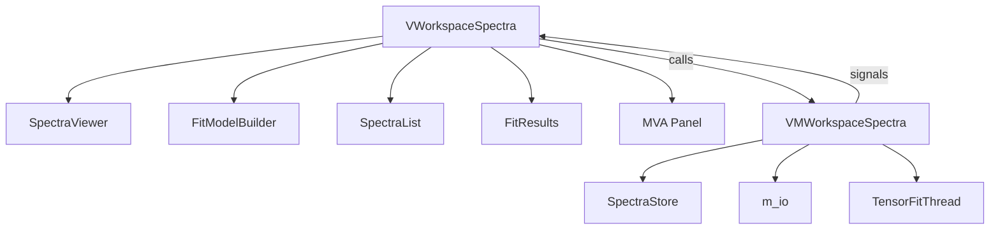
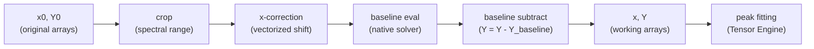

# Spectra Workspace

The Spectra Workspace is the core analytical environment. It manages loading, preprocessing, fitting, and exporting spectral data. It serves as the **base class** that the Maps workspace extends.

---

## Architecture Overview



---

## Key Classes

### `VMWorkspaceSpectra` — The ViewModel

**File**: `spectroview/viewmodel/vm_workspace_spectra.py`

This is the largest and most critical ViewModel. It owns the `SpectraStore` instance and orchestrates every operation on spectra. Key responsibilities:

| Responsibility | Methods |
|---------------|---------|
| **Loading** | `load_files(paths)` |
| **Selection** | `set_selected_fnames(fnames)`, `_get_selected_spectra()`, `_get_active_spectra()` |
| **Preprocessing** | `apply_spectral_range(xmin, xmax)`, `apply_x_correction()` |
| **Baseline** | `set_baseline_settings()`, `subtract_baseline()`, `delete_baseline()` |
| **Peaks** | `add_peak_at(x)`, `remove_peak_at(x)`, `copy/paste_peaks()` |
| **Fitting** | `fit(apply_all)`, `_run_fit_thread()`, `_on_fit_finished()` |
| **Results** | `collect_fit_results()`, `save_spectra_data()` |
| **Persistence** | `save_work()`, `load_work()`, `_load_legacy_spectra()` |
| **Model management** | `copy/paste_fit_model()`, `save_fit_model()`, `apply_fit_model()` |
| **Workspace reset** | `reinit_spectra()`, `clear_workspace()` |

#### Signals (ViewModel → View)

```python
spectra_list_changed = Signal(list)         # Full list refresh
spectra_selection_changed = Signal(object)   # Selected subset changed (tensor_list payload)
fit_progress_updated = Signal(int, int, int, float)  # (current, total, converged, R²)
fit_results_updated = Signal(object)        # pd.DataFrame of fit results
count_changed = Signal(int)                 # Total spectrum count
notify = Signal(str)                        # Toast notification message
```

### `SpectraStore` & `MapData` — Unified Models

**File**: `spectroview/model/spectra_store.py`

SPECTROview uses a unified, tensor-centric architecture where all numerical data is stored in contiguous NumPy arrays per map. 

#### `MapData` Structure

Each map or individual spectrum in the store is wrapped by a `MapData` dataclass:

| Attribute | Type | Purpose |
|-----------|------|---------|
| `name` | `str` | Name of the map or spectrum |
| `x0` | `ndarray` | Original (immutable) wavenumber axis [M] |
| `Y0` | `ndarray` | Original (immutable) raw intensities [N, M] |
| `coords` | `ndarray` | Spatial positions [N, 2] |
| `is_active` | `ndarray` | Active checkbox state per spectrum [N] |
| `fnames` | `list[str]` | Unique filename identifiers per spectrum [N] |
| `colors` | `list[str|None]`| Display color per spectrum [N] |
| `labels` | `list[str|None]`| User-defined display label per spectrum [N] |
| `baseline_config` | `dict` | Baseline settings (`mode`, `attached`, `points`, `order_max`) |
| `fit_model` | `dict` | Peak model metadata dictionary (`peak_labels`, `peak_models`) |
| `peak_params` | `ndarray` | Optimized parameters array [N, K] |
| `fit_success` | `ndarray` | Converged state per spectrum [N] |
| `fit_r2` | `ndarray` | R² values per spectrum [N] |
| `Y_bestfit` | `ndarray` | Composite best-fit curves [N, M_proc] |
| `Y_baseline` | `ndarray` | Evaluated baseline curves [N, M_proc] |
| `Y_peaks` | `list[ndarray]`| Evaluated individual peak curves [N, M_proc] |

---

## Spectrum Lifecycle

### 1. Loading

The `m_io` module detects file formats by extension and parses raw arrays and metadata into native Python dictionaries:

| Format | Loader Function | Notes |
|--------|----------------|-------|
| `.txt` | `load_spectrum_file()` | Auto-detects delimiter (`;`, `\t`, whitespace) |
| `.csv` | `load_spectrum_file()` | Semicolon delimiter, 3 header rows |
| `.wdf` | `load_wdf_spectrum()` | Renishaw WiRE format, extracts metadata |
| `.spc` | `load_spc_spectrum()` | Galactic SPC binary format |
| `.dat` | `load_TRPL_data()` | Time-Resolved Photoluminescence |

Loaded spectra are dynamically added to the `SpectraStore` via `self.store.add_map()` which initializes the numerical coordinates and active flags.

### 2. Preprocessing Pipeline

When a user modifies baseline, spectral range, or X-correction, the spectrum goes through a fully vectorized preprocessing pipeline on `SpectraStore`:



!!! note "Vectorized Preprocessing"
    The original raw arrays `x0` and `Y0` are preserved unchanged. Preprocessing operations are vectorized across the entire map, and the resulting working coordinates `x` and `Y` are computed dynamically.

### 3. Baseline Processing

Manual baseline anchor points and smooth automatic baselines are evaluated in batch layouts:

- **Manual Modes** (`Linear`, `Polynomial`): Anchor points `(x, y)` are registered into `baseline_config`. Linear/Polynomial fits are evaluated in batch over coordinates.
- **Automatic Modes** (`airPLS`, `asLS`, `arPLS`): Live previews are calculated instantly using pure NumPy/SciPy or Whittaker solvers, and subtracted in a single operation.

### 4. Peak Model Assignment

Peaks are registered into the map's `fit_model` dictionary:

1. `VSpectraViewer.peak_add_requested.emit(x_position)` updates the `fit_model` in the store.
2. Initial parameter guesses (center, fwhm, amplitude) are calculated dynamically.
3. The View's `VPeakTable` updates showing parameters with 3-decimal precision.

### 5. Fitting

1. **ViewModel** instantiates `TensorFitThread` with the store and map tasks.
2. **TensorFitThread** invokes `TensorFittingEngine.fit()` which compiles Jacobians and optimizes parameter vectors in batch using vectorized Levenberg-Marquardt solvers.
3. Optimized parameters are written back to `md.peak_params`, and composite fit envelopes (`md.Y_bestfit`, `md.Y_peaks`) are evaluated.

### 6. Fit Results Collection

`collect_fit_results()` iterates over all active spectra in `SpectraStore` and constructs a single DataFrame:

| Column | Source |
|--------|--------|
| `Filename` | `md.fnames[i]` |
| `{peak_label}_center` | `md.peak_params[i, col_center]` |
| `{peak_label}_fwhm` | `md.peak_params[i, col_fwhm]` |
| `{peak_label}_amplitude` | `md.peak_params[i, col_amplitude]` |
| `{peak_label}_area` | Computed area |
| `R²` | `md.fit_r2[i]` |

---

## Fit Model Management

- **Copy/Paste**: Deep copies the `fit_model` and `baseline_config` to clipboard.
- **Save/Load**: Writes the fitting configuration to standard JSON structures.

---

## Persistence: Save/Load Work

### Modern Save Format (ZIP-backed)
- Light metadata (settings, GUI configurations, peak parameters) are saved to `metadata.json`.
- Heavy coordinates and raw intensity arrays (`x0`, `Y0`) are stored in a compressed `arrays.npz` archive.
- Statistics are dumped to `dataframes.pkl`.

### Backward-Compatible Loading
To support legacy workspaces saved with older SPECTROview versions (raw JSON formats < v4), `VMWorkspaceSpectra` implements a robust backward-compatible JSON loader:
- Decodes and decompresses base64/zlib encoded `x0` and `y0` arrays.
- Reconstructs `baseline_config` and evaluates `md.Y_baseline`.
- Iterates and parses legacy peak models, evaluating and rendering component curves (`md.Y_peaks`, `md.Y_bestfit`) automatically.

---

## View Components

### VSpectraViewer

The central Matplotlib canvas renders:

- **Spectrum lines** (with waterfall X/Y shift via sliders)
- **Raw data overlay** (toggle via options menu)
- **Baseline curves** with anchor point markers
- **Individual peak curves** (smooth, using 1000-point interpolation)
- **Best-fit envelope** (sum of peaks + baseline)
- **Residuals** (observed - fitted)
- **Legend** (pickable for label/color editing)
- **R² display** from the first selected spectrum

Tool modes (exclusive radio buttons):

| Mode | Behavior on Click |
|------|------------------|
| **Zoom** | Standard Matplotlib zoom/pan |
| **Baseline** | Left-click adds anchor point; right-click removes nearest |
| **Peak** | Left-click adds peak at x-position; right-click removes nearest |

### VFitModelBuilder

A splitter panel with:

- **Left pane**: X-correction, spectral range, baseline controls, peak shape selector
- **Right pane**: `VPeakTable` (editable peak parameters) + fit action buttons

All actions support **Ctrl+Click** for "apply to all spectra" via the `_emit_with_ctrl()` helper.

### VSpectraList

A `QListWidget` with:

- Checkboxes per spectrum (checked = active for fitting)
- Color indicators 
- Context menu for rename, delete, copy
- Multi-selection support (Ctrl/Shift+Click)
