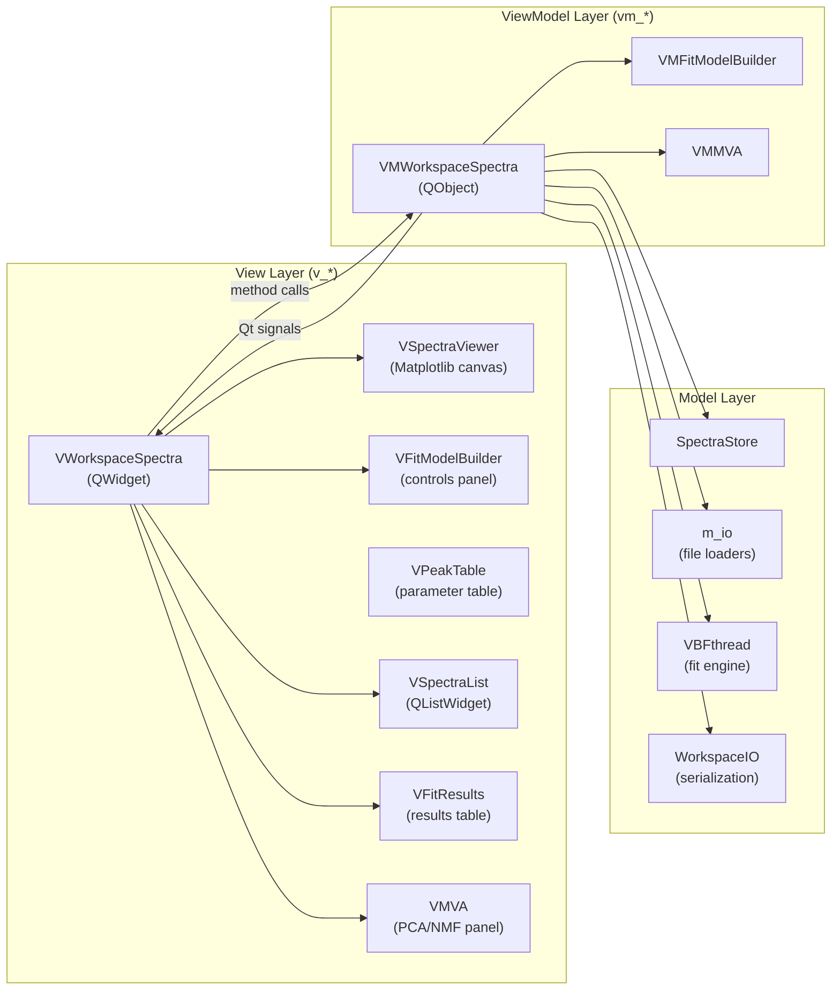

# **Workspace: Spectra**

The `Spectra` workspace is the core analytical environment for individual spectrum management. It handles loading, preprocessing, peak modeling, fitting, and exporting spectral data. It also serves as the **base class** that the [Maps workspace](maps.md) extends via inheritance.

> [!NOTE]
> This page covers the Spectra-specific View and ViewModel layers. For the shared data model (`SpectraStore`, `MapData`, `MapInfo`, proxies), see the dedicated [Data Architecture: SpectraStore](spectra_store.md) page.

---

## Architecture Overview

The workspace follows a strict **MVVM** (Model-View-ViewModel) separation. No layer may cross its boundary in the wrong direction.



### Component Responsibilities

| Layer | Class | Responsibility |
|-------|-------|----------------|
| **View** | `VWorkspaceSpectra` | Assembles UI widgets, connects signals/slots, delegates all logic to ViewModel |
| **View** | `VSpectraViewer` | Matplotlib canvas — renders spectra, baselines, peaks, best-fit, residuals |
| **View** | `VFitModelBuilder` | X-correction, range, baseline and fit controls panel |
| **View** | `VPeakTable` | Editable table of peak parameters with per-row model selectors |
| **View** | `VSpectraList` | Checkbox list with coloring rules, drag-to-reorder, multi-select |
| **ViewModel** | `VMWorkspaceSpectra` | Business logic: orchestrates loading, preprocessing, fitting, persistence |
| **Model** | `SpectraStore` | Tensor-centric in-memory store — see [spectra_store.md](spectra_store.md) |
| **Model** | `VBFthread` | `QThread` that runs the vectorized batch fitting engine off the main thread |

### How Spectra Uses MapData

In the Spectra workspace, each loaded spectrum is stored as an independent `MapData` block with **N=1** (one row). Each block has its own x-axis, allowing spectra with different wavenumber ranges to coexist. See [Data Hierarchy](spectra_store.md#data-hierarchy) for the full tensor layout.

---

## Workspace Components

### `VWorkspaceSpectra` — The View Coordinator

**File**: [`v_workspace_spectra.py`](file:///Users/HoanLe/Documents/SPECTROview/spectroview/view/v_workspace_spectra.py)

`VWorkspaceSpectra` is a pure UI assembly class. It:

1. Instantiates all child widgets and the ViewModel in `__init__`.
2. Wires every signal/slot connection in `setup_connections()`.
3. Delegates every user action to the ViewModel (never manipulates data directly).
4. Updates UI in response to ViewModel signals.

The layout is a horizontal splitter: **left** (SpectraViewer on top, tabbed controls below) and **right** (spectra list sidebar).

**Key pattern — Ctrl-modified actions:**

```python
def _apply_with_ctrl(self, fn):
    apply_all = bool(QApplication.keyboardModifiers() & Qt.ControlModifier)
    fn(apply_all)

# Usage:
self.btn_reinit.clicked.connect(lambda: self._apply_with_ctrl(vm.reinit_spectra))
```

All bulk actions (baseline subtract, peak paste, reinit, fit) follow this pattern. A normal click applies to selected spectra; Ctrl+click applies to all spectra in the store.

### `VMWorkspaceSpectra` — The ViewModel

**File**: [`vm_workspace_spectra.py`](file:///Users/HoanLe/Documents/SPECTROview/spectroview/viewmodel/vm_workspace_spectra.py)

This is the largest and most critical class in the application. It owns the `SpectraStore` and orchestrates every operation.

#### Signals (ViewModel → View)

```python
spectra_list_changed    = Signal(list)          # list[dict] — refresh the spectra list
spectra_selection_changed = Signal(object)      # dict payload for VSpectraViewer
count_changed           = Signal(int)           # total spectrum count label
show_xcorrection_value  = Signal(float)         # sync X-correction spinbox
spectral_range_changed  = Signal(float, float)  # sync range controls
fit_in_progress         = Signal(bool)          # enable/disable fit buttons
fit_progress_updated    = Signal(int, int, int, float, int)  # progress bar
fit_results_updated     = Signal(object)        # pd.DataFrame → results table
notify                  = Signal(str)           # toast notification message
send_df_to_graphs       = Signal(str, object)   # forward DataFrame to Graphs
```

#### Method Reference

| Category | Methods |
|----------|---------|
| **Loading** | `load_files(paths)` |
| **Selection** | `set_selected_fnames()`, `set_selected_indices()`, `_get_selected_spectra()`, `_get_active_spectra()` |
| **Preprocessing** | `apply_spectral_range()`, `apply_x_correction()`, `undo_x_correction()`, `apply_y_normalization()` |
| **Baseline** | `set_baseline_settings()`, `preview_baseline()`, `add_baseline_point()`, `remove_baseline_point()`, `subtract_baseline()`, `delete_baseline()`, `copy_baseline()`, `paste_baseline()` |
| **Peaks** | `add_peak_at()`, `remove_peak_at()`, `update_peak_label()`, `update_peak_model()`, `update_peak_param()`, `delete_peak()`, `copy_peaks()`, `paste_peaks()`, `delete_peaks()` |
| **Fitting** | `fit()`, `stop_fit()`, `_run_fit_thread()`, `_on_fit_finished()` |
| **Results** | `collect_fit_results()`, `save_fit_results()`, `split_filename()`, `add_column_from_filename()`, `compute_column_from_expression()` |
| **Fit model** | `copy_fit_model()`, `paste_fit_model()`, `save_fit_model()`, `apply_fit_model()` |
| **Workspace** | `reinit_spectra()`, `remove_selected_spectra()`, `reorder_spectra()`, `clear_workspace()` |
| **Persistence** | `save_work()`, `load_work()`, `_load_legacy_spectra()` |
| **Display** | `view_stats()`, `save_spectra_data()`, `copy_spectrum_data_to_clipboard()` |

#### Template Method Hooks

The ViewModel uses the **Template Method pattern** to allow the [Maps subclass](maps.md#template-method-overrides) to customize bulk operations without duplicating the operation logic:

```python
def _get_target_mds(self, apply_all: bool) -> list[MapData]:
    """Which MapData blocks to operate on."""
    # Spectra workspace: selected spectra → their MapData objects
    # Maps workspace (override): the current map, or all maps

def _on_map_data_changed(self, md: MapData, action: str):
    """Hook after each individual MapData is modified."""
    # Spectra workspace: no-op
    # Maps workspace (override): clears heatmap cache, re-runs batch_preprocess

def _post_bulk_action(self, apply_all: bool, action: str):
    """Hook after all target MapData objects have been processed."""
    # Spectra workspace: re-emits list and selection
    # Maps workspace (override): also refreshes fit results and map view
```

### `VSpectraViewer` — The Plot Canvas

**File**: [`v_spectra_viewer.py`](file:///Users/HoanLe/Documents/SPECTROview/spectroview/view/components/v_spectra_viewer.py)

The Matplotlib canvas renders everything visible in the spectrum plot. It receives a data dictionary from `VMWorkspaceSpectra.spectra_selection_changed` and redraws accordingly.

**Rendered elements:**

| Element | Source data key |
|---------|----------------|
| Spectrum lines | `data["y"]` (processed) |
| Raw overlay (optional) | `data["y0"]` (raw) |
| Baseline curve | `data["y_baseline"]` |
| Baseline anchor points | `data["baseline_config"]["points"]` |
| Individual peak curves | `data["y_peaks"]` (list of arrays) |
| Best-fit envelope | `data["y_bestfit"]` |
| Residuals | `data["y"] - data["y_bestfit"]` |
| R² annotation | `data["fit_r2"][0]` |

**Interaction modes (radio button exclusive):**

| Mode | Left click | Right click |
|------|-----------|-------------|
| **Zoom** | Standard Matplotlib zoom/pan | — |
| **Baseline** | Add anchor point at x | Remove nearest anchor |
| **Peak** | Add peak at x | Remove nearest peak |

Peaks can also be dragged. The viewer emits `peak_dragged(x, y)` during drag and `peak_drag_finished()` on release, which the ViewModel translates into `update_dragged_peak()` + `finalize_peak_drag()` calls.

### `VFitModelBuilder` — The Controls Panel

**File**: [`v_fit_model_builder.py`](file:///Users/HoanLe/Documents/SPECTROview/spectroview/view/components/v_fit_model_builder.py)

A splitter panel containing the full preprocessing and fitting control surface:

- **Left pane**: X-correction, spectral range, baseline mode selector, baseline action buttons.
- **Right pane**: `VPeakTable` (editable parameter rows) + fit action buttons (Fit, Copy model, Paste model, Save model, Apply model).

### `VPeakTable` — The Parameter Table

**File**: [`v_peak_table.py`](file:///Users/HoanLe/Documents/SPECTROview/spectroview/view/components/v_peak_table.py)

An interactive table where each row represents one peak. Columns show label, model shape, center (x₀), FWHM, amplitude, and bound toggles. Editing any cell emits a signal to `VMWorkspaceSpectra`, which updates `md.fit_model` and immediately reconstructs the Y_peaks preview.

---

## Data Flow

### Loading Spectra

1. **User Action**: The user drag-and-drops files into the `VWorkspaceSpectra` UI.
2. **View → ViewModel**: The View calls `vm.load_files(paths)`.
3. **File Parsing**: For each file, the ViewModel delegates to the `m_io` module (`load_spectrum_file`, `load_wdf_spectrum`, etc.). The IO module returns a dictionary containing raw arrays (`x0`, `y0`) and metadata.
4. **Data Storage**: The ViewModel registers the data in the `SpectraStore` by calling `add_map(name, x0, Y0, coords, fnames)`. A new `MapData` block is created with `x` and `Y` set to `None` (raw data only).
5. **UI Update**: The ViewModel emits the `spectra_list_changed` signal. The View catches this and updates the `VSpectraList` sidebar.

The `m_io` module auto-detects format from file extension. Every loader returns a uniform dict:

```python
{
    "type": "spectra",
    "items": [
        {"name": str, "x0": ndarray, "y0": ndarray, "metadata": dict},
        ...
    ]
}
```

WDF files may return multiple items (temporal series). All items are registered as separate MapData blocks.

### Selecting Spectra

1. **User Action**: The user clicks a spectrum in `VSpectraList`.
2. **View → ViewModel**: The list widget emits a selection signal which calls `vm.set_selected_indices()`.
3. **State Update**: The ViewModel resolves indices to unique `fnames` and stores the active selection.
4. **Payload Construction**: The ViewModel calls `_emit_selected_spectra()`, which queries `SpectraStore` to build a `"type": "tensor_list"` payload containing the arrays for all selected spectra.
5. **UI Update**: The ViewModel emits `spectra_selection_changed(data_dict)`. `VSpectraViewer` receives it, calls `set_plot_data()`, and redraws the Matplotlib canvas.

The selection payload (`data_dict`) contains pre-extracted arrays keyed by `"type": "tensor_list"` for the Spectra workspace (list of independent arrays, each potentially with a different x-axis). The Maps workspace [overrides this](maps.md#_emit_selected_spectra-override) to emit `"type": "tensor"` (shared x-axis matrix).

### Fitting Workflow

1. **User Action**: The user clicks "Fit" in `VFitModelBuilder`.
2. **Task Construction**: The ViewModel builds a list of tasks (one per map/spectrum) containing `indices` and the `fit_model` dictionary.
3. **Thread Launch**: The ViewModel instantiates `VBFthread(store, tasks)` and starts it. The UI buttons are disabled via the `fit_in_progress(True)` signal.
4. **Engine Execution (Background)**: For each task, the thread calls the `VBFengine.fit_spectra(x, Y_sub, fit_model, weights)`.
5. **Result Storage (Background)**: As fits complete, the thread directly writes results to the `SpectraStore` via `set_fit_results()` and updates the `Y_bestfit` and `Y_peaks` arrays on the `MapData` object.
6. **Progress Updates**: The thread emits progress signals which the ViewModel relays to the View's progress bar.
7. **Completion**: The thread emits `finished()`. The ViewModel catches this, calls `_on_fit_finished()`, re-enables the UI, and triggers a canvas redraw.

> [!NOTE]
> `VBFthread` calls `store.set_fit_results()` directly from the worker thread. This is safe because PySide6 allows writes to pure Python/NumPy objects from non-GUI threads, as long as no Qt widget operations occur. The `finished()` signal then triggers UI updates on the main thread.

### Baseline Workflow

1. User sets mode in `VFitModelBuilder` → `set_baseline_settings()` stores config in `md.baseline_config`.
2. User clicks on spectrum → `add_baseline_point(x)` adds anchor to `md.baseline_config["points"]`.
3. `preview_baseline()` evaluates and stores `md.Y_baseline` for rendering (does not subtract).
4. `subtract_baseline()` runs `batch_preprocess()` on the map — subtracts `Y_baseline` from `Y`, sets `md.is_baseline_subtracted = True`.
5. `delete_baseline()` restores `Y` by running `batch_preprocess()` with an empty baseline config (crop only), resets `is_baseline_subtracted`.

### Peak Editing Workflow

1. User Ctrl+clicks peak mode on viewer → `VSpectraViewer.peak_add_requested(x)` → `add_peak_at(x)`.
2. ViewModel reads y-value at x from `md.Y[spec_idx, idx]`, initializes `peak_model` dict with auto-estimated `x0`, `ampli`, `fwhm`, `bounds`.
3. Peak dict is appended to `md.fit_model["peak_models"]` under the next integer key.
4. `eval_peak_initial()` evaluates the model curve and appends it to `md.Y_peaks`.
5. `_emit_selected_spectra()` triggers viewer redraw, showing the new peak curve instantly.

### Fit Results Collection

```python
# VMWorkspaceSpectra.collect_fit_results()
#   → SpectraStore.build_fit_results_df()
#   → returns pd.DataFrame with columns:
#      Filename, [x0_Peak1, fwhm_Peak1, ampli_Peak1, area_Peak1, ...]
```

`build_fit_results_df()` is fully vectorized — it reads `md.peak_params` directly (no Python loop over spectra), applies user peak labels, computes area columns, and returns a `pd.DataFrame`. In the Spectra workspace, `X` and `Y` columns are dropped before emitting to the results table.

---

## Persistence

### Modern Format (v2+, ZIP-backed)

Workspace files (`.spectra`) use the ZIP-backed format described in [SpectraStore: Persistence](spectra_store.md#persistence). The `metadata.json` stores per-spectrum configuration and the `arrays.npz` stores the heavy numerical arrays.

### Legacy Loader

`_load_legacy_spectra()` handles `.spectra` files from older SPECTROview versions (raw JSON with base64+zlib-compressed arrays). It:

1. Decodes and decompresses `x0`/`y0` arrays.
2. Reconstructs `baseline_config`, evaluates `md.Y_baseline`.
3. Re-evaluates peak curves to populate `md.Y_peaks` and `md.Y_bestfit`.

No migration is required — the legacy format is loaded transparently at runtime.

---

## Extension Guide

### Adding a New Preprocessing Tool

1. **ViewModel**: Add a method (e.g., `apply_smoothing(window, apply_all)`) that calls `_get_target_mds(apply_all)`, modifies `md.Y`, then calls `_post_bulk_action()`.
2. **Model** (if needed): Add a function to `fit_engine/baseline.py` or a new file for the algorithm.
3. **View**: Add a button/control to `VFitModelBuilder`. Emit a new signal and connect it in `VWorkspaceSpectra.setup_connections()`.
4. **Persistence**: If the tool produces state that must survive save/load, add it to `SpectraStore.to_metadata_dict()` and restore it in `load_map_from_npz()`.

### Adding a New Peak Model

See the dedicated [VBF Engine guide](vbf_engine.md). In short:

1. Add the model function and analytical Jacobian to `fit_engine/models.py`.
2. Register the model name in `spectroview/__init__.py` → `PEAK_MODELS`.
3. Add initialization logic to `VMWorkspaceSpectra._initialize_peak_params()`.
4. The `VPeakTable` and `VFitModelBuilder` will auto-populate the new model in their dropdowns.

### Adding a New Viewer Rendering Feature

1. Add the render logic to `VSpectraViewer.set_plot_data()` or a dedicated private method.
2. Add the required data to the payload dict emitted by `VMWorkspaceSpectra._emit_selected_spectra()`.
3. If the feature requires a UI toggle, add a `QCheckBox` or menu action in `VSpectraViewer` and connect it to a redraw call.

---

## Troubleshooting

**Spectrum doesn't appear after loading**
- Check `md.is_active[0]` — loading sets this to `True` by default, but a failed load may leave the entry in an inconsistent state.
- Verify that `_emit_list_update()` is called after `store.add_map()`.

**Peak table is empty after fit**
- `_emit_selected_spectra()` must be called after `_on_fit_finished()`. Check that `store.set_fit_results()` populated `md.param_names`.

**R² shows 0.0 despite successful fit**
- The fit engine sets `rsquared = 0` if `fit_success` is False. Check `md.fit_success[idx]` for the spectrum in question.

**`_emit_selected_spectra()` causes a Qt signal loop**
- Never call `_emit_selected_spectra()` from within a slot that is connected to `spectra_selection_changed`. Use a `QTimer.singleShot(0, ...)` to defer if necessary.

For data-model troubleshooting (preprocessing not applied, memory issues), see [SpectraStore: Troubleshooting](spectra_store.md#troubleshooting).
