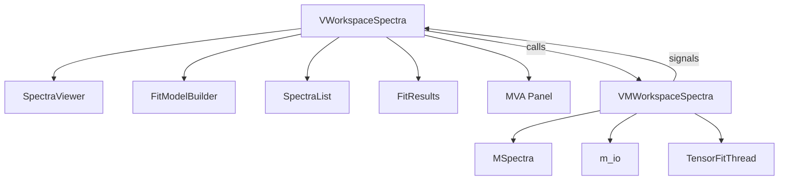
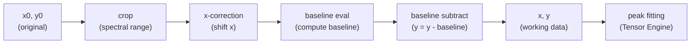

# Spectra Workspace

The Spectra Workspace is the core analytical environment. It manages loading, preprocessing, fitting, and exporting spectral data. It serves as the **base class** that the Maps workspace extends.

---

## Architecture Overview



---

## Key Classes

### `VMWorkspaceSpectra` — The ViewModel

**File**: `spectroview/viewmodel/vm_workspace_spectra.py` (~1050 lines)

This is the largest and most critical ViewModel. It owns the `MSpectra` collection and orchestrates every operation on spectra. Key responsibilities:

| Responsibility | Methods |
|---------------|---------|
| **Loading** | `load_spectra(paths)`, `_load_single_file()` |
| **Selection** | `select_spectra(fnames)`, `_get_selected_spectra()`, `_get_active_spectra()` |
| **Preprocessing** | `crop_spectra(xmin, xmax)`, `apply_xcorrection()` |
| **Baseline** | `set_baseline_settings()`, `subtract_baseline()`, `delete_baseline()` |
| **Peaks** | `add_peak_at(x)`, `remove_peak_at(x)`, `copy/paste_peaks()` |
| **Fitting** | `fit(apply_all)`, `_run_fit_thread()`, `_on_fit_finished()` |
| **Results** | `collect_fit_results()`, `save_fit_results_to_excel()` |
| **Persistence** | `save_work()`, `load_work()`, `_create_spectrum_from_dict()` |
| **Model management** | `copy/paste_fit_model()`, `save_fit_model()`, `apply_loaded_fit_model()` |
| **Workspace reset** | `reinit_spectra()`, `clear_workspace()` |

#### Signals (ViewModel → View)

```python
spectra_list_changed = Signal(list)         # Full list refresh
spectra_selection_changed = Signal(list)     # Selected subset changed
fit_progress_updated = Signal(int, int, int, float)  # (current, total, converged, R²)
fit_results_updated = Signal(object)        # pd.DataFrame of fit results
count_changed = Signal(int)                 # Total spectrum count
notify = Signal(str)                        # Toast notification message
```

### `MSpectrum` — The Data Object

**File**: `spectroview/model/m_spectrum.py` (~134 lines)

Extends `fitspy.Spectrum` with SPECTROview-specific attributes:

| Attribute | Type | Purpose |
|-----------|------|---------|
| `fname` | `str` | Unique identifier / display name |
| `x0`, `y0` | `ndarray` | Original (immutable) data |
| `x`, `y` | `ndarray` | Working data (after crop, baseline subtraction) |
| `baseline` | `Baseline` | Baseline object with mode, anchor points, coefficients |
| `peak_models` | `list[Model]` | lmfit peak model objects |
| `peak_labels` | `list[str]` | User-defined peak labels |
| `result_fit` | `FitResult` | Fitting results (R², parameters, residuals) |
| `xcorrection_value` | `float` | X-axis shift applied |
| `metadata` | `dict` | Instrument metadata (from WDF/SPC) |
| `color` | `str` | Display color in the spectra viewer |
| `is_active` | `bool` | Checkbox state (checked = active) |
| `is_preprocessed` | `bool` | Whether `preprocess()` has been called |

### `MSpectra` — The Collection

**File**: `spectroview/model/m_spectra.py` (~130 lines)

A list-like container for `MSpectrum` objects. Provides:

- `add(spectrum)` / `remove(indices)` — Collection management
- `save(is_map=False)` — Serialize all spectra to dict (with `zlib+base64` compression)
- Iteration support: `for spectrum in spectra: ...`

---

## Spectrum Lifecycle

### 1. Loading

The `m_io` module detects file format by extension and returns `MSpectrum` objects:

| Format | Loader Function | Notes |
|--------|----------------|-------|
| `.txt` | `load_spectrum_file()` | Auto-detects delimiter (`;`, `\t`, whitespace) |
| `.csv` | `load_spectrum_file()` | Semicolon delimiter, 3 header rows |
| `.wdf` | `load_wdf_spectrum()` | Renishaw WiRE format, extracts metadata |
| `.spc` | `load_spc_spectrum()` | Galactic SPC binary format |
| `.dat` | `load_TRPL_data()` | Time-Resolved Photoluminescence |

After loading, the ViewModel adds the spectrum to `self.spectra` and emits `spectra_list_changed`.

### 2. Preprocessing Pipeline

When a user modifies baseline, spectral range, or X-correction, the spectrum goes through preprocessing:



!!! note "Key Design Decision"
    The original arrays `x0` and `y0` are **never modified** after initial loading. All transformations operate on `x` and `y`, and `reinit_spectra()` restores them from `x0/y0` at any time.

### 3. Baseline Processing

The `VFitModelBuilder` provides two families of baseline methods:

**Manual Modes** (`Linear`, `Polynomial`):

- User places anchor points on the plot by clicking in "baseline" tool mode.
- The `VSpectraViewer.baseline_add_requested` signal passes `(x, y)` coordinates to the ViewModel.
- The ViewModel calls `spectrum.baseline.add_point()` and triggers a replot.
- When "Subtract" is clicked, `baseline.eval()` computes the interpolated baseline and `y = y - baseline`.

**Automatic Modes** (`airPLS`, `asLS`):

- Smoothness is controlled by a slider mapped to λ = 10^coef.
- The `baseline_preview_requested` signal provides live preview without committing.
- On "Subtract", the ViewModel calls `baseline.eval(x, y)` which uses the selected `pybaselines` algorithm.

### 4. Peak Model Assignment

Peaks are added interactively (click on spectrum in "peak" mode) or programmatically (paste/apply model):

1. `VSpectraViewer.peak_add_requested.emit(x_position)` → ViewModel
2. ViewModel creates an `lmfit.Model` with the selected peak shape (from `__init__.PEAK_MODELS`)
3. Initial parameters (`center`, `fwhm`, `amplitude`) are estimated from the data
4. The model is appended to `spectrum.peak_models`
5. The View's `VPeakTable` updates to show the new peak's editable parameters

### 5. Fitting

When "Fit" is triggered:

1. **ViewModel** instantiates `TensorFitThread` with the list of spectra to fit
2. **TensorFitThread.run()** calls `TensorFittingEngine.fit_spectra()`
3. The engine groups spectra by **peak model signature** (same number/types of peaks → same batch)
4. Each batch is optimized using the **Batched Levenberg-Marquardt** algorithm
5. On completion, `_on_fit_finished()` writes results back to each `MSpectrum` object
6. `collect_fit_results()` builds a `pd.DataFrame` with all fitted parameters

### 6. Fit Results Collection

`collect_fit_results()` iterates over all active spectra and extracts:

| Column | Source |
|--------|--------|
| `Filename` | `spectrum.fname` |
| `{peak_label}_center` | `param_hints["center"]["value"]` |
| `{peak_label}_fwhm` | `param_hints["fwhm"]["value"]` |
| `{peak_label}_amplitude` | `param_hints["amplitude"]["value"]` |
| `{peak_label}_area` | Computed from `param_hints` |
| `R²` | `spectrum.result_fit.rsquared` |

The resulting DataFrame is emitted via `fit_results_updated` and displayed in the `VFitResults` table.

---

## Fit Model Management

### Copy / Paste

- **Copy** serializes the current spectrum's baseline settings, peak models, and their `param_hints` into a clipboard dict stored on the ViewModel.
- **Paste** applies the clipboard to the selected spectrum(s) or all spectra (Ctrl+Click → `apply_all=True`).

### Save / Load

- **Save** writes the model to a `.json` file in the user's configured model folder (`MSettings.get_model_folder()`).
- **Load** populates the model dropdown (`cbb_model`). Selecting and clicking "Apply" applies the saved model.

### Model Structure (JSON)

```json
{
  "baseline": {
    "mode": "Linear",
    "attached": true,
    "sigma": 4,
    "points": [[x1, x2, ...], [y1, y2, ...]]
  },
  "peak_models": [
    {
      "model_name": "PseudoVoigtModel",
      "peak_label": "Si",
      "param_hints": {
        "center": {"value": 520.7, "min": 518, "max": 523, "vary": true, "expr": ""},
        "fwhm": {"value": 3.2, "min": 0.1, "max": 200, "vary": true, "expr": ""},
        "amplitude": {"value": 1000, "min": 0, "max": 100000, "vary": true, "expr": ""},
        "fraction": {"value": 0.5, "min": 0, "max": 1, "vary": true, "expr": ""}
      }
    }
  ]
}
```

---

## Persistence: Save/Load Work

### Save Flow

```python
def save_work(self):
    spectrums_data = self.spectra.save()  # Compresses x0/y0 with zlib+base64
    data = {
        'spectrums_data': spectrums_data,
        'df_fit_results': self.df_fit_results.to_dict('records') if df else None,
    }
    json.dump(data, file)
```

### Load Flow

```python
def load_work(self, file_path):
    data = json.load(file)
    for spectrum_id, spectrum_data in data['spectrums_data'].items():
        spectrum = self._create_spectrum_from_dict(spectrum_data, x0, y0)
        self.spectra.append(spectrum)
```

The `_create_spectrum_from_dict()` method is the **shared reconstruction helper** used by both Spectra and Maps workspaces. It handles:

- Decompressing `x0`/`y0` arrays from `zlib+base64`
- Restoring baseline settings and re-evaluating if needed
- Re-applying spectral range cropping
- Restoring peak models from `param_hints`
- Setting `xcorrection_value` and other custom attributes

---

## View Components

### VSpectraViewer

The central Matplotlib canvas renders:

- **Spectrum lines** (with waterfall X/Y shift via sliders)
- **Raw data overlay** (toggle via options menu)
- **Baseline curves** with anchor point markers
- **Individual peak curves** (smooth, using 1000-point interpolation)
- **Best-fit envelope** (sum of peaks + baseline)
- **Residuals** (observed - fitted)
- **Legend** (pickable for label/color editing)
- **R² display** from the first selected spectrum

Tool modes (exclusive radio buttons):

| Mode | Behavior on Click |
|------|------------------|
| **Zoom** | Standard Matplotlib zoom/pan |
| **Baseline** | Left-click adds anchor point; right-click removes nearest |
| **Peak** | Left-click adds peak at x-position; right-click removes nearest |

### VFitModelBuilder

A splitter panel with:

- **Left pane**: X-correction, spectral range, baseline controls, peak shape selector
- **Right pane**: `VPeakTable` (editable peak parameters) + fit action buttons

All actions support **Ctrl+Click** for "apply to all spectra" via the `_emit_with_ctrl()` helper.

### VSpectraList

A `QListWidget` with:

- Checkboxes per spectrum (checked = active for fitting)
- Color indicators 
- Context menu for rename, delete, copy
- Multi-selection support (Ctrl/Shift+Click)
