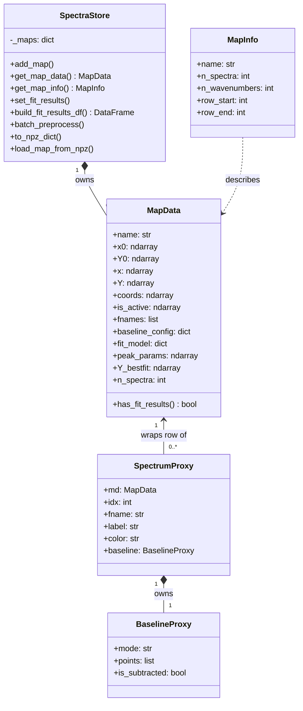

# **Data Architecture: SpectraStore**

`SpectraStore` is the **single source of truth** for all numerical spectral data in SPECTROview. Both the [Spectra](spectra.md) and [Maps](maps.md) workspaces read from and write to the same store. Understanding this module is the most important step for any new contributor.

**Source file**: [`spectra_store.py`](https://github.com/CEA-MetroCarac/SPECTROview/blob/main/spectroview/model/spectra_store.py)

---

## Design Philosophy

Before `SpectraStore` (version before 26.24.1), SPECTROview stored each spectrum as an independent Python object. This created performance bottlenecks when working with large hyperspectral maps (thousands of spectra). The tensor-centric redesign stores all spectra for a logical "map" as contiguous NumPy arrays, enabling:

- **Vectorized preprocessing** — range crop and baseline subtraction applied to the entire N×M matrix in a single operation.
- **Batch fitting** — the [VBF engine](vbf_engine.md) operates directly on the tensor without Python-level iteration.
- **O(1) map access** — retrieving a map's data is a single dictionary lookup, regardless of store size.
- **Heterogeneous datasets** — each map owns its own x-axis, so maps with different wavenumber ranges coexist cleanly.

---

## Data Hierarchy

```
SpectraStore
└── dict: _maps { map_name → MapData }
    │
    ├── MapData ("spectrum_A")          ← Spectra workspace: single spectrum (N=1)
    │   ├── x0: float64[M]             raw wavenumber axis
    │   ├── Y0: float32[1, M]          raw intensity (1 spectrum)
    │   ├── x:  float64[M_proc]        processed axis (after crop)
    │   ├── Y:  float32[1, M_proc]     processed intensity (after crop + baseline)
    │   ├── coords: float64[1, 2]      always (0.0, 0.0) for point spectra
    │   ├── fnames: ["spectrum_A"]      unique identifier
    │   ├── fit_model: dict             peak model definition
    │   ├── peak_params: float64[1, K]  fitted parameters
    │   ├── fit_success: bool[1]
    │   └── ...
    │
    └── MapData ("wafer_300mm")         ← Maps workspace: hyperspectral map (N=2500)
        ├── x0: float64[M]
        ├── Y0: float32[2500, M]        raw intensity matrix
        ├── coords: float64[2500, 2]    (X, Y) stage positions
        ├── fnames: [str × 2500]        "wafer_300mm_(x, y)" per spectrum
        ├── peak_params: float64[2500, K]
        ├── fit_success: bool[2500]
        └── ...
```

> [!IMPORTANT]
> **Both a single spectrum and a full hyperspectral map use the same `MapData` structure** — they only differ in N (the number of rows). This unified model is what enables the Spectra and Maps workspaces to share the same ViewModel base class (`VMWorkspaceSpectra`).

---

## `MapData` — The Tensor Block

```python
@dataclass
class MapData:
    """All numerical data for a single hyperspectral map."""
    name: str
```

`MapData` is a dataclass that owns all heavy arrays for one logical dataset. Its fields are organized into functional groups:

### Spectral Arrays (immutable raw + mutable processed)

| Field | Shape | dtype | Purpose |
|-------|-------|-------|---------|
| `x0` | `[M]` | float64 | Original wavenumber axis — **never mutated** |
| `Y0` | `[N, M]` | float32 | Original intensities — **never mutated** |
| `x` | `[M_proc]` | float64 | Working axis after crop/x-correction (or `None` → use `x0`) |
| `Y` | `[N, M_proc]` | float32 | Working intensities after all preprocessing (or `None` → use `Y0`) |
| `coords` | `[N, 2]` | float64 | Spatial (X, Y) positions — always `(0, 0)` for point spectra |

> [!IMPORTANT]
> The **dual-array design** (`x0/Y0` vs `x/Y`) is the key to non-destructive preprocessing. `x0` and `Y0` are written once on file load and **never touched again**. All preprocessing produces `x` and `Y`. Calling `reinit_spectra()` simply sets `md.x = None; md.Y = None`, making the store fall back to the raw arrays.

### Per-Spectrum Metadata

| Field | Length | Purpose |
|-------|--------|---------|
| `fnames` | N | Unique string identifier for each spectrum row |
| `is_active` | N | `bool` — whether this spectrum is checked in the UI list |
| `colors` | N | Optional display color per spectrum |
| `labels` | N | Optional user-assigned display label |

### Preprocessing State (shared across all N spectra in a map)

| Field | Type | Purpose |
|-------|------|---------|
| `baseline_config` | `dict` | Baseline algorithm and parameters (`mode`, `points`, `coef`, ...) |
| `is_baseline_subtracted` | `bool` or `bool[N]` | Whether `Y` has had the baseline removed |
| `range_min` / `range_max` | `float` | Current spectral crop boundaries |
| `xcorrection_value` | `float` | X-axis shift applied (cm⁻¹) |
| `intensity_norm_factor` | `float` | Multiplicative intensity normalization |
| `map_metadata` | `dict` | Acquisition metadata from WDF/SPC files |

### Fit Results (filled after VBF engine runs)

| Field | Shape | dtype | Purpose |
|-------|-------|-------|---------|
| `peak_params` | `[N, K]` | float64 | Optimized parameter values |
| `fit_success` | `[N]` | bool | Convergence flag per spectrum |
| `fit_r2` | `[N]` | float64 | Coefficient of determination per spectrum |
| `param_names` | list[str] | — | Column labels for `peak_params` (e.g. `m01_x0`, `m01_fwhm`) |
| `fit_model` | `dict` | — | Peak model definition used for fitting |

### Visualization Curves (derived, for rendering only)

| Field | Shape | Purpose |
|-------|-------|---------|
| `Y_bestfit` | `[N, M_proc]` | Composite model curve (sum of all peaks + baseline) |
| `Y_baseline` | `[N, M_proc]` | Evaluated baseline curve |
| `Y_peaks` | list of `[N, M_proc]` | One array per peak (for individual peak rendering) |

---

## `MapInfo` — Lightweight Descriptor

```python
@dataclass
class MapInfo:
    name: str
    row_start: int   # always 0 (kept for API compatibility)
    row_end: int
    n_spectra: int
    n_wavenumbers: int
```

`MapInfo` is a minimal summary returned by `SpectraStore.get_map_info()`. It exists for **API compatibility** — older code that needed to know "where does this map start in the global array" still works without modification, even though the global array no longer exists. Prefer `get_map_data()` for direct access.

---

## `SpectraStore` — The Container

```python
class SpectraStore:
    _maps: dict[str, MapData]   # per-map data blocks
```

`SpectraStore` is a thin dictionary-backed container. Its public API separates cleanly into:

### Map Registration

```python
store.add_map(name, x0, Y0, coords, fnames, ...)   # register a new map
store.remove_map(name)                              # delete a map and free memory
store.reorder_maps(new_order)                       # reorder for list display
```

### Data Access

```python
md   = store.get_map_data(name)                     # MapData — primary access
info = store.get_map_info(name)                     # MapInfo — lightweight summary
x, Y = store.get_xy_batch(name, indices)            # (processed) arrays for subset
```

### Fit Results

```python
store.set_fit_results(name, indices, peak_params, success, r2, param_names, fit_model)
store.build_fit_results_df(name, map_type, peak_labels, only_converged)  # → pd.DataFrame
```

### Preprocessing

```python
store.batch_preprocess(name, baseline_config, range_min, range_max)   # vectorized
store.clear_preprocess(name)                                           # reset to x0/Y0
```

### Serialization

```python
store.to_npz_dict(name)              # heavy arrays → dict for NPZ
store.to_metadata_dict(name)         # lightweight metadata → dict for JSON
SpectraStore.load_map_from_npz(...)  # class method: restore from saved arrays
```

---

## `SpectrumProxy` and `BaselineProxy` — View Bridge

`SpectrumProxy` and `BaselineProxy` are **read/write proxy objects** that present a single-spectrum interface without duplicating any tensor data.

```python
class SpectrumProxy:
    md: MapData       # reference to the parent tensor block
    idx: int          # row index within the tensor
    fname: str        # unique identifier

    @property
    def label(self): ...   # reads md.labels[idx]
    @label.setter          # writes md.labels[idx]
    
    @property
    def color(self): ...   # reads md.colors[idx]
    @color.setter          # writes md.colors[idx]
```

The View never holds raw arrays. When `VMWorkspaceSpectra._emit_selected_spectra()` prepares the payload for `VSpectraViewer`, it packages a list of `SpectrumProxy` objects alongside the array slices. This means the View can call `proxy.label = "My Label"` and the change automatically lands in `md.labels[idx]` without any explicit callback.

---

## Class Relationships



---

## Data Management Strategy

### Storage

Each spectrum or map is stored as an independent `MapData` block in `SpectraStore._maps`. There is no global array or shared index. This eliminates range arithmetic and makes deletion O(1) (`del _maps[name]`).

For each `MapData`, the store holds **two array pairs**:

| Pair | Contents | Mutability |
|------|----------|-----------|
| `x0 / Y0` | Raw, file-loaded data | **Read-only** after registration |
| `x / Y` | Preprocessed working data | Overwritten by `batch_preprocess()`, deleted by `clear_preprocess()` |

When `x` or `Y` is `None`, the store transparently falls back to `x0` / `Y0` in all access methods (`get_xy_batch`, `set_plot_data`, etc.).

### Retrieval

ViewModels always retrieve data through `SpectraStore.get_map_data(name)` which returns a **direct reference** (not a copy) to the `MapData` block. This means:

- **Reads are zero-copy** — no data is duplicated.
- **Writes are immediate** — any modification to `md.Y` is visible everywhere that holds a reference to the same `md`.

This is why the ViewModel calls `self.store.get_map_data(fname)` at the start of every operation, rather than caching `md` as an instance variable.

### Updates and Synchronization

The ViewModel follows a consistent update pattern after every state change:

```
mutate MapData  →  _emit_selected_spectra()  →  [optional] _emit_list_update()
```

`_emit_selected_spectra()` re-reads all selected `MapData` blocks and emits a fresh payload to the viewer. `_emit_list_update()` re-reads all map names and emits status dicts for the spectra list coloring.

This **pull-on-signal** pattern ensures the View is always consistent with the model without needing explicit change notifications on every field mutation.

### Memory Management

- `Y0` is stored as `float32` to halve memory vs `float64`, with no perceptible precision loss for spectroscopy.
- Processed arrays `Y` are only allocated after the first preprocessing operation.
- `Y_bestfit`, `Y_baseline`, and `Y_peaks` are allocated lazily on first fit.
- Deleting a map with `store.remove_map(name)` removes the dict entry; Python garbage collection releases the arrays when no other references exist.
- Large baseline computation intermediates are not cached — they are recomputed on demand by `eval_baseline_batch()`.

---

## Preprocessing Pipeline

All preprocessing is **non-destructive**. `x0` and `Y0` are always preserved.

1. **Raw Data**: `x0` and `Y0` (immutable).
2. **Range Crop**: Arrays are sliced between `md.range_min` and `md.range_max`.
3. **X-Correction**: `md.xcorrection_value` is added to the wavenumber axis.
4. **Baseline Evaluation**: `SpectraStore.batch_preprocess()` evaluates the baseline model for the entire tensor.
5. **Baseline Subtraction**: The evaluated baseline is subtracted from the cropped intensities.
6. **Working Arrays**: The final results are stored in `md.x` and `md.Y`.
7. **Downstream Usage**: These working arrays are used for all visualization and fitting operations.

`SpectraStore.batch_preprocess()` applies range crop and baseline subtraction to the entire N×M matrix in a single vectorized call. For the Spectra workspace (N=1), this processes one spectrum. For the Maps workspace (N=2500), it processes the entire map tensor in one call.

---

## Persistence

### Modern Format (v2+, ZIP-backed)

Workspace files (`.spectra` / `.maps`) are ZIP archives:

| Entry | Content |
|-------|---------|
| `metadata.json` | Lightweight JSON: `format_version`, `store_meta` dict (fnames, colors, labels, baseline_config, fit_model, range bounds, xcorrection) |
| `arrays.npz` | NumPy compressed arrays: `store_{name}_x0`, `store_{name}_y0`, `store_{name}_coords`, `store_{name}_peak_params`, `store_{name}_Y_bestfit`, `store_{name}_Y_peak_{i}` |
| `dataframes.pkl` | Optional: pickled `df_fit_results` |

The separation of lightweight JSON from heavy binary arrays enables fast metadata inspection without loading gigabytes of spectral data.

### Serialization API

```python
# Save path: ViewModel → SpectraStore → WorkspaceIO
metadata = store.to_metadata_dict(name)   # JSON-serializable dict
arrays   = store.to_npz_dict(name)        # heavy NumPy arrays

# Load path: WorkspaceIO → SpectraStore
SpectraStore.load_map_from_npz(store, name, arrays, metadata)
```

---

## Troubleshooting

**Preprocessing not applied to viewer**
- The viewer receives `md.x` / `md.Y` from the payload. If `batch_preprocess()` was not called (e.g., no baseline config and no range), `md.x` and `md.Y` remain `None` and the viewer falls back to `md.x0` / `md.Y0`. This is the expected non-destructive behavior.

**Memory grows unboundedly with large maps**
- `md.Y_bestfit`, `md.Y_baseline`, and `md.Y_peaks` are never freed until the map is deleted or `reinit_spectra()` is called (which resets them to `None`). For very large maps, call `store.remove_map()` for maps that are no longer needed.

**`get_map_data()` returns `None`**
- The map name is case-sensitive and must match the exact key used in `add_map()`. Check `store.map_names` for the registered keys.

**Zero-copy semantics cause unintended side effects**
- Because `get_map_data()` returns a direct reference, modifying `md.Y` anywhere affects all consumers. Always operate through the ViewModel's established mutate-then-signal pipeline to ensure UI consistency.
