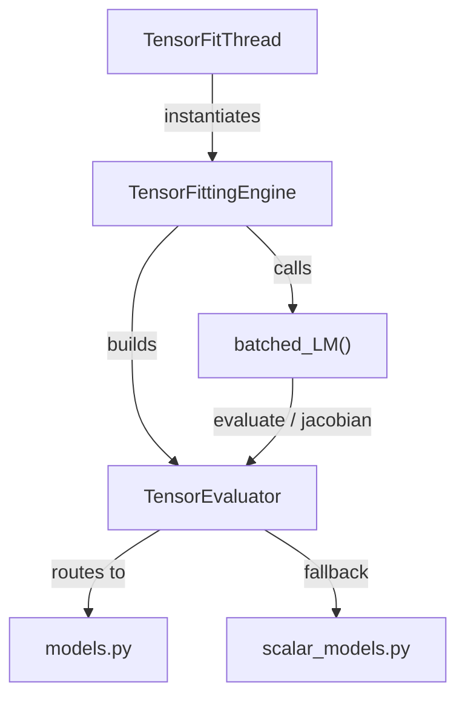
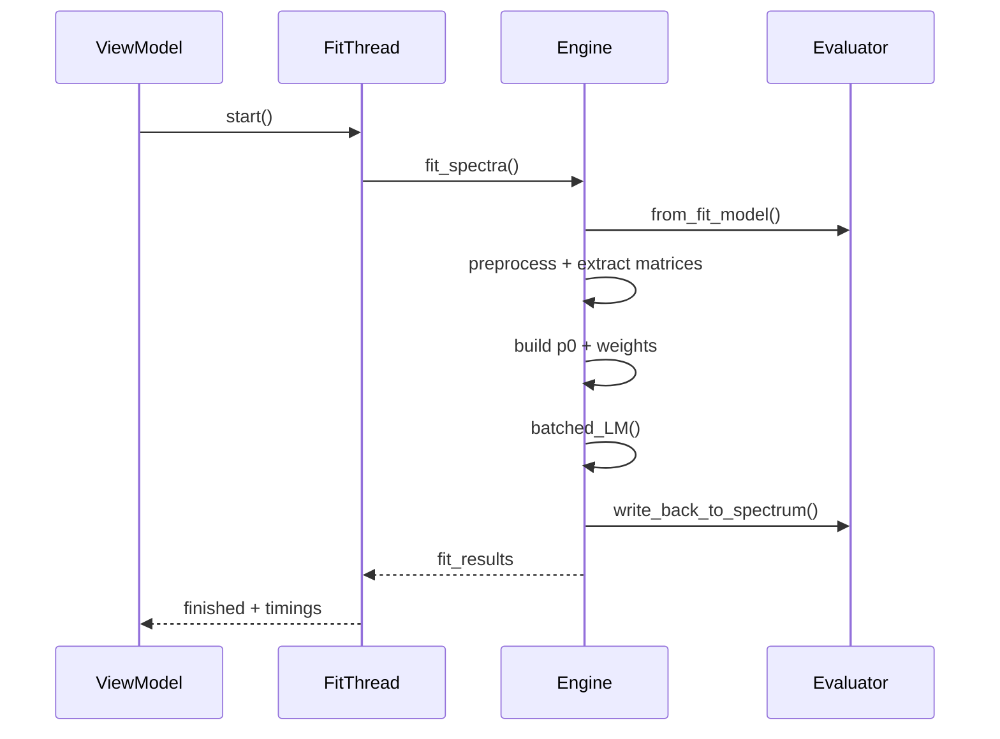
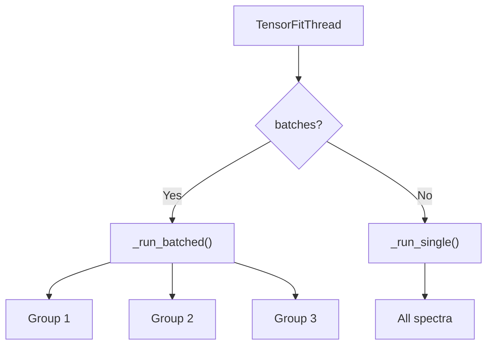

# Developer Guide: Tensor Fit Engine

This document provides a deep dive into the inner workings, architecture, and performance characteristics of the Tensor Fit Engine located in `spectroview/fit_engine/`.

---

## 1. Why the Tensor Engine is Much Faster

The legacy fit engines (based on `lmfit`/`scipy.optimize.least_squares`) operate on a **per-spectrum** basis. For a hyperspectral map containing thousands of spectra, this approach introduces significant overhead:
- **Python Function Call Overhead**: Calling the objective function and Jacobian estimator thousands of times per iteration.
- **Finite-Difference Jacobians**: Approximating the Jacobian numerically requires `2 * K` (where K is the number of parameters) additional function evaluations per iteration, per spectrum.
- **Sequential Execution**: Even with multiprocessing, the overhead of serialization and inter-process communication creates bottlenecks.

The **Tensor Fit Engine** achieves massive speedups (~10x to 15x faster) through the following core principles:

1.  **All-at-Once Optimization**: It optimizes all \(N\) spectra simultaneously. The parameter matrices, data arrays, and residuals are manipulated as large 2D or 3D tensors.
2.  **Vectorized Operations (BLAS/LAPACK)**: By framing the problem as tensors, the heavy lifting is offloaded to highly optimized C/Fortran libraries.
    - Matrix multiplications and transpositions for the normal equations (\(J^T J\) and \(J^T r\)) are performed using `np.einsum`.
    - The linear systems for all spectra are solved in a single call to `np.linalg.solve`, which dispatches to LAPACK.
3.  **Analytical Jacobians**: Instead of estimating derivatives numerically, the engine uses exact analytical formulas for common peak shapes (Lorentzian, Gaussian, PseudoVoigt). This eliminates the \(2K\) extra evaluations entirely.
4.  **No Spatial Propagation**: Unlike older map-fitting approaches that used spiral traversal to propagate guesses from neighbor to neighbor (forcing sequential execution), the tensor engine initializes all pixels independently using amplitude scaling, allowing purely parallel tensor math.
5.  **Variable Length Support**: Spectra with different lengths (e.g. differently cropped) are padded with zeros to fit into a uniform 2D tensor, while a boolean `weights` mask ensures padded regions are ignored during optimization.
6.  **Expression Support**: Supports complex mathematical relationships between parameters across the batch by evaluating mathematical constraints symbolically before mapping to free parameters.

---

## 2. Code Logic and Core Implementation Principles

The engine implements a **Batched Levenberg-Marquardt** algorithm.

### The Mathematics of Batched LM
For \(N\) spectra, each with \(M\) wavelength points and \(K\) free parameters:

1.  **Evaluate Model**: \(\mathbf{Y}_{pred} = f(\mathbf{x}, \mathbf{p})\), returning an \((N, M)\) tensor.
2.  **Calculate Residuals**: \(\mathbf{r} = \mathbf{W} \circ (\mathbf{Y}_{pred} - \mathbf{Y}_{data})\), returning an \((N, M)\) tensor.
3.  **Calculate Jacobian**: \(\mathbf{J} = \frac{\partial f}{\partial \mathbf{p}}\), returning an \((N, M, K)\) tensor.
4.  **Normal Equations**: Assemble \(J^T J\) (size \(N \times K \times K\)) and \(J^T r\) (size \(N \times K\)).
5.  **Damping (Marquardt step)**: Add a damping factor \(\lambda_i\) to the diagonal of \(J^T J\) for each spectrum \(i\).
6.  **Solve**: Solve \((J^T J + \lambda \text{diag}(J^T J)) \delta \mathbf{p} = -J^T r\) for all \(N\) spectra simultaneously.
7.  **Evaluate Step**: Update \(\mathbf{p} \leftarrow \mathbf{p} + \delta \mathbf{p}\) (with projection to bounds) and evaluate the new cost. Adjust \(\lambda\) per spectrum based on success/failure.

### Independent Convergence
Even though the math is batched, each spectrum converges independently. The optimizer uses a boolean mask (`active = ~converged`) to skip Jacobian calculations and linear solves for spectra that have already reached the tolerance limits, progressively speeding up the later iterations.

---

## 3. Folder and Class Structure



| Module | Class / Function | Responsibility |
|--------|-----------------|----------------|
| `tensor_fit_thread.py` | `TensorFitThread` | QThread wrapper. Supports single-model and batched modes. Emits `progress_changed` and `timings_ready` signals. Sets 8 MB stack on macOS to prevent LAPACK segfaults. |
| `tensor_engine.py` | `TensorFittingEngine` | Public API orchestrator. Manages the 8-step pipeline: apply model → preprocess → extract matrices → build p0 → build weights → optimize → write back results. Records step-level timings. |
| `evaluator.py` | `TensorEvaluator` | Bridge between the dictionary-based `fit_model` and the flat tensor API. Parses peak definitions, manages free/fixed parameter indexing, evaluates expressions, routes to correct batched model functions, builds `FitResult` objects. |
| `optimizer.py` | `batched_levenberg_marquardt()` | Pure numerical optimizer. Solves N independent least-squares problems simultaneously using `np.einsum` for normal equations and `np.linalg.solve` for the linear system. GUI-agnostic. |
| `models.py` | `batched_*()` functions | Vectorized peak shape functions and their analytical Jacobians. Contains the `BATCHED_MODELS` registry. Includes `numerical_jacobian()` fallback. |
| `scalar_models.py` | `FitResult`, `ParamValue`, scalar functions | Lightweight result classes compatible with lmfit's interface. Scalar peak functions used as fallbacks when no batched implementation exists. Contains `PEAK_MODEL_REGISTRY`. |

---

## 4. Processing Pipeline / Execution Flow

When a user triggers a fit (e.g., via the "Fit" button), the following pipeline executes:



### Step-by-Step Details

**Step 1 — Model Application** (`apply_model_to_spectra=True`):
The `fit_model` dictionary is applied to all `MSpectrum` objects via `apply_custom_fit_model()`, ensuring they have the correct number and type of peaks. When `False` (Spectra workspace with per-spectrum models), the `TensorFitThread` pre-groups spectra by model signature and processes each group as a separate batch.

**Step 2 — Evaluator Construction**:
`TensorEvaluator.from_fit_model()` iterates over `peak_models` in the fit model dict. For each peak, it:

- Looks up the model name in `BATCHED_MODELS` (fast path) or `PEAK_MODEL_REGISTRY` (scalar fallback)
- Extracts `param_hints` (value, min, max, vary, expr) for each parameter
- Assigns a sequential prefix (`m01_`, `m02_`, ...) to parameter names
- Builds `_free_idx` / `_fixed_idx` arrays for the free ↔ full parameter mapping
- Parses expression strings (e.g., `m01_fwhm`) and marks linked parameters as fixed

**Step 3 — Preprocessing**:
Calls `spectrum.preprocess()` on spectra that haven't been preprocessed yet (baseline evaluation, spectral range cropping).

**Step 4 — Data Extraction**:
Spectra with different lengths are zero-padded to `max_M` (the longest spectrum). The weights matrix is built by `_build_fit_weights()`, which handles:

| Weight Rule | Condition | Effect |
|------------|-----------|--------|
| Negative masking | `fit_negative=False` | `w[y < 0] = 0` |
| Outlier masking | `fit_outliers=False` | `w[outlier_positions] = 0` |
| Noise threshold | `coef_noise > 0` | `w[smoothed_y < noise_level] = 0` |
| Zero-padding | Padded region | `w[M_s:] = 0` (automatic) |

**Step 5 — Initial Parameters (p0)**:

- **First fit** (`apply_model_to_spectra=True`): `build_p0_matrix()` tiles the model's initial values and scales each spectrum's amplitudes proportionally to the actual data intensity at the peak center position. Ratio is clamped to `[0.01, 100]` to prevent extreme initial guesses.
- **Re-fit** (`apply_model_to_spectra=False`): `extract_p0_from_spectrum()` reads the existing fitted `param_hints` values from each spectrum (warm start).

After p0 construction, `apply_noise_threshold()` zeros out amplitude and FWHM for peaks located in regions below the noise floor.

**Step 6 — Optimization**: See Section 2 for the LM algorithm details.

**Step 7 — Result Writeback**:
For each spectrum, `build_result()` reconstructs the full parameter vector, evaluates the best-fit curve, and computes R². Then `write_back_to_spectrum()` writes the optimized values back to each `peak_model.param_hints` and sets `spectrum.result_fit`.

---

## 5. The TensorEvaluator in Detail

The `TensorEvaluator` is the most complex class in the engine. It serves as the **bridge** between the flexible, dictionary-based world of the GUI and the rigid, flat-tensor world of the optimizer.

### Parameter Space Mapping

```
fit_model dict                    TensorEvaluator                  Optimizer
┌─────────────────┐     ┌────────────────────────────┐     ┌──────────────┐
│ peak_models:    │     │ _param_names:              │     │              │
│   "0":          │     │   ["m01_ampli",            │     │  p_free      │
│     Gaussian:   │ ──► │    "m01_fwhm",             │ ──► │  (N, K_free) │
│       ampli: .. │     │    "m01_x0",               │     │              │
│       fwhm:  .. │     │    "m02_ampli", ...]       │     │              │
│       x0:    .. │     │                            │     │              │
│   "1":          │     │ _free_idx:  [0, 1, 2, 3]   │     │              │
│     Lorentzian: │     │ _fixed_idx: [4]             │     │              │
│       ampli: .. │     │ _fixed_values: [0.5]        │     │              │
│       ...       │     │                            │     │              │
└─────────────────┘     └────────────────────────────┘     └──────────────┘
```

### Expression Support

Parameters can reference other parameters via mathematical expressions (e.g., `m01_fwhm = m02_fwhm` or `m01_x0 + 10`). The evaluator handles this in `_to_full()`:

1. Parameters with expressions are marked as **fixed** (not optimized directly)
2. During `_to_full()`, expressions are evaluated using Python's `eval()` with a restricted namespace containing all parameter names, `np`, and common math functions
3. A **multi-pass resolution** loop handles expression chains (e.g., `a = b`, `b = c`) by retrying failed evaluations until all dependencies are resolved
4. The Jacobian accounts for expressions via the **chain rule**: a numerical `J_expr` matrix is computed by perturbing each free parameter and observing how the full parameter vector changes, then the true Jacobian is `J_full @ J_expr`

### Model Routing

The evaluator's `evaluate()` and `jacobian()` methods iterate over all registered peaks and sum their contributions:

```python
def evaluate(self, x, p_free):
    p_full = self._to_full(p_free)           # (N, K_total)
    Y = np.zeros((N, M))
    for model_name, slc, eval_fn, jac_fn, has_jac in self._peaks:
        Y += eval_fn(x, p_full[:, slc])      # Each peak adds its contribution
    return Y
```

For the Jacobian, if a peak has an analytical Jacobian (`has_jac=True`), it's used directly. Otherwise, `numerical_jacobian()` is called as a fallback with central differences and relative perturbation scaling.

---

## 6. Batched Peak Models and Analytical Jacobians

### Tensor Conventions

All batched functions follow the same signature:

```python
def batched_shape(x, params):
    """
    x:      (M,) shared axis  OR  (N, M) per-spectrum axis
    params: (N, n_p) parameter matrix
    Returns: (N, M) predicted values
    """

def batched_shape_jac(x, params):
    """Returns: (N, M, n_p) Jacobian tensor"""
```

### Registered Models (`BATCHED_MODELS`)

All peak models have vectorized batched implementations with **analytical Jacobians**, ensuring maximum performance for every model type:

| Model | Parameters | Formula |
|-------|-----------|---------|
| `Gaussian` | `ampli, fwhm, x0` | \(a \cdot \exp\left(-4\ln 2 \cdot \frac{(x-x_0)^2}{w^2}\right)\) |
| `Lorentzian` | `ampli, fwhm, x0` | \(\frac{a}{1 + 4(x-x_0)^2/w^2}\) |
| `PseudoVoigt` | `ampli, fwhm, x0, alpha` | \(\alpha \cdot G + (1-\alpha) \cdot L\) |
| `GaussianAsym` | `ampli, fwhm_l, fwhm_r, x0` | Piecewise Gaussian with left/right FWHM |
| `LorentzianAsym` | `ampli, fwhm_l, fwhm_r, x0` | Piecewise Lorentzian with left/right FWHM |
| `Fano` | `ampli, fwhm, x0, q` | \(a \cdot \frac{(q + \varepsilon)^2}{1 + \varepsilon^2}\), \(\varepsilon = \frac{2(x-x_0)}{w}\) |
| `DecaySingleExp` | `A, tau, B` | \(A \cdot e^{-x/\tau} + B\) |
| `DecayBiExp` | `A1, tau1, A2, tau2, B` | \(A_1 e^{-x/\tau_1} + A_2 e^{-x/\tau_2} + B\) |

### Numerical Jacobian Fallback

For future custom models registered only in `PEAK_MODEL_REGISTRY` (without a batched implementation), `numerical_jacobian()` uses **central differences** with relative perturbation as a fallback:

```python
h = max(|param| * eps, eps)          # Scale step to parameter magnitude
J[:,:,k] = (f(p+h) - f(p-h)) / 2h  # Central difference
```

This is ~`2K` times slower than analytical Jacobians per iteration but ensures correctness for any model shape.

---

## 7. The TensorFitThread

### Two Operating Modes



**Single-model mode** (Maps workspace / Apply Fit Model):
All spectra share one `fit_model`. The engine processes them in one tensor batch.

**Batched mode** (Spectra workspace / individual models):
When spectra have different peak configurations, the ViewModel groups them by model signature (same number and types of peaks). Each group is processed sequentially through the engine, but spectra *within* each group are optimized in parallel.

### macOS Stack Size

The thread sets an 8 MB stack size on macOS (`setStackSize(8 * 1024 * 1024)`) because:

- macOS defaults QThread stack to 512 KB
- `np.linalg.solve` dispatches to LAPACK, which allocates workspace arrays on the stack
- For large K (many parameters), the stack allocation can exceed 512 KB, causing segfaults

### Signals

| Signal | Payload | Purpose |
|--------|---------|---------|
| `progress_changed` | `(current, total, percent, elapsed)` | Updates progress bar in the View |
| `timings_ready` | `str` | Formatted timing breakdown for console/debug |

---

## 8. Optimization Parameters and Adjustments

The engine behavior can be tuned via the `fit_params` dictionary passed to `fit_spectra()`.

### Key Parameters
*   **`max_ite` (default: 200)**: The maximum number of Levenberg-Marquardt iterations. Increasing this might help extremely difficult spectra converge but will increase total execution time.
*   **`xtol` (default: 1e-4)**: The relative tolerance for the parameter step size \(\delta p\). If the relative change in all parameters is less than `xtol`, the spectrum is considered converged.
*   **`ftol` (default: 1e-4)**: The relative tolerance for the cost function (sum of squared residuals). If the relative change in the cost is less than `ftol`, the spectrum is considered converged.
*   **`fit_negative` (default: `False`)**: Whether to include negative intensity values in the fit. When `False`, negative points get zero weight.
*   **`fit_outliers` (default: `False`)**: Whether to include statistical outlier points. When `False`, outliers detected by `spectrum.calculate_outliers()` get zero weight.
*   **`coef_noise` (default: 1)**: Noise coefficient multiplier. When > 0, activates noise-based weight masking and peak suppression. See [Section 9](#9-noise-amplitude-estimation-and-noise-threshold) for a detailed explanation.

### Tuning for Performance vs. Accuracy
- **Fast Mapping**: For rapid previews, you can increase `xtol` and `ftol` to `1e-3` or `1e-2`. The optimizer will exit much earlier, providing a rough fit in a fraction of the time.
- **Precision Fitting**: For publication-quality results, decrease `xtol` and `ftol` to `1e-5` or `1e-6`.
- **Handling "Stuck" Spectra**: The optimizer tracks `consecutive_rejects`. If a spectrum's cost fails to improve for 15 consecutive iterations (despite damping adjustments), it is marked as converged (stuck) to prevent it from holding back the rest of the batch. This threshold (`MAX_REJECTS` in `optimizer.py`) can be adjusted if needed.

### Damping Schedule

The per-spectrum damping factor \(\lambda\) is initialized at `1e-2` and adjusted after each iteration:

| Outcome | λ adjustment | Effect |
|---------|-------------|--------|
| Cost improved | `λ /= 3.0` (floor `1e-10`) | Trust the Gauss-Newton direction more |
| Cost worsened | `λ *= 2.5` (ceiling `1e10`) | Shift toward gradient descent |

---

## 9. Noise Amplitude Estimation and Noise Threshold

The `coef_noise` parameter controls a noise-aware filtering system that can significantly improve both the **performance** and **precision** of fitting, especially on hyperspectral maps where many pixels may contain weak or absent peaks.

### How Noise Amplitude Is Estimated (`eval_noise_amplitude`)

The noise amplitude is estimated by the `eval_noise_amplitude()` function from the `fitspy` library (`fitspy.core.utils`). It quantifies the **high-frequency oscillation amplitude** of the spectrum — i.e., the typical point-to-point noise — while being robust to real spectral features.

```python
def eval_noise_amplitude(y):
    delta = np.diff(y)                              # δ[i] = y[i+1] − y[i]
    delta1, delta2 = delta[:-1], delta[1:]          # adjacent difference pairs
    mask = np.sign(delta1) * np.sign(delta2) == -1  # sign-alternating (zigzag)
    ampli_noise = np.median(np.abs(delta1[mask] - delta2[mask]) / 2)
    return ampli_noise
```

**Step-by-step logic:**

| Step | Operation | Purpose |
|------|-----------|--------|
| 1 | `np.diff(y)` | Computes consecutive differences \(\delta_i = y_{i+1} - y_i\) |
| 2 | Pair adjacent deltas | Creates overlapping pairs \((\delta_i, \delta_{i+1})\) |
| 3 | Sign-alternation mask | Selects only **zigzag** points where the signal goes up-then-down or down-then-up on consecutive steps — the signature of random noise |
| 4 | Half peak-to-peak | For each zigzag, \(\|\delta_i - \delta_{i+1}\| / 2\) measures the half-amplitude of the oscillation |
| 5 | Median | Takes the **median** over all zigzag points, making the estimate robust to outliers and real peaks |

**Why this works:** Real spectral peaks are broad features that create **sustained** positive or negative runs in the difference vector. They are excluded by the sign-alternation mask (step 3). Only rapid up-down oscillations characteristic of noise pass through, so the estimate cleanly separates noise from signal even if 30–50% of the spectrum contains strong peaks.

### How `coef_noise` Activates Noise Thresholding

When `coef_noise > 0`, the engine computes a **noise level threshold**:

\[
\text{noise\_level} = \text{coef\_noise} \times \text{ampli\_noise}
\]

This threshold activates **two complementary mechanisms**:

#### Mechanism A — Weight Masking (`_build_fit_weights`)

During weight matrix construction in `tensor_engine.py`, a 5-point moving average smooths the spectrum, and any data point where the smoothed signal falls below the noise level is **excluded from the fit** by setting its weight to zero:

```python
ymean = np.convolve(y, np.ones(5) / 5.0, mode='same')  # 5-point moving average
noise_level = coef_noise * ampli_noise
w[ymean < noise_level] = 0.0   # zero weight → ignored by optimizer
```

The optimizer's residual calculation \(\mathbf{r} = \mathbf{W} \circ (\mathbf{Y}_{pred} - \mathbf{Y}_{data})\) naturally ignores these masked points, so the fit focuses only on regions with meaningful signal.

#### Mechanism B — Peak Suppression (`apply_noise_threshold`)

In the `TensorEvaluator`, any peak whose **center position** (`x0`) falls in a below-threshold region has its initial parameters forcibly set to zero:

```python
for each peak:
    x0_val = peak center position
    if ymean[at x0] < noise_level:
        ampli = 0.0    # force amplitude to zero
        fwhm  = 0.0    # force width to zero
```

This runs **twice** during the pipeline:

1. **Before optimization** (Step 5 in the pipeline) — sets a clean initial guess, preventing the optimizer from trying to fit noise fluctuations as peaks.
2. **After optimization** (Step 7) — cleans up any peaks that may have drifted into noise regions during the LM iterations.

### Performance and Precision Benefits

#### Performance

| Aspect | How it helps |
|--------|-------------|
| Faster convergence | Zeroed-out peaks in noise regions start and stay at zero, effectively reducing the active parameter count |
| Fewer wasted iterations | Without noise masking, the optimizer spends many iterations fitting random noise with tiny ghost peaks |
| Better initial guess | Pre-zeroing noise-region peaks brings \(p_0\) closer to the true solution, so LM converges in fewer iterations |

#### Precision

| Aspect | How it helps |
|--------|-------------|
| Eliminates ghost peaks | In maps, some pixels have weak or absent peaks. Without thresholding, noise fluctuations are fitted as tiny false peaks, producing artifacts in parameter maps |
| Stabilizes correlated parameters | Near the noise floor, amplitude, width, and position become highly correlated — small noise perturbations cause large parameter swings. Suppression avoids this instability |
| Prevents cross-talk | A ghost peak in a noise region can "steal" intensity from a real neighboring peak, biasing its fitted amplitude. Suppression prevents this |
| Cleaner R² values | Masked noise regions don't contribute to the R² calculation, so the reported goodness-of-fit reflects only meaningful signal regions |

### Practical Example

Consider a Raman map with 3 defined peaks, where for some pixels peak #2 sits in a flat baseline region:

```
Without coef_noise (= 0):
  Peak #2 → ampli = 0.3 (noise artifact), fwhm = 2.1 (meaningless), x0 = 520.3 (drifted)
  Peak #1 → ampli = 18.2 (slightly biased — peak #2 stealing intensity)

With coef_noise = 1:
  Peak #2 → ampli = 0.0, fwhm = 0.0   (correctly suppressed)
  Peak #1 → ampli = 19.1              (accurate, no cross-talk)
```

### Choosing the Right `coef_noise` Value

| Value | Behavior |
|-------|----------|
| `0` | **Disabled** — all peaks are fitted everywhere, no noise masking |
| `0.5 – 1.0` | **Conservative** — only suppresses peaks/regions well below the noise floor |
| `1.0 – 2.0` | **Moderate** — good default for most datasets |
| `3.0 – 5.0` | **Aggressive** — may suppress real weak peaks; use with caution |
| `> 5.0` | **Very aggressive** — only strong, unambiguous peaks survive |

The default value in `spectroview/__init__.py` is `1`. The Settings UI exposes it as a spin box with range `[0, 100]` and step `0.5`.

---

## 10. Adding New Peak Models

### Fast Path: Analytical Jacobian (Recommended)

To add a new peak shape with maximum performance:

**Step 1** — Define the batched evaluation function in `models.py`:

```python
def batched_newshape(x, params):
    """
    x:      (M,) or (N, M)
    params: (N, n_p) where columns are [param1, param2, ...]
    Returns: (N, M)
    """
    p1 = params[:, 0:1]    # (N, 1) — broadcasts over M
    p2 = params[:, 1:2]
    if x.ndim == 1:
        dx = x[None, :] - p2    # (N, M)
    else:
        dx = x - p2
    return p1 * some_function(dx)
```

**Step 2** — Derive and define the analytical Jacobian:

```python
def batched_newshape_jac(x, params):
    """Returns: (N, M, n_p) — partial derivatives w.r.t. each parameter."""
    # ... compute intermediates ...
    N, M = result.shape
    J = np.empty((N, M, n_p))
    J[:, :, 0] = d_result_d_p1
    J[:, :, 1] = d_result_d_p2
    return J
```

**Step 3** — Register in the `BATCHED_MODELS` dictionary:

```python
BATCHED_MODELS = {
    # ... existing ...
    "NewShape": (batched_newshape, batched_newshape_jac, ["param1", "param2", ...]),
}
```

### Slow Path: Scalar Fallback

If deriving an analytical Jacobian is impractical:

**Step 1** — Define a scalar function in `scalar_models.py`:

```python
def newshape(x, param1, param2):
    """x is a 1D array, params are scalars. Returns 1D array."""
    return param1 * some_function(x - param2)
```

**Step 2** — Register in `PEAK_MODEL_REGISTRY`:

```python
PEAK_MODEL_REGISTRY = {
    # ... existing ...
    "NewShape": (newshape, ["param1", "param2"]),
}
```

The evaluator will automatically wrap it via `_make_batched_scalar()` and use `numerical_jacobian()`. This is functional but significantly slower (~10-50× per peak per iteration).

### Registration in the Application

After adding the model to the engine, register it in `spectroview/__init__.py`:

```python
PEAK_MODELS = [
    "Gaussian", "Lorentzian", "PseudoVoigt",
    # ... existing ...
    "NewShape",  # Add here to appear in the UI dropdown
]
```

---

## 11. Timing and Diagnostics

The `TensorFittingEngine` records wall-clock timings for each step in `self.timings`:

```
Step 1 - apply_model:  0.012s
Step 2 - preprocess:   0.045s
Step 3 - build p0:     0.003s
Step 4 - tensor fit:   1.234s (0.6 ms/spectrum, 1950/2000 converged)
Step 5 - write_back:   0.089s
```

These timings are emitted via `TensorFitThread.timings_ready` and printed to the console. They are invaluable for diagnosing performance bottlenecks:

- If **Step 1** dominates → too many spectra to apply model to; consider caching
- If **Step 4** dominates → normal; this is the actual optimization
- If **Step 4** shows low convergence → check initial guesses, bounds, or model suitability
- If **Step 5** dominates → many spectra with complex write-back; usually negligible

### R² Computation

The goodness-of-fit metric R² is computed during `build_result()`:

\[
R^2 = 1 - \frac{\sum_i w_i (y_i - \hat{y}_i)^2}{\sum_i w_i (y_i - \bar{y}_w)^2}
\]

Where \(\bar{y}_w\) is the weighted mean. When weights are present, only non-zero-weight points contribute to both numerator and denominator, ensuring that masked regions (negative values, outliers, padding) don't artificially inflate or deflate the reported quality.
