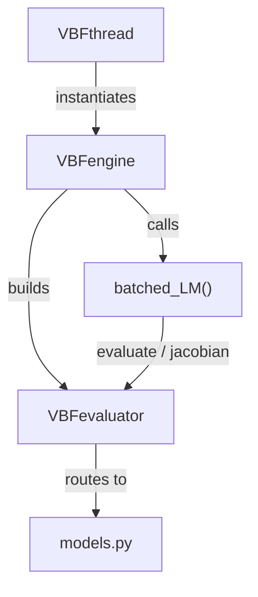
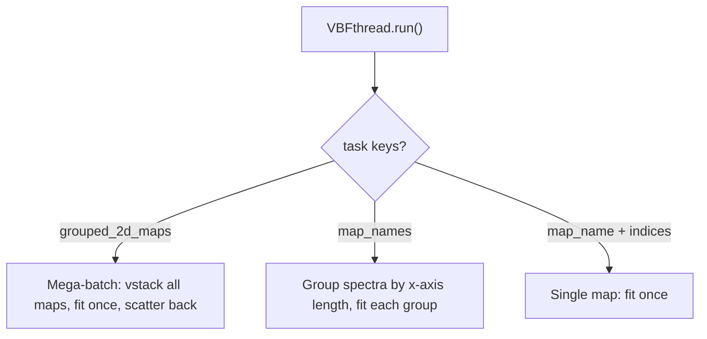

# **Developer Guide: Vectorized Batch Fit Engine (VBF)**

This document provides a deep dive into the inner workings, architecture, and performance characteristics of the Vectorized Batch Fit Engine (`VBF`) located in `spectroview/fit_engine/`.

---

## **1. Why the `VBF Engine` Is Much Faster**

The legacy fit engines operate on a **per-spectrum** basis. For a hyperspectral map containing thousands of spectra, this approach introduces significant overhead:
- **Python Function Call Overhead**: Calling the objective function and Jacobian estimator thousands of times per iteration.
- **Finite-Difference Jacobians**: Approximating the Jacobian numerically requires `2 * K` (where K is the number of parameters) additional function evaluations per iteration, per spectrum.
- **Sequential Execution**: Even with multiprocessing, the overhead of serialization and inter-process communication creates bottlenecks.

The **Vectorized Batch Fit Engine (`VBF Engine`)** achieves massive speedups through the following core principles:

1.  **All-at-Once Optimization**: It optimizes all \(N\) spectra simultaneously. The parameter matrices, data arrays, and residuals are manipulated as large 2D or 3D tensors.
2.  **Vectorized Operations (BLAS/LAPACK)**: By framing the problem as tensors, the heavy lifting is offloaded to highly optimized C/Fortran libraries.
    - Matrix multiplications and transpositions for the normal equations (\(J^T J\) and \(J^T r\)) are performed using `np.matmul`, which dispatches to a batched BLAS `gemm` call. (An earlier version used `np.einsum` for this; `einsum` does not dispatch to BLAS for this contraction pattern and was measured 13–20× slower — see §2.)
    - The linear systems for all spectra are solved via an **adaptive strategy**: NumPy's batched `np.linalg.solve` (LAPACK) for large batches, or a per-matrix SciPy `cho_solve` (Cholesky) loop for small batches with many parameters. See `_batched_solve()` in §2.
3.  **Analytical Jacobians**: Instead of estimating derivatives numerically, the engine uses exact analytical formulas for every registered peak shape (`Gaussian`, `Lorentzian`, `PseudoVoigt`, `GaussianAsym`, `LorentzianAsym`, `Fano`, `DecaySingleExp`, `DecayBiExp`). This eliminates the \(2K\) extra evaluations entirely.
4.  **No Spatial Propagation**: Unlike older map-fitting approaches that used spiral traversal to propagate guesses from neighbor to neighbor (forcing sequential execution), the `VBF Engine` initializes all pixels independently using amplitude scaling, allowing purely parallel tensor math.
5.  **Variable Length Support**: When spectra don't share a common x-axis, `x` is passed as an `(N, M)` matrix instead of `(M,)`, and every batched model/Jacobian function branches on `x.ndim` to broadcast per-row instead of per-column.
6.  **Expression Support**: Supports complex mathematical relationships between parameters across the batch by evaluating mathematical constraints symbolically before mapping to free parameters.

---


## **2. Performance Optimizations**

The items below are specific to the numerical core in `fit_engine/`. Preprocessing-level optimizations (range cropping, baseline evaluation over the whole map tensor) live in `SpectraStore.batch_preprocess()` and are documented in [spectra_store.md](spectra_store.md).

1. **Batched normal-equation assembly via `np.matmul` instead of `np.einsum`** (13–20× faster for \(J^TJ\), 3–4× for \(J^Tr\), measured across realistic N/M/K sizes): `np.einsum('nmk,nml->nkl', J, J)` does not dispatch to BLAS for this contraction pattern and falls back to a generic reduction loop. The mathematically identical `J.transpose(0, 2, 1) @ J` dispatches to a batched BLAS `gemm` call.
2. **Skip redundant Jacobian/normal-equation recomputation for rejected steps**: a rejected LM trial leaves a spectrum's parameters unchanged, so its Jacobian — and therefore \(J^TJ\)/\(J^Tr\) — is still exactly valid; only the damping term needs to change before retrying. `optimizer.py` caches \(J^TJ\)/\(J^Tr\) per spectrum (`JTJ_cache`, `JTr_cache`) and only recomputes them for spectra whose *last* step was accepted (tracked via a `dirty` boolean array), instead of for every active spectrum on every iteration. This is exact, not an approximation — verified to add zero additional numerical drift versus eager recomputation. On a slow-converging map (many spectra retrying at the same point under increasing damping), roughly 30% of active-spectrum iterations are rejected steps, so this directly eliminates ~30% of the two most expensive per-iteration operations.
3. **Guarded `np.nan_to_num`**: `np.nan_to_num` runs three separate full-array passes (`isnan`/`isposinf`/`isneginf`) plus fancy-index assignment, even when nothing is actually wrong — true on the overwhelming majority of iterations. `optimizer._finite_or_clean()` checks `np.isfinite(arr).all()` first (a single fused pass) and only pays for the cleanup when something needs fixing — ~10× faster on the common, clean path.
4. **Reduced temporaries in the batched peak models**: every function in `models.py` computes each repeated quantity (`1/w²`, `1/w³`, `dx²`, …) once and reuses it, replacing repeated `(N,M)`-sized divisions with a single `(N,1)` reciprocal plus a broadcasted multiply, and using in-place ops (`*=`, `+=`, `np.exp(..., out=...)`) to avoid allocating extra full-size arrays. `PseudoVoigt` computes its blend as `L + alpha*(G-L)` in place instead of building two fresh `(N,M[,3])` arrays. `GaussianAsym`/`LorentzianAsym` select the per-point effective FWHM with `np.where(dx < 0, wl, wr)` instead of casting a boolean mask to float and blending. Measured 1.0–1.4× per-function speedup (largest on `eval`-only calls; smaller on Jacobians where `exp()` or division already dominates the cost). All rewrites were validated against the original formulas over thousands of random trials (including near-zero/negative widths and near-overflow decay rates) to ≤1e-10 relative error.
5. **Shared noise-floor statistics**: `apply_noise_threshold()` runs once before the fit (to seed a clean initial guess) and once after (to clean up any peaks that drifted into a noisy region — see §5.2 and §10). Both calls need the same median/smoothing-based noise statistics. `VBFevaluator.compute_noise_stats()` computes them once per `fit_spectra()` call and both invocations reuse the result, instead of repeating the median pass twice.
6. **Adaptive Batched Solver** (`_batched_solve()`): dynamically chooses between NumPy's batched `np.linalg.solve` (best for large N, or small K) and a per-matrix SciPy `cho_solve` loop (Cholesky decomposition — best for small N with large K, exploiting the symmetric positive-definite structure of the normal equations).
7. **Mean-Based Convergence Criteria**: the convergence check uses `mean(|Δp| / |p|) < xtol` rather than `max()`, preventing a single slowly converging parameter in multi-peak models from stalling the entire spectrum.
8. **Vectorized Write-Back**: `build_results_batch()` evaluates all best-fit curves and computes R² simultaneously across all spectra using a single `_to_full()` expansion — no per-spectrum Python loop.
9. **Zero-Weight Early Exit**: spectra identified as pure noise (all weights zero) are marked converged instantly, skipping every Levenberg-Marquardt iteration for them.

## **3. Code Logic and Core Implementation Principles**

The engine implements a **Batched Levenberg-Marquardt** algorithm.

### **3.1. The Mathematics of Batched LM**
For \(N\) spectra, each with \(M\) wavelength points and \(K\) free parameters:

1.  **Evaluate Model**: \(\mathbf{Y}_{pred} = f(\mathbf{x}, \mathbf{p})\), returning an \((N, M)\) tensor.
2.  **Calculate Residuals**: \(\mathbf{r} = \mathbf{W} \circ (\mathbf{Y}_{pred} - \mathbf{Y}_{data})\), returning an \((N, M)\) tensor.
3.  **Calculate Jacobian**: \(\mathbf{J} = \frac{\partial f}{\partial \mathbf{p}}\), returning an \((N, M, K)\) tensor.
4.  **Normal Equations**: Assemble \(J^T J\) (size \(N \times K \times K\)) and \(J^T r\) (size \(N \times K\)) via `np.matmul` (§2).
5.  **Damping (Marquardt step)**: Add a damping factor \(\lambda_i\) to the diagonal of \(J^T J\) for each spectrum \(i\).
6.  **Solve**: Solve \((J^T J + \lambda \text{diag}(J^T J)) \delta \mathbf{p} = -J^T r\) for all \(N\) spectra simultaneously.
7.  **Evaluate Step**: Update \(\mathbf{p} \leftarrow \mathbf{p} + \delta \mathbf{p}\) (with projection to bounds) and evaluate the new cost. Adjust \(\lambda\) per spectrum based on success/failure.

### **3.2. Independent Convergence**
Even though the math is batched, each spectrum converges independently. The optimizer uses a boolean mask (`active = ~converged`) to skip Jacobian calculations and linear solves for spectra that have already reached the tolerance limits, progressively speeding up the later iterations. A second boolean mask (`dirty`, see §2) further skips the Jacobian/normal-equation computation — but *not* the trial-step evaluation — for active spectra whose parameters didn't change on the previous iteration (a rejected step), since only the damping factor differs on the retry.

---

## **4. Folder and Class Structure**



| Module | Class / Function | Responsibility |
|--------|-----------------|----------------|
| `vbf_thread.py` | `VBFthread` | `QThread` wrapper. Groups tasks into single-map, mega-batch (`grouped_2d_maps`), or length-grouped (`map_names`) modes; builds the weights matrix; calls `VBFengine.fit_spectra()`; writes results back into `SpectraStore`. Emits `progress_changed` and `timings_ready` signals. Sets an 8 MB stack on macOS to prevent LAPACK segfaults. |
| `vbf_engine.py` | `VBFengine` | Public API orchestrator for a single fit call. Builds the evaluator, builds `p0` + applies the noise threshold, runs the optimizer, re-applies the noise threshold, and builds the result arrays. Records step-level timings in `self.timings`. |
| `evaluator.py` | `VBFevaluator` | Bridge between the dictionary-based `fit_model` and the flat tensor API. Parses peak definitions, manages free/fixed parameter indexing, evaluates expressions, routes to the correct batched model functions, and builds the returned result arrays (parameters, R², best fits, per-peak curves) — no intermediate `FitResult` objects. |
| `optimizer.py` | `batched_levenberg_marquardt()` | Pure numerical optimizer. Solves N independent least-squares problems simultaneously using batched `np.matmul` for the normal equations, with `JᵀJ`/`Jᵀr` caching to skip recomputation for rejected trial steps (§2). Uses an adaptive solver (`cho_solve` or `np.linalg.solve`) depending on matrix size. GUI-agnostic. |
| `models.py` | `batched_*()` functions | Vectorized peak shape functions and their analytical Jacobians. Contains the `BATCHED_MODELS` registry and the `numerical_jacobian()` fallback for models without one. |
| `scalar_models.py` | scalar peak functions | Single-spectrum reference implementations, and the `PEAK_MODEL_REGISTRY` they're registered under. Used by `eval_peak_initial()` (UI preview curves) and as the scalar fallback wrapped by `_make_batched_scalar()` in `evaluator.py` when a model exists in `PEAK_MODEL_REGISTRY` but has no batched implementation in `BATCHED_MODELS` — currently every registered model has both, so this fallback path is a safety net for future additions rather than something exercised today. |

---

## **5. Processing Pipeline / Execution Flow**

The pipeline has two levels: `VBFthread` orchestrates *tasks* (which spectra go together, how weights are built, where results are written), and `VBFengine.fit_spectra()` is the pure numerical core called once per task.

```mermaid
sequenceDiagram
    participant VM as ViewModel
    participant TFT as VBFthread
    participant TE as VBFengine
    participant EV as VBFevaluator
    participant OPT as optimizer

    VM->>TFT: start()
    TFT->>TFT: _prepare_weights() — negative-value & noise masking
    TFT->>TE: fit_spectra(x, Y, fit_model, weights, fit_params)
    TE->>EV: from_fit_model()
    TE->>EV: build_p0_matrix() + apply_noise_threshold() (pre-fit)
    TE->>OPT: batched_levenberg_marquardt()
    TE->>EV: apply_noise_threshold() (post-fit cleanup)
    TE->>EV: build_results_batch()
    TE-->>TFT: p_full, success, r², best_fits, Y_peaks
    TFT->>TFT: _write_results() → store.set_fit_results(), md.Y_bestfit / md.Y_peaks
    TFT-->>VM: progress_changed / timings_ready / finished
```

### **5.1. `VBFthread.run()` — Task Orchestration**

For each task, `VBFthread` picks one of three branches inside a single loop over `self.tasks` (there is no separate `_run_batched()`/`_run_single()` method):

| Task key present | When used | What happens |
|---|---|---|
| `grouped_2d_maps` | "Apply model to all maps" with a shared model | `np.vstack`s every map's `Y` into one matrix, fits it as a single mega-batch, then scatters the results back into each `MapData` by row range. |
| `map_names` | Spectra workspace batch-fitting many single spectra, each with its own model | Groups spectra by x-axis length (spectra must share length to stack into one matrix) and fits each length-group as one batch. |
| `map_name` + `indices` | Fitting one map (the common case) | Extracts `Y[indices]`, builds weights, calls `fit_spectra()` once. |

Before calling into the engine, `VBFthread._prepare_weights()` builds the weights matrix from `fit_negative` and `coef_noise` (see §9 and §10 — the noise-based masking here uses the same formula as `VBFevaluator.compute_noise_stats()`).

### **5.2. `VBFengine.fit_spectra()` — The Numerical Core**

1. **Build the evaluator** — `VBFevaluator.from_fit_model(fit_model)` parses `peak_models` into the flat parameter layout (§6). If every parameter is fixed (`n_params_free == 0`), the engine short-circuits and returns immediately.
2. **Build `p0`** — `build_p0_matrix()` tiles the model's initial values across all N spectra and rescales each peak's amplitude to the observed data at that peak's `x0` (the ratio is clamped to `[0.01, 100]` so a bad guess can't explode). `apply_noise_threshold()` then zeroes amplitude/FWHM for peaks whose center sits in a below-noise-floor region, giving the optimizer a clean starting point.
3. **Run the optimizer** — `batched_levenberg_marquardt()` (§3) iterates until every spectrum has converged, is marked "stuck" (§9.2), or `max_ite` is reached.
4. **Post-fit cleanup** — `apply_noise_threshold()` runs again on the optimized parameters, in case any peak drifted into a noise region during the LM iterations.
5. **Build results** — `build_results_batch()` evaluates the best-fit curves and per-peak curves once for the whole batch and computes R² vectorized across all N spectra. Returns plain arrays (`p_full`, `success`, `rsquared`, `best_fits`, `Y_peaks`, `param_names`) — not per-spectrum objects.

`VBFthread._write_results()` then writes those arrays into the `SpectraStore` (`set_fit_results()`) and onto the `MapData` object (`Y_bestfit`, `Y_peaks`).

---

## **6. The `VBFevaluator` in Detail**

The `VBFevaluator` is the most complex class in the engine. It serves as the **bridge** between the flexible, dictionary-based world of the GUI and the rigid, flat-tensor world of the optimizer.

### **6.1. Parameter Space Mapping**

```
fit_model dict                    VBFevaluator                  Optimizer
┌─────────────────┐     ┌────────────────────────────┐     ┌──────────────┐
│ peak_models:    │     │ _param_names:              │     │              │
│   "0":          │     │   ["m01_ampli",            │     │  p_free      │
│     Gaussian:   │ ──► │    "m01_fwhm",             │ ──► │  (N, K_free) │
│       ampli: .. │     │    "m01_x0",               │     │              │
│       fwhm:  .. │     │    "m02_ampli", ...]       │     │              │
│       x0:    .. │     │                            │     │              │
│   "1":          │     │ _free_idx:  [0, 1, 2, 3]   │     │              │
│     Lorentzian: │     │ _fixed_idx: [4]            │     │              │
│       ampli: .. │     │ _fixed_values: [0.5]       │     │              │
│       ...       │     │                            │     │              │
└─────────────────┘     └────────────────────────────┘     └──────────────┘
```

### **6.2. Expression Support**

Parameters can reference other parameters via mathematical expressions (e.g., `m01_fwhm = m02_fwhm` or `m01_x0 + 10`). The evaluator handles this in `_to_full()`:

1. Parameters with expressions are marked as **fixed** (not optimized directly).
2. During `_to_full()`, expressions are evaluated using Python's `eval()` with a restricted namespace containing all parameter names, `np`, and common math functions.
3. A **multi-pass resolution** loop handles expression chains (e.g., `a = b`, `b = c`) by retrying failed evaluations until all dependencies are resolved.
4. The Jacobian accounts for expressions via the **chain rule**: a numerical `J_expr` matrix is computed by perturbing each free parameter and observing how the full parameter vector changes, then the true Jacobian is `J_full @ J_expr`.

### **6.3. Model Routing**

The evaluator's `evaluate()` and `jacobian()` methods iterate over all registered peaks and sum their contributions:

```python
def evaluate(self, x, p_free):
    p_full = self._to_full(p_free)           # (N, K_total)
    Y = np.zeros((N, M))
    for model_name, slc, eval_fn, jac_fn, has_jac in self._peaks:
        Y += eval_fn(x, p_full[:, slc])      # Each peak adds its contribution
    return Y
```

For the Jacobian, if a peak has an analytical Jacobian (`has_jac=True`), it is used directly. Otherwise, `numerical_jacobian()` is called as a fallback with central differences and relative perturbation scaling.

---

## **7. Batched Peak Models and Analytical Jacobians**

### **7.1. Tensor Conventions**

All batched functions follow the same signature:

```python
def batched_shape(x, params):
    """
    x:      (M,) shared axis  OR  (N, M) per-spectrum axis
    params: (N, n_p) parameter matrix
    Returns: (N, M) predicted values
    """

def batched_shape_jac(x, params):
    """Returns: (N, M, n_p) Jacobian tensor"""
```

Internally, every function follows the same efficiency pattern (§2.4): compute each repeated quantity once (typically a reciprocal like `1/w²`), reuse it via broadcasted multiplication instead of re-dividing, and write into pre-allocated Jacobian slices in place.

### **7.2. Registered Models (`BATCHED_MODELS`)**

All peak models have vectorized batched implementations with **analytical Jacobians**, ensuring maximum performance for every model type:

| Model | Parameters | Formula |
|-------|-----------|---------| 
| `Gaussian` | `ampli`, `fwhm`, `x0` | <i>a</i> &middot; exp(-4 ln(2) &middot; (x-x<sub>0</sub>)<sup>2</sup> / w<sup>2</sup>) |
| `Lorentzian` | `ampli`, `fwhm`, `x0` | <i>a</i> / [1 + 4(x-x<sub>0</sub>)<sup>2</sup> / w<sup>2</sup>] |
| `PseudoVoigt` | `ampli`, `fwhm`, `x0`, `alpha` | &alpha; &middot; G + (1-&alpha;) &middot; L |
| `GaussianAsym` | `ampli`, `fwhm_l`, `fwhm_r`, `x0` | Piecewise Gaussian with left/right FWHM |
| `LorentzianAsym` | `ampli`, `fwhm_l`, `fwhm_r`, `x0` | Piecewise Lorentzian with left/right FWHM |
| `Fano` | `ampli`, `fwhm`, `x0`, `q` | <i>a</i> &middot; (q + &epsilon;)<sup>2</sup> / (1 + &epsilon;<sup>2</sup>), &epsilon; = 2(x-x<sub>0</sub>)/w |
| `DecaySingleExp` | `A`, `tau`, `B` | <i>A</i> &middot; e<sup>-x/&tau;</sup> + B |
| `DecayBiExp` | `A1`, `tau1`, `A2`, `tau2`, `B` | <i>A</i><sub>1</sub> &middot; e<sup>-x/&tau;<sub>1</sub></sup> + <i>A</i><sub>2</sub> &middot; e<sup>-x/&tau;<sub>2</sub></sup> + B |

### **7.3. Numerical Jacobian Fallback**

For future custom models registered only in `PEAK_MODEL_REGISTRY` (without a batched implementation), `numerical_jacobian()` uses **central differences** with relative perturbation as a fallback:

```python
h = max(|param| * eps, eps)          # Scale step to parameter magnitude
J[:,:,k] = (f(p+h) - f(p-h)) / 2h  # Central difference
```

This is ~`2K` times slower than analytical Jacobians per iteration but ensures correctness for any model shape.

---

## **8. The `VBFthread`**

### **8.1. Task Branches**



All three branches live inside one loop over `self.tasks` in `run()` — see §5.1 for what triggers each one.

### **8.2. macOS Stack Size**

The thread sets an 8 MB stack size on macOS (`setStackSize(8 * 1024 * 1024)`) because:

- macOS defaults `QThread` stack to 512 KB.
- `np.linalg.solve` dispatches to LAPACK, which allocates workspace arrays on the stack.
- For large K (many parameters), the stack allocation can exceed 512 KB, causing segfaults.

### **8.3. Signals**

| Signal | Payload | Purpose |
|--------|---------|---------| 
| `progress_changed` | `Signal(int, int, int, float, int)` → `(current, total, percent, elapsed_seconds, current)` | Updates progress bar in the View. (The 5th argument duplicates the 1st.) |
| `timings_ready` | `Signal(str)` | Formatted per-step timing breakdown for console/debug |

---

## **9. Optimization Parameters and Adjustments**

The engine behavior can be tuned via the `fit_params` dictionary passed to `fit_spectra()`.

### **9.1. Key Parameters**
*   **`max_ite`** (default: 200): The maximum number of Levenberg-Marquardt iterations. Increasing this might help extremely difficult spectra converge but will increase total execution time.
*   **`xtol`** (default: 1e-4): The relative tolerance for the parameter step size \(\delta p\). Convergence is reached when the **mean** relative change across all parameters (\(\operatorname{mean}(|\delta p| / |p|)\)) is less than `xtol`. This mean-based criterion ensures that a single slowly oscillating parameter does not artificially delay convergence for the entire spectrum.
*   **`ftol`** (default: 1e-4): The relative tolerance for the cost function (sum of squared residuals). If the relative change in the cost is less than `ftol`, the spectrum is considered converged.
*   **`fit_negative`** (default: `False`): Whether to include negative intensity values in the fit. When `False`, negative points receive zero weight (`VBFthread._prepare_weights()`).
*   **`coef_noise`** (default: 1): Noise coefficient multiplier. When > 0, activates noise-based weight masking (`VBFthread._prepare_weights()`) and peak suppression (`VBFevaluator.apply_noise_threshold()`). See [Section 10](#10-noise-level-estimation-and-noise-threshold) for a detailed explanation.
*   **`fit_outliers`** — **legacy key, not read by the current engine.** Older saved `fit_model` JSON files may still contain it, but nothing in `fit_engine/` (or anywhere else in the codebase) checks it anymore; it's silently ignored. Safe to leave in old files.

### **9.2. Tuning for Performance vs. Accuracy**
- **Fast Mapping**: For rapid previews, you can increase `xtol` and `ftol` to `1e-3` or `1e-2`. The optimizer will exit much earlier, providing a rough fit in a fraction of the time.
- **Precision Fitting**: For publication-quality results, decrease `xtol` and `ftol` to `1e-5` or `1e-6`.
- **Handling "Stuck" Spectra**: The optimizer tracks `consecutive_rejects`. If a spectrum's cost fails to improve for 15 consecutive iterations (despite damping adjustments), it is marked as converged (stuck) to prevent it from holding back the rest of the batch. This threshold (`MAX_REJECTS` in `optimizer.py`) can be adjusted if needed.

### **9.3. Damping Schedule**

The per-spectrum damping factor \(\lambda\) is initialized at `1e-2` and adjusted after each iteration:

| Outcome | λ Adjustment | Effect |
|---------|-------------|--------|
| Cost improved | `λ /= 3.0` (floor `1e-10`) | Trust the Gauss-Newton direction more |
| Cost worsened | `λ *= 2.5` (ceiling `1e10`) | Shift toward gradient descent |

---

## **10. Noise Level Estimation and Noise Threshold**

The `coef_noise` parameter controls a noise-aware filtering system that can significantly improve both the **performance** and **precision** of fitting, especially on hyperspectral maps where many pixels may contain weak or absent peaks.

### **10.1. How Noise Level Is Estimated**

Both the public `detect_noise_level()` helper (`fit_engine/noise.py`, used by the UI to display/report the noise level on the spectra viewer) and the internal batched estimator used during fitting (`VBFevaluator.compute_noise_stats()`, `VBFthread._prepare_weights()`) use the same robust estimator: the median absolute value of the first difference, rescaled to a Gaussian-equivalent sigma.

```python
def detect_noise_level(y: np.ndarray) -> float:
    dy = np.diff(y)                                    # δ[i] = y[i+1] − y[i]
    return np.median(np.abs(dy)) / 0.6745 * np.sqrt(2)
```

**Why this works:**

| Term | Purpose |
|------|--------|
| `np.diff(y)` | Point-to-point differences — dominated by noise, since real spectral features are broad and change slowly relative to one sample step |
| `np.median(np.abs(dy))` | Median absolute difference — robust to the occasional large jump at a sharp peak edge, unlike a plain standard deviation |
| `/ 0.6745` | Converts a Gaussian median-absolute-deviation into an equivalent standard deviation (0.6745 = the MAD-to-σ constant for a normal distribution) |
| `* sqrt(2)` | A first difference of two independent noisy samples has variance \(2\sigma^2\); this rescales back to the per-point noise σ |

`VBFevaluator.compute_noise_stats(Y, coef_noise)` applies the same `diff`/`median` logic along `axis=1` to estimate one noise level per spectrum simultaneously across the whole map, and additionally computes a 5-point moving average of the signal (`ymean`) used to decide, point-by-point, whether the *signal itself* — not just the noise — is above the floor:

```python
dy = np.diff(Y, axis=1)
ampli_noise = np.median(np.abs(dy), axis=1) / 0.6745 * np.sqrt(2)      # (N,)
Y_padded = np.pad(Y, ((0, 0), (2, 2)), mode='edge')
ymean = (Y_padded[:, 0:-4] + Y_padded[:, 1:-3] + Y_padded[:, 2:-2]
         + Y_padded[:, 3:-1] + Y_padded[:, 4:]) / 5.0                   # 5-point moving average
noise_level = coef_noise * ampli_noise                                   # (N,)
```

> `apply_noise_threshold()` is called twice per fit (before and after optimization — see §5.2), and both calls need the exact same `ymean`/`noise_level`. `VBFengine.fit_spectra()` computes them once via `compute_noise_stats()` and passes the result (`noise_stats=`) to both calls, instead of repeating the median/smoothing pass twice (§2).

### **10.2. How `coef_noise` Activates Noise Thresholding**

When `coef_noise > 0`, a **noise level threshold** is computed as `noise_level = coef_noise × ampli_noise`. This threshold activates **two complementary mechanisms**:

#### **10.2.1. Mechanism A — Weight Masking (`VBFthread._prepare_weights`)**

Before the fit starts, any data point where the smoothed signal (`ymean`) falls below the noise level has its weight set to zero:

```python
weights[ymean < noise_level[:, None]] = 0.0   # zero weight → ignored by optimizer
```

The optimizer's residual calculation \(\mathbf{r} = \mathbf{W} \circ (\mathbf{Y}_{pred} - \mathbf{Y}_{data})\) naturally ignores these masked points, so the fit focuses only on regions with meaningful signal.

#### **10.2.2. Mechanism B — Peak Suppression (`VBFevaluator.apply_noise_threshold`)**

Any peak whose **center position** (`x0`) falls in a below-threshold region has its amplitude and FWHM forced to zero; other shape parameters for that peak are restored to their pre-fit initial guess (`p0_matrix`) to prevent random fluctuations from being mapped as real structure. This runs **twice** during the pipeline (§5.2):

1. **Before optimization** — sets a clean initial guess, preventing the optimizer from trying to fit noise fluctuations as peaks.
2. **After optimization** — cleans up any peaks that may have drifted into noise regions during the LM iterations.

### **10.3. Performance and Precision Benefits**

#### **10.3.1. Performance**

| Aspect | How It Helps |
|--------|-------------|
| Faster convergence | Zeroed-out peaks in noise regions start and stay at zero, effectively reducing the active parameter count |
| Fewer wasted iterations | Without noise masking, the optimizer spends many iterations fitting random noise with tiny ghost peaks |
| Better initial guess | Pre-zeroing noise-region peaks brings \(p_0\) closer to the true solution, so LM converges in fewer iterations |

#### **10.3.2. Precision**

| Aspect | How It Helps |
|--------|-------------|
| Eliminates ghost peaks | In maps, some pixels have weak or absent peaks. Without thresholding, noise fluctuations are fitted as tiny false peaks, producing artifacts in parameter maps |
| Stabilizes correlated parameters | Near the noise floor, amplitude, width, and position become highly correlated — small noise perturbations cause large parameter swings. Suppression avoids this instability |
| Prevents cross-talk | A ghost peak in a noise region can "steal" intensity from a real neighboring peak, biasing its fitted amplitude. Suppression prevents this |
| Cleaner R² values | Masked noise regions do not contribute to the R² calculation, so the reported goodness-of-fit reflects only meaningful signal regions |

### **10.4. Practical Example**

Consider a Raman map with 3 defined peaks, where for some pixels peak #2 sits in a flat baseline region:

```
Without coef_noise (= 0):
  Peak #2 → ampli = 0.3 (noise artifact), fwhm = 2.1 (meaningless), x0 = 520.3 (drifted)
  Peak #1 → ampli = 18.2 (slightly biased — peak #2 stealing intensity)

With coef_noise = 1:
  Peak #2 → ampli = 0.0, fwhm = 0.0   (correctly suppressed)
  Peak #1 → ampli = 19.1              (accurate, no cross-talk)
```

### **10.5. Choosing the Right `coef_noise` Value**

| Value | Behavior |
|-------|----------|
| `0` | **Disabled** — all peaks are fitted everywhere, no noise masking |
| `0.5 – 1.0` | **Conservative** — only suppresses peaks/regions well below the noise floor |
| `1.0 – 2.0` | **Moderate** — good default for most datasets |
| `3.0 – 5.0` | **Aggressive** — may suppress real weak peaks; use with caution |
| `> 5.0` | **Very aggressive** — only strong, unambiguous peaks survive |

The default value in `spectroview/__init__.py` is `1`. The `Settings` UI exposes it as a spin box with range `[0, 100]` and step `0.5`.

---

## **11. Adding New Peak Models**

### **11.1. Fast Path: Analytical Jacobian (Recommended)**

To add a new peak shape with maximum performance:

**Step 1** — Define the batched evaluation function in `models.py`:

```python
def batched_newshape(x, params):
    """
    x:      (M,) or (N, M)
    params: (N, n_p) where columns are [param1, param2, ...]
    Returns: (N, M)
    """
    p1 = params[:, 0:1]    # (N, 1) — broadcasts over M
    p2 = params[:, 1:2]
    if x.ndim == 1:
        dx = x[None, :] - p2    # (N, M)
    else:
        dx = x - p2
    return p1 * some_function(dx)
```

**Step 2** — Derive and define the analytical Jacobian:

```python
def batched_newshape_jac(x, params):
    """Returns: (N, M, n_p) — partial derivatives w.r.t. each parameter."""
    # ... compute intermediates ...
    N, M = result.shape
    J = np.empty((N, M, n_p))
    J[:, :, 0] = d_result_d_p1
    J[:, :, 1] = d_result_d_p2
    return J
```

**Step 3** — Register in the `BATCHED_MODELS` dictionary:

```python
BATCHED_MODELS = {
    # ... existing ...
    "NewShape": (batched_newshape, batched_newshape_jac, ["param1", "param2", ...]),
}
```

When deriving the Jacobian, follow the efficiency pattern used throughout `models.py` (§2.4, §7.1): compute any repeated `1/w`-style term once as a reciprocal and reuse it, and prefer in-place ops (`*=`, `+=`) for large `(N,M)` intermediates. Validate the analytical Jacobian against `numerical_jacobian()` on random parameter sets before relying on it.

### **11.2. Slow Path: Scalar Fallback**

If deriving an analytical Jacobian is impractical:

**Step 1** — Define a scalar function in `scalar_models.py`:

```python
def newshape(x, param1, param2):
    """x is a 1D array, params are scalars. Returns 1D array."""
    return param1 * some_function(x - param2)
```

**Step 2** — Register in `PEAK_MODEL_REGISTRY`:

```python
PEAK_MODEL_REGISTRY = {
    # ... existing ...
    "NewShape": (newshape, ["param1", "param2"]),
}
```

The evaluator will automatically wrap it via `_make_batched_scalar()` and use `numerical_jacobian()`. This is functional but significantly slower (~10–50× per peak per iteration).

### **11.3. Registration in the Application**

After adding the model to the engine, register it in `spectroview/__init__.py`:

```python
PEAK_MODELS = [
    "Gaussian", "Lorentzian", "PseudoVoigt",
    # ... existing ...
    "NewShape",  # Add here to appear in the UI dropdown
]
```

---

## **12. Timing and Diagnostics**

The `VBFengine` records wall-clock timings for each step in `self.timings`:

```
Step 3 - build p0:     0.003s
Step 4 - batch fit:   1.234s (0.6 ms/spectrum, 1950/2000 converged)
Step 5 - write_back:   0.089s
```

Only these three entries are populated by `VBFengine.fit_spectra()` itself — the numbering starts at 3 because it continues from the (unrelated) upstream stages that happen before the engine is even called: model application to `MapData` and `SpectraStore.batch_preprocess()` (range crop + baseline subtraction), which are timed separately and documented in [spectra_store.md](spectra_store.md).

These timings are emitted via `VBFthread.timings_ready` and printed to the console (set `print_benchmark=True` on `fit_spectra()` for live prints during debugging). They are invaluable for diagnosing performance bottlenecks:

- If **Step 4** dominates → normal; this is the actual optimization, and by far the largest cost for any non-trivial map.
- If **Step 4** shows low convergence → check initial guesses, bounds, or model suitability rather than performance.
- If **Step 3** or **Step 5** are unexpectedly large relative to Step 4 → worth profiling; for typical maps they should be one to two orders of magnitude smaller than Step 4.

### **12.1. R² Computation**

The goodness-of-fit metric R² is computed during `build_results_batch()`:

$$
R^2 = 1 - \frac{\sum_i w_i (y_i - \hat{y}_i)^2}{\sum_i w_i (y_i - \bar{y}_w)^2}
$$

Where \(\bar{y}_w\) is the weighted mean. When weights are present, only non-zero-weight points contribute to both the numerator and denominator, ensuring that masked regions (negative values, noise-floor points) do not artificially inflate or deflate the reported quality.
