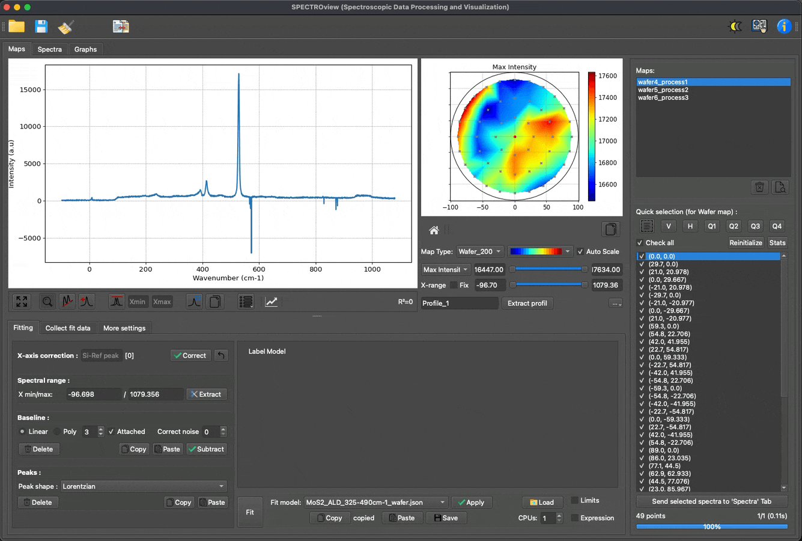

# SPECTROview

[](https://badge.fury.io/py/spectroview)
[](https://github.com/CEA-MetroCarac/spectroview)
[](https://pypi.org/project/spectroview/)
[](https://doi.org/10.5281/zenodo.14147172)

## A Tool for Spectroscopic Data Processing and Visualization

SPECTROview is a free, open-source software application designed for advanced spectroscopic data analysis. It supports a diverse array of data types, including discrete spectra and hyperspectral datasets such as 2D maps and wafer maps.

With its integrated visualization tools, SPECTROview streamlines your analytical workflow by consolidating data processing and visualization into a single, cohesive application.

> For more information, please visit the [GitHub Repository](https://github.com/CEA-MetroCarac/SPECTROview).

---

## Key Features

- **Cross-Platform Compatibility:** Fully supported on Windows, macOS, and Linux.
- **Versatile Data Processing:** Seamlessly process both 1D spectral data and 2D hyperspectral data.
- **High-Performance Vectorized Batch Fit Engine (VBF Engine):** Very fast fitting speeds utilizing batched matrix operations, capable of simultaneously fitting multiple spectra or large 2D maps.
- **Custom Fit Models:** Construct customized fit models for specific spectroscopic profiles and reuse them to rapidly analyze new datasets.
- **Unified Results:** Collect and compile all best-fit results with a single click.
- **Optimized User Interface:** Designed for quick inspection, filtering, and comparison of large spectral datasets.
- **Advanced Visualization:** Dedicated workspace for generating fast, publication-ready data visualizations.

---

## Demo

### Three distinct workspaces for processing discrete spectra, hyperspectral data, and data visualization


### Build custom fit models, replicate them across datasets, fit multiple spectra simultaneously, and aggregate all best-fit results with a single click


### Process hyperspectral maps and wafer data with high-performance batch fitting



### Rapidly and easily plot your data to generate professional visualizations


---

## Quick Start

```bash
pip install spectroview
spectroview
```

## Acknowledgements

This work was carried out at the CEA - Platform for Nanocharacterisation (PFNC) and supported by the "Recherche Technologique de Base" program of the French National Research Agency (ANR).

## Citation

If you use SPECTROview for data processing or visualization in your research, please cite the following publication:

> Le, V.-H., & Quéméré, P. (2025). SPECTROview: A Tool for Spectroscopic Data Processing and Visualization. Zenodo. [https://doi.org/10.5281/zenodo.14147172](https://doi.org/10.5281/zenodo.14147172)
