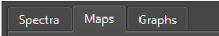
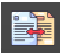
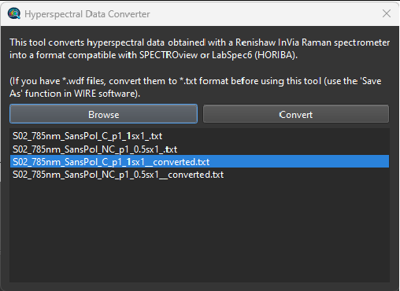
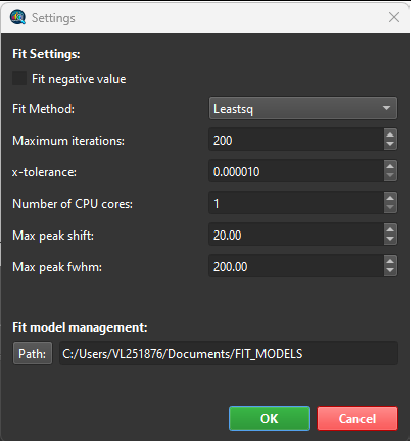
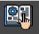

## 4. User Interface Overview

The SPECTROview application is designed for the efficient processing of spectroscopic data and the easy visualization of fitted results. The interface features three main workspaces, each developed for a specific purpose:

- **Spectra**: For processing one or multiple discrete spectra.
- **Maps**: For processing one or multiple hyperspectral datasets, including wafer data and 2D maps.
- **Graphs**: For plotting and visualizing data.

> **Tooltip**: Most GUI elements in SPECTROview (buttons, text boxes, dropdowns, etc.) feature tooltips. Hover the mouse cursor over an element for 1 second to see a brief explanation of its function.

### Toolbar

A horizontal toolbar is located at the top edge of the application containing the following buttons:

| Button | Function |
|--------|----------|
|  | **Open**: Loads all supported data types. The application will automatically switch to the appropriate workspace based on the loaded file type. | |
|  | **Save**: Saves the current active workspace to a file (`.maps`, `.spectra`, or `.graphs`), allowing the user to reopen it later and resume work. | |
|  | **Clear**: Clears the current active workspace to start a new session. All loaded data will be removed. | |
|  |    Figure 1: **File Convert Tool**: Opens the tool to convert hyperspectral data (2D maps) from the Renishaw WiRE format into a format supported by SPECTROview.. Load file(s) → Click "Convert" → New file created with `_converted` suffix. |
|  |    Figure 2: **Settings**: Opens the Settings Panel to adjust fitting parameters and define the storage folder for user-defined fitting models. |* |
|  | **Theme Toggle**: Switches the application GUI between Dark and Light modes. | |
|  | **User Manual**: Opens this User Manual document. | |
|  | **About**: Displays version information and details about the application. | |
