## 5. Spectra and Maps Workspaces

The Maps and Spectra workspaces are very similar. They share many common features, with the Maps workspace containing additional specific features designed to handle multiple hyperspectral datasets.

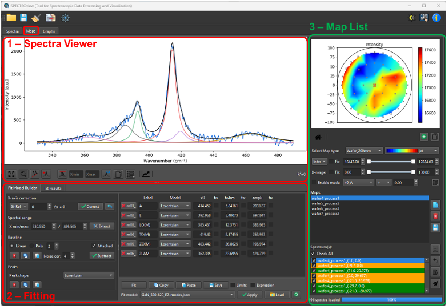
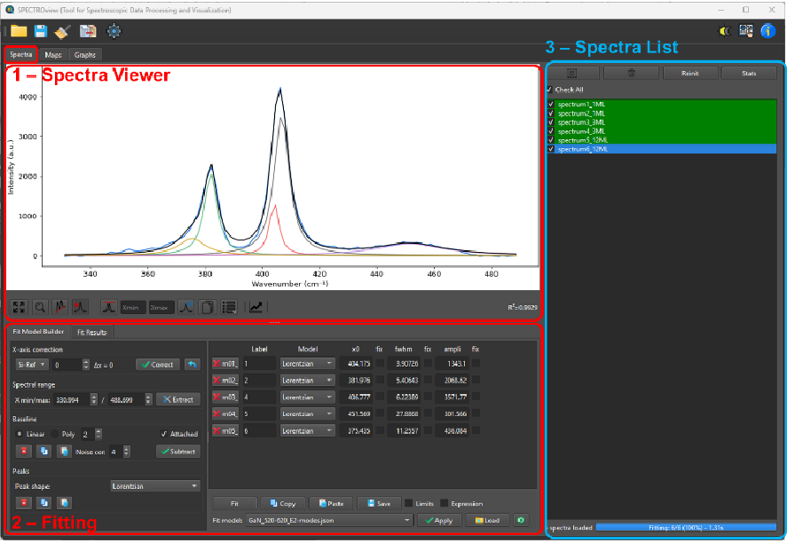
*Figure 3: Interface overview of Spectra (left) and Maps (right) workspaces. The interface is divided into three main sections. Section 1 (SpectraViewer) and 2 (FitModelBuilder) are identical in both workspaces, whereas section 3 (SpectraList / MapList) differs slightly.*

### 5.1 SpectraList & MapList

These sections are designed to efficiently navigate between spectral or hyperspectral data.

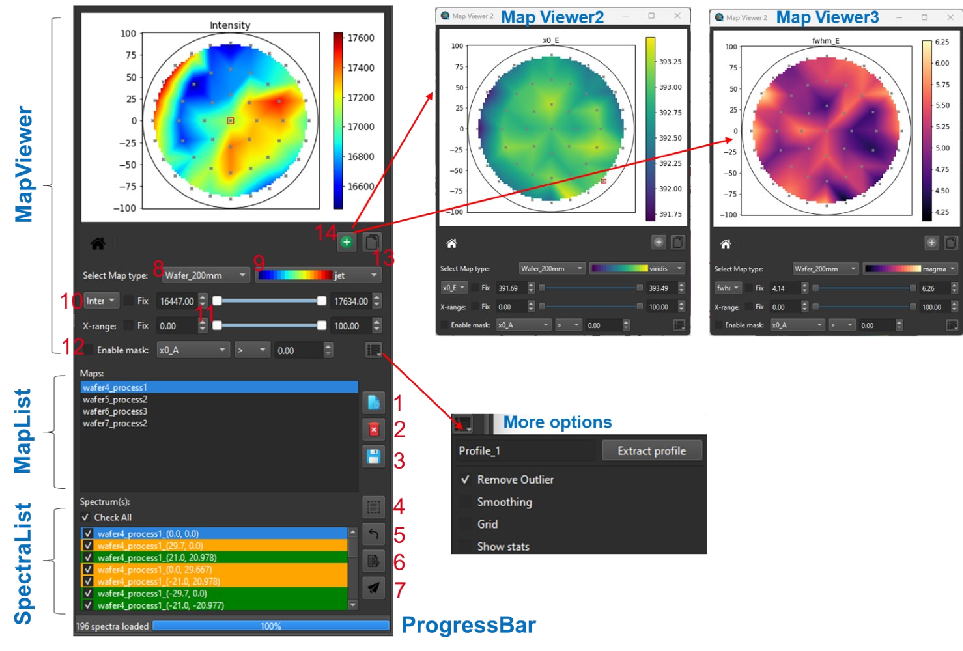
*Figure 4: (Left) MapList section within the Maps workspace. On the right: MapViewer module and More Options to adjust the heatmap display.*

**MapList**: Displays all loaded map files, including wafer maps and 2D map types. Three buttons located on the right side allow the user to (1) view the selected map data, (2) delete the selected map, or (3) save the selected map to an Excel file.

**SpectraList**: Displays all loaded spectra in the Spectra workspace, or all spectra associated with the selected map in the Maps workspace. Users can select one or multiple spectra simultaneously. The selected spectra are displayed in the SpectraViewer. Buttons allow the user to select all available spectra, reset the selection, display the fit statistic report, or send selected spectra to the Spectra workspace.

**MapViewer**: Displays the heatmap of the selected map. Several options are available to customize the heatmap:
- **Map type**: 2D map or wafer map with different diameters.
- **Color palette**: Selection for the heatmap.
- **Displayed parameter**: Maximum intensity, area, or any fitted parameter.
- **Range sliders**: Adjust the X-axis range and the color bar limits.
- **Mask feature**: Define specific regions of the heatmap based on user-defined filters.
- **Copy button**: Copies the heatmap to the clipboard.
- **Multiple MapViewers**: Add additional MapViewer windows as floating windows for comparison.

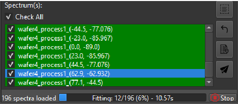
*Figure 5: SpectraList and ProgressBar. Displays fitting progress (% and elapsed time). The Stop button halts fitting.*

### 5.2 Spectra Viewer

The SpectraViewer plots all spectra (and best-fit curves) selected via the SpectraList.

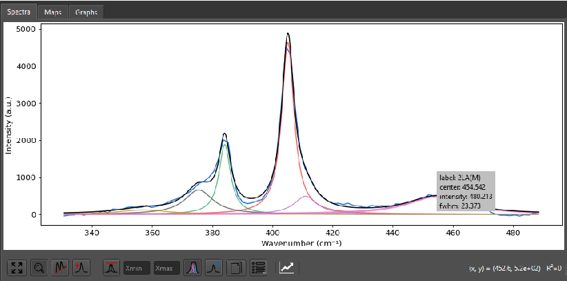
*Figure 6: Spectra Viewer (left) widget and View Options Menu (right).*

#### Toolbar Buttons & View Options

| Button | Function |
|--------|----------|
| 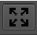 | **Rescale**: To rescale the spectra plot. Shortcut: `Ctrl + R` |
| 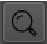 | **Zoom**: When active, enables the "zoom" feature using left mouse click & drag. |
| 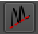 | **Baseline**: When active, allows the user to define baseline point(s) using left mouse click. |
| 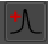 | **Peaks**: When active, allows the user to define peak(s) on the spectra using left mouse click. |
| 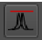 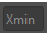 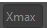 | **Normalization**: Displays selected spectra normalized to the maximum peak intensity. Type into 'min' and 'max' to normalize to a specific spectral range.  *Figure 7: Raw spectra (left) vs. normalized spectra (right) to inspect peak shifts.* |
| 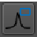 | **Legend**: Displays legend for selected spectra. Click on legend box to change color/labels (Zoom must be disabled). 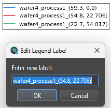 |
| 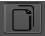 | **Copy**: Copies the plot to the clipboard as an image. `Ctrl + Click` (or `Cmd + click` on macOS): Copies numerical data to the clipboard. |
| 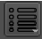 | **More options**: Opens view options (X/Y units, Log scale, Plot style, Raw/Residual visibility, Grids, Line width, Figure size). 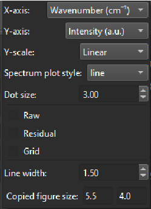 |

#### Mouse Interactions
- **Show Peak Parameters**: Hover over a peak to display a pop-up with its parameters.
- **Add/Remove Peaks**: Right-click to remove the current peak, or left-click to add a new peak (Peak button must be active).
- **Adjust peak**: Drag the peak with the mouse.
- **Quick rescale Y-axis**: Use the mouse wheel.
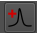

### 5.3 Fit Model Builder

The FitModelBuilder Tab contains three main panels: Fitting, PeakTable, and FitModelControl.

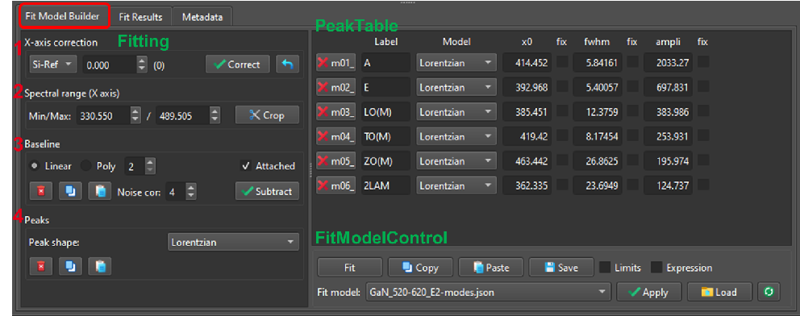
*Figure 8: FitModelBuilder tab widget containing: (1) Fitting, (2) PeakTable and (3) FitModelControl.*

#### 5.3.1 Fitting Panel

The FittingPanel is divided into four sections:

**Step 1: X-axis Correction (optional)**
Perform an X-axis correction based on measurements from a well-known reference sample (e.g., Silicon at 520.7 cm⁻¹). Fit the reference, enter the measured position, and apply the correction to shift the X-axis accordingly.

**Step 2: Define the fitting range**
Define the X-axis range used for the fitting process.

**Step 3: Baseline definition**
Two baseline modes (Manual or Auto) can be chosen:

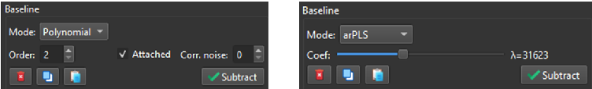
*Figure 9: Baseline mode selection: Manual (left) vs. Auto (right)*

- **Manual mode (Linear or Polynomial)**: Define baseline anchor points by clicking in the SpectraViewer. Check *Attached* to snap points to the curve. Check *Correct noise* to calculate points as an average of neighboring data.
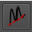
- **Auto mode (airPLS or asLS)**: Baseline curve is automatically defined. Adjust the slider to fine-tune.
  - **airPLS**: Aggressive, great for high-fluorescence. Validated for Raman data.
  - **asLS**: Stable but doesn't distinguish noise/peaks well. Best for clean spectra.

**Step 4: Peak definition**
- Add peaks directly in the SpectraViewer by left-clicking (Peak button enabled). Adjust interactively by dragging.
- Added peaks are listed in the **PeakTable**.
- Supported shapes: Lorentzian, Gaussian, PseudoVoigt, LorentzianAsym, GaussianAsym, Fano, DecaySingleExp, DecayBiExp.
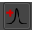

#### 5.3.2 PeakTable Panel

Displays all peaks defined for the selected spectrum. Peak properties are dynamically updated.

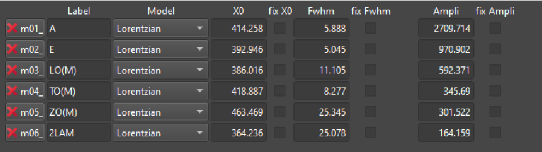
*Figure 10: PeakTable panel*

**Constraints**:
- **Fix**: Keeps the parameter value constant.
- **Limits**: Displays min/max columns to restrict parameter variations.
- **Expression**: Links parameters via mathematical expressions.

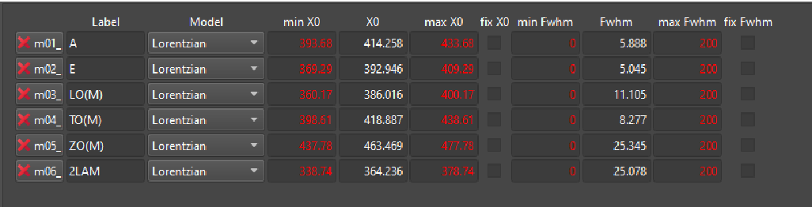
*Example 1: Constrain `m02_x0` to be `m01_x0 - 17`.*

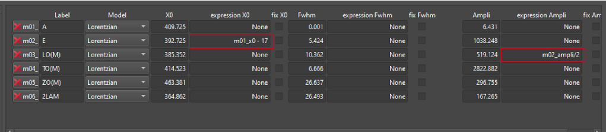
*Example 2: Constrain `m03_ampli` to be `m02_ampli / 2`.*

#### 5.3.3 FitModelControl Panel

Click the **Fit** button to start the fitting process.

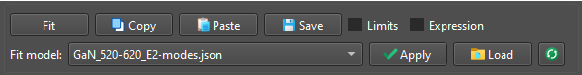
*Figure 11: Interface of FitModelControl*

**Copy / Paste Fit Models**: The entire fit model can be copied and pasted between spectra.
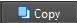
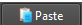
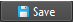

**Saving / Loading Fit Models**:
Save the fit model for later use. Stored models can be accessed using the dropdown menu.
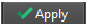
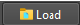

### 5.4 Collect & Save Fit Results

To collect best-fit results from all fitted spectra/maps:
- Switch to the **Fit Results** tab.
- Click the **Collect** button. Results are aggregated into a table.

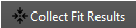
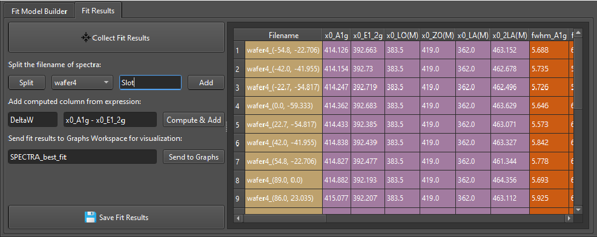
*Figure 12: Collect_fit_results panel*

#### 5.4.1 Splitting Filename Features
Extracts metadata from filenames separated by underscores (e.g., `Sample1_ProcessA_Temp25`) and adds them as new columns.

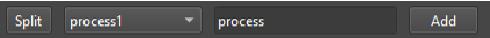

#### 5.4.2 Compute and Add New Columns
Create new columns via mathematical expressions using existing columns (e.g., `x0_p1 - x0_p2`).
Supported operations: `+`, `-`, `*`, `/`, `**`, `%`, `()`.
> **Important**: For column names with special characters, wrap them in backticks (`). Example: `` `x0_LO(M)` ``

#### 5.4.3 Saving or Visualizing
Name the best-fit dataset and send it to the Graphs workspace for plotting, or export as Excel.

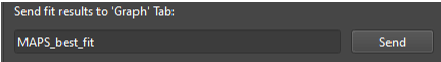
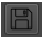

### 5.5 More Tab

Contains three sections:
- **Left**: Metadata showing settings/parameters of loaded `.wdf` or `.spc` files.
- **Middle**: Information about the selected spectrum.
- **Right**: Additional processing features (intensity normalization, cosmic ray detection).

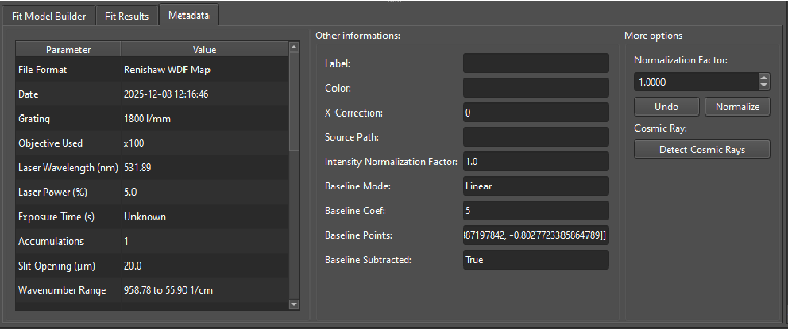
*Figure 13: More Tab's user interface.*
