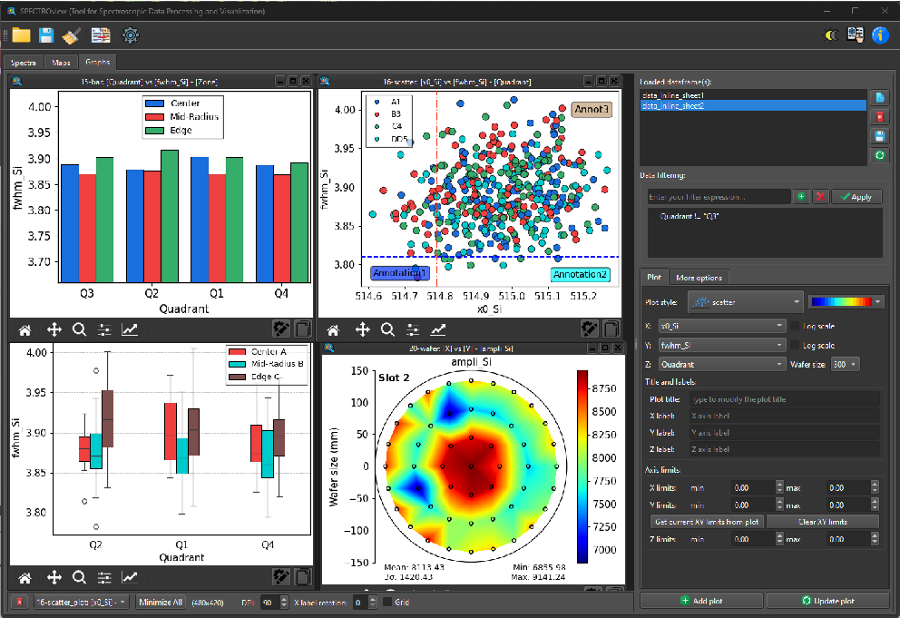
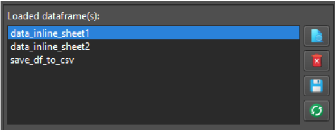
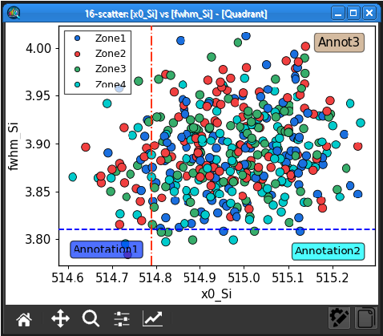
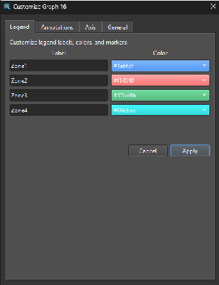
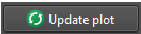
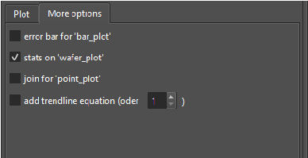
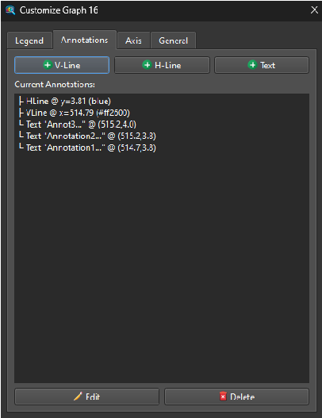

## 6. Graphs Workspace

The Graphs Workspace is exclusively dedicated to data visualization, engineered with a strong emphasis on simplicity, speed, and customization.

 
*Figure 14: The Graphs Workspace interface. The main Graph Viewer is situated on the left, with the comprehensive Control Panel on the right.*

### 6.1 Loading Data

Datasets can be passed seamlessly from the Spectra and Maps workspaces, or imported directly from external Excel/CSV files. All available datasets are dynamically tracked and displayed in the dataset list widget.
Available utility buttons include: **View** (inspect the data table), **Delete** (remove the dataset), **Save** (export the dataset), and **Refresh** (dynamically reload the CSV/Excel file if it has been modified externally).

 
*Figure 15: The list widget displaying all loaded dataframes.*

### 6.2 Adding a New Plot

1. Select your target dataset from the list.
2. Choose the appropriate columns for the X, Y, and Z axes using the provided dropdown menus.
3. Select your desired plot style (available styles: scatter, point, bar, box, line, 2Dmap, wafer).
4. Define your plot labels, axis limits, and wafer diameter dimensions (if applicable).
5. Click **Add Plot** to generate the visualization.

 

### 6.3 Modifying an Existing Plot

 
 
*Figure 16: An example of an active plot widget. Click the "Customize" button to launch the advanced Customize Dialog.*

 

- Click **Customize** to open the comprehensive Customize Dialog, giving you deep control over the Legend, Annotations, Axes, and General aesthetics.
- **Double-click** directly on a legend box or an annotation within the plot to edit its text interactively.
- Quickly adjust core visual settings via the right-hand ControlPanel, then click **Update** to apply the changes instantly.
 

- Click **Copy** to export a high-resolution snapshot of the figure directly to your clipboard.
 

### 6.4 Data Filtering

You can dynamically filter the plotted data by applying boolean logic expressions in the **Filter** field using the format: `(column_name) (operator) (value)`.
> **Note**: String values must be enclosed in double quotes (`"text"`). Column headers containing spaces must be enclosed in backticks (`` `column name` ``).

 
*Figure 17: An example demonstrating how to apply filters to a dataset.*

| Filter Expression | Resulting Behavior |
|-------------------|---------|
| `Confocal != "high"` | Excludes all data points where the "Confocal" column equals "high". |
| `Thickness == "1ML" or Thickness == "3ML"` | Includes only the data points where the "Thickness" column equals exactly "1ML" or "3ML". |
| `` `Laser Power` <= 5 `` | Includes data points where the "Laser Power" column is strictly less than or equal to 5. |

### 6.5 Annotation Features

You can draw and fully customize annotations (such as boundary lines and explanatory text) using the **MoreOptions** tab, or by clicking interactively directly on the active plot.

 
*Figure 18: The MoreOptions Panel.*

 
*Figure 19: The Annotation Customization Panel for configuring drawn lines and text.*
