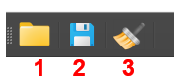

## 11. Save & Load Workspace

### Saving

Click the **Save** button in the toolbar to save the current workspace:

| Workspace | Extension | Contents |
|-----------|-----------|----------|
| **Spectra** | `.spectra` | Loaded spectra, fit models, baseline settings, results |
| **Maps** | `.maps` | Map data, all spectra with fit results, metadata |
| **Graphs** | `.graphs` | All datasets and plot configurations |

### Loading
Click the **Open** button and select a `.spectra`, `.maps`, or `.graphs` file. SPECTROview will automatically restore all data in the correct tab.
