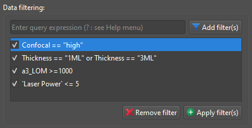

The **pandas.DataFrame.query()** method allows you to filter rows from a
DataFrame based on a boolean expression. It's a powerful and flexible way to
subset your DataFrame to include only the rows that meet specific conditions.

In **SPECTROview**, `query()` method is integrated and can be used via GUI by
typing as following: **(column_name) (operator) (value)**:

1. **(column_name)**: is the exact header of the column containing the
   data/values to be filtered. When the column name contain 'space', you
   need to enclose them in single or double quotes (see example below).

2. **(operator)**: it could be comparison operators (
   e.g., `==`, `<`, `>`, `<=`, `>=`, `!=`)
   and logical operators (e.g., `and`, `or`, `not`) to build complex and
   multiples
   conditions.

3. **(value)**: it could be numeric or string values. String value must be
   enclosed in double quotes (cf. example below)

### Here are some examples of using filters:

    

- Confocal != "high"
- Thickness == "1ML" or Thickness == "3ML"
- a3_LOM >= 1000
- `Laser Power <= 5
