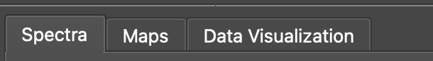
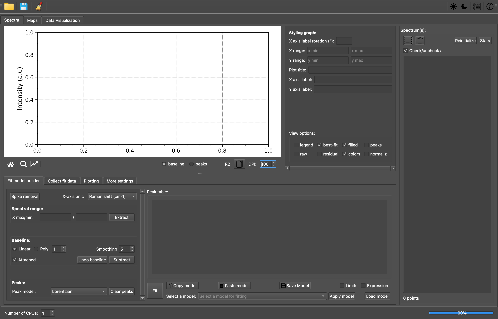

# SPECTROview user manual

    

<!-- TOC -->

- [Introduction](#introduction)
- [1. Supported data formats](#1-supported-data-and-file-formats)
  - [1.1 Discret spectroscopic data (spectrum)](#11-discret-spectroscopic-data-spectrum)
  - [1.2 Hyperspectral data (2Dmaps or wafer data)](#12-hyperspectral-data-2dmaps-or-wafer-data)
  - [1.3 Excel files containing datasheet](#13-excel-files-containing-datasheet)
- [2. "Spectra" and "Maps" tabs](#2-spectra-and-maps-tabs)
- [3. "Data Visualization" TAB](#3-data-visualization-tab)
- [4. Data filtering feature](#4-data-filtering-feature)

<!-- /TOC -->

------------ 
# Introduction

SPECTROview application's GUI offer 3 main modules (tabs) which are designed for different purposes: 
- **Spectra**: for processing one or multiples spectra
- **Maps**: for processing one or multiples hyperspectral data (including wafer data and 2D maps)
- **Data visualization** : as named, this modules is dedicated for plotting and visualizing data. 

The description of each modules is detailled in the following sections. 

    

    

# 1. Supported data and file formats
All supported spectroscopic data (cf. section 1) can be loaded via the universal "open" button. 
The selected data/files will be opened and the modules (tabs) will be display accordingly depending on the format/type files. 

## 1.1 Discret spectroscopic data (spectrum)

Example structure of data, figure
Supported format (CSV, txt)

## 1.2 Hyperspectral data (2Dmaps or wafer data)

Example structure of data
Supported format (CSV, txt)

## 1.3 Excel files containing datasheet

Excel files contaning datasheets within one or multiples Excel sheets is supportted. 
User can directly load an Excel files for plotting via the "data visualization" Tab.

# 2. "Spectra" and "Maps" tabs
The 'Spectra' and 'Maps' tab sharing almost the same feature and GUI except some specific GUi element for 2Dmaps/hyperspectral data navigation.

# 3. "Data Visualization" TAB

# 4. Data filtering feature

The **pandas.DataFrame.query()** method allows you to filter rows from a
DataFrame based on a boolean expression. It's a powerful and flexible way to
subset your DataFrame to include only the rows that meet specific conditions.

    

In **SPECTROview**, `query()` method is integrated and can be used via GUI by
typing as following: **(column_name) (operator) (value)**:

1. **(column_name)**: is the exact header of the column containing the
   data/values to be filtered. When the column name contain 'space', you
   need to enclose them in single or double quotes (see example below).

2. **(operator)**: it could be comparison operators (
   e.g., `==`, `<`, `>`, `<=`, `>=`, `!=`)
   and logical operators (e.g., `and`, `or`, `not`) to build complex and
   multiples
   conditions.

3. **(value)**: it could be numeric or string values. String value must be
   enclosed in double quotes (cf. example below)

### Here are some examples of using filters:

- Confocal != "high"
- Thickness == "1ML" or Thickness == "3ML"
- a3_LOM >= 1000
- `Laser Power <= 5
