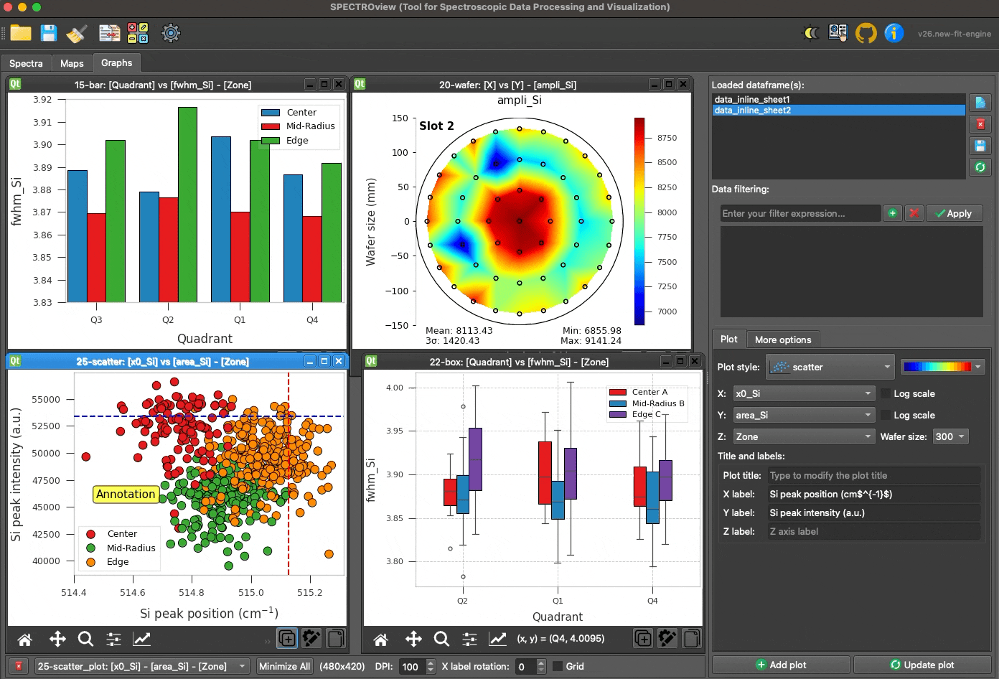
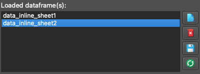
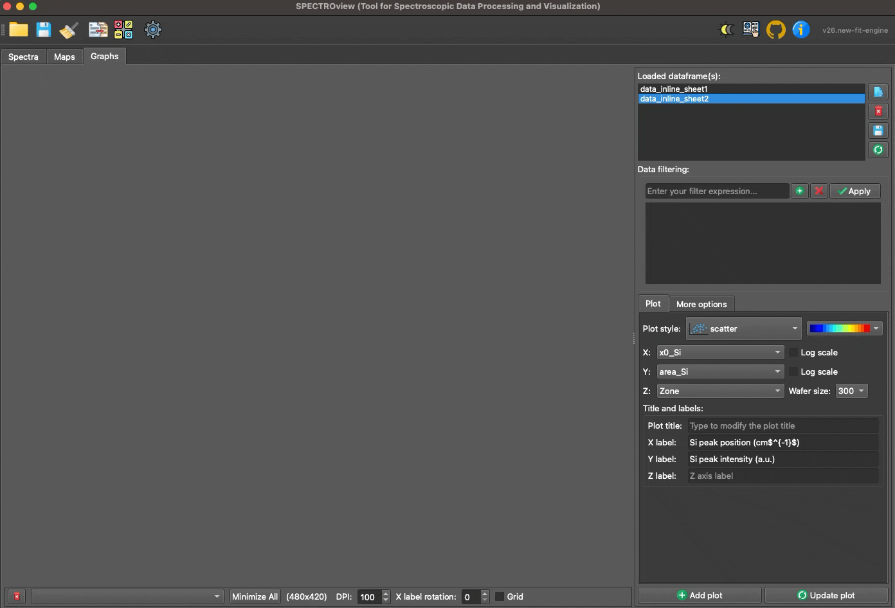
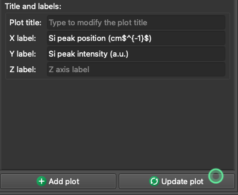
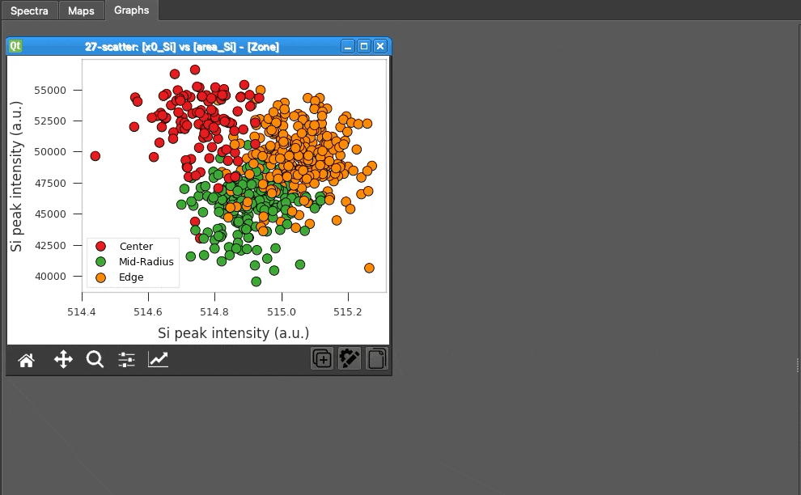
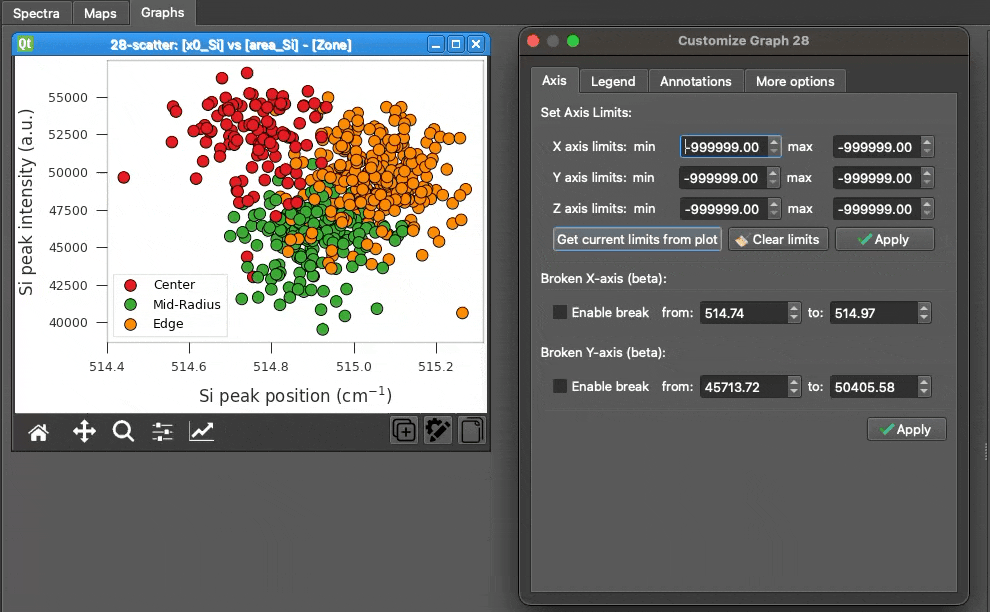
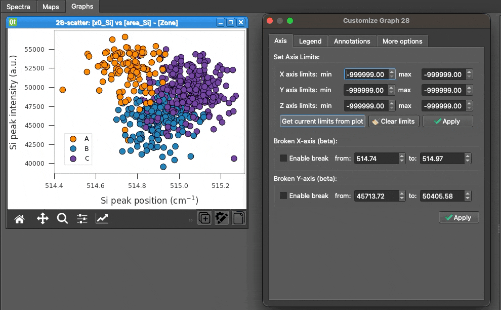
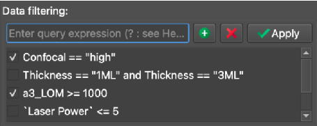

## **Graphs Workspace**

The `Graphs` workspace is exclusively dedicated to data visualization, engineered with a strong emphasis on simplicity, speed, and customization.

   
  <i>Overview of the Graphs Workspace interface.</i>

 

_______

### **1. Loading Data**

Datasets can be passed seamlessly from the `Spectra` and `Maps` workspaces, or imported directly from external Excel/CSV files. All available datasets are dynamically tracked and displayed in the dataset list widget.

 
The four available utility buttons allow you to:

- **View**: Inspect the data table natively.
- **Delete**: Remove the dataset from the workspace.
- **Save**: Export the dataset to Excel or CSV.
- **Refresh**: Dynamically reload the CSV/Excel file if it has been modified externally.

________

### **2. Add or Update a Plot**

1. Select your target dataset from the list.
2. Choose the appropriate columns for the X, Y, and Z axes using the provided dropdown menus.
3. Select your desired plot style (available styles: `scatter`, `point`, `bar`, `box`, `line`, `2Dmap`, `wafer`).
4. Define your plot labels, axis limits, and wafer diameter dimensions (if applicable).
5. Click **Add Plot** to generate the visualization.

   
  <i>Demonstration of adding a new plot or updating an existing one.</i>

______

### **3. Modifying an Existing Plot**

You can modify the **labels** of the axes and the **title** of the plot via the `Right Panel`. Click the **Update Plot** button to apply the changes instantly:

   
  <i>Customize the selected plot via the Right Panel. Click the Update Plot button to apply changes.</i>

 

Click the **Customize** button to open the `Customize Dialog`, giving you deep, granular control over the Legend, Annotations, Axes, and general aesthetics.

   
  <i>Adjusting the axis limits of the selected plot.</i>

   
  <i>Adjusting legends and colors of the selected plot.</i>

 

   
  <i>Adjusting the position and appearance of annotations on the selected plot.</i>

 

_____

### **4. Data Filtering**

You can dynamically filter the plotted data by applying boolean logic expressions in the **Filter** field using the format: `(column_name) (operator) (value)`.
> **Note**: String values must be enclosed in double quotes (`"text"`). Column headers containing spaces must be enclosed in backticks (`` `column name` ``).

   
  <i>An example demonstrating how to apply filters to a dataset dynamically.</i>

 

| Filter Expression | Resulting Behavior |
|-------------------|---------| 
| `Confocal != "high"` | Excludes all data points where the "Confocal" column equals "high". |
| `Thickness == "1ML" or Thickness == "3ML"` | Includes only the data points where the "Thickness" column equals exactly "1ML" or "3ML". |
| `` `Laser Power` <= 5 `` | Includes data points where the "Laser Power" column is less than or equal to 5. |
