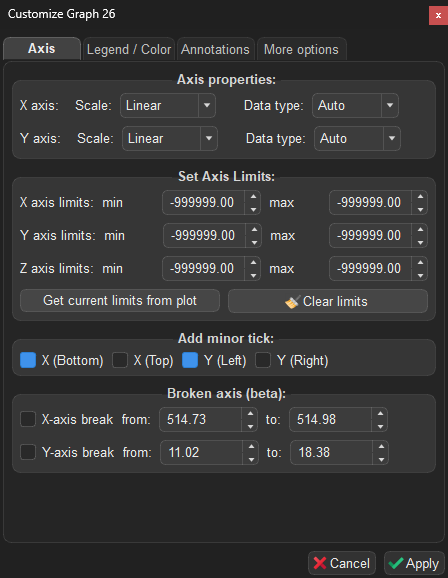
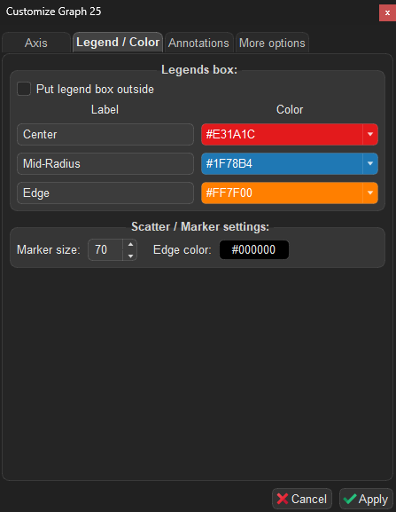
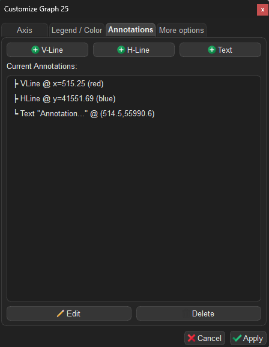
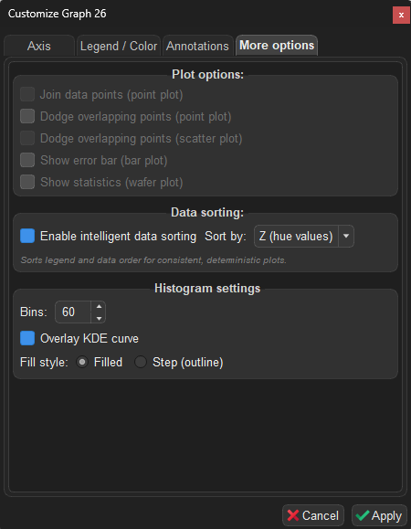

## **Workspace: Graphs**

The `Graphs` workspace is exclusively dedicated to data visualization, engineered with a strong emphasis on simplicity, speed, and customization.

   
  <i>Overview of the Graphs Workspace interface.</i>

 

_______

### **1. Loading Data**

Datasets can be passed seamlessly from the `Spectra` and `Maps` workspaces, or imported directly from external Excel/CSV files. All available datasets are dynamically tracked and displayed in the dataset list widget.

 
The four available utility buttons allow you to:

- **View**: Inspect the data table natively.
- **Delete**: Remove the dataset from the workspace.
- **Save**: Export the dataset to Excel or CSV.
- **Refresh**: Dynamically reload the CSV/Excel file if it has been modified externally.

________

### **2. Add or Update a Plot**

1. Select your target dataset from the list.
2. Choose the appropriate columns for the X, Y, and Z axes using the provided dropdown menus.
3. Select your desired plot style (available styles: `scatter`, `point`, `bar`, `box`, `line`, `trendline`, `histogram`, `2Dmap`, `wafer`).
4. Define your plot labels, axis limits, and wafer diameter dimensions (if applicable).
5. Click **Add Plot** to generate the visualization.

   
  <i>Demonstration of adding a new plot or updating an existing one.</i>

______

### **3. Customizing a Plot**

You can quickly modify the **labels** of the axes and the **title** of the plot via the `Right Panel`. Click the **Update Plot** button to apply the changes instantly:

   
  <i>Customize the selected plot via the Right Panel. Click the Update Plot button to apply changes.</i>

 

For advanced customization, click the **Customize** button (⚙) to open the **Customize Graph Dialog**. This dialog provides deep, granular control through four dedicated tabs: **Axis**, **Legend / Color**, **Annotations**, and **More Options**.

All changes across tabs are applied together via the unified **Apply** button at the bottom of the dialog, or discarded via **Cancel**.

---

#### 3.1 Axis Tab

   
  <i>The Axis tab of the Customize Graph Dialog.</i>

The **Axis** tab controls axis scaling, data types, limits, minor ticks, and axis breaks.

##### Axis Properties

Configure the **scale** and **data type** for each axis independently using dropdown menus:

| Setting | Options | Description |
|---|---|---|
| **X / Y axis Scale** | `Linear`, `Logarithmic` | Switches the axis between linear and logarithmic scale. Logarithmic scale is only applied when the underlying data is numeric. |
| **X / Y axis Data type** | `Auto`, `Category`, `Numerical` | Controls how axis values are interpreted. **Auto** (default): the application auto-detects the best type — numerical if 100% of the data is numeric, otherwise categorical. **Category**: forces categorical indexing. **Numerical**: forces a continuous numeric scale. |

> **Note**: When using `Numerical` data type, the axis adopts a true mathematical scale where spacing reflects actual data values. When using `Category`, each unique value is evenly spaced regardless of its numeric magnitude.

##### Set Axis Limits

Manually constrain the visible range of each axis (X, Y, Z) by specifying **min** and **max** values:

| Control | Description |
|---|---|
| **X / Y / Z axis limits** | Enter min and max values to constrain the visible range. Set both to `-999999` to use automatic limits. |
| **Get current limits from plot** | Captures the current visible limits from the plot and fills the spinboxes. Useful as a starting point before fine-tuning. |
| **Clear limits** | Resets all axis limits back to automatic (unconstrained). |

   
  <i>Adjusting the axis limits of the selected plot.</i>

##### Add Minor Ticks

Enable or disable minor tick marks on each edge of the plot independently:

| Checkbox | Description |
|---|---|
| **X (Bottom)** | Show minor ticks on the bottom X axis (enabled by default). |
| **X (Top)** | Show minor ticks on the top X axis. |
| **Y (Left)** | Show minor ticks on the left Y axis (enabled by default). |
| **Y (Right)** | Show minor ticks on the right Y axis. |

##### Broken Axis (Beta)

Create a visual break in an axis to omit an uninteresting range and focus on relevant data regions:

| Control | Description |
|---|---|
| **X-axis break** | Enable and specify the `from` / `to` range to break on the X axis. |
| **Y-axis break** | Enable and specify the `from` / `to` range to break on the Y axis. |

> **Note**: This feature is in beta. Axis breaks work best with linear scales.

---

#### 3.2 Legend / Color Tab

   
  <i>The Legend / Color tab of the Customize Graph Dialog.</i>

The **Legend / Color** tab lets you customize the appearance and placement of the plot legend, as well as scatter/marker settings.

##### Legend Box

| Control | Description |
|---|---|
| **Put legend box outside** | Moves the legend box to the right of the plot area, keeping it out of the way of your data. Uncheck to place it inside the plot. |
| **Label** | Edit the display name for each data series in the legend. |
| **Marker** | Choose a marker symbol for each series (available for `point` plots). |
| **Color** | Pick a color for each series from the predefined palette. |

> **Tip**: The legend box can be **dragged** to any position directly on the plot canvas using the mouse.

   
  <i>Adjusting legends and colors of the selected plot.</i>

##### Scatter / Marker Settings

This section appears only for `scatter`, `trendline`, and `point` plot styles:

| Control | Description |
|---|---|
| **Marker size** | Adjust the marker size (range: 5–500, default: 70). Affects both scatter points and point plot markers. |
| **Edge color** | Pick the border color of scatter/point markers (default: black). Click the color button to open the color picker. |

---

#### 3.3 Annotations Tab

   
  <i>The Annotations tab of the Customize Graph Dialog.</i>

The **Annotations** tab allows you to overlay reference lines and text labels on top of your plot.

##### Adding Annotations

Click one of the buttons at the top to add an annotation at the center of the current plot view:

| Button | Description |
|---|---|
| **V-Line** | Adds a vertical reference line (default: red, dashed). |
| **H-Line** | Adds a horizontal reference line (default: blue, dashed). |
| **Text** | Adds a text label with a rounded background box (default: yellow background). |

##### Managing Annotations

All current annotations are listed below the buttons. Select an annotation to **Edit** or **Delete** it.

**Editing a line annotation** allows you to change:
- Color, line style (solid, dashed, dotted, dash-dot), and line width.

**Editing a text annotation** allows you to change:
- Text content, font size, text color, background frame toggle, background color, and transparency.

> **Tip**: Annotations can be **dragged** directly on the plot canvas. Their positions are persisted when saving the workspace. Double-clicking an annotation on the canvas also opens its edit dialog.

   
  <i>Adjusting the position and appearance of annotations on the selected plot.</i>

---

#### 3.4 More Options Tab

   
  <i>The More Options tab of the Customize Graph Dialog.</i>

The **More Options** tab adapts dynamically to the active plot style, showing only the controls relevant to the current graph.

##### Plot Options (General)

These checkboxes are always visible, but only enabled when the corresponding plot style is active:

| Option | Applicable style | Description |
|---|---|---|
| **Join data points** | `point` | Connects the mean values with lines between categories. |
| **Dodge overlapping points** | `point` | Offsets overlapping hue groups horizontally to prevent overlap. |
| **Dodge overlapping points** | `scatter` | Offsets overlapping hue groups horizontally for scatter plots. |
| **Show error bar** | `bar` | Displays standard deviation error bars on top of each bar. |
| **Show statistics** | `wafer` | Overlays statistical summary (mean, std, etc.) on the wafer map. |

##### Trendline Settings

Visible only when the plot style is `trendline`:

| Option | Description |
|---|---|
| **Polynomial order** | Set the degree of the polynomial fit (1 = linear, 2 = quadratic, …, up to 10). |
| **Anchor point** | Constrain the fit to pass through a specific point. Choose **Origin (0, 0)** or enter a **custom (X₀, Y₀)**. |
| **Fit equation(s)** | Displays the computed equation and R² value for each hue group in a table. Click **Copy** to export as tab-separated text (paste directly into Excel). |

##### Histogram Settings

Visible only when the plot style is `histogram`:

| Option | Description |
|---|---|
| **Bins** | Number of histogram bins (2–500, default: 20). |
| **Overlay KDE curve** | Superimposes a smooth Kernel Density Estimate curve on the histogram. |
| **Fill style** | Choose **Filled** bars (default) or **Step** (outline only). |

 

_____

### **4. Data Filtering**

You can dynamically filter the plotted data by applying boolean logic expressions in the **Filter** field using the format: `(column_name) (operator) (value)`.
> **Note**: String values must be enclosed in double quotes (`"text"`). Column headers containing spaces must be enclosed in backticks (`` `column name` ``).

   
  <i>An example demonstrating how to apply filters to a dataset dynamically.</i>

 

| Filter Expression | Resulting Behavior |
|-------------------|---------| 
| `Confocal != "high"` | Excludes all data points where the "Confocal" column equals "high". |
| `Thickness == "1ML" or Thickness == "3ML"` | Includes only the data points where the "Thickness" column equals exactly "1ML" or "3ML". |
| `` `Laser Power` <= 5 `` | Includes data points where the "Laser Power" column is less than or equal to 5. |

_____

### **5. Statistical Calculations & Fitting Details**

For statistical plot styles (`point`, `bar`, `box`, and `trendline`), SPECTROview automatically calculates essential metrics and visualizes the distribution of your data.

#### 5.1 **Point and Bar Plots**

- **Central Value (Mean):** The primary data point (the circle marker in a `point` plot or the top of the bar in a `bar` plot) represents the **arithmetic mean** of all Y-values for a given X-category.
- **Error Bars (95% CI):** The error bars extending from the mean represent the **95% Confidence Interval** of the mean. This is calculated using the Standard Error of the Mean (SEM):
  `Error Bar = ± (1.96 × SEM)`
  where `SEM = Standard Deviation / sqrt(N)`.

#### 5.2 **Box Plot**

The `box` plot natively displays the statistical distribution of the dataset based on standard five-number summaries:
- **Box Bounds (Q1 to Q3):** The main body of the box spans from the first quartile (25th percentile) to the third quartile (75th percentile), known as the Interquartile Range (IQR).
- **Median Line:** The horizontal line inside the box marks the **Median** (50th percentile).
- **Whiskers:** The whiskers extend to the furthest data points that are still within `1.5 × IQR` of the box edges.
- **Fliers (Outliers):** Any data points falling beyond the whiskers are explicitly drawn as individual outlier points.

#### 5.3 **Trendline Estimation**

- **Standard Fit (No Anchor):** The trendline is calculated using an Ordinary Least Squares (OLS) linear regression to fit a polynomial of the specified degree:
  `y = p₀·xᵈ + p₁·xᵈ⁻¹ + ... + p_d`
  where `d` is the polynomial order.

- **Anchored Fit (Forced through a point (x₀, y₀)):** The coordinate system is shifted so that the anchor point becomes the origin (`x' = x - x₀`, `y' = y - y₀`). A polynomial without a constant term (zero intercept) is then fitted to the shifted variables:
  - **For Linear order (1):** The slope `m` is directly calculated as:
    `m = sum(x'_i * y'_i) / sum((x'_i)²)`
  - **For Higher orders (>1):** The shifted data is fitted with a zero intercept using a linear least squares solver.
  The fitted curve is then translated back to the original coordinate space.

#### 5.4 **Trendline Confidence Intervals**

- **Confidence Level:** The shaded band around standard trendlines represents a **95% confidence interval** (estimated by Seaborn's regression plot module).
- **Estimation Method:** The confidence interval is estimated using a non-parametric bootstrapping procedure (resampling data points with replacement 1000 times, fitting a regression model to each bootstrap sample, and calculating the 2.5th and 97.5th percentiles of the predictions).
- **Anchored Fits:** Please note that confidence intervals are only computed and displayed for standard, unconstrained fits. If an anchor is enabled, the confidence interval band is omitted.
