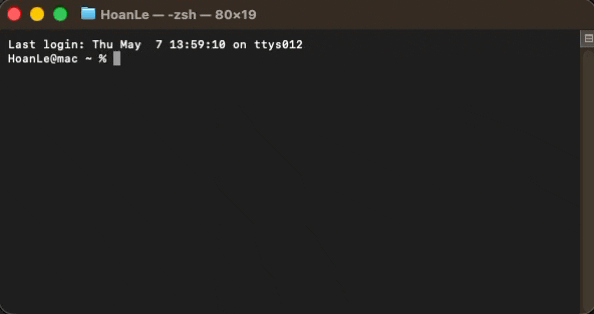

## **Installation**

`SPECTROview` requires Python (versions 3.8 through 3.12). It can be easily installed and managed via your system's command-line interface (e.g., Command Prompt on Windows or Terminal on macOS/Linux).

### **1. From PyPI (Recommended)**
```bash
pip install spectroview
```

<div align="center">
  <br>
  <i>Successfully installing SPECTROview via pip.</i>
</div>

### **2. From GitHub (Latest Development Version)**
To install the latest development version directly from the source repository:
```bash
pip install git+https://github.com/CEA-MetroCarac/SPECTROview.git
```
> [!NOTE]
> In systems where both Python 2 and Python 3 are installed, `pip3 install spectroview` should be used instead.

### **3. Launch and Update**

To launch `SPECTROview`, open your terminal or command prompt and execute:
```bash
spectroview
```

To update your installation to the latest release:
```bash
pip install --upgrade spectroview
```

To install or downgrade to a specific version (e.g., `26.24.1`):
```bash
pip install spectroview==26.24.1
```
