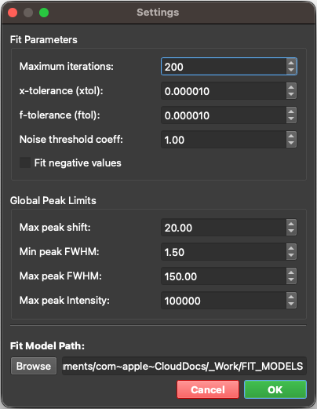
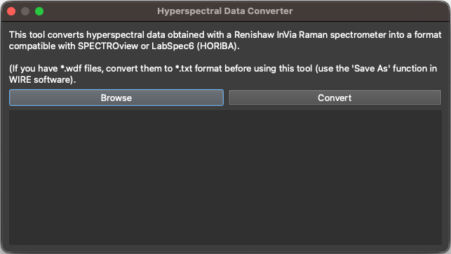
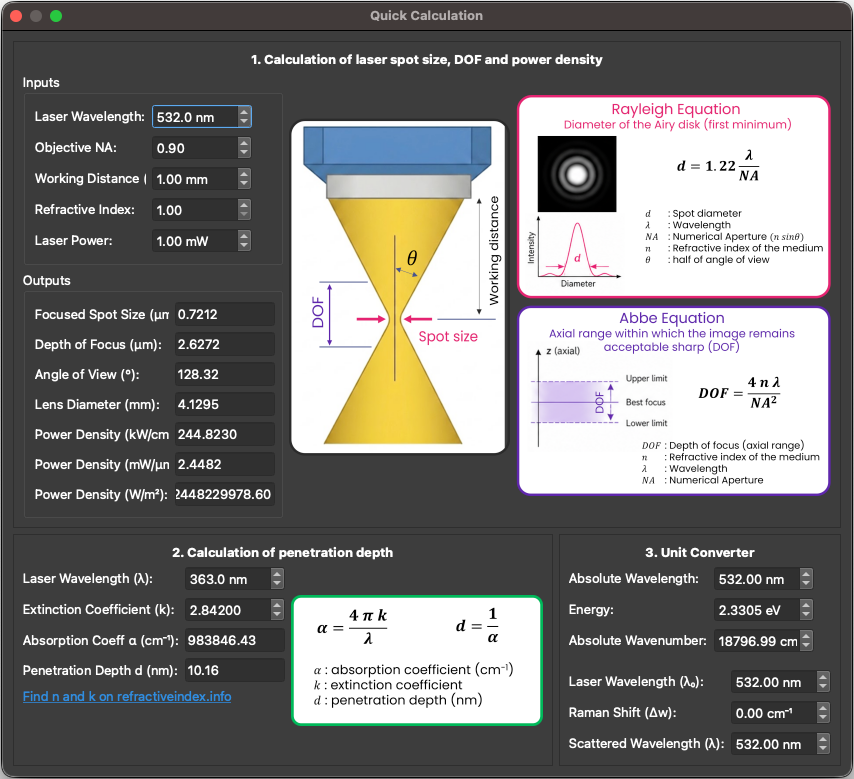

## **Menu Bar**

### **1. Menu Bar Buttons**
A horizontal toolbar located at the top of the application provides quick access to essential features:

| Button | Function |
|--------|----------|
|  | **Open**: Loads any supported data type. The application automatically detects the file format and switches to the appropriate workspace. |
|  | **Save**: Saves the active workspace to a dedicated file (`.maps`, `.spectra`, or `.graphs`), allowing you to pause and resume your work effortlessly. |
|  | **Clear**: Clears the currently active workspace, removing all loaded data to start a fresh session. |
|  | **Convert**: Opens the `Hyperspectral Data Converter` tool (see below for details). |
|  | **Calculators**: Opens the `Quick Calculators` tool (see below for details). |
|  | **Settings**: Opens the `Settings Panel` (see below for details). |
|  | **Theme Toggle**: Instantly switches the application interface between Dark and Light modes. |
|  | **User Manual**: Opens the integrated User Manual documentation viewer. |
|  | **About**: Displays version information, licensing, and details about the **SPECTROview** application. |

### **2. Settings Panel**
Click the **Settings** icon to open the `Settings Panel`. See the "Settings" section for details.

   
   <i>The Settings Panel interface.</i>

### **3. Hyperspectral Data Converter Tool**
Click the **Convert** icon to open this utility.

To convert hyperspectral data (2D maps) from Renishaw WiRE into a format natively supported by **SPECTROview**, load your file(s) and click **Convert**. The converted file will be saved with a `_converted` suffix in the same directory as the original file.

   
   <i>The Hyperspectral Data Converter Tool interface.</i>

### **4. Quick Calculation Tool**
Click the **Calculator** icon to open a suite of utility calculators. See the "Quick Calculators" section for details.

   
   <i>The Quick Calculators interface.</i>

