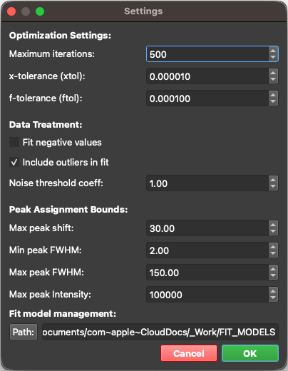

## Menubar

### Menubar's buttons:
A horizontal toolbar located at the top of the application provides quick access to essential features:

| Button | Function |
|--------|----------|
|  | **Open**: Loads any supported data type. The application will automatically detect the file format and switch to the appropriate workspace. |
|  | **Save**: Saves the active workspace to a dedicated file (`.maps`, `.spectra`, or `.graphs`), allowing you to effortlessly pause and resume your work later. |
|  | **Clear**: Clears the currently active workspace, removing all loaded data to start a fresh session. |
|  | To open **Hyperspectral Data Converter Tool** -> see bellow for more detail.|
|  | To Open **Quick Calculation Tool** -> see bellow for more detail. |
|  | To open **Setting Panel** -> see bellow for more detail. |
|  | **Theme Toggle**: Instantly switches the application interface between Dark and Light modes. |
|  | **User Manual**: Opens the integrated User Manual documentation viewer. |
|  | **About**: Displays version information, licensing, and details about the SPECTROview application. |

### Settings Panel
Opens a Settings Panel by clicking to icon "Settings" as described above, where you can:

- Adjust all fittings parameters.
- Define a defaut folder where all fit_models (JSON format) are stored. The application will automatically scan this folder and load all fit_models for easy selection in the fitting windows.

### Hyperspectral Data Converter Tool
Opens a utility by clicking to icon "Convert" as described above. 

To convert a hyperspectral data (2D maps) from Renishaw WiRE into a format natively supported by SPECTROview, load your file(s) and click "Convert". The converted file will have a `_converted` suffix and be saved in the same folder as the original file.

### Quick Calculation Tool

Click to the "Calculator" icon to open  a suite suite of utility calculators : 

#### 1. Calculation of laser spot size, depth of field and laser power density
This tool estimates the theoretical, diffraction-limited spatial resolution of your optical setup, including spot size, depth of focus, and laser power density.

- **Spot Size**: Calculated as $1.22 \times \lambda / \text{NA}$ ($\mu\text{m}$)
- **Depth of Focus**: Calculated as $4 \times n \times \lambda / \text{NA}^2$ ($\mu\text{m}$)

#### 2. Calculation of penetration depth from absorption coefficient and laser wavelength.
This tool calculates the theoretical optical penetration depth of a laser into a specific material, derived from its complex refractive index (extinction coefficient).

- **Penetration Depth ($d$)**: Calculated as $\lambda / (4 \pi k)$ ($\text{nm}$)

#### 3. Unit Converter
A rapid utility to convert between various standard spectroscopic units, ensuring flawless consistency during data analysis (e.g., converting wavelength in $\text{nm}$ to energy in $\text{eV}$, or calculating Raman shift in $\text{cm}^{-1}$ from excitation wavelengths).

