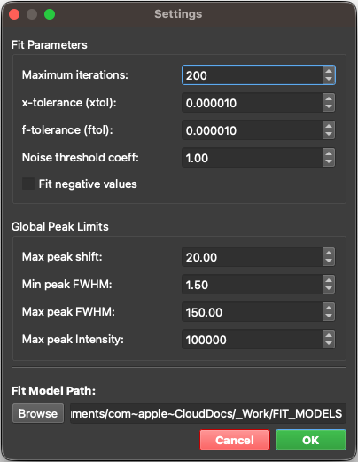

## **Settings & Preferences**

Access the **Settings** menu via the gear icon in the main toolbar (or press `Ctrl + Shift + S`).

   

 

The `Settings Panel` is organized into two tabs:

- **General** — fitting behavior and file locations: **`Fit Parameters`**, **`Global Peak Limits`**, and the **`SPECTROview Working Folder`** (sections 1–3 below).
- **AI** — API keys, chat history, and the optional local MCP endpoint (sections 4–5 below).

---

### **1. Fit Parameters** *(General tab)*

These parameters control the behavior of the **Vectorized Batch Fit (`VBF`) engine** — the mathematical optimizer that performs curve fitting on your spectra. Adjusting these values directly affects fitting speed, precision, and convergence.

| Parameter | Setting | Default | Range | Description & Behavior |
|-----------|---------|---------|-------|------------------------|
| **Maximum Iterations** | `max_ite` | 200 | 1 – 10,000 | The maximum number of Levenberg-Marquardt iterations per spectrum.  • **Lower (50–100)**: Faster fitting for previews. • **Higher (200+)**: Better convergence for complex spectra. |
| **x-tolerance** | `xtol` | 1×10⁻⁴ | 1×10⁻⁶ – 1×10⁻¹ | Relative tolerance for the parameter step size. Convergence requires:   mean(\|&delta;<i>p</i>\| / \|<i>p</i>\|) &lt; `xtol` |
| **f-tolerance** | `ftol` | 1×10⁻⁴ | 1×10⁻⁶ – 1×10⁻¹ | Relative tolerance for the cost function. Convergence requires:   \|costn - costn-1\| / \|costn\| &lt; `ftol` |
| **Noise Threshold Coefficient** | `coef_noise` | 1.0 | 0 – 100 | Multiplier for the auto-estimated noise level (`coef_noise` × estimated noise amplitude). Masks noisy data and suppresses ghost peaks. • **0**: Disabled • **0.5–1.0**: Conservative • **1.0–2.0**: Moderate (Default) • **3.0+**: Aggressive  *Note: You can refer to the noise level displayed in the toolbar or activate the "Show noise level" checkbox within the `View Options` of the `SpectraViewer` to see the noise level directly on the spectra plot.* |
| **Loss Function** | `loss` | `linear` | `linear`, `soft_l1`, `huber` | Robust loss function for outlier resistance (e.g. cosmic ray spikes, sharp artifacts).  • **linear**: Standard least squares (default). • **soft_l1**: Smooth L1 approximation $\rho(z) = 2(\sqrt{1+z}-1)$, robust to large spikes without manual masking. • **huber**: Huber loss, quadratic for inliers and linear for residuals exceeding `f_scale`. |
| **Loss Scale** | `f_scale` | 1.0 | 1×10⁻⁴ – 10,000 | Margin scale between inliers and outliers for robust loss functions. Residuals are scaled as $(r / f\_scale)$ before evaluating $\rho'(z)$. |
| **Fit Negative Values** | - | Unchecked | - | When checked, negative intensity values are included in the fit. When unchecked, they are assigned zero weight. |

> **Note**: A spectrum is considered converged only when **both** `xtol` and `ftol` criteria are simultaneously satisfied.
>
> **Weighting Composition Order**: Hard exclusions (`fit_negative` and `coef_noise` noise-floor masking) are evaluated first to assign zero weight to excluded points. For active points, robust loss weighting (`soft_l1` or `huber`) is applied second, smoothly down-weighting outlier residuals via Iteratively Reweighted Least Squares (IRLS).

---

### **2. Global Peak Limits** *(General tab)*

These parameters define **absolute boundary conditions** that are applied globally to all peaks across the application. When you add a new peak to a fit model, these limits are used to set the initial parameter bounds automatically.

> **Note**: You can check the "Limits" checkbox under the `PeakTable` to display the actual bounds of each peak.

| Limit | Default | Range | Description & Constraint |
|-------|---------|-------|--------------------------| 
| **Max Peak Shift** | 20 | 0 – 100 | Maximum allowed displacement of a peak center (`x0`) from its initial value.  <i>x</i>0 - maxshift &le; <i>x</i>0fitted &le; <i>x</i>0 + maxshift |
| **Min Peak FWHM** | 0.1 | 0.01 – 500 | Minimum allowed Full Width at Half Maximum (`FWHM`). Prevents peaks from collapsing into delta-function artifacts. |
| **Max Peak FWHM** | 200 | 1 – 1,000 | Maximum allowed `FWHM`. Prevents peaks from broadening into flat baselines. |
| **Max Peak Intensity** | 100,000 | 1 – 1×10⁹ | Upper bound for peak amplitude. Prevents unrealistically high intensity values. |

---

### **3. SPECTROview Working Folder** *(General tab)*

Specify a single root folder for all of SPECTROview's saved templates. When you set it, three subfolders are created automatically inside it:

| Subfolder | Contents |
|-----------|----------|
| `fit_model/` | Custom fit models (JSON). The `Fit Model Builder` scans this folder and lists every model here for one-click reuse. |
| `plot_recipe/` | Plot Recipes — saved sets of full plot configurations (data bindings + style) for the `Graphs` workspace. |
| `plot_style/` | Style Templates — saved appearance-only styles that can be applied to any existing graph. |

Click **Browse** to select a folder, or type the path directly.

> **Note**: This single Working Folder replaces the older separate "Fit model folder" / "Plot template folder" settings. If you had one of those configured previously, it is migrated automatically the first time the Working Folder is read.

---

### **4. AI Settings** *(AI tab)*

The **AI** tab configures the [AI Chat Agent](ai_agent.md). Nothing here is required to use the rest of SPECTROview.

#### **API Keys**

The fields for a **Custom** (OpenAI-compatible) endpoint are shown by default:

| Field | Description |
|-------|-------------|
| **Custom API Key** | The API key for your custom / internal endpoint. |
| **Base URL** | The endpoint's OpenAI-compatible root URL (e.g. `https://host/v1`). |
| **Model Name** | A comma-separated list of model names (e.g. `model-a, model-b`). These populate the model dropdown in the chat panel — handy for endpoints that don't expose a model-listing API. |

Keys for the built-in cloud providers are tucked under the collapsible **▸ Other cloud providers** section (click to expand): **OpenAI**, **Anthropic**, **Gemini**, **DeepSeek**, and **Mistral**. All keys are stored masked and remembered between sessions.

> **Where your keys are stored.** API keys go into your operating system's
> per-user settings store — the registry (`HKEY_CURRENT_USER\Software\CEA-Leti\SPECTROview`)
> on Windows, `~/Library/Preferences` on macOS. They are **never** written to a
> file inside the SPECTROview project folder, are not included in an exported
> workspace, and cannot be committed to a Git repository by accident. They are
> stored in plain text there, so treat them like any other saved credential:
> they are readable by anything running under your user account.

#### **Chat History**

| Field | Description |
|-------|-------------|
| **History Folder** | Where AI chat conversations are saved (as JSON). Click **Browse** to choose a folder. |

---

### **5. Local MCP Server** *(AI tab)*

Enable this only when a trusted MCP client on the same computer needs access
to the currently running SPECTROview session. The default endpoint is
`http://127.0.0.1:8765/mcp` and starts as soon as you select **OK**.

| Field | Default | Description |
|---|---|---|
| **Enable local MCP endpoint** | Off | Starts/stops the embedded MCP server. |
| **Port** | 8765 | Local Streamable HTTP port (1024–65535). Choose another if the port is busy. |

The bind address is fixed to localhost (`127.0.0.1`); it is not exposed to the
LAN or internet. Keep SPECTROview running while the client is connected. The
endpoint stops when SPECTROview closes or the checkbox is cleared.
