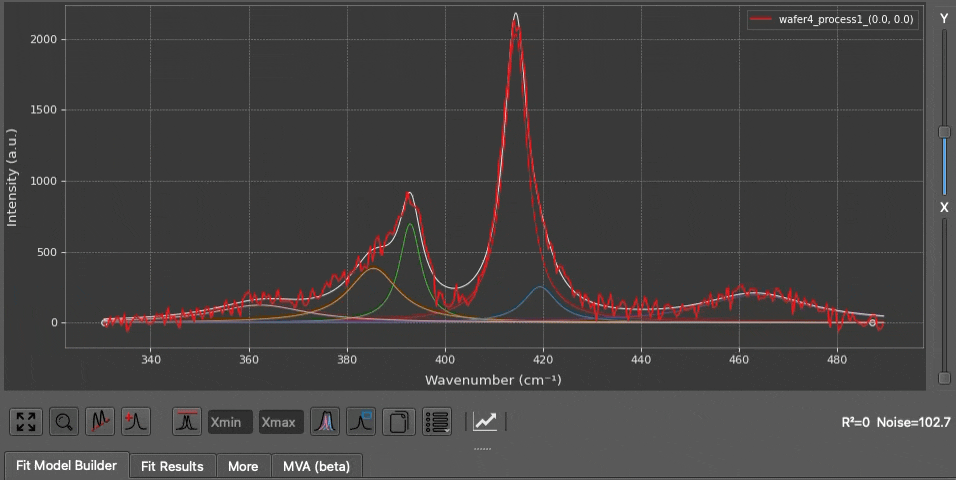

## Keyboard Shortcuts & Tips

To maximize your efficiency within SPECTROview, a variety of keyboard shortcuts and power-user tips have been integrated directly into the application.

### Global Shortcuts

| Keyboard Shortcut | Resulting Action |
|----------|--------|
|  |
| `Ctrl + Click` | Under a figure canvas, there is always a Copy button. Simply click it to copy the plot as a PNG image. Hold `Ctrl` and click to copy the raw numerical dataset of the current plot directly to your system clipboard (instead of an image). On macOS, use `Cmd + Click`. |

### **Tooltips Everywhere** : 

If you are ever unsure what a specific button or parameter does, simply hover your mouse cursor over the GUI element for a moment to reveal a descriptive tooltip.

   

 

________ 

### Tips with SpectraViewer :
In the SpectraViewer, you can **interact** with the spectra plot using your mouse: 

  

 

- `Ctrl + R` : When active in the Spectra or Maps workspace, this shortcut automatically rescales the axes of the current plot to perfectly fit the visible data.
- You can use the mouse wheel to adjust y zoom.
- Adjust vertical X, Y sliders on the right of the plot to shift spectra along the X or Y axis for improved visual clarity.
- You can directly click and drag the center point or the width of any peak inside the `SpectraViewer` to adjust its parameters dynamically. This is a much faster way to set up the initial parameters for your fit.
- Hover your mouse over a peak, and it will show you the parameters of the peak (position, width, amplitude). 
- Hover the mouse over a peak and right-click to remove it.

- As defining a baseline (Linear or Polynomial), once baseline points are added, you can also hover your mouse over a baseline anchor point and right-click to remove it instantly.
- User shortcut key `Ctrl + R` to rescales the the spectra plot to fit the visible data.

  

 

- No matter the current global theme is (dark or light), you can change the theme of the spectra plot in the `View Options` button. Similary, when you copy the figure to the clipboard, you can specify the theme (dark or light) for the copied figure.
- You can show or deasctivate best-fit curves or legend box anytime by clicking to corresponding buttons in the Spectra Viewer's toolbar.
- When legend box is shown in the plot, double-click on any label to change its display name. double click on the color to change the color of the line.

________   
### Tips with MapsViewer :

**Extract Profile from 2D Map Plot**: Whenever two distinct points are selected on the 2D map, the intensity profile between these two coordinates will be calculated and plotted directly on the heatmap:

   
  <i>The profile is displayed on the map when two points are selected, and it automatically disappears when more than two points are selected.</i>

   
  <i>You can define a profile name in the `View Options` menu, then click `Extract` to send it directly to the `Graphs` workspace for plotting.</i>

 

________ 

**Quick Re-fit (Warm Starting)**: If a fit does not converge perfectly, you can manually adjust the peak bounds and simply click the **Fit** button again. The engine will "warm-start" using the results of the previous optimization, making subsequent fits drastically faster.

 

________ 

**Handling Complex Column Names**: If you are using the `Data Filter` or `Computed Columns` features and your target column name contains spaces or special characters, you must enclose the column name in backticks (`` ` ``) (e.g., `` `Laser Power` <= 5 ``).

 

________ 

**Spatial Profile Extraction**: While inside the Maps workspace, if you select exactly two distinct spatial points on the `MapViewer` heatmap, SPECTROview will automatically extract and plot an interpolated intensity profile between those two coordinates.
