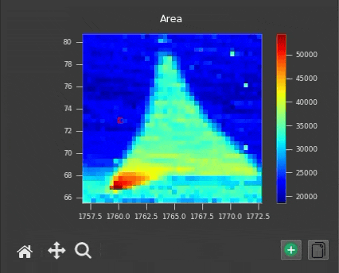
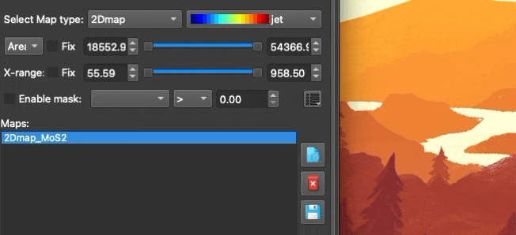

## Keyboard Shortcuts & Tips

To maximize your efficiency within SPECTROview, a variety of keyboard shortcuts and power-user tips have been integrated directly into the application.

### Global Shortcuts

| Keyboard Shortcut | Resulting Action |
|----------|--------|
| `Ctrl + R` | When you are in Spectra or Maps Workspace, this shortcuts rescales the axes of the current spectra plot to perfectly fit the visible data. |
| `Ctrl + Click` | Under a figure canvas, there is alway a Copy button. Simply click to copy PNG images. Hold Ctrl + click to copy the raw numerical dataset of the current plot directly to your system clipboard (instead of an image). On macOS, use `Cmd + Click`. |

### Advanced User Tips

**Tooltips Everywhere**: If you are ever unsure what a specific button or parameter does, simply hover your mouse cursor over the GUI element for 1 second to reveal a descriptive tooltip.

   

 

_________   

**Extract profile from 2Dmap plot**: Whenever 2 points are selected on the 2D map, the intensity profile between these 2 points will be calculated and ploted directly on heatmap:

   
  <i>Profil is displayed on map when two points are selected, automatically disappears when more than two points are selected.</i>

   
  <i>You can define the profile_name in ViewOption menus, then click Extract to plot in the Graph Workspace.</i>

 

_________ 

**Mouse interactive with SpectraViewer**: In SpectraViewer, you can interact with the spectra plot using the mouse: 

- First, you need to select the mouse tools (baseline or peaks) from the toolbar.
- You can then directly click and drag the center point or the width of any peak inside the Spectra Viewer to adjust its initial guess dynamically. This is a much faster way to set up the initial parameters for your fit.
- You can also directly click and drag the baseline anchor points inside the Spectra Viewer to adjust its initial guess dynamically.
- Hover the mouse over a baseline anchor point or a peak and right click to remove it.

  

 

_________ 

**Quick Re-fit (Warm Starting)**: If a fit does not converge perfectly, you can manually adjust the peak bounds and simply click the "Fit" button again. The engine will "warm-start" using the results of the previous optimization, making subsequent fits drastically faster.

 
_________ 

**Handling Complex Column Names**: If you are using the Data Filter or Computed Columns features and your target column name contains spaces or special characters, you must enclose the column name in backticks (`` ` ``) (e.g., `` `Laser Power` <= 5 ``).

 
_________ 

**Spatial Profile Extraction**: While inside the Maps workspace, if you select exactly 2 distinct spatial points on the MapViewer heatmap, SPECTROview will automatically extract and plot an interpolated intensity profile between those two coordinates.

