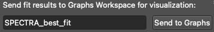
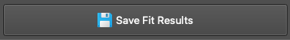

## Spectra and Maps Workspaces

The Maps and Spectra workspaces share a unified design and many core features. However, the Maps workspace includes specialized tools engineered for handling large hyperspectral datasets.

  

*Interface overview of the Spectra and Maps workspaces. Both interfaces are divided into three primary sections: Top-left (SpectraViewer), bottom-left (FitModelBuilder), and right (SpectraList / MapList).*

_______

### MapList and MapViewer

**MapList and MapViewer** are widgets designed for the efficient navigation and management of your hyperspectral datasets. The MapList displays all loaded map files, including wafer maps and standard 2D maps.

Three utility buttons located on the right side of the MapList allow you to: (1) view the selected map data, (2) delete the selected map from the workspace, or (3) export the selected map directly to an Excel file.

   

You can easily navigate between loaded 2D maps using the MapList. The selected map is rendered in the MapViewer. By default, the MapViewer displays a heatmap of signal "Intensity" or "Area". If the map has been fitted, you can select and visualize the heatmap of any fitted parameter.

   

- Dual sliders allow you to quickly adjust the spectral range and the data range of the heatmap plot.
- You can open several MapViewers simultaneously to compare different fitted parameters.
- **Mask Feature**: Isolate specific regions of the heatmap by defining custom, parameter-based numerical filters.

  

  

*Example of the mask feature for 2D maps: An MoS2 flake is isolated by applying a mask (intensity of peak A1g > 40 a.u.) to filter out the surrounding substrate.*

_________

### SpectraList

**SpectraList**: Displays all loaded discrete spectra in the Spectra workspace, or all spectra associated with the currently selected map in the Maps workspace.

You can select one or multiple spectra simultaneously; the selected spectra are immediately visualized in the SpectraViewer. Dedicated buttons allow you to select all spectra, clear your selection, display a comprehensive fit statistics report, or send the currently selected spectra to the Spectra workspace for isolated analysis.

- **Coloring Rules**: Each spectrum in the list is automatically assigned a unique, consistent color indicator. These colors are strictly preserved even when you use the search/filter box to narrow down the list, ensuring you never lose track of which spectrum corresponds to which curve in the viewer.

#### Cross-Workspace Transfer

When sending selected spectra from the Maps workspace to the Spectra workspace, the system uses deep-copied payload dictionaries. This means that:
- The raw intensity and coordinate arrays are perfectly preserved.
- The `baseline_config` (including anchor points and calculation modes) is transferred exactly as you configured it.
- Your entire `fit_model` (including all peak limits, expressions, and initial guesses) is retained.
- The active spectral cropping bounds and baseline subtraction states are kept identical.

This ensures that transferred spectra retain their full interactive and analytical states in the new workspace tab without affecting the original map.

  

*The SpectraList alongside the progress bar (within the Maps Workspace). The progress bar displays real-time fitting progress (percentage and elapsed time). A 'Stop' button is provided to safely halt an ongoing fitting process.*

_______

### Spectra Viewer

The SpectraViewer is the central plotting widget where all spectra selected via the SpectraList (along with their best-fit curves) are visualized.

#### SpectraViewer with Interactive Mouse Controls

  

- **Show Peak Parameters**: Hover your cursor over any fitted peak to display a tooltip containing its precise parameters.
- **Add/Remove Peaks**: With the 'Peak' button enabled in the toolbar, left-click to drop a new peak guess, or right-click near an existing peak to remove it.
- **Adjust Peak Initial Guesses**: Click and drag the center or width of an initial peak guess to manually adjust it before fitting.
- **Quick Rescale Y-axis**: Use your mouse wheel to rapidly scale the Y-axis up or down.

#### Toolbar Buttons and View Options

| Button | Function |
|--------|----------|
|  | **Rescale**: Automatically rescales the plot axes to perfectly fit the current data. Shortcut: `Ctrl + R`. |
|  | **Zoom**: When toggled on, enables a click-and-drag box zoom feature using the left mouse button. |
|  | **Baseline**: When toggled on, allows you to manually define baseline anchor points by clicking directly on the spectra. |
|  | **Peaks**: When toggled on, allows you to manually add initial peak guesses by clicking directly on the spectra. |
|  | **Normalization**: Displays the selected spectra normalized to their maximum peak intensity. Enter values into the 'min' and 'max' fields to normalize based on a specific targeted spectral range.  *Raw spectra (left) vs. normalized spectra (right), highly useful for inspecting subtle peak shifts.* |
|  | **Show Bestfit**: Toggles the display of the best-fit curve(s). |
|  | **Legend**: Toggles the display of the legend box. When the 'Zoom' tool is disabled, you can click directly on the legend box to customize colors and labels.  |
|  | **Copy**: Copies the plot to your clipboard as a high-quality image. Use `Ctrl + Click` (or `Cmd + Click` on macOS) to copy the raw numerical plot data to your clipboard instead. |
|  | **More Options**: Opens a comprehensive configuration panel allowing you to adjust X/Y units, toggle log scales, change plot styles, toggle Raw/Residual visibility, enable grids, adjust line widths, and define precise figure dimensions.  |

_______

### Fit Model Builder

The FitModelBuilder tab is where you configure your spectral fitting models. It is divided into three main panels: Fitting, PeakTable, and FitModelControl.

  

*The FitModelBuilder tab featuring: (1) The Fitting Panel (left), (2) The PeakTable Panel (top-right), and (3) The FitModelControl Panel (bottom-right).*

#### Fitting Panel

The Fitting Panel guides you through the process of building a robust model in four logical steps:

**Step 1: X-axis Correction (Optional)**: Perform an empirical X-axis correction based on measurements from a known reference sample (e.g., a Silicon peak at exactly 520.7 cm⁻¹). Simply fit your reference data, input the theoretically correct position, and apply the shift to correct calibration offsets globally.

**Step 2: Define the Fitting Range**: Restrict the mathematical fitting process to a specific X-axis region of interest.

**Step 3: Baseline Definition**: SPECTROview offers two distinct modes for defining spectral baselines (Manual or Auto):

   
   <i>Baseline mode selection: Manual mode (left) vs. Auto mode (right).</i>

- **Manual Mode (Linear or Polynomial)**: Define baseline anchor points by clicking directly in the SpectraViewer. Check *Attached* to automatically snap your clicked points to the nearest data curve. Check *Correct noise* to calculate the point's intensity as a local average of neighboring data, making the anchor placement robust against high noise.
- **Auto Mode**: Let advanced algorithms automatically generate the baseline curve. Use the slider to fine-tune the algorithm's aggressiveness.
  - **arPLS**: Asymmetrically Reweighted PLS. A gold standard algorithm for typical Raman and IR baselines.
  - **airPLS**: A highly aggressive algorithm, excellent for removing strong, complex fluorescence backgrounds. Highly recommended and validated for Raman data.
  - **AsLS**: A very stable algorithm, though it can sometimes struggle to distinguish between noise and broad peaks. Best suited for relatively clean spectra.
  - **ModPoly**: Modified Polynomial. Extremely popular and effective for simple polynomial fluorescence backgrounds.

**Step 4: Peak Definition**:

- Add peaks directly inside the SpectraViewer by left-clicking (ensure the Peak toggle button is active). You can interactively adjust their initial guesses by dragging them with the mouse.
- Every peak added to the plot is immediately listed in the **PeakTable**.
- Supported peak profiles include: Lorentzian, Gaussian, PseudoVoigt, LorentzianAsym, GaussianAsym, Fano, DecaySingleExp, and DecayBiExp.

#### Supported Peak Profiles

SPECTROview’s VBF engine provides heavily optimized implementations for the following mathematical peak profiles:

| Model | Parameters | Formula |
|-------|-----------|---------|
| `Gaussian` | `ampli, fwhm, x0` | <i>a</i> &middot; exp(-4 ln(2) &middot; (x-x0)2 / w2) |
| `Lorentzian` | `ampli, fwhm, x0` | <i>a</i> / [1 + 4(x-x0)2 / w2] |
| `PseudoVoigt` | `ampli, fwhm, x0, alpha` | &alpha; &middot; G + (1-&alpha;) &middot; L |
| `GaussianAsym` | `ampli, fwhm_l, fwhm_r, x0` | Piecewise Gaussian with left/right FWHM |
| `LorentzianAsym` | `ampli, fwhm_l, fwhm_r, x0` | Piecewise Lorentzian with left/right FWHM |
| `Fano` | `ampli, fwhm, x0, q` | <i>a</i> &middot; (q + &epsilon;)2 / (1 + &epsilon;2), &epsilon; = 2(x-x0)/w |
| `DecaySingleExp` | `A, tau, B` | <i>A</i> &middot; e-t/&tau; + B |
| `DecayBiExp` | `A1, tau1, A2, tau2, B` | <i>A</i>1 &middot; e-t/&tau;1 + <i>A</i>2 &middot; e-t/&tau;2 + B |

#### PeakTable Panel

The PeakTable displays all mathematical parameters for the peaks you have defined. When you drag a peak in the viewer, these properties update dynamically.

**Dynamic Peak Indexing**: Every peak is automatically indexed with a suffix (e.g., `_1`, `_2`) indicating its order of creation. When you add, delete, or re-order peaks, SPECTROview automatically re-indexes them to maintain consecutive numbering (e.g., if you delete peak 2, peak 3 becomes the new peak 2). This ensures your expressions and fit results remain organized.

   
   <i>The PeakTable panel displaying peak parameters and constraints.</i>

**Add Constraints for Fit Model**:

**Fix**: Check "fix" box to freeze the parameter value, preventing the optimizer from changing it during the fit.

**Limits**: Enter minimum and maximum boundary values to restrict how far the optimizer can move the parameter.

   
   <i>Example 1: Activate the "Limits" under the peak table and set 'min' and 'max' values for each fit parameter.</i>

**Expression**: Define complex mathematical relationships between parameters. SPECTROview's VBF engine robustly evaluates these expressions mathematically before mapping them to the optimizer. If peaks are re-indexed due to deletions, their references in your mathematical expressions are automatically updated to prevent broken models!

   
   <i>Example 2: Using an expression to constrain that (1) the peak position of peak E (P2) is 17 smaller than peak A (P1) or (2) the amplitude of peak E (P2) is exactly half the amplitude of  A (P1).</i>

#### FitModelControl Panel

Once your model is fully defined, click the **Fit** button to execute the optimization.

   
   <i>The FitModelControl panel.</i>

**Copy / Paste Fit Models**:
A fully configured fit model can be copied from one spectrum and pasted onto another, making it easy to replicate complex setups across isolated files.

**Saving / Loading Fit Models**:
If you intend to use a model frequently, you can save it as a template. Stored models can be easily accessed and applied to new datasets using the dropdown menu.

_______

### Collect & Save Fit Results

Once fitting is complete across your spectra or maps, you need to aggregate the best-fit results:

- Navigate to the **Fit Results** tab.
- Click the **Collect** button. SPECTROview will instantly aggregate all best-fit parameters into a unified, sortable table.

   
   <i>The Collect Fit Results interface and aggregated data table.</i>

#### Splitting Filename Features
This tool allows you to automatically extract metadata embedded in your filenames. For example, if your files are named `Sample1_ProcessA_Temp25`, the tool can split the filename by underscores (`_`) and assign the extracted values into distinct new columns in your dataset (see the video above).

#### Compute and Add New Columns
You can easily create new columns derived from mathematical combinations of existing fitted parameters (e.g., calculating a peak shift via `x0_p1 - x0_p2`).
Supported mathematical operations include: `+`, `-`, `*`, `/`, `**`, `%`, and `()`.
> **Important Note**: If your column names contain spaces or special characters, you must enclose them in backticks. Example: `` `x0_LO(M)` ``

#### Save and Visualize
Once your data table is finalized, you can:

- **Save it with a descriptive name**, then **send it directly to the Graphs workspace** for immediate plotting.

   

 

- **Export it to an Excel/CSV spreadsheet** for external use.

   

### More Tab

The 'More' tab provides access to auxiliary tools and metadata, divided into three sections:

- **Left**: Displays comprehensive metadata extracted directly from loaded `.wdf` or `.spc` files, showing the exact instrument settings used during acquisition.
- **Middle**: Displays detailed properties and statistical information about the currently selected spectrum.
- **Right**: Provides access to additional pre-processing utilities, such as global intensity normalization algorithms and cosmic ray artifact detection.

   

