## Spectra/Maps Workspaces

The Maps and Spectra workspaces share a unified design and many core features. However, the Maps workspace includes additional, specialized tools specifically engineered for handling large hyperspectral datasets.

  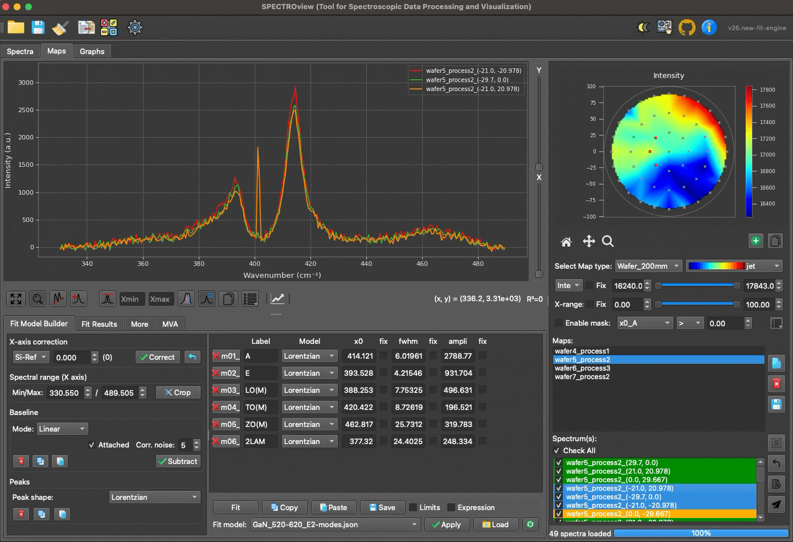

*Interface overview of the Spectra and Maps workspaces. Both interfaces are divided into three primary sections: Top-left section (SpectraViewer), bottom-left section (FitModelBuilder), and right section (SpectraList / MapList).*

_______

### MapList and MapViewer
**MapList**: and **MapViewer** widgets are engineered for efficient navigation and management of your hyperspectral datasets. MapList displays all loaded map files, including wafer maps and 2D map types. 

Three utility buttons located on the right side of MapList allow you to: (1) view the selected map data, (2) delete the selected map from the workspace, or (3) export the selected map directly to an Excel file.

  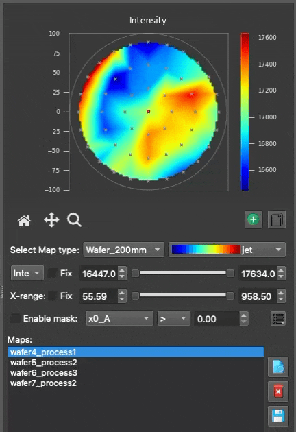 

User can navigate between loaded 2D maps via a listbox (MapList). The 2Dmap plot of the selected map is displayed in the MapViewer. By defaut MapViewer displays heatmap of "Intensity" or "Area" for the selected map. If the 2Dmap is fitted, the user can select to display the heatmap of any fitted parameter.

  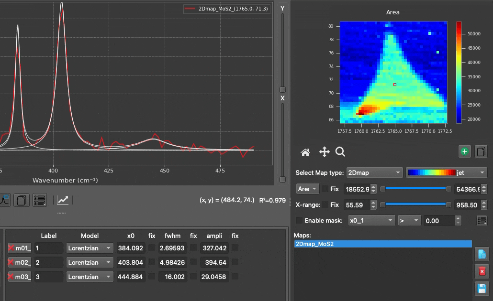

- Two sliders for adjusting the spectral range and the data range of heatmap plot.
- User can add several Mapviewers for comparing with different fitted parameters.
- **Mask Feature**: Isolate specific regions of the heatmap by defining custom, parameter-based filters.

  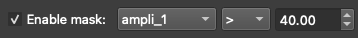

  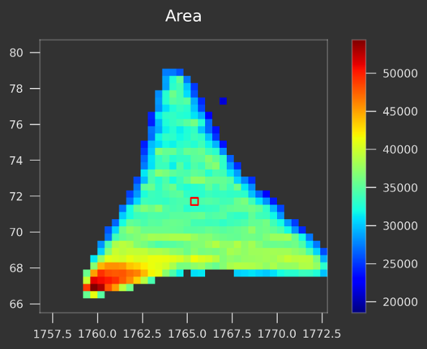

*Example for mask feature for 2D maps: 2Dmap of MoS2 flake using a mask (intensity of peak A1g > 40 a.u) to filter out all region except the flake.* 

_________

### SpectraList

**SpectraList**: Displays all loaded discrete spectra in the Spectra workspace, or all spectra associated with the currently selected map in the Maps workspace. 

You can select one or multiple spectra simultaneously; the selected spectra are immediately visualized in the SpectraViewer. Dedicated buttons allow you to select all spectra, clear your selection, display a comprehensive fit statistic report, or send the currently selected spectra to the Spectra workspace for isolated analysis.

  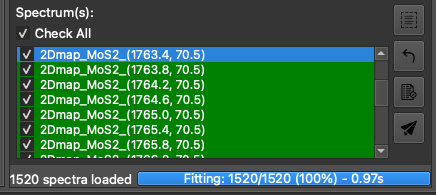

*SpectraList alongside the ProgressBar (within Maps Workspace). The progress bar displays real-time fitting progress (percentage and elapsed time). A 'Stop' button is provided to safely halt an ongoing fitting process.*

_______

### Spectra Viewer

The SpectraViewer is the central plotting widget where all spectra selected via the SpectraList (and their best-fit curves) are visualized.
#### SpectraViewer with Interactive Mouse Controls

  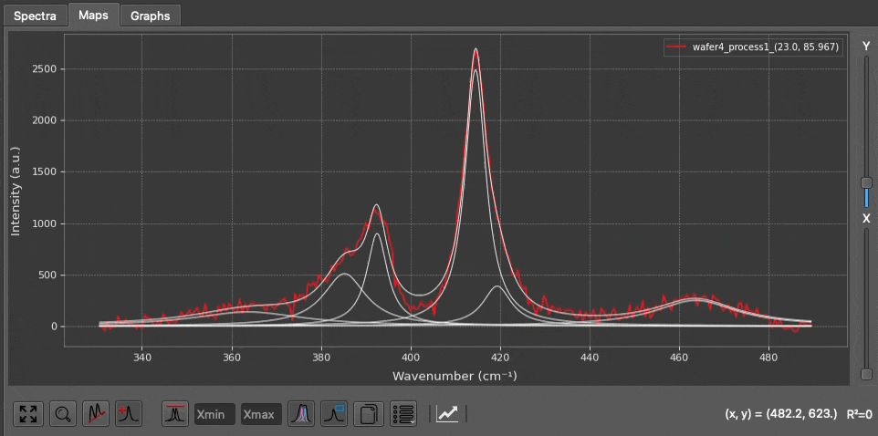

- **Show Peak Parameters**: Hover your cursor over any fitted peak to display a tooltip containing its precise parameters.
- **Add/Remove Peaks**: With the 'Peak' button enabled, left-click to drop a new peak, or right-click near an existing peak to remove it.
- **Adjust Peak Initial Guesses**: Click and drag the center or width of an initial peak guess to adjust it manually before fitting.
- **Quick Rescale Y-axis**: Use your mouse wheel to rapidly scale the Y-axis up or down.

#### Toolbar Buttons and View Options

| Button | Function |
|--------|----------|
| 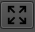 | **Rescale**: Automatically rescales the plot axes to fit the current data perfectly. Shortcut: `Ctrl + R`. |
| 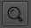 | **Zoom**: When toggled on, enables a click-and-drag box zoom feature using the left mouse button. |
| 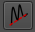 | **Baseline**: When toggled on, allows you to manually define baseline anchor points by clicking directly on the spectra. |
| 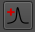 | **Peaks**: When toggled on, allows you to manually add initial peak guesses by clicking directly on the spectra. |
| 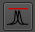 | **Normalization**: Displays the selected spectra normalized to their maximum peak intensity. Enter values into the 'min' and 'max' fields to normalize based on a specific, targeted spectral range. 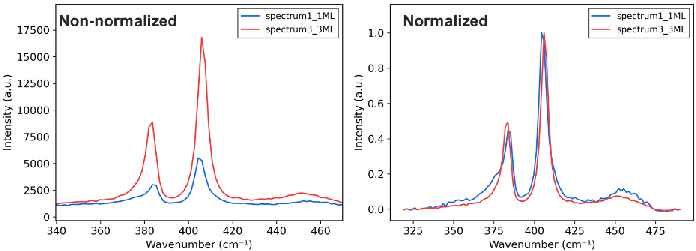 *Raw spectra (left) vs. normalized spectra (right), highly useful for inspecting subtle peak shifts.* |
| 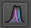 | **Show Bestfit**: Toggles the display of the best-fit curve(s). |
| 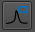 | **Legend**: Toggles the display of the legend box. When the 'Zoom' tool is disabled, you can click directly on the legend box to customize colors and labels.  |
| 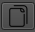 | **Copy**: Copies the plot to your clipboard as a high-quality image. Use `Ctrl + Click` (or `Cmd + Click` on macOS) to copy the raw numerical plot data to your clipboard instead. |
| 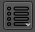 | **More Options**: Open a comprehensive configuration panel allowing you to adjust X/Y units, toggle Log scales, change plot styles, toggle Raw/Residual visibility, enable grids, adjust line widths, and define precise figure dimensions, etc. 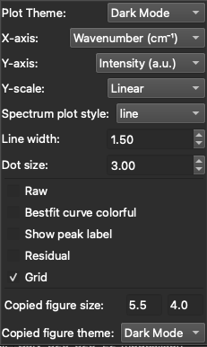 |

_______

### Fit Model Builder

The FitModelBuilder tab is where you configure your spectral fitting models. It is divided into three main panels: Fitting, PeakTable, and FitModelControl.

  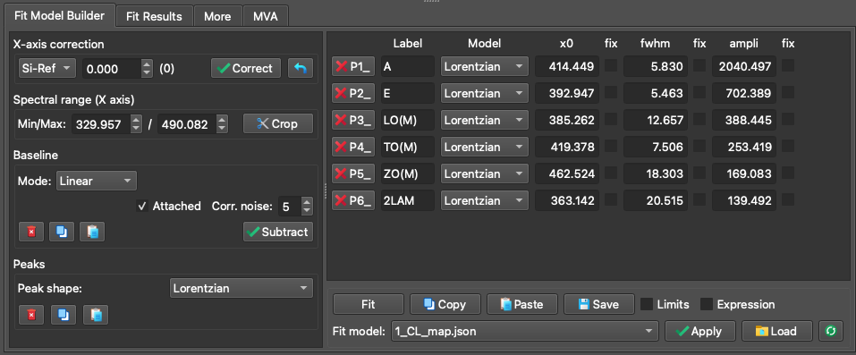

*The FitModelBuilder tab featuring: (1) The Fitting Panel (left), (2) The PeakTable Panel (top-right), and (3) The FitModelControl Panel (bottom-right).*

#### Fitting Panel

The Fitting Panel guides you through the process of building a robust model in four logical steps:

**Step 1: X-axis Correction (Optional)** : Perform an empirical X-axis correction based on measurements from a known reference sample (e.g., a Silicon peak at exactly 520.7 cm⁻¹). Simply fit your reference data, input the theoretically correct position, and apply the shift to correct calibration offsets globally.

**Step 2: Define the Fitting Range**: Restrict the mathematical fitting process to a specific X-axis region of interest.

**Step 3: Baseline Definition**:  SPECTROview offers two distinct modes for defining spectral baselines (Manual or Auto):

  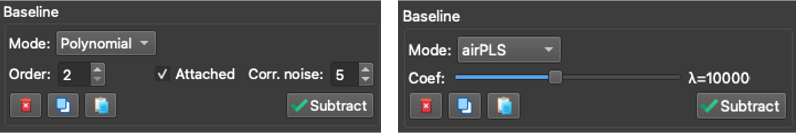 
   <i>Baseline mode selection: Manual mode (left) vs. Auto mode (right).</i>

**Manual Mode (Linear or Polynomial)**: Define baseline anchor points by clicking directly in the SpectraViewer. Check *Attached* to automatically snap your clicked points to the nearest data curve. Check *Correct noise* to calculate the point's intensity as a local average of neighboring data, making it robust against high noise.

**Auto Mode (airPLS or asLS)**: Let advanced algorithms automatically generate the baseline curve. Use the slider to fine-tune the algorithm's aggressiveness.
  - **airPLS**: A highly aggressive algorithm, excellent for removing strong, complex fluorescence backgrounds. Highly recommended and validated for Raman data.
  - **asLS**: A very stable algorithm, though it can sometimes struggle to distinguish between noise and broad peaks. Best suited for relatively clean spectra.

**Step 4: Peak Definition**

- Add peaks directly inside the SpectraViewer by left-clicking (ensure the Peak toggle button is active). You can interactively adjust their initial guesses by dragging them with the mouse.
- Every peak added to the plot is immediately listed in the **PeakTable**.
- Supported peak profiles include: Lorentzian, Gaussian, PseudoVoigt, LorentzianAsym, GaussianAsym, Fano, DecaySingleExp, and DecayBiExp.

#### PeakTable Panel

The PeakTable displays all the mathematical parameters for the peaks you have defined. When you drag a peak in the viewer, these properties update dynamically.

   
   <i>The PeakTable panel displaying peak parameters and constraints.</i>

**Add Constraints for fit model**:

- **Fix**: Check this box to freeze the parameter value, preventing the optimizer from changing it during the fit.
- **Limits**: Enter minimum and maximum boundary values to restrict how far the optimizer can move the parameter.
- **Expression**: Define complex mathematical relationships between parameters.

  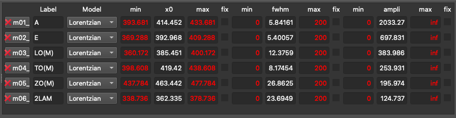 
   <i>Example 1: Using an expression to constrain the position (`x0`) of `m02` to always remain exactly 17 units away from the position of `m01`.</i>

  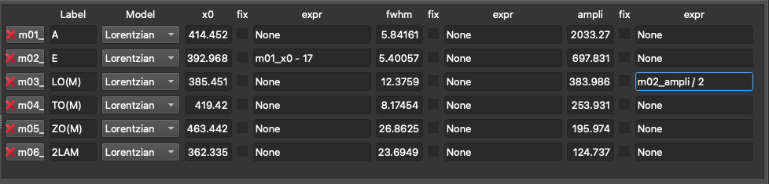 
   <i>Example 2: Using an expression to constrain the amplitude of `m03` to always be exactly half the amplitude of `m02`.</i>

#### FitModelControl Panel

Once your model is fully defined, click the **Fit** button to execute the fitting action.

  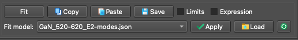 
   <i>Fit model control panel.</i>

**Copy / Paste Fit Models**: 
A fully configured fit model can be copied from one spectrum and pasted onto another, making it easy to replicate complex setups.

**Saving / Loading Fit Models**:
If you intend to use a model frequently, you can save it as a template. Stored models can easily be accessed and applied to new data using the dropdown menu.

_______

### Collect & Save Fit Results

Once fitting is complete across your spectra or maps, we need to aggregate the bestfit results:

- Navigate to the **Fit Results** tab.
- Click the **Collect** button. SPECTROview will instantly aggregate all best-fit parameters into a unified, sortable table.

  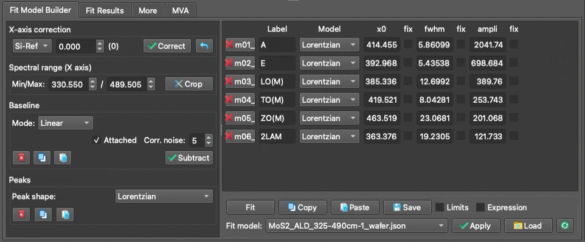 
   <i>The Collect Fit Results interface and aggregated data table.</i>

#### Splitting Filename Features
This tool allows you to automatically extract metadata embedded in your filenames. For example, if your files are named `Sample1_ProcessA_Temp25`, the tool can split the filename by underscores (`_`) and assign the extracted values into distinct new columns in your dataset (see video above).

#### Compute and Add New Columns
You can easily create new columns derived from mathematical combinations of existing fitted parameters (e.g., calculating a peak shift via `x0_p1 - x0_p2`) (see video above).
Supported mathematical operations include: `+`, `-`, `*`, `/`, `**`, `%`, and `()`.
> **Important Note**: If your column names contain spaces or special characters, you must enclose them in backticks. Example: `` `x0_LO(M)` ``

#### Save and Visualize
Once your data table is finalized, give it a descriptive name and either send it directly to the Graphs workspace for immediate plotting or export it to an Excel/CSV spreadsheet for external use.

### More Tab

The 'More' tab provides access to auxiliary tools and metadata, divided into three sections:

- **Left**: Displays comprehensive metadata extracted directly from loaded `.wdf` or `.spc` files, showing the exact instrument settings used during acquisition.
- **Middle**: Displays detailed properties and statistical information about the currently selected spectrum.
- **Right**: Provides access to additional pre-processing utilities, such as global intensity normalization algorithms and cosmic ray artifact detection.

  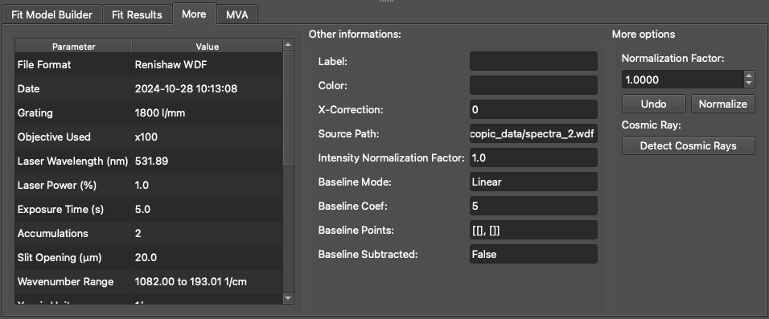 

