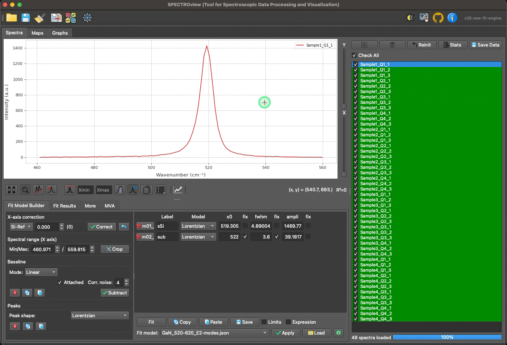
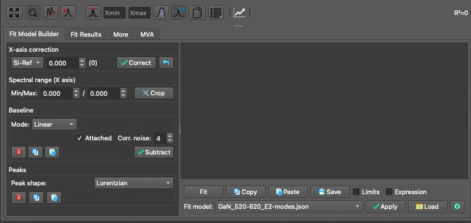

## **User Interface Overview**

### **1. Workspaces**

**SPECTROview** is meticulously designed to streamline the processing of spectroscopic data and the visualization of fitted results. The interface is built around three primary workspaces, each tailored for a specific workflow:

- **`Spectra`**: Dedicated to processing individual or multiple discrete spectra.
- **`Maps`**: Optimized for handling hyperspectral datasets, including extensive wafer data and 2D maps.
- **`Graphs`**: Designed for robust statistical plotting and comprehensive data visualization.

   
   <i>Navigating between the three primary workspaces.</i>

_____

### **2. Tooltips**

Most GUI elements in **SPECTROview** (e.g., buttons, text boxes, dropdowns) include built-in tooltips. Simply hover your mouse cursor over an element for a moment to view a brief explanation of its function.

   
  <i>Demonstration of interactive tooltips.</i>

